# 
 Universidad Peruana de Ciencias Aplicadas 

  

### 
 Informe de Trabajo Final 

 

  
 Carrera: Ingeniería de Software 

   
  
 Ciclo: 2025-10 

   
  
 Curso: Diseño de Experimentos de Ingeniería de Software 

   
  
 NRC: 4438 

   
  
 Profesor: Noriega Melendez, Julio Manuel 

   
  
 Nombre del Startup: PeaceApp 

   
  
 Nombre del Producto: PeaceApp 

   
  
 Relación de Integrantes: 

  
  - Avila Asto, Alex Ramon Alberto (u20221a322) 

  
  - Guia Carrasco, Pedro Andre (u202212010) 

  
  - Noriega Suschenko, Anatoly Andrey (u202211813) 

  
  - Tongo Alejandro, Milagros Salet (u20216078)

   
  
 Mes y Año: Abril del 2025 

---

# Registro de Versiones del Informe

<table>
  <tr>
    <th style="text-align:center;">Versión</th>
    <th style="text-align:center;">Fecha</th>
    <th style="text-align:center;">Autor</th>
    <th style="text-align:center;">Descripción de la modificación</th>
  </tr>
  <tr>
    <td align="center">TB1</td>
    <td>21/04/2025</td>
    <td> Alex Avila   Pedro Guia   Anatoly Noriega   Milagros Tongo </td>
    <td> Realizamos los capítulos 1, 2, 3, 4 y 5 según la rúbrica de manera conjunta y eficiente.  </td>
  </tr>
</table>

---

# Tabla de contenidos

- [ Universidad Peruana de Ciencias Aplicadas ](#-universidad-peruana-de-ciencias-aplicadas-)
    - [ Informe de Trabajo Final ](#-informe-de-trabajo-final-)
- [Registro de Versiones del Informe](#registro-de-versiones-del-informe)
- [Tabla de contenidos](#tabla-de-contenidos)
- [Student Outcome](#student-outcome)
- [Capítulo I: Introducción](#capítulo-i-introducción)
  - [1.1 Startup Profile](#11-startup-profile)
    - [1.1.1 Descripción de la Startup](#111-descripción-de-la-startup)
    - [1.1.2. Perfiles de integrantes del equipo](#112-perfiles-de-integrantes-del-equipo)
  - [1.2. Solution Profile](#12-solution-profile)
    - [1.2.1. Antecedentes y problemática](#121-antecedentes-y-problemática)
    - [1.2.2. Lean UX Process](#122-lean-ux-process)
      - [1.2.2.1. Lean UX Problem Statements](#1221-lean-ux-problem-statements)
      - [1.2.2.2. Lean UX Assumptions](#1222-lean-ux-assumptions)
      - [1.2.2.3. Lean UX Hypothesis Statements](#1223-lean-ux-hypothesis-statements)
      - [1.2.2.4. Lean UX Canvas](#1224-lean-ux-canvas)
  - [1.3. Segmentos Objetivo](#13-segmentos-objetivo)
- [Capítulo II: Requirements Elicitation \& Analysis](#capítulo-ii-requirements-elicitation--analysis)
  - [2.1. Competidores](#21-competidores)
    - [2.1.1. Análisis Competitivo](#211-análisis-competitivo)
    - [2.1.2. Estrategias y tácticas frente a competidores](#212-estrategias-y-tácticas-frente-a-competidores)
  - [2.2. Entrevistas](#22-entrevistas)
    - [2.2.1. Diseño de entrevistas](#221-diseño-de-entrevistas)
    - [2.2.2. Registro de entrevistas](#222-registro-de-entrevistas)
    - [2.2.3. Análisis de entrevistas](#223-análisis-de-entrevistas)
  - [2.3. Needfinding](#23-needfinding)
    - [2.3.1. User Personas](#231-user-personas)
    - [2.3.2. User Task Matrix](#232-user-task-matrix)
    - [2.3.2. User Task Matrix](#232-user-task-matrix-1)
    - [2.3.3. User Journey Mapping](#233-user-journey-mapping)
    - [2.3.4. Empathy Mapping](#234-empathy-mapping)
      - [2.3.5. As-is Scenario Mapping](#235-as-is-scenario-mapping)
  - [2.4. Ubiquitous Language](#24-ubiquitous-language)
- [Capítulo III: Requirements Specification](#capítulo-iii-requirements-specification)
  - [3.1. To-be Scenario Mapping](#31-to-be-scenario-mapping)
  - [3.2. User Stories](#32-user-stories)
  - [3.3. Product Backlog](#33-product-backlog)
  - [3.4. Impact Mapping](#34-impact-mapping)
- [Capítulo IV: Product Design](#capítulo-iv-product-design)
  - [4.1. Style Guidelines](#41-style-guidelines)
    - [4.1.1. General Style Guidelines](#411-general-style-guidelines)
    - [4.1.2. Web Style Guidelines](#412-web-style-guidelines)
    - [4.1.3. Mobile Style Guidelines](#413-mobile-style-guidelines)
      - [4.1.3.1. iOS Mobile Style Guidelines](#4131-ios-mobile-style-guidelines)
      - [4.1.3.2. Android Mobile Style Guidelines](#4132-android-mobile-style-guidelines)
  - [4.2. Information Architecture](#42-information-architecture)
    - [4.2.1. Organization Systems](#421-organization-systems)
    - [4.2.2. Labeling Systems](#422-labeling-systems)
    - [4.2.3. SEO Tags and Meta Tags](#423-seo-tags-and-meta-tags)
    - [4.2.4. Searching Systems](#424-searching-systems)
    - [4.2.5. Navigation Systems](#425-navigation-systems)
  - [4.3. Landing Page UI Design](#43-landing-page-ui-design)
    - [4.3.1. Landing Page Wireframe](#431-landing-page-wireframe)
    - [4.3.2. Landing Page Mock-up](#432-landing-page-mock-up)
  - [4.4. Mobile Applications UX/UI Design](#44-mobile-applications-uxui-design)
    - [4.4.1. Mobile Applications Wireframes](#441-mobile-applications-wireframes)
    - [4.4.2. Mobile Applications Wireflow Diagrams](#442-mobile-applications-wireflow-diagrams)
    - [4.4.3. Mobile Applications Mock-ups](#443-mobile-applications-mock-ups)
    - [4.4.4. Mobile Applications User Flow Diagrams](#444-mobile-applications-user-flow-diagrams)
  - [4.5. Mobile Applications Prototyping](#45-mobile-applications-prototyping)
    - [4.5.1. Android Mobile Applications Prototyping](#451-android-mobile-applications-prototyping)
    - [4.5.2. IOS Mobile Applications Prototyping](#452-ios-mobile-applications-prototyping)
  - [4.6. Web Applications UX/UI Design](#46-web-applications-uxui-design)
    - [4.6.1. Web Applications Wireframes](#461-web-applications-wireframes)
    - [4.6.2. Web Applications Wireflow Diagrams](#462-web-applications-wireflow-diagrams)
    - [4.6.3. Web Applications Mock-ups](#463-web-applications-mock-ups)
    - [4.6.4. Web Applications User Flow Diagrams](#464-web-applications-user-flow-diagrams)
  - [4.7. Web Applications Prototyping](#47-web-applications-prototyping)
  - [4.8. Domain-Driven Software Architecture](#48-domain-driven-software-architecture)
    - [4.8.1. Software Architecture Context Diagram](#481-software-architecture-context-diagram)
    - [4.8.2. Software Architecture Container Diagram](#482-software-architecture-container-diagram)
    - [4.8.3. Software Architecture Components Diagram](#483-software-architecture-components-diagram)
  - [4.9. Software Object-Oriented Design](#49-software-object-oriented-design)
    - [4.9.1. Class Diagrams](#491-class-diagrams)
    - [4.9.2. Class Dictionary](#492-class-dictionary)
  - [4.10. Database Design](#410-database-design)
    - [4.10.1. Relational Database Diagram](#4101-relational-database-diagram)
- [Capítulo V: Product Implementation](#capítulo-v-product-implementation)
  - [5.1. Software Configuration Management](#51-software-configuration-management)
    - [5.1.1. Software Development Environment Configuration](#511-software-development-environment-configuration)
    - [5.1.2. Source Code Management](#512-source-code-management)
    - [5.1.3. Source Code Style Guide \& Conventions](#513-source-code-style-guide--conventions)
    - [5.1.4. Software Deployment Configuration](#514-software-deployment-configuration)
  - [5.2. Product Implementation \& Deployment](#52-product-implementation--deployment)
    - [5.2.1. Sprint Backlogs](#521-sprint-backlogs)
    - [5.2.2. Implemented Landing Page Evidence](#522-implemented-landing-page-evidence)
    - [5.2.3. Implemented Frontend-Web Application Evidence](#523-implemented-frontend-web-application-evidence)
    - [5.2.4. Implemented Native-Mobile Application Evidence](#524-implemented-native-mobile-application-evidence)
    - [5.2.5. Implemented RESTful API and/or Serverless Backend Evidence](#525-implemented-restful-api-andor-serverless-backend-evidence)
    - [5.2.6. RESTful API documentation](#526-restful-api-documentation)
    - [5.2.7. Team Collaboration Insights](#527-team-collaboration-insights)
  - [5.3. Video About the Product](#53-video-about-the-product)
- [Conclusiones](#conclusiones)
- [Bibliografia](#bibliografia)
- [Anexos](#anexos)

# Student Outcome

**Criterio:** La capacidad de reconocer responsabilidades éticas y
profesionales en  
situaciones de ingeniería y hacer juicios informados, que deben
considerar el  
impacto de las soluciones de ingeniería en contextos globales,
económicos,  
ambientales y sociales.

ABET -- EAC - Student Outcome 4

<table>
<colgroup>
<col style="width: 30%" />
<col style="width: 40%" />
<col style="width: 30%" />
</colgroup>
<thead>
<tr class="header">
<th><strong>Criterio específico</strong></th>
<th><strong>Acciones Realizadas</strong></th>
<th><strong>Conclusiones</strong></th>
</tr>
</thead>
<tbody>
<tr class="odd">
<td>Reconoce responsabilidad 
ética y profesional en 
situaciones de ingeniería de 
software</td>
<td>
            <strong>Avila Asto, Alex Ramon Alberto</strong>  
            TB1   Morbi vel tortor id eros dictum venenatis id dui. Mauris quis tellus eu nunc hendrerit vehicula ac id mauris. Pellentesque volutpat tellus non ligula blandit ullamcorper quis sodales erat.
             
            TP1   ...
              
            <strong>Guia Carrasco, Pedro Andre</strong>  
            TB1   Actué con ética y profesionalismo en todo momento, aplicando buenas prácticas desde la recolección de requisitos hasta la validación final, para asegurar un desarrollo de software íntegro y de alta calidad.
             
            TP1   ...
              
            <strong>Noriega Suschenko, Anatoly Andrey</strong>  
            TB1   Me aseguré de actuar con ética y profesionalismo a la hora de realizar los puntos de este trabajo, aplicando buenas prácticas, desde la fase de las entrevistas, evaluación de las historias de usuario hasta la revisión de los flujos de las aplicaciones del proyecto.
             
            TP1   ...
              
            <strong>Tongo Alejandro, Milagros Salet</strong>  
            TB1  Me aseguré de tomar decisiones éticas y profesionales, reconociendo la importancia de aplicar buenas prácticas en cada fase, desde las entrevistas hasta las revisiones, para garantizar 
            la integridad y calidad del software desarrollado
             
            TP1   ...
</td>
<td><em><strong>TB1</strong></em>
 A lo largo del proceso de desarrollo de la startup, el equipo asumió de manera conjunta la responsabilidad ética y profesional en cada etapa del proyecto. Desde la recopilación de requisitos y entrevistas hasta la implementación final, se aseguraron de aplicar principios éticos y profesionales en actividades como el análisis competitivo,
el diseño de entrevistas y la creación de documentación, garantizando soluciones de calidad y sostenibles. 
</td>
</tr>
<tr class="even">
<td>Emite juicios informados 
considerando el impacto de las 
soluciones de ingeniería de 
software en contextos globales, 
económicos, ambientales y 
sociales</td>
<td>
            <strong>Avila Asto, Alex Ramon Alberto</strong>  
            TB1   Morbi vel tortor id eros dictum venenatis id dui. Mauris quis tellus eu nunc hendrerit vehicula ac id mauris. Pellentesque volutpat tellus non ligula blandit ullamcorper quis sodales erat.
             
            TP1   ...
              
            <strong>Guia Carrasco, Pedro Andre</strong>  
            TB1   Al integrar las entrevistas en el trabajo, pude darme cuenta el impacto global, economico y social positivo que tendria el producto, buscando soluciones que fueran sostenibles y que contribuyan al entorno donde pensamos aplicar la solución.
             
            TP1   ...
              
            <strong>Noriega Suschenko, Anatoly Andrey</strong>  
            TB1   Al momento de realizar las entrevistas y las tareas consiguientes a ellas, estuve al tanto del impacto global, económico y social de las soluciones que proporcionamos fueran sostenibles, inclusivas y alineadas con las necesidades reales de los usuarios.
             
            TP1   ...
              
            <strong>Tongo Alejandro, Milagros Salet</strong>  
            TB1  Al realizar entrevistas y revisiones, siempre tuve en cuenta el impacto global, económico y social de las soluciones propuestas, buscando soluciones que fueran sostenibles y que pudieran 
            contribuir positivamente al entorno en el que se implementaran.
             
</td>
<td><em><strong>TB1</strong></em>
 El equipo, a lo largo de todo el proceso, consideró el impacto global, económico, social y ambiental de las soluciones propuestas. Al realizar actividades como el análisis de entrevistas, la creación de mapas de recorrido del usuario y el diseño de prototipos, las decisiones tomadas fueron informadas, buscando siempre generar un impacto positivo en el contexto en el que se implementaría la solución. 
</td>
</tr>
</tbody>
</table>

# Capítulo I: Introducción 

## 1.1 Startup Profile

### 1.1.1 Descripción de la Startup

En respuesta a la creciente inseguridad ciudadana en Perú, PeaceApp nace
como una solución innovadora para mejorar la seguridad en las calles. En
Lima Metropolitana, el 89,9% de la población percibe su entorno como
inseguro (INEI, 2024), una cifra alarmante que no podemos ignorar.

**Misión:** Nuestra misión es garantizar la seguridad de nuestros
usuarios, para que puedan transitar sin miedo alguno por las distintas
calles del Perú.

**Visión:** Vemos el mundo en constante cambio y buscamos ser parte de
ello. Creemos que todas las personas deben poder sentirse seguras de
vivir y transitar en su propio país, y que los gobiernos deben
encargarse de ello. Por eso, aspiramos a ser reconocidos como líderes en
el mercado de seguridad, gracias a nuestra labor en beneficio de todos
nuestros usuarios.

*¿Cómo lo logramos?* PeaceApp se presenta como una herramienta esencial
para cualquier ciudadano preocupado por su seguridad. Con nuestra
aplicación, los usuarios pueden acceder a un mapa interactivo que
muestra los niveles de seguridad en diferentes zonas, permitiendo tomar
decisiones más informadas. Además, ofrecemos la posibilidad de denunciar
crímenes de forma rápida y sencilla, adjuntando fotos, audios o videos,
ya sea de manera pública o anónima.

Sin embargo, PeaceApp va más allá: permite a los usuarios compartir su
ubicación en tiempo real con sus contactos de confianza para que puedan
monitorear su trayecto, brindando tranquilidad en sus desplazamientos.
Además, contamos con un sistema de marcación rápida que facilita el
envío de alertas de emergencia a la Policía Nacional del Perú (PNP) y a
los bomberos en situaciones críticas.

Con PeaceApp, construimos un Perú más seguro, paso a paso.

### 1.1.2. Perfiles de integrantes del equipo

<table>
<colgroup>
<col style="width: 65%" />
<col style="width: 34%" />
</colgroup>
<thead>
<tr class="even">
<td>
<strong>Nombre:</strong>

<strong>Conocimientos técnicos/habilidades:</strong>
</th>
<th></th>
</tr>
</thead>
<tr class="even">
<td>
<strong>Nombre:</strong>Pedro Andre Guia Carrasco 
(U202212010)

<strong>Conocimientos técnicos/habilidades:</strong> Soy estudiante de Ingeniería de Software, voy en mi septimo ciclo y cuento con experiencia en frontend y backend. Manejo de framework como Angular y Vue, y tengo conocimientos en bases de datos como MySQL y MongoDB. Algunos de los lenguajes de programcion que utilice son C++, Java, Python, C#, HTML, JavaScript, TypeScript, CSS, Flutter y entre otros.
</td>
<td></td>
</tr>
<tr class="even">
<td>
<strong>Nombre:</strong> Anatoly Andrey Noriega Suschenko
(U202211813)

<strong>Mi nombre es Anatoly Andrey Noriega Suschenko y soy muy apasionado a los videojuegos y a la programación en general. Actualmente tengo 20 años y estoy cursando el séptimo ciclo de mi carrera. Tengo cierto conocimiento y habilidad con los frameworks de Angular, Flutter y Vue. Domino lenguajes como C++, Python, Java, C#, HTML, CSS, GML, Javascript, entre otros.
</td>
<td></td>
</tr>
<tr class="odd">
<td>
<strong>Nombre:</strong> Milagros Salet Tongo Alejandro
(U202116078)

<strong>Conocimientos técnicos/habilidades:</strong> Soy estudiante de Ingeniería de Software, en el séptimo ciclo, con experiencia en frontend y backend. Manejo frameworks como Angular y Vue, lo que me ha permitido desarrollar proyectos completos. Me considero una persona sociable y generosa, disfruto trabajando en equipo y creo que aprender de los demás es fundamental para mejorar tanto profesional como personalmente. 
</td>
<td></td>
</tr>
</table>

## 1.2. Solution Profile

### 1.2.1. Antecedentes y problemática 

**What (Qué):** PeaceApp es una aplicación móvil diseñada para empoderar
a los usuarios en su vida diaria, ayudándolos a navegar de manera más
segura por las calles de Lima Metropolitana. Al crear una comunidad
entre ciudadanos y autoridades, PeaceApp garantiza el acceso a
información detallada y confiable sobre la seguridad en tiempo real,
fomentando una red de colaboración que beneficia a todos.

**When (Cuándo):** PeaceApp estará disponible las 24 horas del día, los
7 días de la semana, ofreciendo asistencia continua y actualizada en
cualquier momento que los usuarios lo necesiten.

**Where (Dónde):** PeaceApp puede ser utilizada en cualquier lugar y
momento, siempre que el usuario cuente con una conexión a internet. La
aplicación se adapta automáticamente a la ubicación del usuario,
actualizando la información de seguridad local en tiempo real para
brindar datos precisos y relevantes.

**Who (Quién):** PeaceApp está dirigida a los ciudadanos que transitan
por las calles de Lima Metropolitana. Los usuarios no solo podrán
beneficiarse de la información proporcionada, sino que también tendrán
la capacidad de contribuir al bienestar de la comunidad al reportar
incidentes y situaciones de riesgo, ayudando a mantener la plataforma
actualizada y confiable para todos.

**Why (Por qué):** PeaceApp surge como respuesta al preocupante aumento
de la delincuencia en Lima y en todo el país. Nuestro objetivo es
proporcionar a los ciudadanos una herramienta que les permita estar
informados sobre los sucesos más recientes en su entorno, incrementando
su seguridad personal y ayudando a otros transeúntes a evitar
situaciones peligrosas.

**How (Cómo):** PeaceApp se mantiene actualizada gracias al constante
aporte de los usuarios, quienes reportan incidentes y colaboran con la
comunidad. Además, la aplicación utiliza tecnología avanzada de
geolocalización y análisis de datos para ofrecer información precisa en
tiempo real.

**How Much (Cuánto):** PeaceApp estará disponible de forma gratuita para
todos los usuarios. Sin embargo, para sostener el desarrollo y
mantenimiento de la plataforma, la aplicación incluirá anuncios
integrados.

### 1.2.2. Lean UX Process 
#### 1.2.2.1. Lean UX Problem Statements 

El propósito de nuestro servicio es empoderar a los ciudadanos
ayudándolos a moverse de manera segura por su entorno. Con nuestra
aplicación, los usuarios acceden a un mapa de calor que muestra la
peligrosidad de las diferentes zonas de Lima Metropolitana, actualizado
en tiempo real según los reportes enviados por otros usuarios. Hemos
identificado una creciente insatisfacción en la población respecto a la
seguridad en las calles, ya que los hurtos y delitos son una
preocupación constante. Según el último resultado de la ENAPRES para el
semestre móvil Ene-Jun 2024, publicado por el INEI, el 27.7% de la
población mayor de 15 años en Perú ha sido víctima de algún hecho
delictivo.

Ante ello, ¿cómo podemos transformar la percepción de inseguridad en
Lima y ofrecer a los ciudadanos una herramienta que realmente impacte en
su día a día?

#### 1.2.2.2. Lean UX Assumptions

Ahora que hemos analizado la problemática y contamos con una visión
clara de cómo abordar la solución, es crucial identificar qué empresas
comparten características similares a las nuestras y cómo han
evolucionado con el tiempo. Esto nos permitirá aprender de su
experiencia y adaptarnos mejor al mercado.

**Assumptions:**

1.  **Los ciudadanos de Lima necesitan una aplicación que les ofrezca
    rutas seguras para moverse por la ciudad.** Con el aumento de la
    delincuencia, es esencial que los usuarios puedan planificar sus
    trayectos de manera informada y evitar zonas peligrosas.

2.  **Los ciudadanos valoran sentirse parte de una comunidad que les
    permita reportar incidentes y ver esos reportes reflejados en un
    mapa interactivo.** La posibilidad de contribuir a la seguridad de
    su entorno genera un sentido de pertenencia y confianza en la
    aplicación.

3.  **Actualmente, no existe una competencia relevante en el mercado que
    ofrezca una solución integral como la nuestra.** Esto nos posiciona
    como pioneros y líderes potenciales en el sector de la seguridad
    ciudadana en Lima.

4.  **Las entidades que utilicen nuestra aplicación obtendrán datos
    valiosos que les ayudarán a combatir la criminalidad de manera más
    efectiva.** Al tener acceso a información en tiempo real sobre las
    zonas más conflictivas, podrán tomar decisiones informadas.

5.  **Los ciudadanos comunes estarán interesados en nuestra aplicación,
    ya que les proporciona una herramienta práctica para mejorar su
    seguridad diaria.** La simplicidad y utilidad de la aplicación
    atraerán a un público amplio.

6.  **Las entidades públicas de Perú necesitan este tipo de soluciones
    tecnológicas para mejorar su capacidad de respuesta ante la
    criminalidad.** Nuestra aplicación les permitirá actuar de manera
    más proactiva y estratégica.

**Business Outcomes:**

- Generar ingresos sostenibles a través de la venta de la aplicación a
  entidades públicas y privadas.

- Mejorar la calidad de vida de los ciudadanos del Perú al reducir su
  exposición a riesgos en las calles.

- Contribuir a la disminución de la delincuencia en el país al facilitar
  la detección de zonas peligrosas y la respuesta oportuna.

**User Outcomes:**

1.  **¿Quién es el usuario?** Cualquier ciudadano que viva o trabaje en
    zonas donde las entidades están asociadas con nuestra plataforma.

2.  **¿Dónde encaja nuestro producto en su vida diaria?** Nuestra
    aplicación se convierte en una herramienta indispensable para
    planificar trayectos seguros y reportar incidentes, brindando
    tranquilidad en su rutina diaria.

3.  **¿Qué desafíos enfrenta nuestro producto?** Un desafío importante
    es que nuestra generación de ingresos depende de la capacidad de
    atraer y mantener asociaciones con entidades públicas y privadas.

4.  **¿Cuándo y cómo es usado nuestro producto?** Los usuarios utilizan
    la aplicación al desplazarse por áreas desconocidas o al desear
    reportar incidentes para proteger a otros. La aplicación se
    convierte en una herramienta diaria para asegurar trayectos más
    seguros.

5.  **¿Qué características son importantes?** La aplicación debe ser
    intuitiva y fácil de usar, con acceso rápido a la información
    relevante y una navegación clara. La actualización en tiempo real es
    fundamental para su efectividad.

6.  **¿Cómo debe verse y comportarse nuestro producto?** La aplicación
    debe ser visualmente atractiva, con una paleta de colores que sea
    agradable y fácil de leer. El proceso de registro debe ser simple y
    accesible para todos los usuarios, maximizando la usabilidad.

**User Benefits:**

1.  Evitar robos y otros incidentes peligrosos al moverse por la ciudad,
    gracias a la información proporcionada en tiempo real.

2.  Acceso a un mapa de calor que muestra zonas peligrosas y rutas
    seguras, ayudando a los usuarios a tomar decisiones informadas.

3.  Sentirse parte de una comunidad que contribuye a la seguridad
    colectiva, fortaleciendo el sentido de pertenencia y confianza.

#### 1.2.2.3. Lean UX Hypothesis Statements

- **Hypothesis Statement 01:**

**Creemos que** la aplicación logrará formar una comunidad activa y
comprometida con la seguridad ciudadana.

**Sabremos que** hemos tenido éxito cuando se observe un aumento
constante en la cantidad de usuarios registrados diariamente y estos
participen en la aplicación realizando reportes.

- **Hypothesis Statement 02:**

**Creemos que** los ciudadanos valorarán la posibilidad de reportar
incidentes y recibir información en tiempo real sobre la seguridad de su
entorno.

**Sabremos que** hemos tenido éxito cuando veamos un alto porcentaje de
usuarios activos que reporten incidentes con regularidad y utilicen la
aplicación para consultar el mapa de calor antes de desplazarse.

- **Hypothesis Statement 03:**

**Creemos que** nuestra aplicación será capaz de reducir la percepción
de inseguridad en las zonas donde se implemente.

**Sabremos que** hemos tenido éxito cuando encuestas de percepción de
seguridad reflejen una disminución del miedo al crimen en las áreas
donde los usuarios utilizan PeaceApp activamente.

- **Hypothesis Statement 04:**

**Creemos que** la implementación de anuncios en la versión gratuita de
la aplicación no afectará negativamente la experiencia del usuario.

**Sabremos que** hemos tenido éxito cuando mantengamos un alto índice de
retención de usuarios en la versión gratuita y obtengamos ingresos
sostenibles a través de la publicidad.

- **Hypothesis Statement 05:**

**Creemos que** la aplicación será intuitiva y fácil de usar para
personas de todas las edades y niveles de experiencia tecnológica.

**Sabremos que** hemos tenido éxito cuando las pruebas de usabilidad
muestren que la mayoría de los usuarios completan tareas clave en la
aplicación sin dificultad.

- **Hypothesis Statement 06:**

**Creemos que** el uso de geolocalización en tiempo real mejorará la
precisión y relevancia de los datos de seguridad proporcionados a los
usuarios.

**Sabremos que** hemos tenido éxito cuando los usuarios confíen en la
información del mapa de calor y se apoyen en ella para tomar decisiones
sobre sus rutas diarias.

- **Hypothesis Statement 07:**

**Creemos que** la posibilidad de compartir la ubicación en tiempo real
con contactos de confianza aumentará la sensación de seguridad entre los
usuarios.

**Sabremos que** hemos tenido éxito cuando una cantidad significativa de
usuarios utilicen esta función regularmente.

#### 1.2.2.4. Lean UX Canvas

\*Enlace al esquema hecho en Miro: <https://tinyurl.com/ymmmjj7t>

## 1.3. Segmentos Objetivo

<table>
<colgroup>
<col style="width: 22%" />
<col style="width: 77%" />
</colgroup>
<thead>
<tr class="header">
<th rowspan="2"><strong>Variables</strong></th>
<th><strong>Segmento</strong></th>
</tr>
<tr class="odd">
<th>Ciudadanos preocupados por su seguridad en espacios públicos</th>
</tr>
</thead>
<tbody>
<tr class="odd">
<td><strong>Geográfica</strong></td>
<td><ul>
<li>
Ubicación: Lima Metropolitana, con especial enfoque en zonas con
altos índices de delincuencia y tráfico peatonal.
</li>
<li>
Alcance: Barrios y distritos urbanos dentro de Lima
Metropolitana.
</li>
</ul></td>
</tr>
<tr class="even">
<td><strong>Demográfica</strong></td>
<td><ul>
<li>
Edad: Adultos jóvenes y mayores (18-65 años).
</li>
<li>
Género: Hombres y mujeres.
</li>
<li>
Nivel socioeconómico: C1, C2 y C3, quienes suelen transitar por
las calles de Lima para trabajo, estudio o actividades
personales.
</li>
<li>
Ocupación: Estudiantes, profesionales, trabajadores informales, y
amas de casa.
</li>
</ul></td>
</tr>
<tr class="odd">
<td><strong>Psicológica</strong></td>
<td><ul>
<li>
Actitudes y valores: Personas preocupadas por su seguridad
personal y la de sus seres queridos, con alta sensibilidad a temas de
delincuencia y seguridad.
</li>
<li>
Motivaciones: Buscan tranquilidad al transitar por la ciudad,
desean estar informados sobre situaciones de riesgo y prefieren tomar
decisiones basadas en información confiable.
</li>
<li>
Estilo de vida: Ciudadanos activos que suelen desplazarse
frecuentemente por la ciudad.
</li>
</ul></td>
</tr>
<tr class="even">
<td><strong>Función de comportamiento</strong></td>
<td><ul>
<li>
Necesidades: Acceso a información en tiempo real sobre la
seguridad en su entorno inmediato.
</li>
<li>
Comportamiento de compra/uso: Uso frecuente de aplicaciones
móviles para obtener información y comunicación, propensos a adoptar
nuevas tecnologías que mejoren su seguridad.
</li>
<li>
Lealtad: Usuarios que buscan plataformas confiables y
colaborativas que les permitan contribuir a la seguridad
comunitaria.
</li>
</ul></td>
</tr>
</tbody>
</table>

# Capítulo II: Requirements Elicitation & Analysis

## 2.1. Competidores

<table>
<colgroup>
<col style="width: 18%" />
<col style="width: 29%" />
<col style="width: 30%" />
<col style="width: 21%" />
</colgroup>
<thead>
<tr class="header">
<th><strong>Principales Competidores</strong></th>
<th><strong>Características</strong></th>
<th><strong>Diferencias</strong></th>
<th><strong>Limitaciones</strong></th>
</tr>
</thead>
<tbody>
<tr class="odd">
<td>SafeCity</td>
<td>
Reportes Anónimos: Permite a los usuarios reportar incidentes de
manera completamente anónima.

Mapeo de Seguridad: Los datos se usan para crear mapas interactivos
que muestran las áreas donde se reportan más incidentes.

Colaboración con ONG: SafeCity colabora con organizaciones no
gubernamentales para utilizar los datos recopilados en campañas de
concientización y políticas públicas.
</td>
<td>
Foco en el Acoso: Mientras que PeaceApp abarca una amplia gama de
incidentes, SafeCity se especializa en el reporte y la prevención del
acoso.

Análisis de Datos: SafeCity ofrece un análisis más profundo de los
datos para propósitos educativos y de políticas públicas.
</td>
<td>
Especificidad: El enfoque en el acoso puede limitar su utilidad
para usuarios que buscan una herramienta más general de seguridad.

Cobertura Limitada: SafeCity no está disponible en todas las
ciudades, a diferencia de PeaceApp que se enfoca en Lima
Metropolitana.
</td>
</tr>
<tr class="even">
<td>Nextdoor</td>
<td>
Foros Comunitarios: Espacios donde los vecinos pueden discutir
temas de seguridad, reportar incidentes, y organizar eventos.

Alertas de Seguridad: Los usuarios pueden recibir notificaciones
sobre incidentes de seguridad en su área.

Redes de Vecindario: Permite la creación de grupos privados basados
en la ubicación del usuario.
</td>
<td>
Enfoque en la Comunidad: Nextdoor es más una red social con un
enfoque amplio, mientras que PeaceApp está específicamente diseñada para
la seguridad ciudadana.

Cobertura: Disponible en varias ciudades a nivel internacional, no se
limita solo a Lima.
</td>
<td>
No Específica de Seguridad: Aunque tiene funcionalidades de
seguridad, Nextdoor es una plataforma de propósito general, no una
aplicación de seguridad dedicada.

Privacidad: La naturaleza social de la plataforma puede plantear
preocupaciones sobre la privacidad, especialmente en temas de
seguridad.
</td>
</tr>
<tr class="odd">
<td>Waze</td>
<td>
Alcance: Aunque es principalmente una aplicación de navegación,
Waze permite reportar incidentes en la vía pública, incluyendo
accidentes y peligros.

Interacción: Los usuarios pueden reportar incidentes que otros
conductores verán en tiempo real.

Popularidad: Amplia base de usuarios, lo que incrementa la cantidad
de reportes en tiempo real.
</td>
<td>
Waze no está específicamente diseñada para la seguridad personal
o la prevención de delitos, sino para la navegación y tráfico.

Su comunidad está más orientada a conductores que a peatones o
personas que transitan a pie.
</td>
<td>
No está enfocada en la seguridad ciudadana de forma
específica.

La información sobre incidentes podría no ser tan detallada ni
orientada a la prevención de delitos.
</td>
</tr>
</tbody>
</table>

### 2.1.1. Análisis Competitivo 

<table>
<colgroup>
<col style="width: 9%" />
<col style="width: 11%" />
<col style="width: 21%" />
<col style="width: 19%" />
<col style="width: 19%" />
<col style="width: 17%" />
</colgroup>
<thead>
<tr class="header">
<th colspan="6"><strong>Competitive Analysis Landscape</strong></th>
</tr>
</thead>
<tbody>
<tr class="odd">
<td colspan="6"><em>¿Por qué llevar al cabo este análisis</em>? Para
conocer a nuestros competidores, conocer sus estrategias y poder
aprender de estos.</td>
</tr>
<tr class="even">
<td colspan="2">Empresas (Aplicación)</td>
<td>
SafeCity

</td>
<td>
Nextdoor

</td>
<td>
Waze

</td>
<td>PeaceApp</td>
</tr>
<tr class="odd">
<td rowspan="2"><strong>Perfil</strong></td>
<td>Overview</td>
<td>SafeCity es una aplicación que permite a los usuarios reportar
incidentes de acoso y violencia en tiempo real, principalmente enfocada
en la seguridad de las mujeres. La plataforma utiliza estos reportes
para crear mapas de calor que visualizan las áreas más peligrosas,
ayudando a otros usuarios a evitar esas zonas.</td>
<td>Nextdoor es una red social privada para vecindarios, que conecta a
los residentes de una misma comunidad para discutir temas locales,
compartir recomendaciones, organizar eventos y mantenerse informados
sobre lo que ocurre en su entorno.</td>
<td>Waze es una aplicación de navegación que utiliza la información
proporcionada por los usuarios para ofrecer rutas en tiempo real,
evitando tráfico, accidentes y otros obstáculos en la carretera.</td>
<td>PeaceApp es una aplicación móvil enfocada en mejorar la seguridad
ciudadana en Lima Metropolitana, proporcionando información en tiempo
real sobre incidentes y riesgos en las calles.</td>
</tr>
<tr class="even">
<td>¿Qué valor ofrece los clientes?</td>
<td>
Seguridad y prevención: Proporciona a los usuarios una
herramienta para identificar y evitar áreas peligrosas basadas en
reportes en tiempo real.

Empoderamiento: Empodera a las mujeres y a otras víctimas al darles
una plataforma para denunciar incidentes de acoso.

Comunicación anónima: Permite reportes anónimos, lo que ayuda a
aumentar la cantidad de reportes sin temor a represalias.
</td>
<td>
Conexión comunitaria: Facilita la interacción entre vecinos,
fortaleciendo la sensación de comunidad.

Seguridad y vigilancia vecinal: Permite a los usuarios reportar y
discutir incidentes de seguridad, fomentando una red de vigilancia
vecinal.

Recursos locales: Ofrece una plataforma para que los usuarios
compartan recomendaciones de servicios y negocios locales, creando un
entorno de apoyo mutuo.
</td>
<td>
Eficiencia en desplazamientos: Proporciona rutas optimizadas en
tiempo real, ahorrando tiempo y evitando atascos.

Seguridad en la conducción: Informa sobre peligros en la carretera,
como accidentes y obstáculos, ayudando a los conductores a tomar
decisiones informadas.

Comunidad activa: Los usuarios contribuyen activamente con
información sobre el tráfico, lo que enriquece la precisión y utilidad
de la aplicación.
</td>
<td>
Seguridad en tiempo real: Los usuarios reciben alertas sobre
situaciones de riesgo en su entorno.

Colaboración ciudadana: Facilita la comunicación entre ciudadanos y
autoridades para reportar incidentes.

Empoderamiento: Permite a los usuarios contribuir activamente a la
seguridad de su comunidad.

Accesibilidad: Interfaz fácil de usar para personas de todas las
edades.

Prevención de riesgos: Ayuda a los usuarios a evitar áreas peligrosas
y mejorar su seguridad personal.
</td>
</tr>
<tr class="odd">
<td rowspan="2"><strong>Perfil de Marketing</strong></td>
<td>Mercado objetivo</td>
<td>
Demográfico: Principalmente mujeres de todas las edades,
especialmente en áreas urbanas donde el acoso y la violencia de género
son más prevalentes.

Geográfico: Focalizado en ciudades con altos índices de violencia y
acoso, especialmente en India y otros países donde la inseguridad para
las mujeres es una preocupación significativa.

Psicológico: Individuos conscientes de la seguridad y que buscan
activamente herramientas para protegerse y empoderarse frente a
situaciones de acoso.

Comportamiento: Usuarios que valoran la seguridad personal y están
dispuestos a contribuir a una comunidad compartiendo incidentes para
prevenir futuros ataques.
</td>
<td>
Demográfico: Adultos de todas las edades, propietarios de
viviendas y residentes de vecindarios interesados en conectarse con sus
vecinos.

Geográfico: Vecindarios en áreas urbanas y suburbanas en Estados
Unidos, Reino Unido, y otros países donde la vida comunitaria es
fuerte.

Psicológico: Personas que valoran la interacción comunitaria, la
seguridad en el vecindario y el acceso a recursos locales.

Comportamiento: Usuarios que buscan construir relaciones más
estrechas con sus vecinos y mantenerse informados sobre lo que ocurre en
su comunidad.
</td>
<td>
Demográfico: Conductores de todas las edades, especialmente
aquellos que conducen diariamente en áreas urbanas congestionadas.

Geográfico: Principalmente en ciudades grandes con problemas de
tráfico significativos a nivel mundial.

Psicológico: Conductores que valoran la eficiencia en sus
desplazamientos y están dispuestos a utilizar la tecnología para evitar
el tráfico.

Comportamiento: Usuarios que buscan optimizar sus rutas y minimizar
el tiempo de viaje mediante la navegación en tiempo real.
</td>
<td>
Demográfico: Ciudadanos de todas las edades, en su mayoría
residentes urbanos, que están preocupados por la seguridad personal y
buscan soluciones para prevenir situaciones de riesgo.

Geográfico: Enfocado en Lima Metropolitana, una ciudad con desafíos
de seguridad que requiere atención y recursos adicionales para mejorar
la seguridad ciudadana.

Psicológico: Individuos que valoran su seguridad y buscan
herramientas efectivas para mantenerse informados y protegidos en su
entorno. Personas proactivas que quieren colaborar con la comunidad para
mejorar la seguridad.

Comportamiento: Usuarios que frecuentemente se enfrentan a
situaciones de inseguridad y están dispuestos a participar activamente
reportando incidentes y compartiendo información para mantener la
comunidad segura.
</td>
</tr>
<tr class="even">
<td>Estrategias de Marketing</td>
<td>
Campañas de concienciación: Colaboraciones con ONG y movimientos
feministas para sensibilizar sobre la seguridad de las mujeres y
promover el uso de la aplicación.

Publicidad digital: Anuncios segmentados en redes sociales y
plataformas digitales que lleguen a mujeres en áreas urbanas.

Marketing comunitario: Promoción de la aplicación en comunidades
locales y eventos relacionados con la seguridad de las mujeres.

Relaciones públicas: Historias de éxito de la aplicación difundidas
en medios de comunicación para destacar su impacto positivo.
</td>
<td>
Publicidad en redes sociales: Campañas dirigidas a residentes de
vecindarios específicos para fomentar la conexión entre vecinos.

Marketing de boca en boca: Incentivar a los usuarios actuales para
que inviten a sus vecinos a unirse a la plataforma.

Colaboraciones con asociaciones vecinales: Trabajar con asociaciones
de vecinos para promover el uso de la aplicación como herramienta de
comunicación comunitaria.

Email marketing: Enviar correos electrónicos personalizados con
contenido relevante para diferentes vecindarios.
</td>
<td>
Marketing de alianzas: Colaboraciones con empresas automotrices y
servicios de transporte para integrar Waze en sus sistemas.

Publicidad geolocalizada: Anuncios dirigidos a conductores en áreas
específicas durante sus desplazamientos.

Eventos en carretera: Patrocinio de eventos relacionados con el
transporte y la seguridad vial para aumentar la visibilidad de la
aplicación.

Programas de incentivos: Ofrecer recompensas o beneficios a los
usuarios que contribuyen activamente con información sobre el tráfico y
peligros en la carretera.
</td>
<td>
Campañas de concienciación: Colaborar con entidades locales y
organizaciones comunitarias para sensibilizar sobre la importancia de la
seguridad personal y promover PeaceApp como una herramienta
esencial.

Publicidad digital: Implementar campañas en redes sociales y
plataformas digitales dirigidas a residentes de Lima Metropolitana,
destacando las funcionalidades de la app y cómo contribuye a la
seguridad.

Marketing comunitario: Promover la aplicación en eventos locales
relacionados con la seguridad y fomentar el uso entre grupos
comunitarios que se preocupan por la seguridad pública.

Relaciones públicas: Publicar historias de éxito y casos de uso en
medios locales para demostrar el impacto positivo de PeaceApp en la
mejora de la seguridad y la colaboración ciudadana.
</td>
</tr>
<tr class="odd">
<td rowspan="3"><strong>Perfil del producto</strong></td>
<td>Producto &amp; Servicios</td>
<td>
Aplicación móvil: SafeCity permite a los usuarios reportar
incidentes de acoso y violencia en tiempo real, creando un mapa de
puntos críticos de seguridad en ciudades. También ofrece alertas de
seguridad basadas en la ubicación y consejos preventivos.

Plataforma de datos: Ofrece un acceso a datos agregados para ONGs,
gobiernos y organizaciones comunitarias para analizar y abordar
problemas de seguridad.

Comunidad: Fomenta la creación de una comunidad de apoyo y
concienciación, donde los usuarios pueden compartir experiencias y
obtener apoyo.
</td>
<td>
Red social vecinal: Nextdoor conecta a los vecinos para discutir
temas locales, compartir recomendaciones, organizar eventos, y vender o
comprar artículos.

Servicios de anuncios locales: Ofrece a las pequeñas empresas y
servicios locales la posibilidad de anunciarse directamente en su
comunidad.

Alerta de seguridad: Funcionalidad para alertar a los vecinos sobre
situaciones de seguridad y eventos importantes en el
vecindario.
</td>
<td>
Aplicación de navegación: Waze ofrece navegación GPS en tiempo
real con información sobre el tráfico, accidentes, y rutas alternativas,
basada en la colaboración de los usuarios.

Alertas de tráfico: Los usuarios pueden reportar incidentes, cámaras
de velocidad, y otros peligros en la carretera.

Integración con otros servicios: Waze se integra con servicios de
música, mapas y otras aplicaciones, ofreciendo una experiencia de
conducción más rica.
</td>
<td>
Aplicación móvil: PeaceApp permite a los usuarios acceder a
información en tiempo real sobre la seguridad en las calles de Lima
Metropolitana. Los usuarios pueden reportar incidentes y situaciones de
riesgo, contribuyendo a un mapa colaborativo que muestra las áreas más
peligrosas. También proporciona alertas basadas en la ubicación y
recomendaciones de seguridad personal.

Plataforma de datos: Ofrece datos agregados para autoridades locales
y organizaciones de seguridad que les permiten analizar patrones de
criminalidad y planificar intervenciones más efectivas.

Comunidad: Fomenta la colaboración entre ciudadanos y autoridades,
creando una comunidad comprometida con la mejora de la seguridad
pública. Los usuarios pueden compartir experiencias y obtener consejos
útiles sobre cómo evitar situaciones peligrosas.
</td>
</tr>
<tr class="even">
<td>Precios &amp; Costos</td>
<td>
Modelo freemium: La aplicación es gratuita para usuarios
individuales, mientras que las organizaciones pueden acceder a servicios
premium, como análisis de datos detallados y reportes personalizados,
mediante suscripciones.

Costos: Incluyen desarrollo y mantenimiento de la aplicación, hosting
de la plataforma de datos, y costos operativos asociados con campañas de
concienciación y relaciones comunitarias.
</td>
<td>
Gratuito para usuarios: No hay costo para los usuarios que se
inscriben y utilizan la plataforma.

Publicidad pagada: Las empresas locales y los proveedores de
servicios pueden pagar por anuncios dirigidos en su vecindario, lo que
constituye la principal fuente de ingresos.

Costos: Desarrollo y mantenimiento de la plataforma, moderación de
contenido, soporte al cliente y costos de marketing.
</td>
<td>
Gratuito: La aplicación es gratuita para todos los usuarios. Los
ingresos se generan principalmente a través de publicidad
geolocalizada.

Publicidad geolocalizada: Waze ofrece a las empresas la posibilidad
de mostrar anuncios en la aplicación basados en la ubicación del
usuario.

Costos: Incluyen el desarrollo y mantenimiento de la aplicación,
costos de servidores para manejar grandes volúmenes de datos, y la
gestión de asociaciones con empresas de publicidad y
automotrices.
</td>
<td>
Modelo freemium: La aplicación es gratuita para los usuarios
individuales. Sin embargo, se ofrece un servicio premium para empresas y
organizaciones, que incluye acceso a análisis avanzados de datos,
reportes personalizados y funciones adicionales de seguridad,
disponibles a través de suscripciones mensuales o anuales.

Costos: Los costos principales incluyen el desarrollo y mantenimiento
de la aplicación móvil, el hosting de la plataforma de datos, gastos en
campañas de marketing, y costos operativos para la colaboración con
autoridades locales y la gestión de la comunidad de usuarios.
</td>
</tr>
<tr class="odd">
<td>Canales de distribución (Web &amp;/o Móvil)</td>
<td>
Móvil: Disponible como aplicación móvil en Android y iOS.

Web: Una plataforma web complementaria permite el acceso a mapas de
seguridad y la participación en foros comunitarios.
</td>
<td>
Móvil: Disponible como aplicación móvil en Android y iOS.

Web: La plataforma también está accesible vía navegador web,
permitiendo una experiencia completa en escritorio.
</td>
<td>
Móvil: Disponible como aplicación móvil en Android y iOS.

Web: Aunque la experiencia principal es móvil, Waze también ofrece
una plataforma web para la planificación de rutas.
</td>
<td>
Móvil: PeaceApp está disponible como una aplicación móvil tanto
en Android como en iOS, ofreciendo a los usuarios acceso en cualquier
momento y lugar.

Web: Una plataforma web complementaria permite a los usuarios acceder
a mapas interactivos de seguridad, reportar incidentes desde sus
computadoras, y participar en foros comunitarios para compartir
información y consejos de seguridad.
</td>
</tr>
<tr class="even">
<td rowspan="4"><strong>Análisis SWOT</strong></td>
<td>Fortalezas</td>
<td>
Enfoque en la seguridad personal: SafeCity se especializa en la
seguridad de los usuarios, permitiéndoles reportar incidentes de manera
anónima y acceder a mapas de seguridad en tiempo real.

Impacto social positivo: Fomenta la conciencia y la acción
comunitaria sobre temas de seguridad, lo que puede aumentar la confianza
y lealtad de los usuarios.

Colaboraciones con ONGs y gobiernos: La plataforma ofrece datos
valiosos que pueden ser utilizados por organizaciones para tomar
decisiones informadas en temas de seguridad.
</td>
<td>
Red social hiperlocal: Nextdoor se enfoca en conectar a los
vecinos, lo que crea una comunidad cercana y de apoyo mutuo.

Diversidad de funcionalidades: Ofrece una amplia gama de servicios,
desde discusiones locales hasta venta de artículos, lo que aumenta la
retención de usuarios.

Gran base de usuarios: Al estar presente en muchos países, cuenta con
una amplia comunidad y reconocimiento de marca.
</td>
<td>
Navegación en tiempo real: Ofrece actualizaciones en vivo sobre
tráfico y rutas alternativas, lo que es altamente valorado por los
usuarios.

Colaboración de la comunidad: Los usuarios pueden reportar incidentes
en tiempo real, mejorando la precisión y utilidad de la información.

Integración con otros servicios: Waze se integra con aplicaciones de
música y otros servicios, ofreciendo una experiencia de conducción
completa.
</td>
<td>
Enfoque en la seguridad urbana: PeaceApp está diseñada
específicamente para mejorar la seguridad en las calles de Lima
Metropolitana, ofreciendo a los usuarios la capacidad de reportar
incidentes y acceder a información de seguridad en tiempo real.

Colaboración ciudadana: La aplicación promueve la colaboración entre
los ciudadanos y las autoridades, lo que refuerza la confianza en la
comunidad y aumenta la eficacia en la prevención del crimen.
</td>
</tr>
<tr class="odd">
<td>Debilidades</td>
<td>
Alcance limitado: Aunque es fuerte en áreas urbanas, su impacto
puede ser limitado en zonas rurales o en regiones con baja penetración
de smartphones.

Dependencia del usuario: La eficacia de la aplicación depende de la
cantidad y calidad de los reportes generados por los usuarios.

Modelo freemium restringido: Las opciones premium pueden no ser
atractivas para todas las organizaciones, limitando su base de
ingresos.
</td>
<td>
Problemas de privacidad: Ha enfrentado críticas sobre la
privacidad y la gestión de datos personales, lo que puede afectar la
confianza de los usuarios.

Moderación de contenido: Mantener la calidad del contenido y evitar
el mal uso de la plataforma puede ser un desafío constante.

Alto nivel de competencia: Compite con otras plataformas sociales y
aplicaciones de comunicación local, lo que puede diluir su propuesta de
valor.
</td>
<td>
Dependencia de la comunidad: La calidad de la información depende
de la participación activa de los usuarios.

Consumo de datos y batería: La aplicación puede consumir mucha
batería y datos móviles, lo que puede ser una limitación para algunos
usuarios.

Monetización limitada: Aunque tiene publicidad, el modelo de ingresos
puede no ser suficiente a largo plazo sin diversificación.
</td>
<td>
Penetración limitada fuera de Lima: La efectividad de PeaceApp
está inicialmente limitada a Lima Metropolitana, lo que podría
restringir su impacto en otras ciudades o áreas rurales.

Dependencia de la participación del usuario: La calidad y utilidad de
la información en la aplicación dependen en gran medida de la cantidad y
precisión de los reportes generados por los usuarios.

Costos operativos: Mantener la plataforma actualizada y funcional
requiere una inversión constante en tecnología y operaciones, lo que
podría ser un desafío a largo plazo.
</td>
</tr>
<tr class="even">
<td>Oportunidades</td>
<td>
Expansión geográfica: Ampliar su presencia a más ciudades y
países puede aumentar su impacto y base de usuarios.

Integración con otras plataformas: Colaboraciones con aplicaciones de
transporte o redes sociales pueden mejorar la visibilidad y
funcionalidad de SafeCity.

Aumento en la demanda de seguridad: Con el incremento de
preocupaciones de seguridad, hay una creciente necesidad de soluciones
tecnológicas como SafeCity.
</td>
<td>
Expansión de servicios: Puede integrar nuevas funcionalidades,
como marketplaces locales más robustos o herramientas para la
organización de eventos comunitarios.

Alianzas con negocios locales: Colaborar con pequeños negocios para
ofrecer promociones exclusivas podría fortalecer su propuesta de
valor.

Creciente demanda de comunidades: La necesidad de conexión a nivel
local está en aumento, lo que puede aumentar la adopción de la
plataforma.
</td>
<td>
Expansión a nuevas funciones: Integración con servicios de
emergencia o mayor personalización de rutas puede atraer a más
usuarios.

Colaboración con gobiernos locales: Waze podría colaborar con
gobiernos para mejorar la gestión del tráfico en tiempo real.

Crecimiento en el uso de automóviles: A medida que más personas optan
por conducir en lugar de utilizar transporte público, la base de
usuarios puede crecer.
</td>
<td>
Expansión a otras ciudades: Existe una gran oportunidad de
expandir PeaceApp a otras ciudades peruanas y latinoamericanas que
también enfrentan problemas de inseguridad.

Alianzas estratégicas: Colaborar con gobiernos locales, ONGs y
empresas de tecnología podría mejorar la visibilidad y efectividad de
PeaceApp.

Creciente preocupación por la seguridad: Con el aumento de la
delincuencia, existe una demanda creciente por aplicaciones como
PeaceApp que ofrezcan soluciones tecnológicas para mejorar la
seguridad.
</td>
</tr>
<tr class="odd">
<td>Amenazas</td>
<td>
Competencia creciente: Nuevas aplicaciones de seguridad y
herramientas similares pueden reducir la cuota de mercado de
SafeCity.

Regulaciones sobre datos: Cambios en la legislación sobre privacidad
y seguridad de datos pueden impactar la operación de la aplicación.

Dependencia tecnológica: Problemas técnicos o de conectividad pueden
afectar la confiabilidad de los datos y la confianza de los
usuarios.
</td>
<td>
Cambios en la privacidad de datos: Las nuevas regulaciones
podrían afectar su modelo de negocio basado en publicidad.

Competencia de grandes plataformas: Redes sociales más grandes pueden
replicar sus características y capturar su mercado.

Saturación del mercado: La aparición de nuevas aplicaciones
hiperlocales podría fragmentar la audiencia.
</td>
<td>
Competencia de servicios de mapas: Competidores como Google Maps
(que pertenece a la misma empresa matriz) y Apple Maps están mejorando
sus capacidades, lo que podría reducir la relevancia de Waze.

Problemas de privacidad: El manejo de datos de localización puede ser
un tema sensible y puede generar desconfianza si no se gestiona
adecuadamente.

Cambio en hábitos de movilidad: Un cambio hacia transporte público o
movilidad compartida podría disminuir el uso de la aplicación.
</td>
<td>
Competencia en el mercado: La presencia de otras aplicaciones de
seguridad podría limitar el crecimiento de PeaceApp, especialmente si
estas ofrecen funcionalidades similares o más avanzadas.

Cambios regulatorios: La evolución de las normativas sobre privacidad
de datos podría afectar la forma en que PeaceApp maneja y utiliza la
información de los usuarios.

Riesgos tecnológicos: Fallos en la plataforma o problemas de
conectividad podrían comprometer la confianza de los usuarios en la
aplicación y su capacidad para proporcionar información
precisa.
</td>
</tr>
</tbody>
</table>

### 2.1.2. Estrategias y tácticas frente a competidores 

**1. Diferenciación por Especialización Local:**

> Estrategia: Centrar a PeaceApp en Lima Metropolitana, destacando un
> profundo conocimiento de la dinámica local de la seguridad y creando
> alianzas estratégicas con autoridades locales y comunidades.
>
> Táctica: Desarrollar campañas de comunicación que subrayen la
> experiencia y el enfoque exclusivo de PeaceApp en Lima,
> diferenciándola de aplicaciones más generalizadas como Waze y
> Nextdoor.

**2. Fomento de la Participación Ciudadana:**

> Estrategia: Potenciar la participación de los usuarios en la
> plataforma, incentivando el reporte de incidentes y la colaboración
> comunitaria.
>
> Táctica: Implementar un sistema de recompensas por participación,
> donde los usuarios más activos reciban reconocimientos o beneficios
> dentro de la aplicación.

**3. Alianzas Estratégicas:**

> Estrategia: Establecer asociaciones con organizaciones locales, ONGs,
> y fuerzas del orden para fortalecer la credibilidad y eficacia de
> PeaceApp.
>
> Táctica: Firmar acuerdos con estas entidades para la integración de
> PeaceApp en sus programas de seguridad ciudadana, asegurando un flujo
> constante de datos y apoyo mutuo.

**4. Expansión Geográfica Controlada:**

> Estrategia: Una vez consolidada en Lima, expandirse estratégicamente a
> otras ciudades peruanas con alta incidencia de delitos, ofreciendo un
> enfoque similar al aplicado en Lima.
>
> Táctica: Realizar estudios de mercado para identificar las ciudades
> más adecuadas para la expansión y adaptar la estrategia de
> comunicación y marketing a las particularidades de cada región.

**5. Innovación en Funcionalidades:**

> Estrategia: Introducir funcionalidades adicionales que no estén
> presentes en las aplicaciones competidoras, mejorando la propuesta de
> valor de PeaceApp.
>
> Táctica: Desarrollar herramientas como alertas personalizadas,
> integración con sistemas de transporte y un botón de pánico que
> conecte directamente con las autoridades locales.

## 2.2. Entrevistas

El objetivo realizar las entrevistas es para poder comprender las
preocupaciones, necesidades y expectativas de nuestro segmento objetivo,
en este caso los ciudadanos preocupados por su seguridad en espacios
públicos, en relación con su seguridad en espacios públicos. La
información recolectada guiará el desarrollo de funcionalidades clave en
la aplicación móvil, buscando mejorar la seguridad y tranquilidad de los
usuarios en su entorno.

### 2.2.1. Diseño de entrevistas

Para la primera parte necesitaremos algunos de sus datos personales:
Nombres y Apellidos, edad, pasatiempos y ocupación

**Segmento Objetivo: Ciudadanos preocupados por su seguridad en espacios
públicos**

1.  ¿Puede describir alguna situación reciente en un espacio público
    donde se haya sentido inseguro o preocupado por su seguridad?

Objetivo: Captar experiencias personales y contextos específicos que
generan inseguridad.

2.  ¿Qué medidas toma actualmente para sentirse más seguro cuando se
    encuentra en espacios públicos?

Objetivo: Conocer las prácticas o herramientas que ya utilizan para
protegerse.

3.  ¿Qué aspectos de los espacios públicos (iluminación, vigilancia,
    presencia policial, etc.) le generan mayor preocupación en términos
    de seguridad?

Objetivo: Identificar factores específicos que afectan la percepción de
seguridad.

4.  ¿Cómo reaccionaría si fuera testigo o víctima de una situación
    peligrosa en un espacio público?

Objetivo: Comprender las respuestas típicas de los ciudadanos ante
situaciones de inseguridad.

5.  ¿Qué tipo de información o alertas le gustaría recibir a través de
    una aplicación móvil para mejorar su seguridad en espacios públicos?

Objetivo: Definir las funcionalidades más valiosas para los usuarios.

6.  ¿Qué tan cómodo se siente utilizando aplicaciones móviles para
    reportar incidentes de seguridad o recibir alertas?

Objetivo: Evaluar el nivel de comodidad y experiencia con tecnologías de
seguridad.

7.  ¿Ha utilizado alguna vez una aplicación móvil enfocada en la
    seguridad ciudadana? Si es así, ¿qué le gustó o no le gustó de esa
    experiencia?

Objetivo: Identificar experiencias previas y posibles mejoras.

8.  ¿Considera útil la posibilidad de compartir su ubicación en tiempo
    real con familiares o amigos cuando se encuentra en un espacio
    público?

Objetivo: Evaluar el interés en funciones de seguridad basadas en la
ubicación.

9.  ¿Qué otras características o herramientas le gustarían que una
    aplicación móvil incluyera para ayudarle a sentirse más seguro en
    espacios públicos?

Objetivo: Recopilar ideas adicionales para funcionalidades en la
aplicación.

10. ¿Qué aspectos de una aplicación móvil de seguridad le harían sentir
    más confiado en su uso regular? (Ej.: facilidad de uso, protección
    de datos, confiabilidad, etc.)

Objetivo: Identificar los requisitos esenciales para que la aplicación
sea adoptada ampliamente.

### 2.2.2. Registro de entrevistas 

**URL de todas las entrevistas:** <https://upcedupe-my.sharepoint.com/:v:/g/personal/u202116078_upc_edu_pe/Ef7Bpl3VeZJNg8F2vOnR6L4B6Y8LP7USUQwNi1cFDt0inQ?e=FGh7T1&nav=eyJyZWZlcnJhbEluZm8iOnsicmVmZXJyYWxBcHAiOiJTdHJlYW1XZWJBcHAiLCJyZWZlcnJhbFZpZXciOiJTaGFyZURpYWxvZy1MaW5rIiwicmVmZXJyYWxBcHBQbGF0Zm9ybSI6IldlYiIsInJlZmVycmFsTW9kZSI6InZpZXcifX0%3D>

**Entrevista N°1:**

**Timing:** 0:05

**Nombre:** Mauricio Rojas

**Edad:** 22 años

**Pasatiempos:** Salir con amigos y con mascotas.

**Ocupación:** Estudiante Universitario

Mauricio se siente inseguro en zonas congestionadas cerca de suuniversidad, especialmente después de presenciar un robo que generó tensión entre los transeúntes. Para protegerse, se mantiene cauteloso y evita zonas peligrosas cuando es posible, prestando atención a su
entorno. La falta de iluminación y vigilancia en las calles aumenta su sensación de inseguridad. Ante un incidente, su reacción sería grabarlo y difundirlo para garantizar que se realice una denuncia. Aunque no ha usado aplicaciones de seguridad ciudadana, le ustaría recibir alertas sobre zonas peligrosas y se siente cómodo usando tecnología para mantenerse informado. Considera útil compartir su ubicación en zonas desconocidas y valora la inclusión de foros en una app donde los usuarios puedan compartir experiencias. También le interesa que la aplicación sea confiable, especialmente en la protección de  datos y en la actualización de información basada en los reportes de los usuarios. 

**Entrevista N°2:** 

**Timing:** 8:20

**Nombre**: Jeyson Melendez

**Edad:** 25 años

**Pasatiempos:** Salir con amigos y visitar eventos culturales

**Ocupación:** Ingeriero Civil

En la entrevista, Jeyson compartió que recientemente experimentó un robo junto con su familia, lo que lo hizo sentir inseguro en un espacio público. Para protegerse, evita exponer objetos valiosos como el celular. Además, destacó la importancia de la vigilancia en áreas con alta afluencia de personas, sugiriendo que la falta de supervisión aumenta la preocupación por la seguridad. Jeyson mencionó que, tanto como víctima o testigo, considera esencial reportar incidentes, ya sea a través de denuncias o redes sociales, y subrayó que una aplicación móvil que ofrezca alertas en tiempo real sobre robos y otros delitos sería muy útil. A pesar de no haber utilizado aplicaciones de seguridad previamente, expresó su interés en una app que permita compartir la ubicación en tiempo real con familiares, así como la inclusión de herramientas como mapas de calor para identificar zonas de mayor o menor riesgo, destacando la importancia de la protección de datos y la facilidad de uso en la aplicación.

**Entrevista N° 3:**

**Timing:** 13:46

**Nombre**: Maria Paula Rojas

**Edad:** 19 años

**Pasatiempos:** Dibujar, ver series animadas, cantar, estudiar educacion especial.

**Ocupación:** Estudiante universitaria (Educacion Infantil)

Maria Paula Rojas, una joven de 19 años que estudia Educación Infantil y disfruta de dibujar, ver series animadas, cantar y aprender sobre educación especial, participó en una conversación centrada en la seguridad y el uso de aplicaciones móviles. Durante la entrevista, se discutió la importancia de implementar herramientas tecnológicas para mejorar la seguridad en espacios públicos, incluyendo el desarrollo de una app que permita reportar y rastrear incidentes. También se habló sobre el potencial uso de tecnología para detectar y localizar robots, y se compararon algunas funciones con las que ofrecen dispositivos como los de Apple. La charla reflejó un claro interés en crear soluciones innovadoras que contribuyan a la protección de las personas en su entorno cotidiano.

**Entrevista N° 4:**

**Timing:** 17:45

Nombre: Edson Sanchez

Edad: 20 años

Pasatiempos: Salir con amigos y jugar fútbol.

Ocupación: Estudiante Universitario (Psicología)

El entrevistado se siente inseguro en espacios públicos, especialmente cerca de su casa a altas horas de la noche, que a pesar de que no le haya ocurrido nada siente algo de miedo. Le preocupa la falta de vigilancia y la iluminación deficiente en estos lugares. Ante situaciones peligrosas, prefiere evitar problemas para salvaguardar su seguridad. Valora recibir alertas sobre robos o zonas peligrosas a través de una aplicación móvil, aunque no ha usado una app de seguridad antes, conoce su potencial y está interesado en funciones como alarmas y mapas de riesgo. Además, considera útil compartir su ubicación en tiempo real en caso de riesgo o llamar a las autoridades.

**Entrevista N° 5:**

**Timing:** 25:47

Nombre: Andrew Yomar Santiago Peña

Edad: 20 años

Pasatiempos: Codeforces

Ocupación: Estudiante de Ing de Software

En la entrevista, Andrew compartió que suele sentirse inseguro en espacios públicos cuando toma transporte, especialmente en lugares concurridos o mal iluminados. Señaló que ha habido casos de robo (globo) en esas zonas y teme ser víctima de uno. Para protegerse, observa con atención los rostros de las personas y evita estar cerca de grupos grandes.

Indicó que la iluminación deficiente es uno de los aspectos que más le preocupa, sobre todo en la noche, ya que aumenta su sensación de vulnerabilidad. Si llegara a presenciar o ser víctima de un incidente, admitió que probablemente se sentiría asustado y no sabría cómo actuar.

Andrew valoraría una aplicación móvil que envíe alertas en tiempo real sobre delitos recientes en su zona, recomiende rutas más seguras y permita saber si hay presencia policial. Afirmó que se sentiría muy cómodo utilizando una app de este tipo.

Comentó que ha usado una app de seguridad anteriormente, pero la encontró poco intuitiva y poco detallada, ya que solo informaba a nivel de distrito sin datos específicos sobre calles o seguimiento de los delincuentes.

Destacó la utilidad de compartir su ubicación en tiempo real con familiares o amigos, especialmente en caso de emergencia. Propuso además una herramienta en la app que notifique a contactos de confianza si alguien intenta desbloquear su teléfono fallidamente tres veces tras un robo.

Finalmente, señaló que el aspecto que más le haría confiar en una app de seguridad sería la facilidad de uso, para poder reaccionar de manera rápida ante una situación peligrosa.

### 2.2.3. Análisis de entrevistas

Los entrevistados, expresan una profunda preocupación por la inseguridad
en sus entornos diarios, especialmente en áreas cercanas a su
universidad y en espacios públicos como parques y calles con poca
iluminación. Esta sensación de inseguridad está influenciada por la
falta de vigilancia, la deficiente iluminación en las zonas que
frecuentan, y la frecuencia con la que han sido testigos de actos
delictivos, lo que genera una necesidad apremiante de soluciones
tecnológicas que puedan mitigar estos riesgos.

**Intereses y Requerimientos Principales:**

**1. Reportes en Tiempo Real:**

- Interés en una aplicación que les permita reportar incidencias de
  forma inmediata. Esta funcionalidad es vista como un mecanismo para
  alertar a otros usuarios y facilitar la intervención de las
  autoridades en casos de emergencia.

**2. Alertas de Zonas Peligrosas:**

- La capacidad de recibir notificaciones sobre áreas peligrosas es una
  función altamente valorada. Estas alertas podrían ayudar a los
  usuarios a evitar situaciones riesgosas al informarles sobre robos
  recientes u otros incidentes delictivos en su entorno.

**3. Compartir Ubicación en Tiempo Real:**

- Ambos usuarios consideran útil compartir su ubicación en tiempo real,
  pero hay una fuerte preferencia por hacerlo de manera anónima para
  evitar posibles represalias o problemas de privacidad. Esto sugiere la
  necesidad de implementar medidas robustas de protección de datos y
  opciones para mantener el anonimato.

## 2.3. Needfinding

### 2.3.1. User Personas 

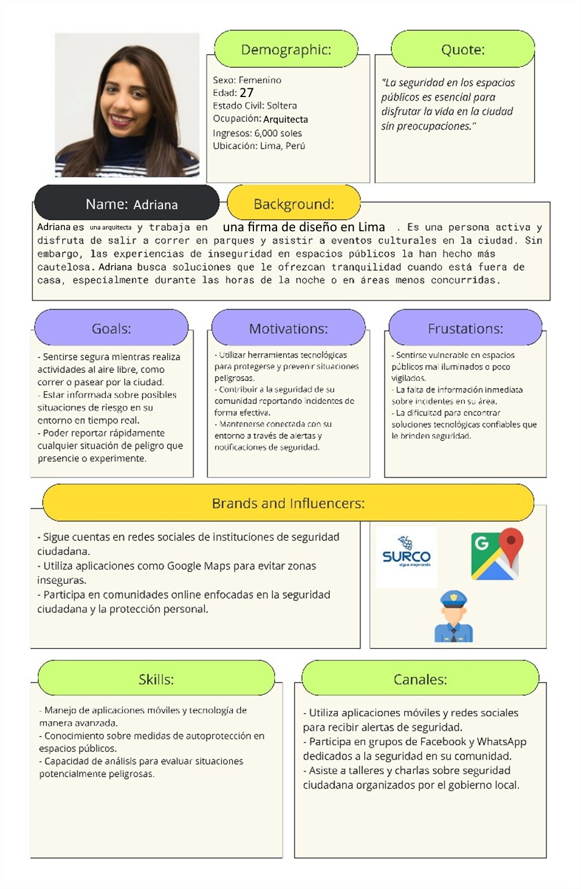

### 2.3.2. User Task Matrix

Ciudadanos preocupados por su seguridad en espacios públicos

### 2.3.2. User Task Matrix

| **Task Matrix**                                                                    | **Ciudadanos preocupados por su seguridad en espacios públicos** |
|------------------------------------------------------------------------------------|------------------------------------------------------------------|
|                                                                                    | **Frecuencia / Importancia**                                     |
| Consultar a familiares o amigos sobre la seguridad de una zona antes de visitarla | Siempre / Alta                                                   |
| Buscar en Internet o en redes sociales noticias sobre incidentes en su área       | A veces / Media                                                  |
| Evitar salir en horarios o lugares que son conocidos como peligrosos              | Siempre / Alta                                                   |
| Llamar a la policía o a servicios de emergencia en caso de sentirse en peligro    | Casi nunca / Alta                                                |
| Organizarse con vecinos para mejorar la seguridad en la comunidad                 | Nunca / Media                                                    |
| Usar aplicaciones de mapas para evitar zonas peligrosas conocidas                 | Nunca / Media                                                    |
| Llevar consigo objetos de autodefensa personal                                     | Nunca / Media                                                    |

### 2.3.3. User Journey Mapping 

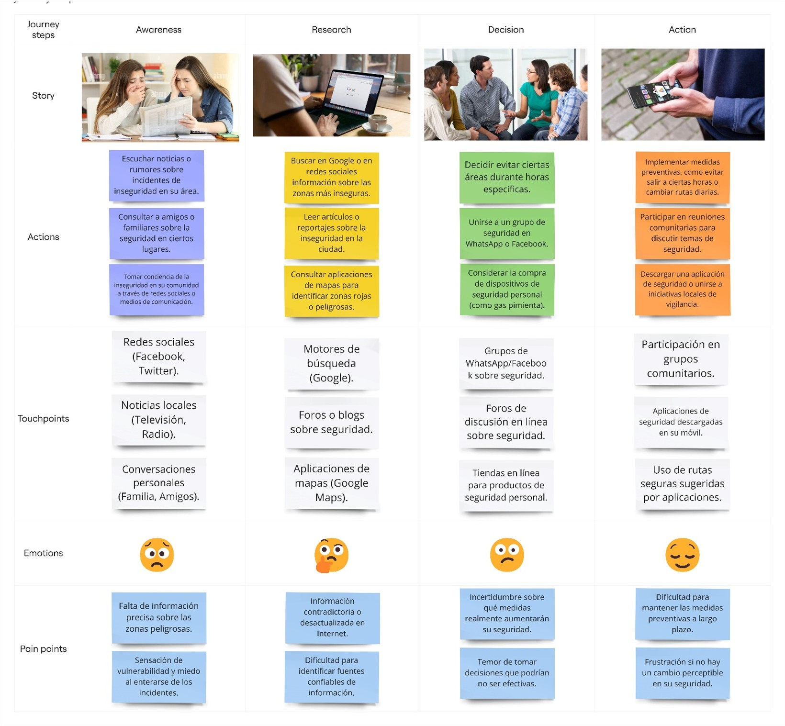

### 2.3.4. Empathy Mapping 

Con ayuda del gráfico Empathy Mapping podemos conocer las necesidades,
frustraciones de nuestro segmento objetivo: **Ciudadanos preocupados por
su seguridad en espacios públicos**. Esto nos ofrece una comprensión más
profunda de cómo se siente nuestro usuario y abordar una solución que
realmente los ayuden.

#### 2.3.5. As-is Scenario Mapping 

| **FASES**    | Búsqueda de información actualizada                                                                                                                                   | Planificación para realizar un viaje a un sitio en específico                                                                                      | Contribución a la actualización de inseguridad ciudadana                                                                                                |
|--------------|-----------------------------------------------------------------------------------------------------------------------------------------------------------------------|----------------------------------------------------------------------------------------------------------------------------------------------------|---------------------------------------------------------------------------------------------------------------------------------------------------------|
| **DOING**    | El usuario ingresa a internet, ve noticieros para encontrar las condiciones de seguridad de los sitios que visitará.                                                  | El usuario ingresa a su aplicación que ofrece un mapa y recopila el recorrido que debe realizar para llegar a su destino.                          | El usuario ofrece a sus conocidos, amigos, familiares información de aquellas rutas y zonas inseguras que es de su conocimiento.                        |
| **THINKING** | El usuario piensa que la información es difícil de obtener, ya que muchas veces los reportes y denuncias llega a ser confidencial por el lado de la policía nacional. | El usuario piensa que alguno de los recorridos que ofrece el mapa contiene zonas no muy seguras y llega a ser peligroso para cualquier transeúnte. | El usuario piensa que brindar esta información es necesaria e importante para ayudar a sus seres más queridos y estén seguros ante cualquier incidente. |
| **FEELING**  | El usuario siente frustración al no encontrar información relevante, números de incidentes delictivos dentro de una zona específica.                                  | El usuario se siente preocupado al intentar llevar el recorrido ofrecido por la aplicación sin tener otra opción.                                  | El usuario se siente feliz y satisfecho por brindar la ayuda necesaria para aquellas personas que necesiten el estado de inseguridad de alguna ruta.    |

## 2.4. Ubiquitous Language

---

# Capítulo III: Requirements Specification
## 3.1. To-be Scenario Mapping

| **FASES**    | **Búsqueda de información actualizada**                                                                                                                   | **Planificación para realizar un viaje a un sitio en específico**                                                          | **Contribución a la actualización de inseguridad ciudadana**                                                                                           |
|--------------|-----------------------------------------------------------------------------------------------------------------------------------------------------------|----------------------------------------------------------------------------------------------------------------------------|--------------------------------------------------------------------------------------------------------------------------------------------------------|
| **DOING**    | El usuario ingresa a nuestra aplicación móvil, busca y visualiza la zona que requiere comprobar su estado de seguridad.                                   | El usuario ingresa a nuestra aplicación móvil y planea su recorrido por realizar                                           | El usuario ingresa a nuestra aplicación móvil, selecciona una zona en específico y la categoriza con puntuación y grado de inseguridad.                |
| **THINKING** | El usuario piensa que la información es fácil de buscar y obtener en esta aplicación, además que ofrece posibilidad de actualizarla.                      | El usuario piensa que es de gran utilidad conocer el grado de inseguridad de cada zona que planea visitar.                 | El usuario piensa que brindar esta información es necesaria e importante para todas las personas que utilicen la aplicación y así puedan considerarlo. |
| **FEELING**  | El usuario se siente satisfecho por la funcionalidad ofrecida por la aplicación móvil, una búsqueda rápida por zonas, etiquetando su grado de inseguridad | El usuario se siente seguro al observar y tener varias posibilidades en diferentes zonas por las cuales puede trasladarse. | El usuario se siente feliz y satisfecho por brindar la ayuda necesaria para aquellas personas que necesiten el estado de inseguridad de alguna ruta.   |

## 3.2. User Stories

| User/Technical Story ID | Título                                             | Descripción                                                                                                                                                                          | Criterios de Aceptación | Relacionado con (Epic ID) |
|-------------------------|----------------------------------------------------|--------------------------------------------------------------------------------------------------------------------------------------------------------------------------------------|--------------------------|----------------------------|
| EP01                    | Interfaz de Usuario y Navegación                   | Como usuario, quiero interactuar con una interfaz clara y fácil de navegar, para acceder a las funciones de la aplicación sin complicaciones.                                       | No corresponde.          | No corresponde.            |
| EP02                    | Registro, Inicio de Sesión y Perfil                | Como usuario, quiero poder registrarme, iniciar sesión y personalizar mi perfil, para gestionar mi cuenta y preferencias dentro de la aplicación.                                  | No corresponde.          | No corresponde.            |
| EP03                    | Mapa Interactivo y Reportes                        | Como usuario, quiero acceder a un mapa interactivo que muestre rutas seguras y zonas peligrosas, y poder enviar reportes de incidentes, para contribuir a la seguridad de mi comunidad. | No corresponde.          | No corresponde.            |
| EP04                    | Diseño y Accesibilidad de la Landing Page         | Como visitante de la landing page, quiero acceder a una página bien diseñada y fácil de navegar, para obtener rápidamente información sobre PeaceApp y cómo descargarla.           | No corresponde.          | No corresponde.            |
| EP05                    | Información y Contacto                             | Como visitante de la landing page, quiero encontrar información clara sobre los servicios y beneficios de la aplicación y tener la opción de contactar al equipo, para resolver cualquier duda o preocupación que tenga. | No corresponde.          | No corresponde.            |
| US01          | Contactar con la Startup    | Como visitante de la Landing Page, quiero encontrar un formulario de contacto funcional y accesible, para poder comunicarme con el startup. | Escenario 1: Enviar un mensaje a los desarrolladores Dado que el visitante tiene una consulta o comentario relacionado con la aplicación, Cuando redacte un mensaje para contactar a los desarrolladores, Entonces el sistema enviará el mensaje a la dirección de correo electrónico del startup. | EP05                       |
| US02          | Navegar en la Landing Page  | Como visitante de la Landing Page, quiero encontrar las secciones bien definidas para comprender fácilmente la información mostrada. | Escenario 1: Visualizar información Dado que el visitante está recorriendo la landing page, Cuando acceda a una sección de la landing page, Entonces podrá comprender la información, ya que, cada sección estará organizada.  Escenario 2: Navegación a través del menú principal Dado que el visitante está en la landing page, Cuando hace clic en una opción del menú principal (como "About Us", "Services", entre otros), Entonces es redirigido a la sección correspondiente y la información se muestra claramente. | EP04                       |
| US03          | Acceso a Planes             | Como visitante de la Landing Page, quiero poder acceder a los detalles de los planes ofrecidos por PeaceApp, para elegir el que mejor se adapte a mis necesidades. | Escenario 1: Visualización de planes Dado que el visitante está en la landing page, Cuando accede a la sección "Plans", Entonces puede ver los detalles de los diferentes planes de suscripción.  Escenario 2: Comparación de planes Dado que el visitante está en la sección de "Plans", Cuando desea comparar las características de los diferentes planes, Entonces el sistema muestra una tabla o lista comparativa que destaca las diferencias entre los planes.  Escenario 3: Selección de un plan para más detalles Dado que el visitante está revisando los planes disponibles, Cuando hace clic en un plan específico, Entonces se muestra información más detallada de lo que ofrece el respectivo plan. | EP05                       |
| US04          | Navegación Intuitiva | Como usuario, quiero que la interfaz de la aplicación sea intuitiva y fácil de navegar, para poder acceder rápidamente a las funciones que necesito.     | Escenario 1: Navegación sencilla Dado que el usuario abre la aplicación, Cuando comienza a interactuar con la interfaz, Entonces encuentra fácilmente las opciones y menús que necesita.  Escenario 2: Búsqueda rápida de funciones Dado que el usuario quiere acceder a una función específica, Cuando utiliza el menú principal o el buscador de la aplicación, Entonces puede localizar la función rápidamente sin navegar por múltiples menús. | EP01 |
| US05          | Diseño Responsivo    | Como usuario, quiero que la aplicación se adapte bien a diferentes tamaños de pantalla, para poder usarla cómodamente en cualquier dispositivo, ya sea móvil, tablet o escritorio. | Escenario 1: Adaptación a dispositivos móviles Dado que el usuario accede a la aplicación desde un smartphone, Cuando la aplicación se carga en el dispositivo, Entonces la interfaz se ajusta automáticamente para proporcionar una experiencia de uso óptima en una pantalla pequeña.  Escenario 2: Adaptación a tablets Dado que el usuario accede a la aplicación desde una tablet, Cuando la aplicación se carga en el dispositivo, Entonces la interfaz muestra un diseño responsivo adecuado para la pantalla más grande, utilizando el espacio de manera eficiente. | EP01 |
| US06          | Registro de Usuarios | Como usuario, quiero poder registrarme en la aplicación, para acceder a las funcionalidades de PeaceApp.                                                 | Escenario 1: Registro exitoso Dado que el usuario ha completado todos los campos del formulario de registro, Cuando hace clic en "Crear cuenta", Entonces la cuenta se crea y el usuario accede a la aplicación.  Escenario 2: Registro incompleto Dado que el usuario intenta registrarse sin completar todos los campos obligatorios, Cuando hace clic en "Crear cuenta", Entonces el sistema muestra un mensaje de error indicando qué campos faltan por completar.  Escenario 3: Registro con credenciales ya utilizadas Dado que el usuario intenta registrarse utilizando un correo electrónico ya registrado en la base de datos, Cuando hace clic en "Crear cuenta", Entonces el sistema muestra un mensaje de error indicando que el correo electrónico ya está en uso y sugiere recuperar la contraseña. | EP02 |
| US07          | Iniciar Sesión       | Como usuario registrado, quiero poder iniciar sesión con mi correo y contraseña, para acceder a mi cuenta.                                               | Escenario 1: Inicio de sesión exitoso Dado que el usuario ha ingresado su correo y contraseña correctamente, Cuando hace clic en "Iniciar sesión", Entonces accede a su cuenta en la aplicación.  Escenario 2: Inicio de sesión con credenciales incorrectas Dado que el usuario ingresa un correo electrónico o contraseña incorrectos, Cuando hace clic en "Iniciar sesión", Entonces el sistema muestra un mensaje de error indicando que las credenciales son incorrectas. | EP02 |
| US08          | Generar Reporte de Incidentes  | Como usuario, quiero poder generar reportes de incidentes de seguridad, para contribuir a la actualización del mapa de calor. | Escenario 1: Reporte exitoso Dado que el usuario ha presenciado un incidente, Cuando completa el formulario de reporte en la aplicación, Entonces el incidente se registra y el mapa de calor se actualiza.  Escenario 2: Reporte con datos incompletos Dado que el usuario intenta enviar un reporte sin completar toda la información requerida, Cuando hace clic en "Enviar reporte", Entonces el sistema muestra un mensaje de error indicando los campos faltantes.  Escenario 3: Cancelación del reporte Dado que el usuario ha comenzado a llenar un reporte de incidente, Cuando decide cancelar el envío antes de completar el formulario, Entonces el sistema le pregunta si está seguro de que desea cancelar y descartar los datos ingresados. | EP03 |
| US09          | Adjuntar Evidencia al Reporte  | Como usuario, quiero poder adjuntar fotos o videos al reporte, para dar mayor credibilidad y detalle al incidente reportado. | Escenario 1: Adjuntar evidencia Dado que el usuario está completando un reporte, Cuando adjunta una foto o video desde su dispositivo, Entonces el reporte se envía con la evidencia adjunta.  Escenario 2: Error al subir evidencia Dado que el usuario intenta subir una imagen o video de gran tamaño que excede el límite permitido, Cuando hace clic en "Subir evidencia", Entonces el sistema muestra un mensaje de error indicando que el archivo es demasiado grande. | EP03 |
| US10          | Visualización de Rutas Seguras | Como ciudadano, quiero poder ingresar mi destino en la aplicación, para elegir la ruta más segura para mi viaje.        | Escenario 1: Selección de una ruta segura Dado que el ciudadano desea desplazarse hacia su destino usando la aplicación, Cuando ingresa su destino en la aplicación y solicita las rutas posibles, Entonces la aplicación muestra varias rutas posibles hacia su destino y el usuario selecciona una ruta de acuerdo a sus preferencias y necesidades.  Escenario 2: Comparación de rutas por nivel de seguridad Dado que el ciudadano tiene varias opciones de rutas disponibles, Cuando compara las rutas en función del nivel de seguridad, Entonces la aplicación muestra una comparación clara que destaca la seguridad de cada ruta.  Escenario 3: Cambio de ruta durante el viaje Dado que el ciudadano ha comenzado a seguir una ruta sugerida por la aplicación, Cuando decide cambiar a una ruta diferente por cualquier motivo (como tráfico o condiciones de seguridad cambiantes), Entonces la aplicación recalcula y ofrece una nueva ruta segura basada en la ubicación actual. | EP03 |
| US11          | Visualización de Reportes        | Como ciudadano, quiero poder ver los reportes de otros usuarios sobre incidentes ocurridos en la zona, para estar al tanto de los eventos de seguridad. | Escenario 1: Visualización de reportes recientes Dado que el ciudadano está navegando por la aplicación, Cuando accede a la opción de "ver reportes", Entonces la aplicación muestra los reportes más recientes en la zona del ciudadano.  Escenario 2: Visualización de reportes en el mapa Dado que el ciudadano está utilizando el mapa interactivo en la aplicación, Cuando activa la opción de mostrar reportes en el mapa, Entonces la aplicación superpone los reportes relevantes en el mapa, mostrando la ubicación exacta de cada incidente. | EP03 |
| US12          | Recibir Notificaciones sobre Reportes | Como ciudadano, quiero recibir notificaciones sobre los reportes recientes en mi área, para estar informado y tomar precauciones. | Escenario 1: Notificaciones activadas Dado que el usuario tiene activadas las notificaciones, Cuando se recibe un nuevo reporte en su área, Entonces el usuario es notificado inmediatamente.  Escenario 2: Configuración de notificaciones Dado que el ciudadano desea ajustar la frecuencia o tipo de notificaciones que recibe, Cuando accede a la configuración de notificaciones en la aplicación, Entonces puede seleccionar qué tipo de reportes desea ser notificado y con qué frecuencia. | EP03 |
| US13          | Recibir Alertas de Zonas de Riesgo | Como ciudadano, quiero recibir alertas si me acerco a una zona de alto riesgo, para tomar las precauciones necesarias. | Escenario 1: Alerta de riesgo mientras está en una zona peligrosa Dado que el ciudadano está caminando en una zona peligrosa según la aplicación, Cuando la aplicación detecta que el ciudadano está en esa zona, Entonces la aplicación envía una alerta al ciudadano. | EP03 |
| US14         | Compartir Ubicación con Contactos | Como usuario, quiero poder compartir mi ubicación con mis contactos cercanos, para que puedan monitorear mi trayecto y estar alertas ante cualquier peligro. | Escenario 1: Compartir ubicación con éxito Dado que un usuario desea compartir su ubicación, Cuando activa la opción de compartir ubicación en la aplicación, Entonces los contactos seleccionados reciben la ubicación en tiempo real.  Escenario 2: Error al compartir ubicación Dado que un usuario intenta compartir su ubicación con sus contactos cercanos, Cuando la aplicación no puede acceder a la ubicación del usuario, Entonces se muestra un mensaje de error indicando que no se puede compartir la ubicación. | EP03 |
| US15          | Editar Información de Perfil     | Como usuario, quiero poder editar mi información de perfil, para corregir o actualizar mis datos personales.                 | Escenario 1: Editar información de perfil exitosa Dado que el usuario está en la pantalla de edición de su perfil, Cuando el usuario actualiza su información personal y hace clic en el botón "Guardar cambios", Entonces la información actualizada debe guardarse correctamente y mostrarse en el perfil del usuario, con un mensaje de confirmación indicando que los cambios se realizaron con éxito.  Escenario 2: Error al guardar información de perfil Dado que el usuario está en la pantalla de edición de su perfil, Cuando el usuario intenta guardar los cambios con un campo obligatorio vacío o con un formato incorrecto, Entonces el sistema debe mostrar un mensaje de error indicando que la información no es válida, resaltando los campos que necesitan corrección, y no debe guardar los cambios hasta que toda la información esté correctamente completada. | EP02 |
| US16          | Recuperar Contraseña             | Como usuario, quiero poder recuperar mi contraseña si la olvido, para poder acceder nuevamente a mi cuenta.                  | Escenario 1: Edición exitosa Dado que el usuario accede a la configuración de su perfil, Cuando cambia la información deseada, Entonces la información se actualiza correctamente.  Escenario 2: Fallo en la edición de perfil Dado que el usuario intenta guardar los cambios en su perfil, Cuando hay un problema de conectividad o error del servidor, Entonces el sistema muestra un mensaje de error indicando que los cambios no se han podido guardar. | EP02 |
| US17          | Acceder a Mapa de Calor          | Como usuario, quiero poder ver un mapa de calor que muestre las zonas de mayor peligrosidad en mi área, para tomar decisiones informadas sobre mi seguridad. | Escenario 1: Acceso al mapa de calor Dado que el usuario está en la página principal de la aplicación, Cuando selecciona el mapa de calor, Entonces se muestra el mapa de calor señalando las zonas peligrosas y/o seguras de acuerdo con su ubicación. | EP03 |
| TS01 | Autenticación JWT mediante RESTful API | Como desarrollador, quiero autenticar a los usuarios a través de un token JWT para que puedan acceder a la plataforma de manera segura. | Escenario 1: Inicio de sesión exitoso Dado que el endpoint /api/v1/login está disponible Cuando se envía un POST request con nombre de usuario y contraseña correctos Entonces se recibe un response con un status 200 Y un token JWT es generado y enviado en el body del response.  Escenario 2: Fallo en inicio de sesión Dado que el endpoint /api/v1/login está disponible Cuando se envía un POST request con credenciales incorrectas Entonces se recibe un response con un status 401 Y un mensaje en el body dice "Credenciales incorrectas." | No corresponde |
| TS02 | Crear nuevo usuario mediante RESTful API | Como desarrollador, quiero permitir la creación de nuevos usuarios para que puedan acceder al sistema. | Escenario 1: Crear usuario con datos válidos Dado que el endpoint /api/v1/users está disponible Cuando se envía un POST request con nombre, correo y contraseña Entonces se recibe un response con un status 201 Y el usuario es creado, y se devuelve un body con el ID del usuario y los datos ingresados.  Escenario 2: Crear usuario con correo duplicado Dado que el endpoint /api/v1/users está disponible Cuando se envía un POST request con un correo que ya existe Entonces se recibe un response con un status 400 Y un mensaje en el body del response dice "El correo ya está en uso." | No corresponde |
| TS03 | Editar perfil de usuario mediante RESTful API | Como desarrollador, quiero que los usuarios puedan actualizar su información personal para mantener sus perfiles al día. | Escenario 1: Actualizar nombre y correo del perfil Dado que el endpoint /api/v1/users/{id} está disponible Cuando se envía un PUT request con datos actualizados Entonces se recibe un response con un status 200 Y la información del perfil es actualizada en el sistema. | No corresponde |
| TS04 | Eliminar cuenta de usuario mediante RESTful API | Como desarrollador, quiero permitir que los usuarios eliminen sus cuentas para que puedan gestionar su presencia en la plataforma. | Escenario 1: Eliminar cuenta existente Dado que el endpoint /api/v1/users/{id} está disponible Cuando se envía un DELETE request con el ID del usuario Entonces se recibe un response con un status 204 Y el usuario es eliminado del sistema.  Escenario 2: Intentar eliminar usuario inexistente Dado que el endpoint /api/v1/users/{id} está disponible Cuando se envía un DELETE request con un ID de usuario inexistente Entonces se recibe un response con un status 404 Y un mensaje en el body dice "Usuario no encontrado." | No corresponde |
| TS05 | Crear reporte de incidente mediante RESTful API | Como desarrollador, quiero que los usuarios puedan crear reportes de incidentes para compartir información sobre zonas peligrosas. | Escenario 1: Crear reporte de incidente válido Dado que el endpoint /api/v1/reports está disponible Cuando se envía un POST request con los detalles del incidente (ubicación, descripción, tipo) Entonces se recibe un response con un status 201 Y el reporte es creado y registrado en el sistema.  Escenario 2: Intentar crear reporte con datos faltantes Dado que el endpoint /api/v1/reports está disponible Cuando se envía un POST request sin todos los detalles necesarios (como la ubicación) Entonces se recibe un response con un status 400 Y un mensaje en el body dice "Datos insuficientes para crear el reporte." | No corresponde |
| TS06 | Obtener lista de reportes mediante RESTful API | Como desarrollador, quiero que los usuarios puedan obtener una lista de reportes para ver incidentes recientes en su área. | Escenario 1: Obtener reportes existentes Dado que el endpoint /api/v1/reports está disponible Cuando se envía un GET request Entonces se recibe un response con un status 200 Y una lista de reportes es devuelta en el body del response.  Escenario 2: No hay reportes disponibles Dado que el endpoint /api/v1/reports está disponible Cuando se envía un GET request Entonces se recibe un response con un status 200 Y un mensaje en el body dice "No hay reportes disponibles." | No corresponde |
| TS07 | Eliminar reporte de incidente mediante RESTful API | Como desarrollador, quiero permitir que los usuarios eliminen reportes que hayan creado previamente para que puedan gestionar la información que han compartido en la plataforma. | Escenario 1: Eliminar reporte existente Dado que el endpoint /api/v1/reports/{id} está disponible Cuando se envía un DELETE request con el ID del reporte Entonces se recibe un response con un status 204 Y el reporte es eliminado del sistema.  Escenario 2: Intentar eliminar reporte inexistente Dado que el endpoint /api/v1/reports/{id} está disponible Cuando se envía un DELETE request con un ID inexistente Entonces se recibe un response con un status 404 Y un mensaje en el body dice "Reporte no encontrado." | No corresponde |
| TS08 | Enviar alerta de emergencia mediante RESTful API | Como desarrollador, quiero que los usuarios puedan enviar alertas de emergencia para que reciban ayuda inmediata. | Escenario 1: Enviar alerta válida Dado que el endpoint /api/v1/alerts está disponible Cuando se envía un POST request con los datos de la emergencia (ubicación, tipo) Entonces se recibe un response con un status 201 Y la alerta es enviada a los contactos de emergencia.  Escenario 2: Intentar enviar alerta sin datos suficientes Dado que el endpoint /api/v1/alerts está disponible Cuando se envía un POST request con datos incompletos Entonces se recibe un response con un status 400 Y un mensaje en el body dice "Datos incompletos para enviar la alerta." | No corresponde |
| TS09 | Obtener lista de alertas enviadas mediante RESTful API | Como desarrollador, quiero que los usuarios puedan obtener una lista de las alertas que han enviado previamente para que puedan revisar su historial de alertas. | Escenario 1: Obtener alertas enviadas Dado que el endpoint /api/v1/alerts está disponible Cuando se envía un GET request Entonces se recibe un response con un status 200 Y se devuelve una lista de alertas previamente enviadas. | No corresponde |
| TS10 | Obtener reporte por ID mediante RESTful API | Como desarrollador, quiero que los usuarios puedan obtener los detalles de un solo reporte para consultar información específica sobre un incidente. | Escenario 1: Obtener reporte existente por ID Dado que el endpoint /api/v1/reports/{id} está disponible Cuando se envía un GET request con un ID válido Entonces se recibe un response con un status 200 Y los detalles del reporte son devueltos en el body del response.  Escenario 2: Intentar obtener reporte con un ID inexistente Dado que el endpoint /api/v1/reports/{id} está disponible Cuando se envía un GET request con un ID inexistente Entonces se recibe un response con un status 404 Y un mensaje en el body del response dice "Reporte no encontrado." | No corresponde |

## 3.3. Product Backlog

Se implementa el siguiente producto backlog a partir de las historias de
usuario elaboradas, evaluándolas en un rango de 1,2,3,5,8 (serie
Fibonacci), significando el mayor número como el más importante y
relevante.

| **ID** | **User Story / Technical Story Id** | **Título**                                                                   | **Descripción**                                                                                                                                                                    | **Story Points (1/2/3/5/8)** |
|--------|-------------------------------------|------------------------------------------------------------------------------|------------------------------------------------------------------------------------------------------------------------------------------------------------------------------------|------------------------------|
| 1      | **US02**                            | Navegar en la Landing Page                                                   | Como visitante de la Landing Page, quiero encontrar las secciones bien definidas para comprender fácilmente la información mostrada.                                               | 1                            |
| 2      | **US03**                            | Acceso a Planes                                                              | Como visitante de la Landing Page, quiero poder acceder a los detalles de los planes ofrecidos por PeaceApp, para elegir el que mejor se adapte a mis necesidades.                 | 2                            |
| 3      | **US01**                            | Contactar con la Startup                                                     | Como visitante de la Landing Page, quiero encontrar un formulario de contacto funcional y accesible, para poder comunicarme con el startup.                                        | 1                            |
| 4      | **US17**                            | Acceder a Mapa de Calor                                                | Como usuario, quiero poder ver un mapa de calor que muestre las zonas de mayor peligrosidad en mi área, para tomar decisiones informadas sobre mi seguridad.                                                      | 8                           |
| 4      | **US08**                            | Generar Reporte de Incidentes                                                | Como usuario, quiero poder generar reportes de incidentes de seguridad, para contribuir a la actualización del mapa de calor.                                                      | 3                            |
| 5      | **US12**                            | Recibir Notificaciones sobre Reportes                                        | Como ciudadano, quiero recibir notificaciones sobre los reportes recientes en mi área, para estar informado y tomar precauciones.                                                  | 3                            |
| 6      | **US13**                            | Recibir Alertas de Zonas de Riesgo                                           | Como ciudadano, quiero recibir alertas si me acerco a una zona de alto riesgo, para tomar las precauciones necesarias.                                                             | 3                            |
| 7      | **US11**                            | Visualización de Reportes                                                    | Como ciudadano, quiero poder ver los reportes de otros usuarios sobre incidentes ocurridos en la zona, para estar al tanto de los eventos de seguridad.                            | 3                            |
| 8      | **US09**                            | Adjuntar Evidencia al Reporte                                                    | Como usuario, quiero poder adjuntar fotos o videos al reporte, para dar mayor credibilidad y detalle al incidente reportado.                            | 5                            |
| 9      | **US10**                            | Visualización de Rutas Seguras                                               | Como ciudadano, quiero poder ingresar mi destino en la aplicación, para elegir la ruta más segura para mi viaje.                                                                   | 5                            |
| 10     | **US14**                            | Compartir Ubicación con Contactos                                            | Como usuario, quiero poder compartir mi ubicación con mis contactos cercanos, para que puedan monitorear mi trayecto y estar alertas ante cualquier peligro.                       | 5                            |
| 11     | **US06**                            | Registro de Usuarios                                                         | Como usuario, quiero poder registrarme en la aplicación, para acceder a las funcionalidades de PeaceApp.                                                                           | 3                            |
| 12     | **US07**                            | Iniciar Sesión                                                               | Como usuario registrado, quiero poder iniciar sesión con mi correo y contraseña, para acceder a mi cuenta.                                                                         | 5                            |
| 13     | **US15**                            | Editar Información de Perfil                                                 | Como usuario, quiero poder editar mi información de perfil, para corregir o actualizar mis datos personales.                                                                       | 1                            |
| 14     | **US16**                            | Recuperar Contraseña                                           | Como usuario, quiero poder guardar mis preferencias de seguridad, para que la aplicación las aplique automáticamente cada vez que planifique una ruta.                             | 2                            |
| 15     | **US05**                            | Diseño Responsivo                                                            | Como usuario, quiero que la aplicación se adapte bien a diferentes tamaños de pantalla, para poder usarla cómodamente en cualquier dispositivo, ya sea móvil, tablet o escritorio. | 3                            |
| 16     | **US04**                            | Navegación Intuitiva                                                         | Como usuario, quiero que la interfaz de la aplicación sea intuitiva y fácil de navegar, para poder acceder rápidamente a las funciones que necesito.                               | 5                            |
| 17     | **TS05**                            | Crear reporte de incidente mediante RESTful API                              | Como desarrollador, quiero que los usuarios puedan crear reportes de incidentes para compartir información sobre zonas peligrosas.                                                 | 5                            |
| 18     | **TS08**                            | Enviar alerta de emergencia mediante RESTful API                             | Como desarrollador, quiero que los usuarios puedan enviar alertas de emergencia para que reciban ayuda inmediata.                                                                  | 8                            |
| 19     | **TS10**                            | Obtener reporte por ID mediante RESTful API                                  | Como desarrollador, quiero que los usuarios puedan obtener los detalles de un solo reporte para consultar información específica sobre un incidente.                               | 3                            |
| 20     | **TS06**                            | Obtener lista de reportes mediante RESTful API                               | Como desarrollador, quiero que los usuarios puedan obtener una lista de reportes para ver incidentes recientes en su área.                                                         | 3                            |
| 21     | **TS07**                            | Eliminar reporte de incidente mediante RESTful API                           | Como desarrollador, quiero permitir que los usuarios eliminen reportes que hayan creado previamente para que puedan gestionar la información que han compartido en la plataforma.  | 3                            |
| 22     | **TS01**                            | Autenticación JWT mediante RESTful API                                       | Como desarrollador, quiero autenticar a los usuarios a través de un token JWT para que puedan acceder a la plataforma de manera segura.                                            | 8                            |
| 23     | **TS02**                            | Crear nuevo usuario mediante RESTful API                                     | Como desarrollador, quiero permitir la creación de nuevos usuarios para que puedan acceder al sistema.                                                                             | 5                            |
| 24     | **TS03**                            | Editar perfil de usuario mediante RESTful API                                | Como desarrollador, quiero que los usuarios puedan actualizar su información personal para mantener sus perfiles al día.                                                           | 3                            |
| 25     | **TS09**                            | Obtener lista de alertas enviadas mediante RESTful API                       | Como desarrollador, quiero que los usuarios puedan obtener una lista de las alertas que han enviado previamente para que puedan revisar su historial de alertas.                   | 3                            |
| 26     | **TS04**                            | Eliminar cuenta de usuario mediante RESTful API                              | Como desarrollador, quiero permitir que los usuarios eliminen sus cuentas para que puedan gestionar su presencia en la plataforma.                                                 | 5                            |

## 3.4. Impact Mapping

# Capítulo IV: Product Design 

## 4.1. Style Guidelines

### 4.1.1. General Style Guidelines

**Branding:** Nuestro logo refleja de manera sencilla y memorable el
espíritu de PeaceApp. Con el nombre de la aplicación acompañado por un
símbolo que evoca un camino seguro y la inicial de \"PeaceApp\",
buscamos que los usuarios asocien rápidamente nuestra marca con su
propósito: guiarlos hacia un entorno más seguro. Queremos que nuestro
logo sea fácil de recordar, al igual que la seguridad que ofrecemos en
cada trayecto.

**Tipografía:** Nuestro logotipo posee la fuente "Lora", el cual refleja
un estilo simple y moderno. Buscando promover un ambiente innovador e
interactivo de nuestra aplicación. En adición, y con respecto a nuestra
aplicación tanto la palabra "Peace" como "App", gozan de las mismas
características de formato. Se usa Poppins en el resto de la aplicación.

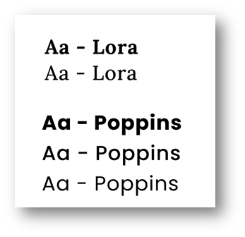

**Colores:** Continuando con el objetivo de brindar una imagen que
influya principalmente la confianza y seguridad. Hemos decidido optar
por una paleta de colores que transmiten calma, seguridad, estabilidad y
profesionalismo. Por lo que serán tonos de azules hasta llegar a blanco.
Esta combinación no solo manifiesta el objetivo de nuestro proyecto,
sino también una atmosfera de serenidad y sofisticación. A continuación,
se muestra la paleta de colores que se usarán para desarrollar nuestra
aplicación.

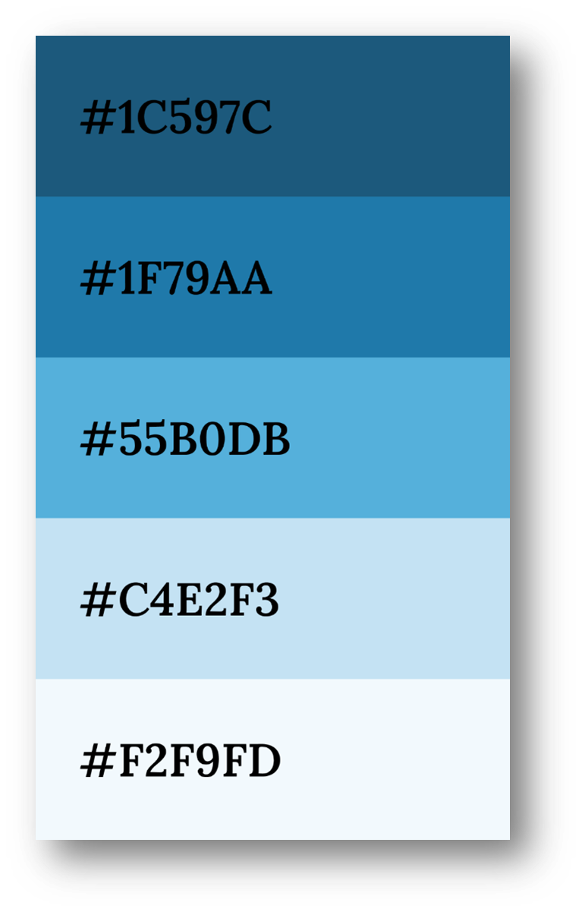

 ### 4.1.2. Web Style Guidelines
 
 Para la versión web, se sigue un enfoque de diseño responsivo, adoptando el patrón visual en forma de “Z” para guiar la atención del usuario. Se prioriza la simplicidad, con fondos de color único y uso puntual de imágenes representativas por sección. Los botones utilizan tonos contrastantes dentro de la paleta azul para diferenciar acciones clave. Las pantallas emergentes oscurecen el fondo y emplean variantes de azul con mayor intensidad para destacar acciones importantes y asegurar la atención del usuario antes de continuar con la navegación.
 
 ### 4.1.3. Mobile Style Guidelines
 
 #### 4.1.3.1. iOS Mobile Style Guidelines 
 
 Para dispositivos iOS, seguimos las recomendaciones de la Human Interface Guidelines (HIG) de Apple. El diseño se enfoca en la simplicidad, la legibilidad y la eficiencia del espacio. Se prioriza el uso de componentes nativos como tab bars, modals y gestos multitáctiles, garantizando una experiencia fluida y coherente con el ecosistema Apple. Además, se cuida el uso del safe area para asegurar una visualización óptima en dispositivos con diferentes tamaños de pantalla y elementos como el notch. Se promueve una navegación intuitiva, con transiciones suaves y retroalimentación clara para cada acción.
 
 #### 4.1.3.2. Android Mobile Style Guidelines 
 
 Para dispositivos Android, adoptamos las recomendaciones de Material Design de Google. Este enfoque promueve una interfaz adaptable y visualmente clara, con especial énfasis en la jerarquía de elementos, animaciones suaves y uso eficiente del color. Se implementan componentes nativos como floating action buttons, snackbars y cards para asegurar familiaridad y coherencia. También se aprovechan las capacidades del sistema como servicios de ubicación, notificaciones push y navegación por gestos, garantizando una experiencia moderna, consistente y funcional en toda la plataforma.
 
## 4.2. Information Architecture

En nuestra aplicación PeaceApp, buscamos ofrecer una interfaz
interactiva que inspire confianza y seguridad a nuestros usuarios. No
hace falta mencionar que nuestro enfoque es la seguridad ciudadana del
Perú, y esa es nuestra prioridad que debe de estar presente en la
experiencia de los usuarios. Una parte esencial será administrar
correctamente la arquitectura de la información. A continuación, se
detalla lo planeado para nuestra aplicación.

> **Página de Inicio:**

- Mapa Interactivo: Sección que muestra un mapa con los niveles de
  seguridad en diferentes zonas, permitiendo a los usuarios identificar
  áreas seguras e inseguras.

- Opciones de Denuncia: Enlace y acceso rápido a la funcionalidad de
  denuncia, donde los usuarios pueden reportar crímenes de manera
  pública o anónima.

- Información sobre la Plataforma: Detalles sobre PeaceApp, nuestra
  misión, visión y el impacto que buscamos generar. Además, información
  de contacto para consultas y asistencia.

> **Mapa de Seguridad:**

- Categorías de Seguridad: División del mapa en zonas categorizadas por
  niveles de seguridad (alto, medio, bajo) para facilitar la
  identificación rápida de áreas críticas.

- Filtros de Búsqueda: Herramientas para filtrar el mapa por tipos de
  incidentes reportados, fecha y hora de los eventos, y nivel de riesgo.

- Vista Detallada de Incidentes: Páginas individuales para cada
  incidente reportado con descripciones, ubicación precisa, y opción
  para agregar más detalles o evidencias.

> **Denuncia de Crímenes:**

- Herramienta de Denuncia: Interfaz intuitiva donde los usuarios pueden
  reportar incidentes seleccionando la categoría del crimen, adjuntando
  fotos, videos, o audios, y eligiendo la opción de denuncia anónima.

- Vista Previa en Tiempo Real: Visualización en tiempo real del reporte
  antes de enviarlo para asegurar que toda la información es correcta.

- Opciones de Ubicación y Tipo de Incidente: Selección de la ubicación
  del incidente y el tipo de crimen, con opción de marcarlo en el mapa.

> **Registro:**

- Registro de Usuarios: Formulario para que los usuarios se registren en
  la plataforma, incluyendo información básica como nombre, correo
  electrónico y número de teléfono.

- Registro de Contactos de Confianza: Opción para que los usuarios
  registren los contactos de confianza con quienes compartirán su
  ubicación en tiempo real.

### 4.2.1. Organization Systems

El sistema de organización se centrará en proporcionar la mejor
experiencia al usuario en cuanto a la navegación y uso de las
funcionalidades de seguridad. Nuestra plataforma está diseñada para que
los usuarios puedan navegar, reportar incidentes y monitorear la
seguridad de manera segura y cómoda.

> **Categorización de la Información:**

- Mapa de Seguridad: Categorizado por niveles de seguridad (alto, medio,
  bajo) y tipos de incidentes (robos, agresiones, etc.).

- Denuncias y Reportes: Categorizado por tipo de crimen y nivel de
  urgencia para facilitar la gestión y respuesta rápida.

> **Filtros y Búsqueda:**

- Filtros en el Mapa: Permiten a los usuarios filtrar incidentes por
  tipo de crimen, fecha y hora, y nivel de riesgo.

- Búsqueda Avanzada: Opción de búsqueda avanzada en el mapa y en los
  reportes para encontrar información específica o zonas críticas.

> **Interfaz de Usuario Intuitiva:**

- Menú Principal: Navegación clara con acceso rápido a las secciones
  principales como Mapa, Denuncia, Registro, y Contacto.

- Submenús Contextuales: Dentro de las secciones principales, submenús
  contextuales que guían a los usuarios a funcionalidades específicas,
  como diferentes tipos de incidentes en el Mapa o herramientas de
  denuncia.

> **Funcionalidades Específicas:**

- Información Detallada de Incidentes: Páginas individuales de
  incidentes que muestran descripciones completas, ubicación precisa y
  opciones de seguimiento.

### 4.2.2. Labeling Systems

Consideramos que la mejor opción para el desarrollo de nuestra
plataforma será a través de un sistema de etiquetado. Utilizaremos
etiquetas claras para describir cada funcionalidad y característica.
Ejemplos de etiquetas incluirán:

- Mapa de calor (Interactivo y a tiempo real)

- Denunciar (Denuncias a crímenes o incidentes)

- Información de Incidentes

- Registro de Usuarios

- Compartir Ubicación en Tiempo Real

### 4.2.3. SEO Tags and Meta Tags 

Nuestros SEO Tags y Meta Tags, o, dicho de otra forma, las etiquetas
clave que representarán el contenido de nuestra aplicación presentado
tanto en nuestra aplicación web como en aplicación móvil serán:

> Landing Page:

- Title: PeaceApp

- Description: PeaceApp - Oficial Landing Page

- Keywords: Seguridad, Accidentes, Incidentes, Policía.

- Authors: PeaceApp Team

> Web application:

- Title: PeaceApp

- Description: PeaceApp - Oficial Web Site

- Keywords: Seguridad, Accidentes, Incidentes, Policía.

- Authors: PeaceApp Team

### 4.2.4. Searching Systems 

El sistema de búsqueda permitirá a los usuarios encontrar y filtrar
información relevante sobre incidentes de seguridad en sus áreas de
interés. Emplearemos diferentes formas de búsqueda:

> **Búsqueda por Incidente:**

- Los usuarios pueden buscar incidentes específicos como \"robos en
  Miraflores\" o \"agresiones en San Isidro\".

- Se proporcionan opciones de búsqueda avanzada para filtrar por fecha,
  hora, tipo de crimen, y nivel de riesgo.

> **Búsqueda por Ubicación:**

- Los usuarios pueden buscar incidentes por ubicación específica, como
  \"incidentes en el centro de Lima\".

- Se ofrecen filtros para seleccionar múltiples ubicaciones y tipos de
  incidentes a la vez. (esto lo quitan si quieren, son ideas q yo saque)

> **Búsqueda por Nivel de Seguridad:**

- Los usuarios pueden buscar zonas según su nivel de seguridad, como
  \"zonas de alto riesgo\" o \"áreas seguras en Lima\".

- La plataforma sugiere las zonas más seguras y permite explorar áreas
  con diferentes niveles de riesgo.

> **Búsqueda Avanzada:**

- Se ofrece una búsqueda avanzada que permite a los usuarios combinar
  múltiples criterios de búsqueda, como \"robos en Miraflores durante la
  noche\".

- Los resultados de la búsqueda avanzada se presentan en una lista
  organizada por relevancia y se pueden refinar aún más utilizando
  filtros adicionales.

> **Búsqueda por Fecha y Hora:**

- Los usuarios pueden buscar incidentes dentro de un rango de fechas y
  horas específicas.

- Se muestra información sobre la frecuencia de incidentes en
  determinados horarios, facilitando la toma de decisiones informadas.

### 4.2.5. Navigation Systems 

El sistema de navegación de PeaceApp debe proporcionar una experiencia
fluida y fácil de usar para los usuarios, permitiéndoles encontrar
rápidamente la información que buscan. Se describe de la siguiente
forma:

> **Menú Principal:**

- Un menú principal ubicado en la parte superior izquierda (tanto con el
  logo como con solo el icono del logo), de cada página que incluye
  enlaces a las secciones clave como Mapa, Denuncia, Registro y
  Contacto.

- Cada elemento del menú principal está etiquetado de manera clara y
  concisa para facilitar la navegación.

> **Navegación Contextual:**

- Dentro de cada sección principal, se proporciona una navegación
  contextual que muestra submenús o enlaces relacionados con la sección
  actual, como diferentes categorías en el Mapa o herramientas de
  denuncia en la sección de Denuncia.

> **Botones de Acción Destacados:**

- En las páginas de Inicio y Mapa, se destacan botones de acción para
  dirigir a los usuarios a las funcionalidades principales de la
  plataforma.

- Estos botones de acción tienen un diseño llamativo y están
  estratégicamente ubicados para captar la atención de los usuarios.

> **Búsqueda y Filtros Visibles:**

- La barra de búsqueda y los filtros de navegación son visibles en todas
  las páginas para que los usuarios puedan buscar información específica
  o filtrar resultados según sus preferencias.

- Los filtros se presentan de manera clara y se pueden ajustar
  fácilmente para refinar los resultados de búsqueda.

> **Flujo de Navegación Intuitivo:**

- Se establece un flujo de navegación intuitivo y lógico que guía a los
  usuarios a través de las diferentes funcionalidades, desde la
  exploración del mapa hasta la denuncia de crímenes y el monitoreo de
  seguridad.

- Se utilizan llamadas a la acción claras y señales visuales para
  indicar el progreso y las acciones que los usuarios deben realizar en
  cada paso del proceso de navegación.

## 4.3. Landing Page UI Design

### 4.3.1. Landing Page Wireframe

Utilizando la herramienta de diseño Figma, creamos la estructura base de
la Landing Page.

Enlace al Landing Page Wireframe: <https://tinyurl.com/ybtsb4c6>

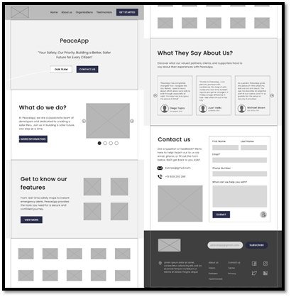

### 4.3.2. Landing Page Mock-up

Teniendo el wireframe, realizamos una representación más realista de la
Landing Page.

Enlace al Landing Page Mock-up: <https://tinyurl.com/ymunn2vn>

> 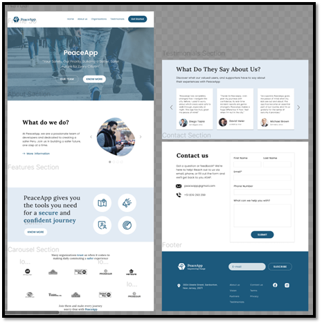

## 4.4. Mobile Applications UX/UI Design

### 4.4.1. Mobile Applications Wireframes

Creamos la estructura de PeaceApp utilizando Figma.

Enlace a los Mobile Applications Wireframes:
<https://www.figma.com/design/qDvXC6SO5sIKnEyGcgiHhe/Peace-App-Web-Applications-UX%2FUI-Design?node-id=0-1&node-type=canvas&t=8M5eo45jFkAsIaiW-0>

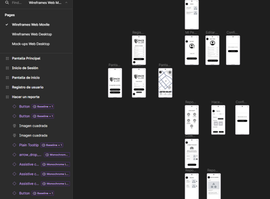

IOS Application Wireframes:

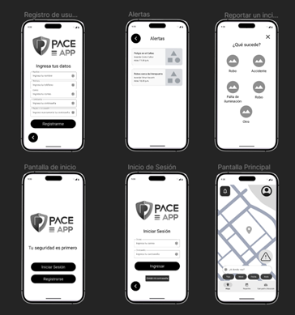

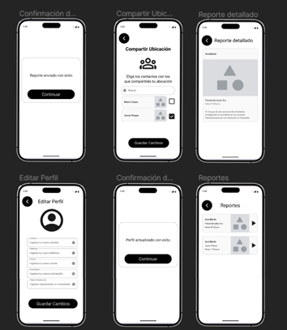

### 4.4.2. Mobile Applications Wireflow Diagrams 

**Wire Flow**: User Goal: Ingresar a la aplicación móvil como usuario registrado. Para este objetivo, el usuario accede a la pantalla inicial, selecciona el botón “Iniciar sesión” e ingresa su correo y contraseña. Si los datos ingresados son correctos, se redirige automáticamente al mapa de la aplicación. En caso de error (credenciales incorrectas o campos vacíos), se muestra un mensaje de advertencia solicitando revisar la información. US07

> 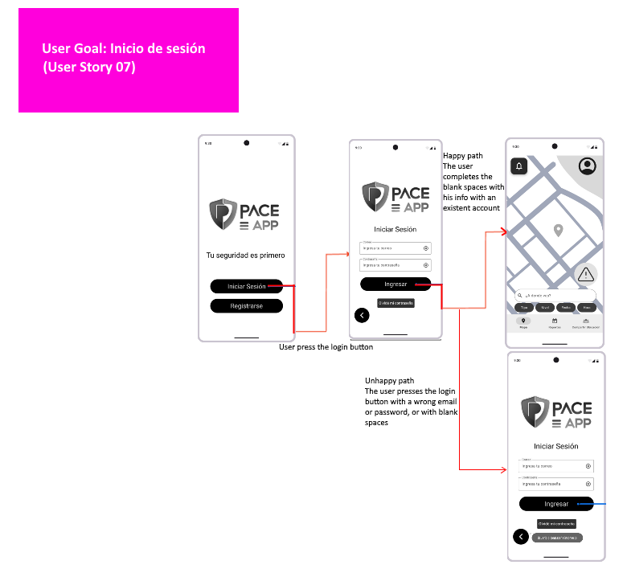

**Wire Flow**: User Goal: Registrarse en la aplicación móvil como nuevo usuario. Para lograr este objetivo, el usuario presiona el botón “Comenzar ahora” en la pantalla inicial y accede al formulario de registro. Allí deberá ingresar su nombre, apellido, número de teléfono, correo electrónico y contraseña. Si toda la información es válida, se muestra un mensaje confirmando la creación exitosa de la cuenta. Si hay errores en el formato del correo, la contraseña es demasiado corta o el número es inválido, se informará al usuario y no se completará el registro. US06

> 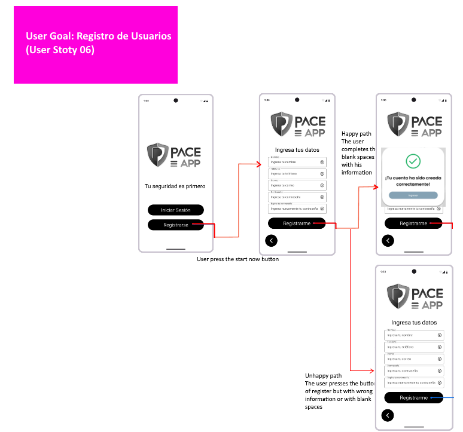

**Wire Flow**: User Goal: Visualizar los reportes disponibles en la aplicación. Una vez dentro de la app, el usuario puede acceder a la sección “Alertas” para ver los reportes en su zona. Si no existen alertas, no se mostrará contenido. Desde el mapa también puede acceder directamente al detalle de un reporte tocando un ícono. En la pestaña “Reportes”, puede revisar tanto los reportes generales como los propios. Si aún no se han generado reportes, esas secciones estarán vacías. US11

> 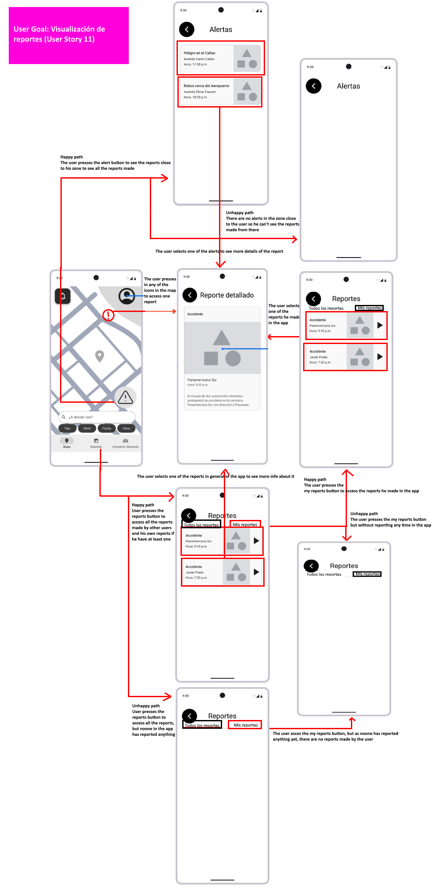

**Wire Flow:** User Goal: Editar la información del perfil del usuario. Al ingresar a la aplicación, el usuario puede acceder a su perfil mediante el ícono correspondiente. Desde allí puede modificar sus datos personales. Si todos los campos requeridos son completados correctamente, la información se actualiza exitosamente. Si algún campo queda vacío, se notificará al usuario para que complete todos los datos. US15

> 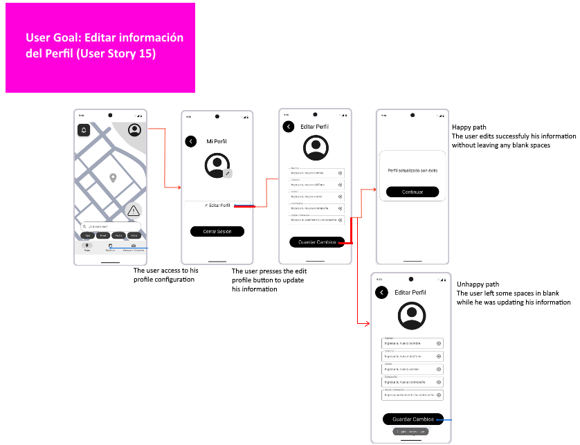

**Wire Flow:** Acceder al mapa de calor desde cualquier sección de la app. Al iniciar sesión correctamente, la aplicación redirige automáticamente al mapa donde se visualizan los reportes. Adicionalmente, desde cualquier otra sección, el usuario puede acceder al mapa mediante el ícono de navegación inferior. US17

> 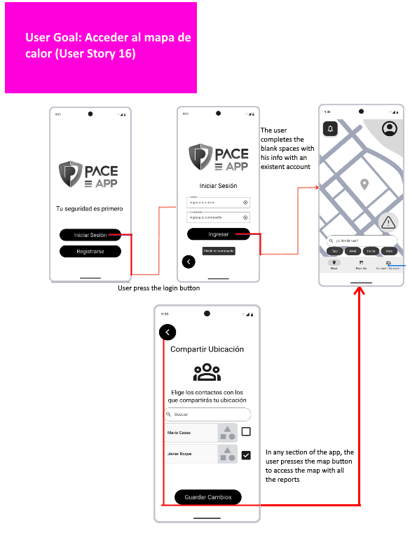

**Wire Flow**: Generar un nuevo reporte de incidente y adjuntar evidencia. Para cumplir este objetivo, el usuario accede a la sección “Mis reportes” y selecciona el botón para crear uno nuevo. Luego elige el tipo de incidente (robo, accidente, etc.) y completa el formulario incluyendo una descripción y la evidencia correspondiente. Puede cancelar el proceso, lo que le permitirá eliminar el reporte. Si completa correctamente todos los campos y adjunta evidencia, el reporte se publica exitosamente y se visualizará en el mapa de calor. Si hay errores o campos vacíos, el reporte no será enviado. US08 y US09

> 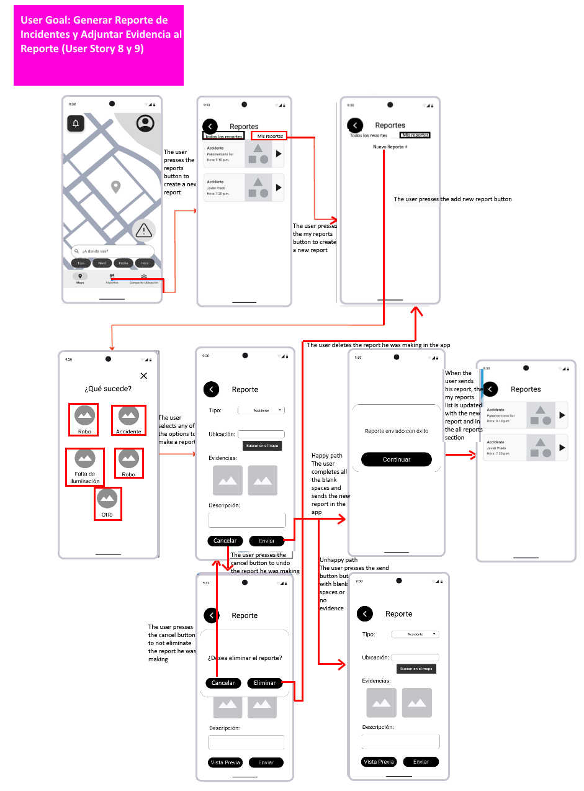

**Wire Flow**: Recibir notificaciones sobre reportes y alertas de riesgo. Al abrir la aplicación, el usuario puede seleccionar el ícono de alertas para ver los reportes cercanos. Si no existen alertas en la zona, se muestra una vista vacía. Si hay reportes disponibles, el usuario podrá ver los detalles tocando alguno de ellos. US13 y US12

**Wire Flow**: Compartir ubicación con contactos. El usuario accede a la sección “Compartir ubicación” desde el ícono correspondiente en la parte inferior de la app. Desde ahí puede ver una lista de contactos y seleccionar a quién desea enviar su ubicación. Al presionar el botón “Guardar cambios”, la ubicación será compartida con los contactos elegidos. US14

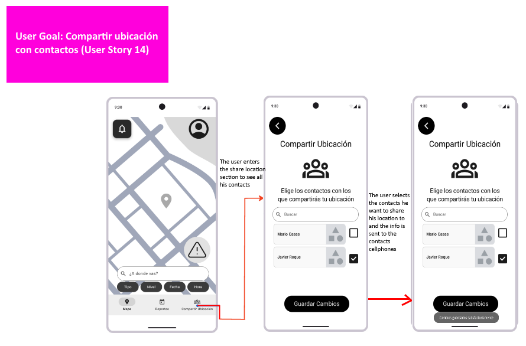

### 4.4.3. Mobile Applications Mock-ups

Creamos un boceto más realista de cómo se verá PeaceApp.

Enlace a los Mobile Application Mock-ups: <https://tinyurl.com/dyb2ex8u>

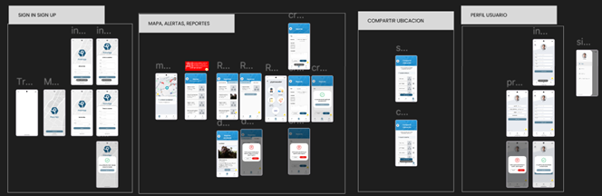

**Sección log in y sign up:**

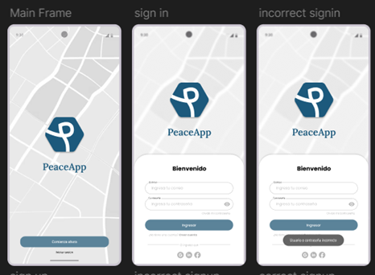

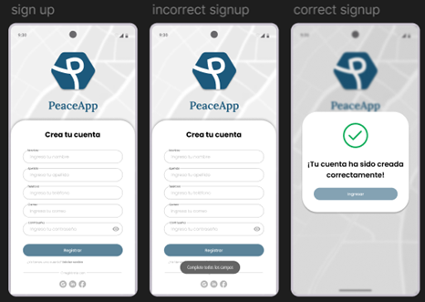

**Sección del mapa, alerta y reportes:**

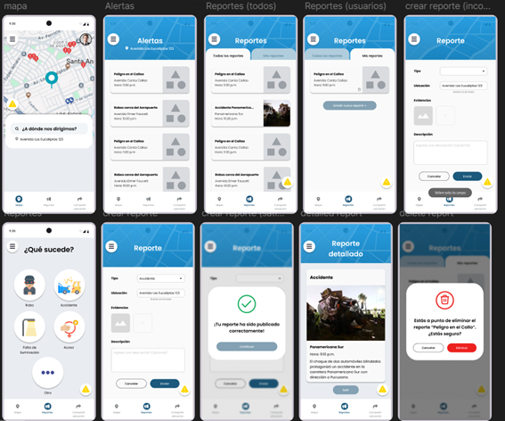

**Sección compartir ubicación:**

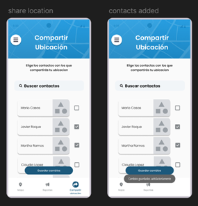

**Sección perfil:**

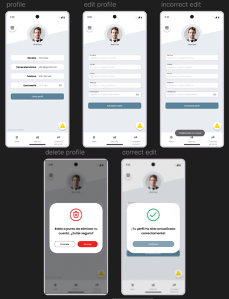

### 4.4.4. Mobile Applications User Flow Diagrams

**User Flow**: User Goal: Ingresar a la aplicación móvil como usuario registrado. Para este objetivo, el usuario accede a la pantalla inicial, selecciona el botón “Iniciar sesión” e ingresa su correo y contraseña. Si los datos ingresados son correctos, se redirige automáticamente al mapa de la aplicación. En caso de error (credenciales incorrectas o campos vacíos), se muestra un mensaje de advertencia solicitando revisar la información. US07

> 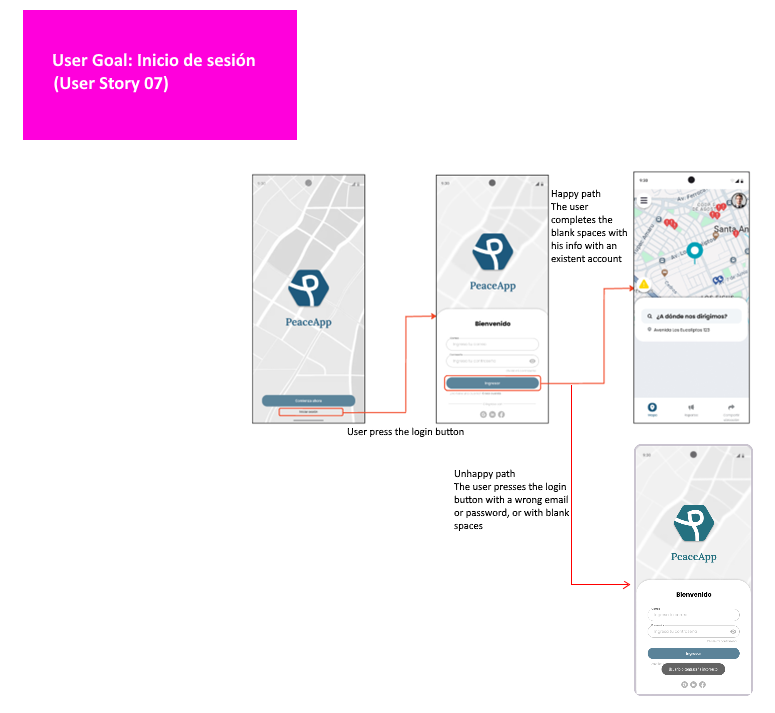

**User Flow**: User Goal: Registrarse en la aplicación móvil como nuevo usuario. Para lograr este objetivo, el usuario presiona el botón “Comenzar ahora” en la pantalla inicial y accede al formulario de registro. Allí deberá ingresar su nombre, apellido, número de teléfono, correo electrónico y contraseña. Si toda la información es válida, se muestra un mensaje confirmando la creación exitosa de la cuenta. Si hay errores en el formato del correo, la contraseña es demasiado corta o el número es inválido, se informará al usuario y no se completará el registro. US06

> 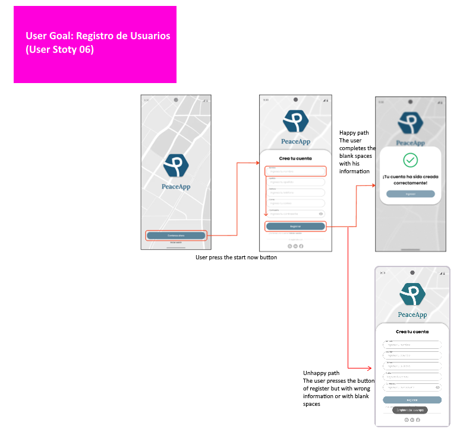

**User Flow**: User Goal: Visualizar los reportes disponibles en la aplicación. Una vez dentro de la app, el usuario puede acceder a la sección “Alertas” para ver los reportes en su zona. Si no existen alertas, no se mostrará contenido. Desde el mapa también puede acceder directamente al detalle de un reporte tocando un ícono. En la pestaña “Reportes”, puede revisar tanto los reportes generales como los propios. Si aún no se han generado reportes, esas secciones estarán vacías. US11

> 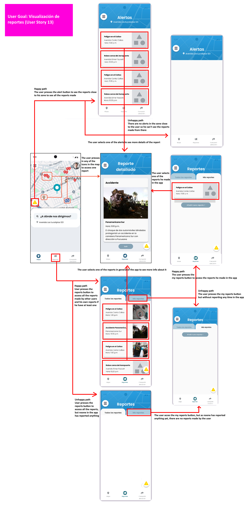

**User Flow:** User Goal: Editar la información del perfil del usuario. Al ingresar a la aplicación, el usuario puede acceder a su perfil mediante el ícono correspondiente. Desde allí puede modificar sus datos personales. Si todos los campos requeridos son completados correctamente, la información se actualiza exitosamente. Si algún campo queda vacío, se notificará al usuario para que complete todos los datos. US15

> 

**User Flow:** Acceder al mapa de calor desde cualquier sección de la app. Al iniciar sesión correctamente, la aplicación redirige automáticamente al mapa donde se visualizan los reportes. Adicionalmente, desde cualquier otra sección, el usuario puede acceder al mapa mediante el ícono de navegación inferior. US17

> 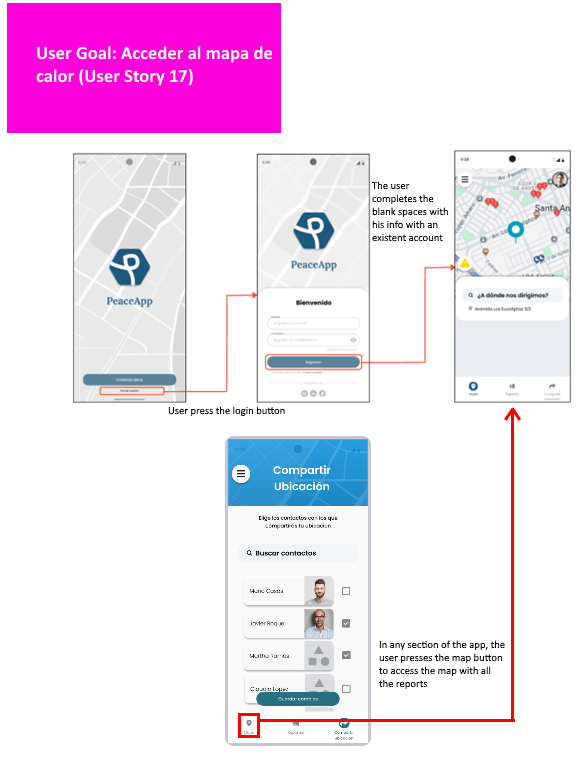

**User Flow**: Generar un nuevo reporte de incidente y adjuntar evidencia. Para cumplir este objetivo, el usuario accede a la sección “Mis reportes” y selecciona el botón para crear uno nuevo. Luego elige el tipo de incidente (robo, accidente, etc.) y completa el formulario incluyendo una descripción y la evidencia correspondiente. Puede cancelar el proceso, lo que le permitirá eliminar el reporte. Si completa correctamente todos los campos y adjunta evidencia, el reporte se publica exitosamente y se visualizará en el mapa de calor. Si hay errores o campos vacíos, el reporte no será enviado. US08 y US09

> 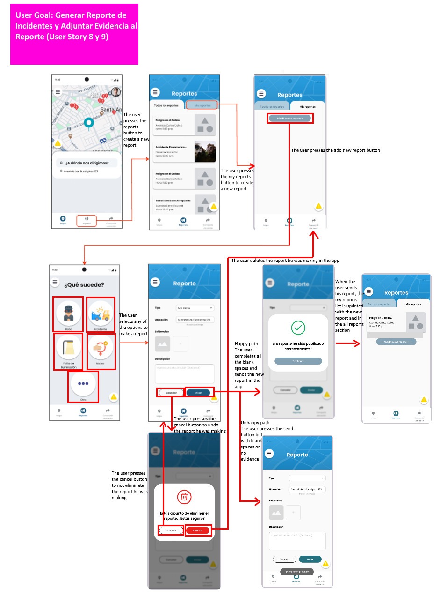

**User Flow**: Recibir notificaciones sobre reportes y alertas de riesgo. Al abrir la aplicación, el usuario puede seleccionar el ícono de alertas para ver los reportes cercanos. Si no existen alertas en la zona, se muestra una vista vacía. Si hay reportes disponibles, el usuario podrá ver los detalles tocando alguno de ellos. US13 y US12

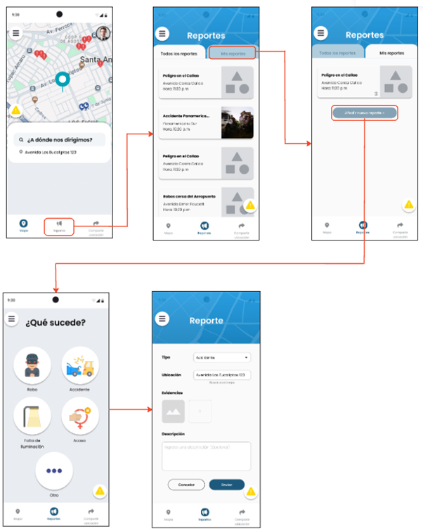

**User Flow**: Compartir ubicación con contactos. El usuario accede a la sección “Compartir ubicación” desde el ícono correspondiente en la parte inferior de la app. Desde ahí puede ver una lista de contactos y seleccionar a quién desea enviar su ubicación. Al presionar el botón “Guardar cambios”, la ubicación será compartida con los contactos elegidos. US14

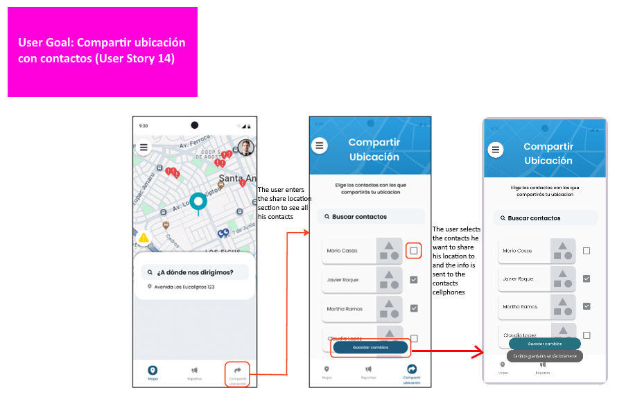

## 4.5. Mobile Applications Prototyping

### 4.5.1. Android Mobile Applications Prototyping 

Habiendo realizado los mock-ups, creamos un prototipo de la app en
Figma.

Enlace al prototipo: <https://tinyurl.com/zm8788jn>

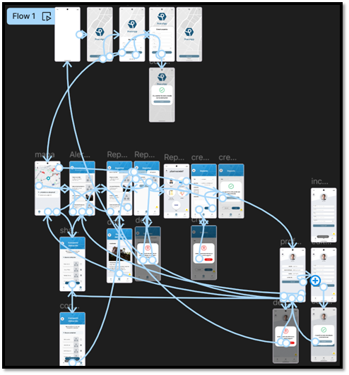

### 4.5.2. IOS Mobile Applications Prototyping 

Habiendo realizado los mock-ups, creamos un prototipo de la app en Figma similar a el prototyping de Android.

Enlace al prototipo: <https://tinyurl.com/zm8788jn>

## 4.6. Web Applications UX/UI Design 

### 4.6.1. Web Applications Wireframes

Creamos la estructura de la aplicación web de PeaceApp utilizando Figma.

Enlace a los Web Applications Wireframes:
<https://www.figma.com/design/KFB2co2shH7aJF2UIXTOrL/Untitled--Copy-?node-id=0-1&t=k2uYPScq5bHnEsDH-1>

### 4.6.2. Web Applications Wireflow Diagrams

**User Flow**: User Goal: Iniciar sesión en la aplicación web como usuario registrado. Para este objetivo, el usuario ingresa directamente desde la página principal de la web, donde encuentra el formulario de inicio de sesión. Completa su correo y contraseña y presiona el botón "Ingresar". Si los datos son correctos, será redirigido al mapa. En caso contrario, se le avisará que hay campos vacíos o que los datos ingresados son incorrectos. US07

> 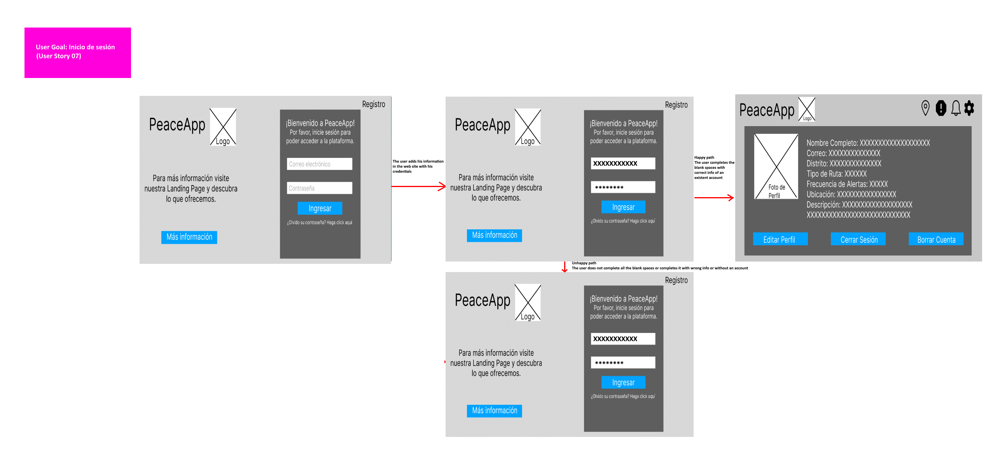

**User Flow**: User Goal: Registrarse en la aplicación web como nuevo usuario. El usuario selecciona el botón "Registro", que lo redirige a un formulario donde debe ingresar su nombre, apellido, número de teléfono, correo electrónico y contraseña. Si completa todo correctamente, la cuenta se crea exitosamente. En caso de errores de formato, campos vacíos o datos inválidos, se le notificará y no se registrará. US06

> 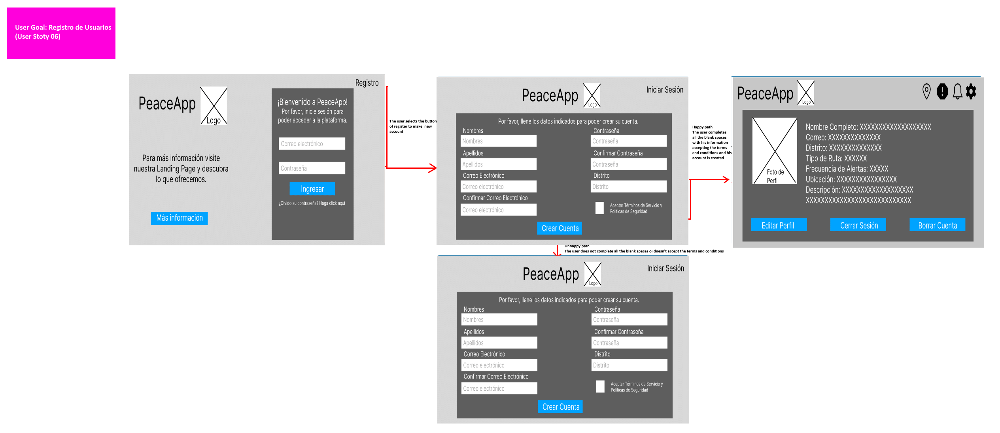

**User Flow**: User Goal: Generar un reporte de incidente en la aplicación web. El usuario accede a la sección "Reportes" y selecciona la opción para crear un nuevo reporte. Redacta el tipo de incidente libremente y selecciona la ubicación en el mapa arrastrando un marcador. Adjuntar evidencia es opcional. Si decide cancelar, podrá eliminar el reporte. Si completa correctamente los datos requeridos, el reporte se publica. Si hay errores o campos vacíos, no se enviará. US08

> 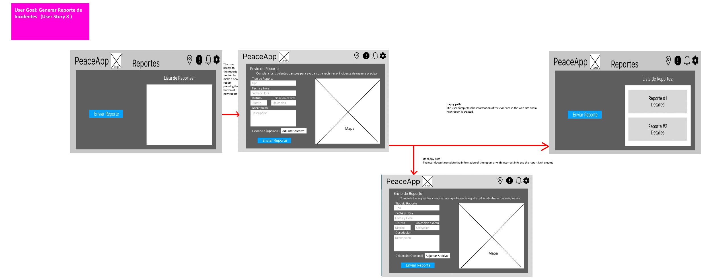

**User Flow:** User Goal: Visualizar reportes en la aplicación web. Desde la sección "Reportes", el usuario podrá ver una lista general de todos los reportes. Si no existen reportes, se mostrará la vista vacía. Actualmente, no hay visualización de alertas, íconos en el mapa ni opción para ver detalles de reportes individuales. US11

> 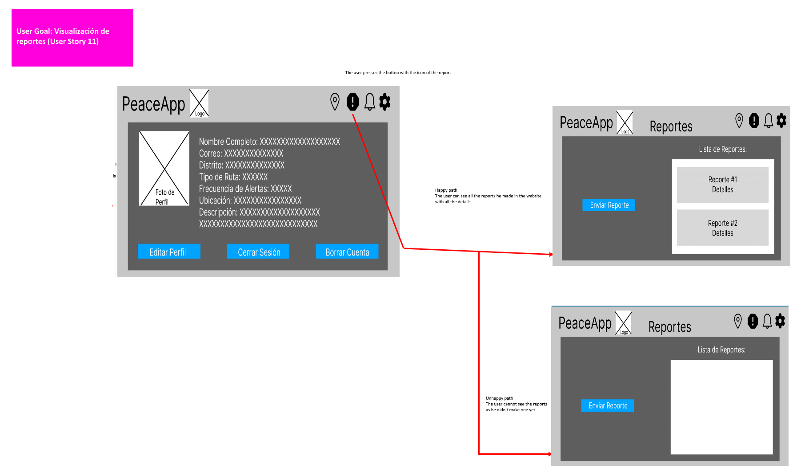

**User Flow:** User Goal: Editar la información del perfil en la aplicación web. Al ingresar, el usuario puede acceder al ícono de perfil y desde ahí editar sus datos personales. Si todos los campos obligatorios se completan, los cambios se guardan correctamente. Si deja algún campo vacío, se le notificará. US15

> 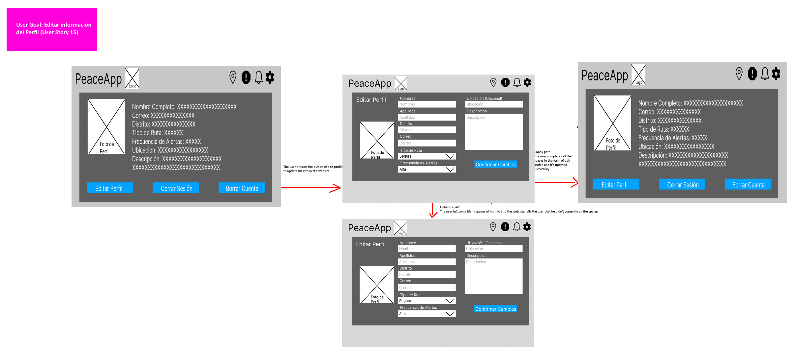

**User Flow**: User Goal: Visualizar rutas seguras dentro del mapa en la aplicación web. El usuario accede a la sección "Mapa" e ingresa la ubicación a la que desea llegar. Si deja el campo vacío o ingresa una dirección inválida, no se mostrará nada. Si la dirección es válida, se generará una ruta segura en el mapa desde su ubicación actual hasta el destino ingresado. US10

> 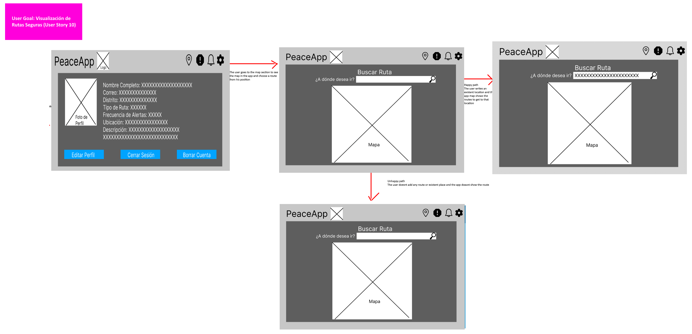

### 4.6.3. Web Applications Mock-ups 

Creamos un boceto más realista de cómo se verá PeaceApp en la aplicación Web.

Enlace a los Web Application Mock-ups: <https://www.figma.com/design/4ddpaCLGMU2orrZG7Y3GyH/Sin-t%C3%ADtulo?node-id=0-1&t=k2uYPScq5bHnEsDH-1>

**Sección log in y sign up:**

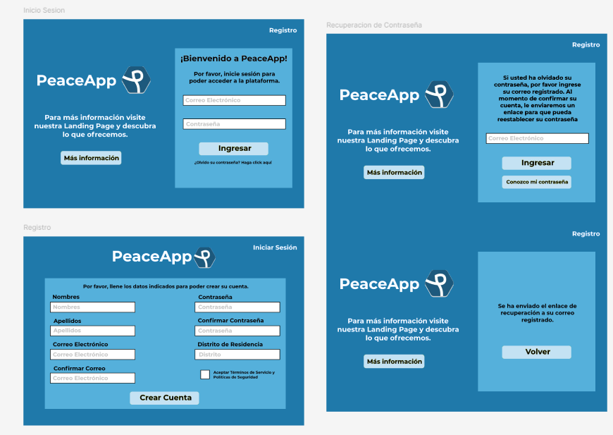

**Sección del mapa:**

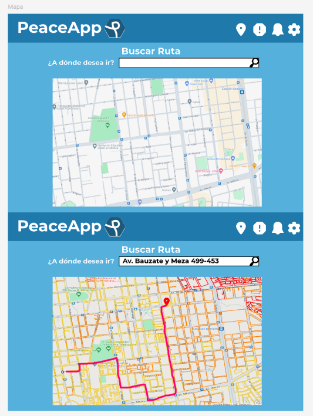

**Sección de Reportes y alerta:**

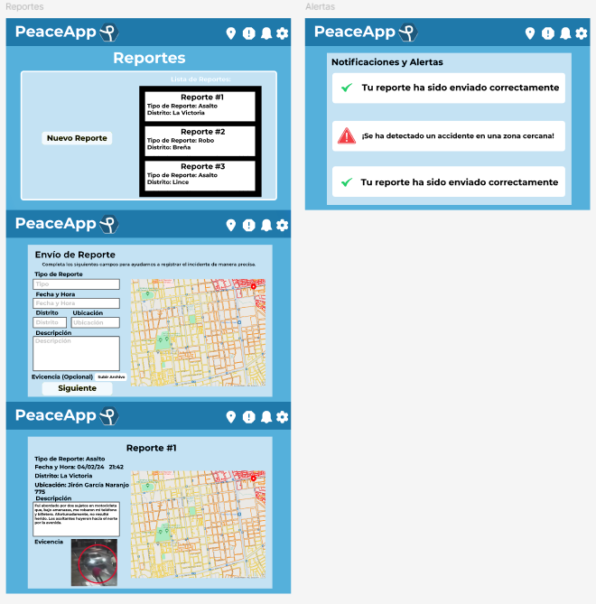

**Sección perfil:**

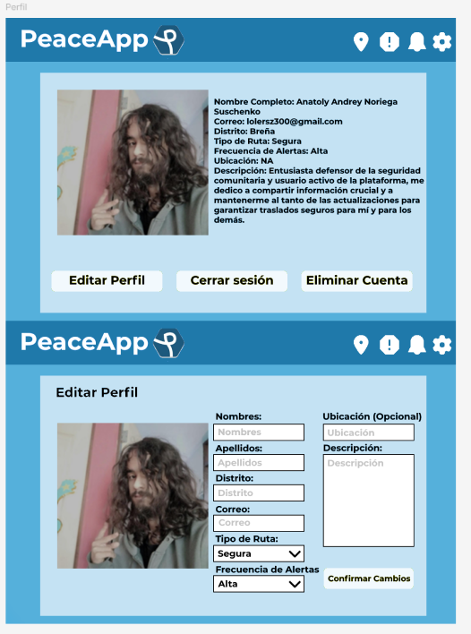

### 4.6.4. Web Applications User Flow Diagrams 

**User Flow**: User Goal: Iniciar sesión en la aplicación web como usuario registrado. Para este objetivo, el usuario ingresa directamente desde la página principal de la web, donde encuentra el formulario de inicio de sesión. Completa su correo y contraseña y presiona el botón "Ingresar". Si los datos son correctos, será redirigido al mapa. En caso contrario, se le avisará que hay campos vacíos o que los datos ingresados son incorrectos. US07

> 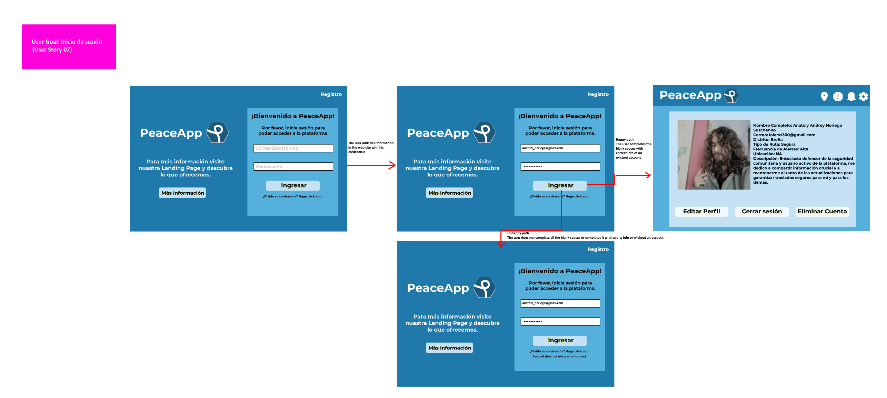

**User Flow**: User Goal: Registrarse en la aplicación web como nuevo usuario. El usuario selecciona el botón "Registro", que lo redirige a un formulario donde debe ingresar su nombre, apellido, número de teléfono, correo electrónico y contraseña. Si completa todo correctamente, la cuenta se crea exitosamente. En caso de errores de formato, campos vacíos o datos inválidos, se le notificará y no se registrará. US06

> 

**User Flow**: User Goal: Generar un reporte de incidente en la aplicación web. El usuario accede a la sección "Reportes" y selecciona la opción para crear un nuevo reporte. Redacta el tipo de incidente libremente y selecciona la ubicación en el mapa arrastrando un marcador. Adjuntar evidencia es opcional. Si decide cancelar, podrá eliminar el reporte. Si completa correctamente los datos requeridos, el reporte se publica. Si hay errores o campos vacíos, no se enviará. US08

> 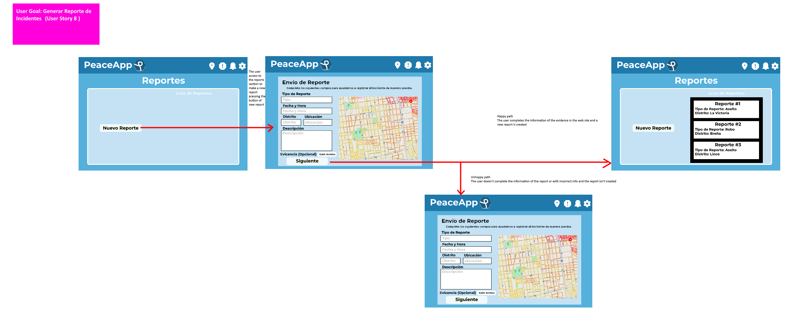

**User Flow:** User Goal: Visualizar reportes en la aplicación web. Desde la sección "Reportes", el usuario podrá ver una lista general de todos los reportes. Si no existen reportes, se mostrará la vista vacía. Actualmente, no hay visualización de alertas, íconos en el mapa ni opción para ver detalles de reportes individuales. US11

> 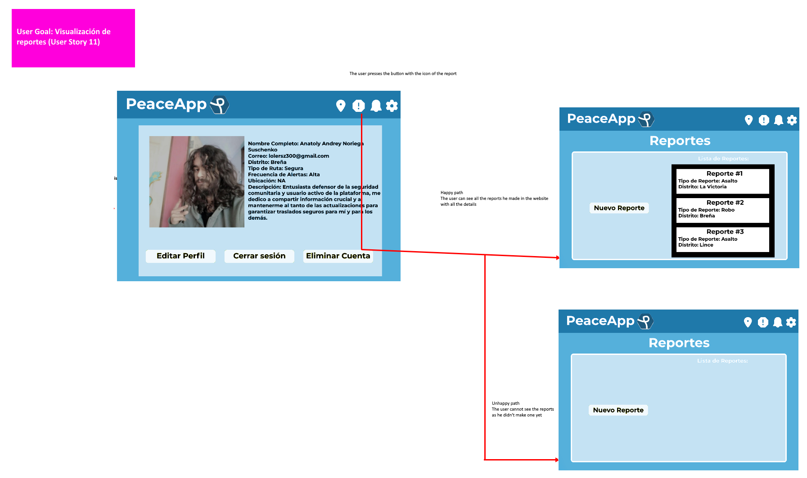

**User Flow:** User Goal: Editar la información del perfil en la aplicación web. Al ingresar, el usuario puede acceder al ícono de perfil y desde ahí editar sus datos personales. Si todos los campos obligatorios se completan, los cambios se guardan correctamente. Si deja algún campo vacío, se le notificará. US15

> 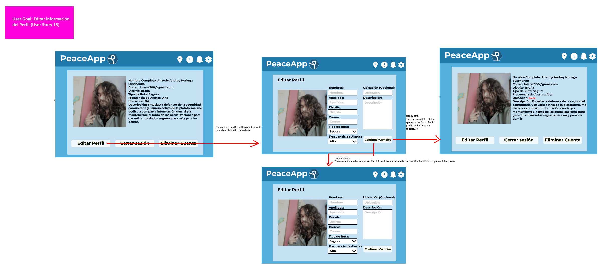

**User Flow**: User Goal: Visualizar rutas seguras dentro del mapa en la aplicación web. El usuario accede a la sección "Mapa" e ingresa la ubicación a la que desea llegar. Si deja el campo vacío o ingresa una dirección inválida, no se mostrará nada. Si la dirección es válida, se generará una ruta segura en el mapa desde su ubicación actual hasta el destino ingresado. US10

> 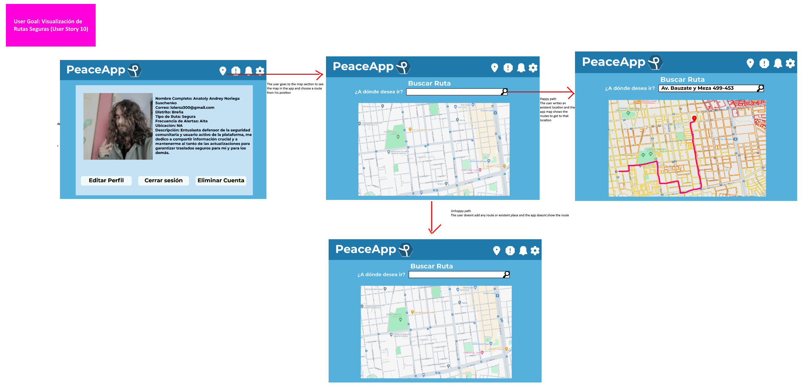

## 4.7. Web Applications Prototyping
 
 Habiendo realizado los mock-ups, creamos un prototipo de la aplicación web en Figma.
 
 Enlace al prototipo: https://www.figma.com/proto/g2UjaaatgDwqOfmLg1rFFW/PeaceApp-Prototype?node-id=2-2&p=f&t=xMFwVGxiDoS4zFvU-1&scaling=scale-down&content-scaling=fixed&page-id=0%3A1&starting-point-node-id=2%3A2
 
 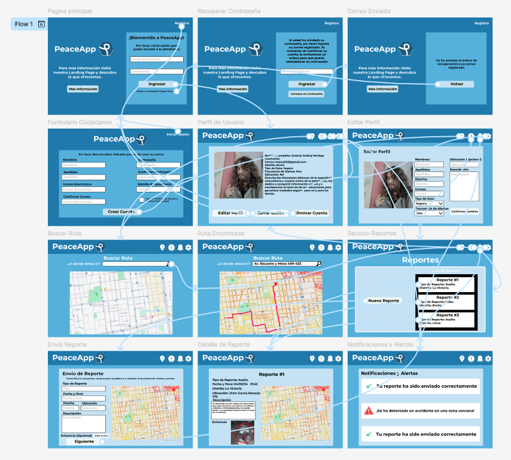

## 4.8. Domain-Driven Software Architecture

### 4.8.1. Software Architecture Context Diagram 

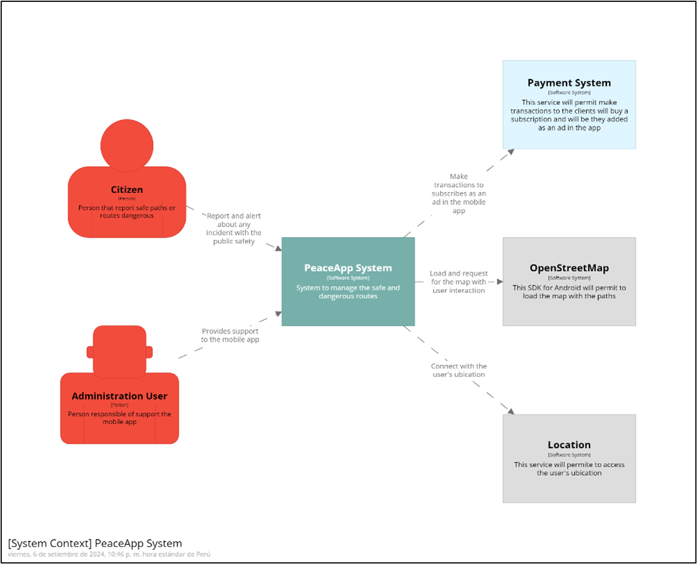

### 4.8.2. Software Architecture Container Diagram 

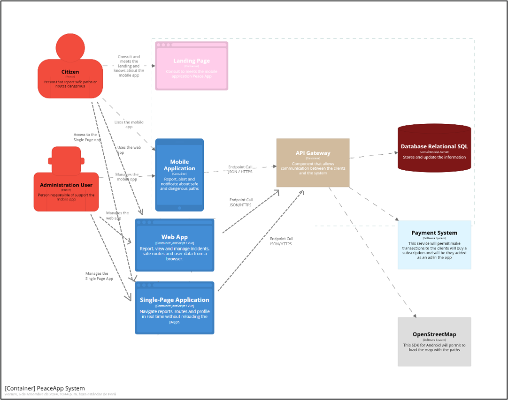

### 4.8.3. Software Architecture Components Diagram

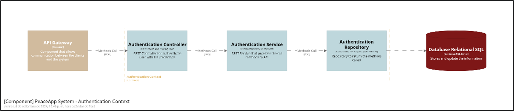

Bounded Context: Authentication

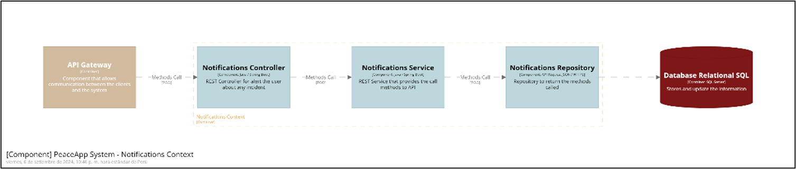

Bounded Context: Notification

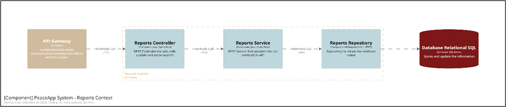
Bounded Context: Reports

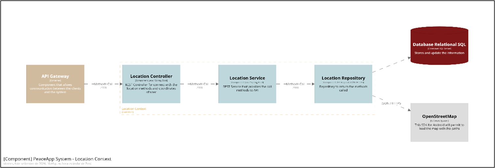

Bounded Context: Location

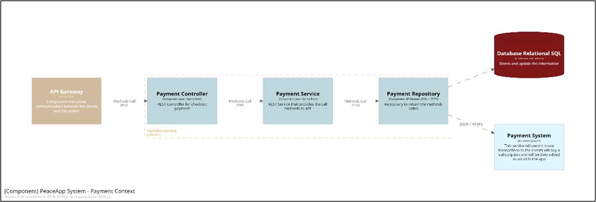

Bounded Context: Payment

## 4.9. Software Object-Oriented Design

### 4.9.1. Class Diagrams 
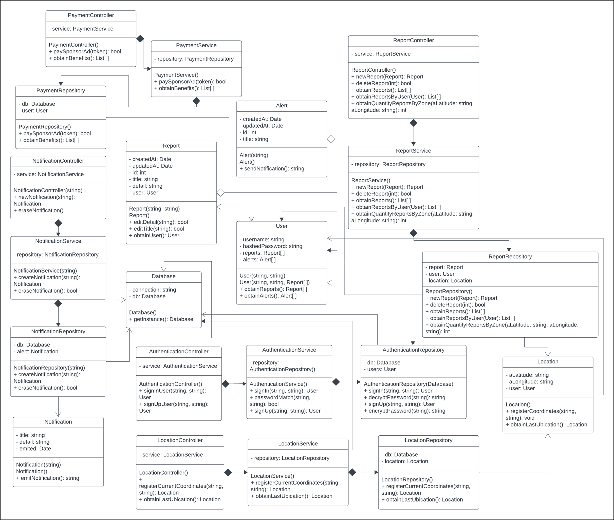

### 4.9.2. Class Dictionary

| **User:** La clase "User" representa a la entidad del usuario, el cual interactuará con la aplicación móvil |                                                                                                                   |
|-------------------------------------------------------------------------------------------------------------|-------------------------------------------------------------------------------------------------------------------|
| **Atributo**                                                                                                | **Descripción**                                                                                                   |
| username: string                                                                                            | Esta variable representa el nombre de usuario único                                                               |
| hashedPassword: string                                                                                      | Representa la contraseña del usuario, hasheada de manera interna                                                  |
| reports: Report\[ \]                                                                                        | Representa un arreglo de objetos "Reporte" el cual el usuario mantendrá conforme vaya registrando sus incidencias |
| Alerts: Alert\[ \]                                                                                          | Representa un arreglo de objetos "Alerta" las cuales tendrá el usuario                                            |
| **Método**                                                                                                  | **Descripción**                                                                                                   |
| obtainReports(): Report\[ \]                                                                                | Representa la obtención de los diferentes reportes que haya registrado el usuario                                 |
| obtainAlerts(): Alert\[ \]                                                                                  | Representa la obtención de las diferentes alertas que tenga el usuario                                            |

| **Report:** La clase "Report" representa a la entidad del reporte, siendo un objeto para el usuario cuando registra alguna incidencia |                                                                       |
|---------------------------------------------------------------------------------------------------------------------------------------|-----------------------------------------------------------------------|
| **Atributo**                                                                                                                          | **Descripción**                                                       |
| createdAt: Datetime                                                                                                                   | Representa la fecha y hora de creación de este registro               |
| updatedAt: Datetime                                                                                                                   | Representa la fecha y hora de actualización de este registro          |
| Id: int                                                                                                                               | Representa el identificador único de un registro                      |
| title: string                                                                                                                         | Representa el título que mantendrá de encabezado en el reporte        |
| detail: string                                                                                                                        | Representa el detalle o cuerpo del reporte indicando la incidencia    |
| user: User                                                                                                                            | Hace referencia al objeto Usuario para conocer de quién es el reporte |
| **Método**                                                                                                                            | **Descripción**                                                       |
| editDetail(string): bool                                                                                                              | Se puede editar el detalle colocado en el reporte                     |
| editTitle(string): bool                                                                                                               | Se puede editar el título colocado en el reporte                      |
| obtainUser(): User                                                                                                                    | Se puede obtener el Usuario que ha emitido este reporte.              |

| **Alert:** La clase "Alert" representa a la entidad de la alerta, en el que el usuario permitirá a que otro usuario pueda ser "alertado" debido a ciertas condiciones colocadas por la víctima. |                                                                                                                                      |
|-------------------------------------------------------------------------------------------------------------------------------------------------------------------------------------------------|--------------------------------------------------------------------------------------------------------------------------------------|
| **Atributo**                                                                                                                                                                                    | **Descripción**                                                                                                                      |
| createdAt: Datetime                                                                                                                                                                             | Representa la fecha y hora de creación de este registro                                                                              |
| updatedAt: Datetime                                                                                                                                                                             | Representa la fecha y hora de actualización de este registro                                                                         |
| Id: int                                                                                                                                                                                         | Representa el identificador único de un registro                                                                                     |
| title: string                                                                                                                                                                                   | Representa el título que mantendrá de encabezado en la alerta                                                                        |
| **Método**                                                                                                                                                                                      | **Descripción**                                                                                                                      |
| sendNotification(): string                                                                                                                                                                      | Este método funcionará para enviar la alerta al usuario compartido por la víctima sobre alguna condición inusual que sea presentado. |

| **Notification:** La clase "Notification" representa a la entidad de la notificación, el cual funciona de recordatorio al usuario ante una nueva novedad. |                                                                                           |
|-----------------------------------------------------------------------------------------------------------------------------------------------------------|-------------------------------------------------------------------------------------------|
| **Atributo**                                                                                                                                              | **Descripción**                                                                           |
| title: string                                                                                                                                             | Representa el título que tendrá la notificación                                           |
| detail: string                                                                                                                                            | Representa el cuerpo que tendrá la notificación                                           |
| emited: Date                                                                                                                                              | Representa la fecha en la cual fue la última vez que se emitió esta notificación          |
| **Método**                                                                                                                                                | **Descripción**                                                                           |
| emitNotification(): string                                                                                                                                | Este método funcionará para notificar al usuario ante la última novedad que haya ocurrido |

| **Location:** La clase "Location" representa a la entidad de la ubicación del celular de su usuario |                                                                                                                       |
|-----------------------------------------------------------------------------------------------------|-----------------------------------------------------------------------------------------------------------------------|
| **Atributo**                                                                                        | **Descripción**                                                                                                       |
| aLatitude: string                                                                                   | Representa la coordenada en latitud de la última ubicación del usuario                                                |
| aLongitude: string                                                                                  | Representa la coordenada en longitud de la última ubicación del usuario                                               |
| user: User                                                                                          | Representa al usuario el cual está vinculada la ubicación                                                             |
| **Método**                                                                                          | **Descripción**                                                                                                       |
| registerCoordinates(string, string): void                                                           | Este método funcionará para registrar la última ubicación del usuario mediante las coordenadas de longitud y latitud. |
| obtainLastUbication(): Location                                                                     | Con el objeto "Ubicación" se podrá obtener la última ubicación con las coordenadas guardadas.                         |

| **Database:** La clase "Database" representa a la conexión que se tendrá con la base de datos |                                                                                                          |
|-----------------------------------------------------------------------------------------------|----------------------------------------------------------------------------------------------------------|
| **Atributo**                                                                                  | **Descripción**                                                                                          |
| connection: string                                                                            | Representa la cadena de conexión con la concatenación de las credenciales de la base de datos a conectar |
| db: Database                                                                                  | Representa la instancia que se mantiene en todo el proyecto                                              |
| **Método**                                                                                    | **Descripción**                                                                                          |
| getInstance(): Database                                                                       | Este método funciona para obtener la instancia de la base de datos que se crea en todo el proyecto       |

| **Repository:** Las clases Repository mantienen la lógica con la creación de una sesión de la base de datos y la ejecución de las queries mediante un ORM |                                                                            |
|-----------------------------------------------------------------------------------------------------------------------------------------------------------|----------------------------------------------------------------------------|
| **Atributo**                                                                                                                                              | **Descripción**                                                            |
| model: Object                                                                                                                                             | Representa normalmente una entidad creada como "User", "Report", etc.      |
| **Método**                                                                                                                                                | **Descripción**                                                            |
| insert()                                                                                                                                                  | Este método asimila la función de una inserción en la base de datos        |
| get()                                                                                                                                                     | Este método asimila la función de una obtención desde la base de datos     |
| update()                                                                                                                                                  | Este método asimila la función de una actualización desde la base de datos |
| delete()                                                                                                                                                  | Este método asimila la función de una eliminación desde la base de datos.  |

| **Service:** Dentro de las clases Services se mantiene la lógica de la aplicación para comunicarse con las clases Repository |                                                                            |
|------------------------------------------------------------------------------------------------------------------------------|----------------------------------------------------------------------------|
| **Atributo**                                                                                                                 | **Descripción**                                                            |
| repository: Repository                                                                                                       | Representa la instancia del Repository según sea el caso de la clase       |
| **Método**                                                                                                                   | **Descripción**                                                            |
| Repository.insert()                                                                                                          | Este método asimila la función de una inserción en la base de datos        |
| Repository.get()                                                                                                             | Este método asimila la función de una obtención desde la base de datos     |
| Repository.update()                                                                                                          | Este método asimila la función de una actualización desde la base de datos |
| Repository.delete()                                                                                                          | Este método asimila la función de una eliminación desde la base de datos.  |

| **Controller:** Dentro de las clases Controller se realizan los ajustes necesarios para realizar el llamado a las clases Service |                                                                            |
|----------------------------------------------------------------------------------------------------------------------------------|----------------------------------------------------------------------------|
| **Atributo**                                                                                                                     | **Descripción**                                                            |
| service: Service                                                                                                                 | Representa la instancia del Service según sea el caso de la clase          |
| **Método**                                                                                                                       | **Descripción**                                                            |
| Service.insert()                                                                                                                 | Este método asimila la función de una inserción en la base de datos        |
| Service.get()                                                                                                                    | Este método asimila la función de una obtención desde la base de datos     |
| Service.update()                                                                                                                 | Este método asimila la función de una actualización desde la base de datos |
| Service.delete()                                                                                                                 | Este método asimila la función de una eliminación desde la base de datos.  |

## 4.10. Database Design

### 4.10.1. Relational Database Diagram

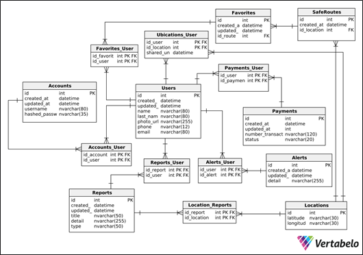

# Capítulo V: Product Implementation 

## 5.1. Software Configuration Management

En esta sección se resume toda la información recopilada, analizando que
pasos que se realizaran y como se siente.

### 5.1.1. Software Development Environment Configuration

En la siguiente sección se describe la ruta de referencia de cada uno de
los productos de software para que cualquier miembro del equipo pueda
desarrollar cada punto del trabajo:

**Figma:** Herramienta colaborativa que nos permitirá desarrollar
wireframes y mockups.

**Vertabelo:** Plataforma colaborativa que nos permitirá crear nuestro
diagrama de base de datos.

**GitHub:** Repositorio colaborativo en la nube

**IntelliJ:** es un entorno de desarrollo para trabajar con Java y otros
lenguajes que se ejecutan en JVM, como Kotlin.

### 5.1.2. Source Code Management

Trabajamos con 3 ramas principales:

**Main:** nuestra rama principal donde presentaremos nuestras
publicaciones oficiales.

**Development:** Es nuestra rama de desarrollo, en donde probaremos e
integraremos las funcionalidades trabajadas.

**Feature- :** Se descompone en ramas por cada feature trabajado.

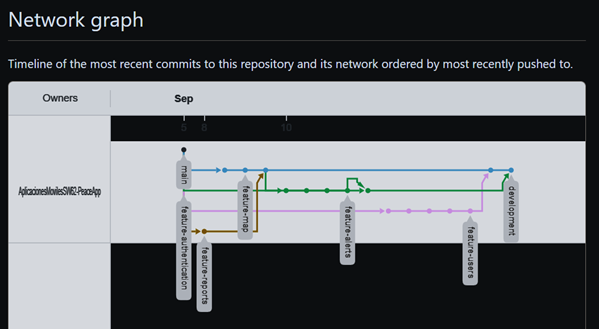

### 5.1.3. Source Code Style Guide & Conventions

Para desarrollar nuestro proyecto hemos requerido de algunas
nomenclaturas, referencias y lenguajes para esta solución.

Tecnologías: Utilizamos algunas de estas tecnologías para el desarrollo
de nuestra aplicación como: HTML5, CSS, JS, Java.

Herramientas: Nos apoyamos de las tecnologías más utilizadas y
recomendadas para el desarrollo de nuestra aplicación como: GitHub,
Figma, IntelliJ

Convenciones de Idioma: Uso del idioma inglés para elaborar nuestro
Código

### 5.1.4. Software Deployment Configuration

Para desplegar nuestra landing page en la plataforma de GitHub, seguimos
los siguientes pasos:

**Creación del Repositorio Remoto en GitHub:**

- Creamos un nuevo repositorio en GitHub de nuestro proyecto, el cual se
  utilizará para el desarrollo y deployment.

**Inicialización del Repositorio:**

- Se utiliza el comando git init para inicializar el repositorio.

**Subida de Archivos al Repositorio Remoto:**

- Añadimos los archivos de nuestra landing page al repositorio local.

- Subimos los archivos al repositorio de GitHub con el comando git push
  -u origin master o utilizando GitHub Desktop.

**Configuración de Vercel:**

- Nos dirigimos a Vercel y creamos una nueva cuenta o iniciamos sesión.

- En Vercel, seleccionamos la opción de importar el proyecto desde
  GitHub.

- Autorizamos a Vercel para acceder a nuestro repositorio de GitHub.

- Elegimos el repositorio que contiene nuestra landing page y
  configuramos las opciones de despliegue.

**Despliegue:**

- Vercel se encargará de desplegar automáticamente nuestra landing page.

- Accedemos a la URL proporcionada por Vercel para verificar que nuestra
  landing page se haya desplegado correctamente.

De este modo, nuestra landing page estará disponible utilizando Vercel y
podrá ser visible para cualquier usuario que tenga el enlace.

**Enlace del landing page:** <https://thepeaceapp.vercel.app/>

## 5.2. Product Implementation & Deployment

### 5.2.1. Sprint Backlogs

| Sprint \#  |                                                        | Sprint 1       |                                                        |                                                                                                                                                                  |            |             |                                           |
|------------|--------------------------------------------------------|----------------|--------------------------------------------------------|------------------------------------------------------------------------------------------------------------------------------------------------------------------|------------|-------------|-------------------------------------------|
| User Story |                                                        | Work-Item/Task |                                                        |                                                                                                                                                                  |            |             |                                           |
| Id         | Title                                                  | Id             | Title                                                  | Description                                                                                                                                                      | Estimation | Assigned To | Status(To-do /InProcess /To-Review /Done) |
| TS02       | Crear nuevo usuario mediante RESTful API               | 1              | Creación de un nuevo usuario en la RESTful API         | Como desarrollador, quiero permitir la creación de nuevos usuarios para que puedan acceder al sistema.                                                           | 5          |             | Done                                      |
| TS03       | Editar perfil de usuario mediante RESTful API          | 2              | Modificación de un perfil de usuario en la RESTful API | Como desarrollador, quiero que los usuarios puedan actualizar su información personal para mantener sus perfiles al día.                                         | 3          |             | Done                                      |
| TS05       | Crear reporte de incidente mediante RESTful API        | 3              | Creación de un reporte en la RESTful API               | Como desarrollador, quiero que los usuarios puedan crear reportes de incidentes para compartir información sobre zonas peligrosas.                               | 5          |             | Done                                      |
| TS06       | Obtener lista de reportes mediante RESTful API         | 4              | Obtención de una lista de reportes en la RESTful API   | Como desarrollador, quiero que los usuarios puedan obtener una lista de reportes para ver incidentes recientes en su área.                                       | 3          |             | Done                                      |
| TS08       | Enviar alerta de emergencia mediante RESTful API       | 5              | Creación de una alerta en la RESTful API               | Como desarrollador, quiero que los usuarios puedan enviar alertas de emergencia para que reciban ayuda inmediata.                                                | 8          | Anatoly     | Done                                      |
| TS09       | Obtener lista de alertas enviadas mediante RESTful API | 6              | Obtención de una lista de alertas en la RESTful API    | Como desarrollador, quiero que los usuarios puedan obtener una lista de las alertas que han enviado previamente para que puedan revisar su historial de alertas. | 3          | Anatoly     | Done                                      |
| TS10       | Obtener reporte por ID mediante RESTful API            | 7              | Obtención de un reporte en la RESTful API              | Como desarrollador, quiero que los usuarios puedan obtener los detalles de un solo reporte para consultar información específica sobre un incidente.             | 3          |             | Done                                      |

| Sprint \#  |                                                 | Sprint 2       |                                                  |                                                                                                                                                               |            |                 |        |
|------------|-------------------------------------------------|----------------|--------------------------------------------------|---------------------------------------------------------------------------------------------------------------------------------------------------------------|------------|-----------------|--------|
| User Story |                                                 | Work-Item/Task |                                                  |                                                                                                                                                               |            |                 |        |
| Id         | Title                                           | Id             | Title                                            | Description                                                                                                                                                   | Estimation | Assigned To     | Status |
| US01       | Formulario de contacto                          | 1              | Desarrollar formulario de contacto               | Como desarrollador, quiero implementar un formulario que permita a los visitantes enviar mensajes al startup desde la Landing Page.                           | 2          | Anatoly Noriega | Done   |
| US02       | Navegación clara en la Landing Page             | 2              | Organizar secciones de la Landing Page           | Como desarrollador, quiero estructurar las secciones de la Landing Page para facilitar la navegación del visitante.                                           | 2          | Anatoly Noriega | Done   |
| US04       | Diseño responsivo para diferentes dispositivos  | 3              | Implementar diseño responsivo en la Landing Page | Como desarrollador, quiero que la Landing Page se ajuste a pantallas móviles y de escritorio para mejorar la usabilidad.                                      | 3          | Anatoly Noriega | Done   |
| US05       | Crear pantalla de inicio (Main Frame)           | 4              | Crear Main Frame de la app                       | Como desarrollador, quiero crear la estructura base de la pantalla de inicio de la app, para dar una primera impresión clara a los usuarios.                  | 2          |                 | Done   |
| US05       | Crear layout de login y registro en el frontend | 5              | Crear layout para login y registro en la app     | Como desarrollador, quiero diseñar los formularios de login y registro, incluyendo los campos necesarios y botones, pero sin conexión con el backend todavía. | 2          |                 | Done   |

| Sprint \#  |                               | Sprint 3       |                                                                                                        |                                                                                                                                                                                    |            |             |        |
|------------|-------------------------------|----------------|--------------------------------------------------------------------------------------------------------|------------------------------------------------------------------------------------------------------------------------------------------------------------------------------------|------------|-------------|--------|
| User Story |                               | Work-Item/Task |                                                                                                        |                                                                                                                                                                                    |            |             |        |
| Id         | Title                         | Id             | Title                                                                                                  | Description                                                                                                                                                                        | Estimation | Assigned To | Status |
| US06       | Registro de Usuarios          | 1              | Creación del registro de usuarios                                                                      | Como usuario, quiero poder registrarme en la aplicación, para acceder a las funcionalidades de PeaceApp.                                                                           | 3          | Arian       | Done   |
| US07       | Iniciar Sesión                | 2              | Creación del login                                                                                     | Como usuario registrado, quiero poder iniciar sesión con mi correo y contraseña, para acceder a mi cuenta.                                                                         | 5          | Arian       | Done   |
| US19       | Recuperar Contraseña          | 3              | Creación de la funcionalidad de recuperar contraseña                                                   | Como usuario, quiero poder personalizar mi perfil, para reflejar mi identidad en la aplicación.                                                                                    | 2          | Ian         | Done   |
| US09       | Generar Reporte de Incidentes | 4              | Creación de la funcionalidad de generar reporte de incidentes                                          | Como usuario, quiero poder generar reportes de incidentes de seguridad, para contribuir a la actualización del mapa de calor.                                                      | 3          | Ian         | Done   |
| US13       | Visualización de Reportes     | 5              | Creación de la vista para poder visualizar los reportes                                                | Como ciudadano, quiero poder ver los reportes de otros usuarios sobre incidentes ocurridos en la zona, para estar al tanto de los eventos de seguridad.                            | 3          | Anatoly     | Done   |
| US10       | Adjuntar Evidencia al Reporte | 6              | Creación de la funcionalidad para poder adjuntar evidencias en un reporte                              | Como usuario, quiero poder personalizar mi perfil, para reflejar mi identidad en la aplicación.                                                                                    | 2          | Anatoly     | Done   |
| US04       | Navegación Intuitiva          | 7              | Hacer la navegación lo más sencilla posible                                                            | Como usuario, quiero que la interfaz de la aplicación sea intuitiva y fácil de navegar, para poder acceder rápidamente a las funciones que necesito.                               | 5          | Fabia       | Done   |
| US05       | Diseño Responsivo             | 8              | Adaptar el contenido de la aplicación para diversas resoluciones de pantalla y diferentes dispositivos | Como usuario, quiero que la aplicación se adapte bien a diferentes tamaños de pantalla, para poder usarla cómodamente en cualquier dispositivo, ya sea móvil, tablet o escritorio. | 3          | Fabia       | Done   |

### 5.2.2. Implemented Landing Page Evidence

El equipo logró terminar con el desarrollo de la landing page, la cual
ya se encuentra desplegada en la web de manera pública.

**Vercel** generará una URL para tu proyecto. En este caso, la URL es
[**https://thepeaceapp.vercel.app/**](https://thepeaceapp.vercel.app/).

Acceder a la URL para verificar que la landing page esté funcionando
correctamente.

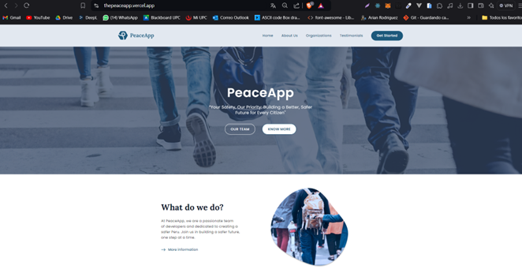

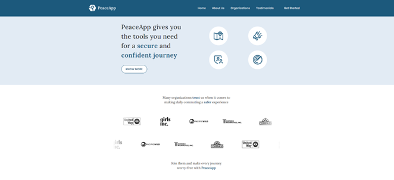

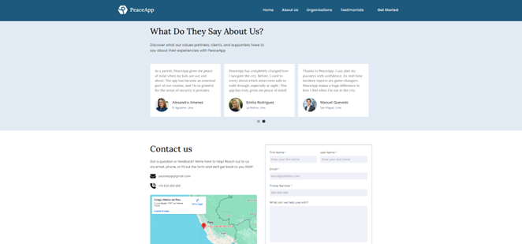

### 5.2.3. Implemented Frontend-Web Application Evidence

### 5.2.4. Implemented Native-Mobile Application Evidence

Se realizaron mejoras en el diseño de la aplicación.

### 5.2.5. Implemented RESTful API and/or Serverless Backend Evidence

Para esta primera entrega, nuestro equipo ha conseguido elaborar la
primera versión del Backend del proyecto \"PeaceApp\".

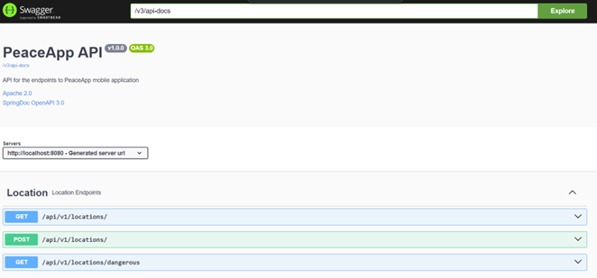

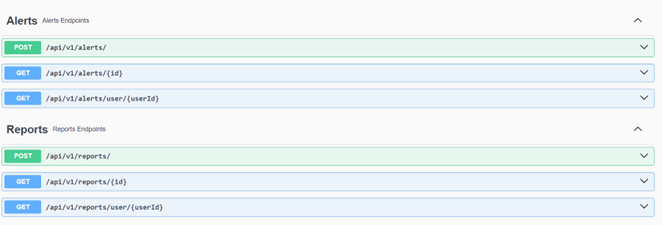

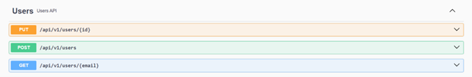

### 5.2.6. RESTful API documentation

Durante este sprint, se desarrolló el back-end de una API en Java,
utilizando JPA para la gestión de datos mediante un App Service. La API
permite gestionar alertas, reportes, ubicaciones y usuarios, que pueden
consumirse por la aplicación móvil.

| **Endpoint**                  | **Acción**                   | **Verbo HTTP** | **Sintaxis de Llamada**       | **Parámetros**                 | **Ejemplo de Llamada**           | **Explicación del Response**                                                                              |
|-------------------------------|------------------------------|----------------|-------------------------------|--------------------------------|----------------------------------|-----------------------------------------------------------------------------------------------------------|
| /api/v1/alerts                | Crear nueva alerta           | POST           | /api/v1/alerts                | Body con datos de la alerta    | POST /api/v1/alerts              | 201 Created: Devuelve la alerta creada.                                                                   |
| /api/v1/alerts/{id}           | Obtener alerta por ID        | GET            | /api/v1/alerts/{id}           | ID de la alerta                | GET /api/v1/alerts/1             | 200 OK: Devuelve los detalles de la alerta con el ID especificado.                                        |
| /api/v1/alerts/user/{userId}  | Obtener alertas por usuario  | GET            | /api/v1/alerts/user/{userId}  | ID del usuario                 | GET /api/v1/alerts/user/1        | 200 OK: Devuelve la lista de alertas asociadas al usuario especificado.                                   |
| /api/v1/locations             | Guardar nueva ubicación      | POST           | /api/v1/locations             | Body con datos de ubicación    | POST /api/v1/locations           | 201 Created: Devuelve la ubicación creada.                                                                |
| /api/v1/reports               | Crear nuevo reporte          | POST           | /api/v1/reports               | Body con datos del reporte     | POST /api/v1/reports             | 201 Created: Devuelve el reporte creado.                                                                  |
| /api/v1/reports/{id}          | Obtener reporte por ID       | GET            | /api/v1/reports/{id}          | ID del reporte                 | GET /api/v1/reports/1            | 200 OK: Devuelve los detalles del reporte con el ID especificado.                                         |
| /api/v1/reports/user/{userId} | Obtener reportes por usuario | GET            | /api/v1/reports/user/{userId} | ID del usuario                 | GET /api/v1/reports/user/1       | 200 OK: Devuelve la lista de reportes asociados al usuario especificado.                                  |
| /api/v1/users                 | Crear nuevo usuario          | POST           | /api/v1/users                 | Body con datos del usuario     | POST /api/v1/users               | 201 Created: Devuelve el usuario creado.                                                                  |
| /api/v1/users/{email}         | Obtener usuario por email    | GET            | /api/v1/users/{email}         | Email del usuario              | GET /api/v1/users/test@email.com | 200 OK: Devuelve los detalles del usuario con el email especificado.                                      |
| /api/v1/users/{id}            | Actualizar usuario por ID    | PUT            | /api/v1/users/{id}            | ID del usuario y datos en Body | PUT /api/v1/users/1              | 200 OK: Actualiza la información del usuario con el ID especificado y devuelve los detalles actualizados. |

**Visualización de los Endpoints:**

**Controller del Bounded Context de Alerts:**

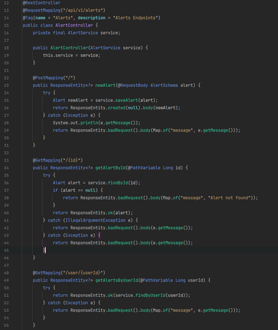

**Controller del Bounded Context de Location:**

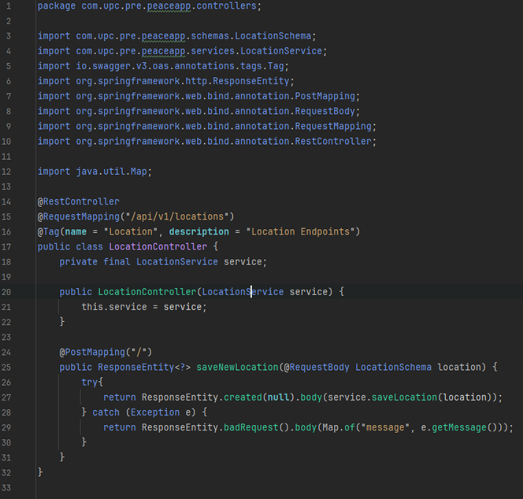

**Controller del Bounded Context de Report:**

**Controller del Bounded Context de User:**

 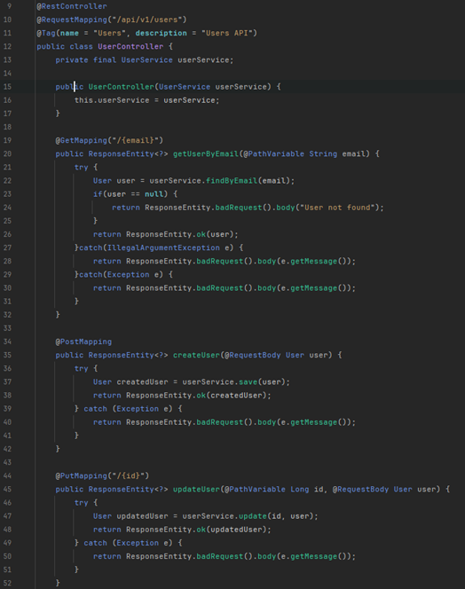

Url del repositorio:
<https://github.com/PeaceApp-UPC-4438/PeaceApp-Backend>

| Repository                               | Branch | Commit Id                                | Commit Message                                |
|------------------------------------------|--------|------------------------------------------|-----------------------------------------------|
| AplicacionesMovilesSW62-PeaceApp/Backend | main   | b130fb5e83be397ae7dee4dc18b72e826395cc5c | Merge branch \'feature-map\' into development |
| AplicacionesMovilesSW62-PeaceApp/Backend | main   | 15c9230d2907f4d2fb26986c08a53e956e968201 | update: deploy                                |
| AplicacionesMovilesSW62-PeaceApp/Backend | main   | f8d82635f0868f2bc9db4ba412fd13080eed86cf | update: connecting to db                      |

Se realizó el despliegue del Backend con el apoyo del servicio Railway
(<https://railway.app>) el cual nos ofrece un plan gratuito para poder
desplegar capas de aplicación y datos. Es aquí donde se aloja la base de
datos y el backend de PeaceApp de manera pública, para que pueda ser
utilizada a través del Swagger o directamente integrada desde la
aplicación móvil desarrollada en Kotlin. De la misma manera, las
credenciales generadas por el servicio para la base de datos son útiles
y capaces de poder conectarse desde MySQL Workbench para administrar y
gestionar la información. Además, cuenta con un sistema de Logs en cada
servicio (base de datos y backend) para monitorear el comportamiento de
la aplicación

URL pública:
<https://peaceapp-production.up.railway.app/swagger-ui/index.html#/>

### 5.2.7. Team Collaboration Insights 

Durante este sprint se realizaron las funcionalidades correspondientes
en cada rama principal del feature. Finalmente fue unido a la rama
"development" para realizar las pruebas necesarias y sea enviado a
producción en la rama "main"

## 5.3. Video About the Product

Se evidencia el video demostrando el prototipo pensado para PeaceApp, el
cual contendrá las diferentes funcionalidades avanzadas hasta el
momento.

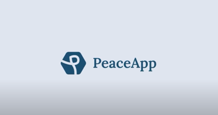

<https://www.youtube.com/watch?v=S1wn29tcVOg>

# Conclusiones 
# Bibliografia
# Anexos
