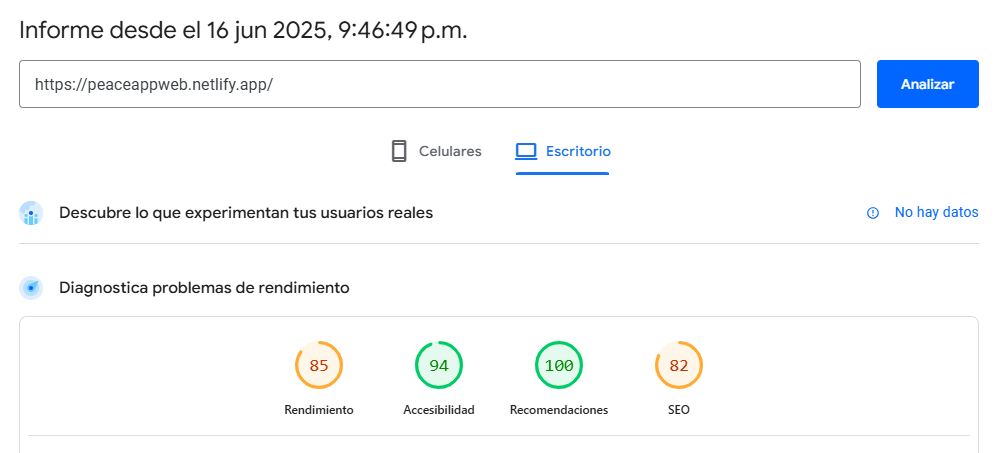
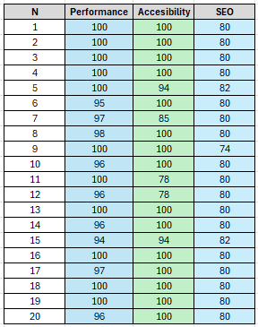
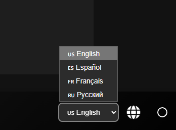

# <p align="center" id="caratula"> Universidad Peruana de Ciencias Aplicadas </p>

<p align="center">
  
</div>

### <p align="center"> Informe de Trabajo Final </p>

<br>
<div align="center">
  <p> Carrera: Ingeniería de Software </p>
  <br>
  <p> Ciclo: 2025-10 </p>
  <br>
  <p> Curso: Diseño de Experimentos de Ingeniería de Software </p>
  <br>
  <p> NRC: 4438 </p>
  <br>
  <p> Profesor: Noriega Melendez, Julio Manuel </p>
  <br>
  <p> Nombre del Startup: PeaceApp </p>
  <br>
  <p> Nombre del Producto: PeaceApp </p>
  <br>
  <p> Relación de Integrantes: </p>
  <p>  - Avila Asto, Alex Ramon Alberto (u20221a322) </p>
  <p>  - Guia Carrasco, Pedro Andre (u202212010) </p>
  <p>  - Noriega Suschenko, Anatoly Andrey (u202211813) </p>
  <p>  - Tongo Alejandro, Milagros Salet (u20216078)</p>
  <br>
  <p> Mes y Año: Julio del 2025 </p>
</div>

---

# Registro de Versiones del Informe

<table>
  <tr>
    <th style="text-align:center;">Versión</th>
    <th style="text-align:center;">Fecha</th>
    <th style="text-align:center;">Autor</th>
    <th style="text-align:center;">Descripción de la modificación</th>
  </tr>
  <tr>
    <td align="center">TB1</td>
    <td>21/04/2025</td>
    <td> Alex Avila <br> Pedro Guia <br> Anatoly Noriega <br> Milagros Tongo </td>
    <td> Realizamos los capítulos 1, 2, 3, 4 y 5 según la rúbrica de manera conjunta y eficiente.  </td>
  </tr>
  <tr>
    <td align="center">TP1</td>
    <td>12/05/2025</td>
    <td> Alex Avila <br> Pedro Guia <br> Anatoly Noriega <br> Milagros Tongo </td>
    <td> Realizamos la mejora contunua y los capítulos 5, 6 Y 7 según la rúbrica de manera conjunta y eficiente.  </td>
  </tr>
  <tr>
    <td align="center">TB2</td>
    <td>19/06/2025</td>
    <td> Alex Avila <br> Pedro Guia <br> Anatoly Noriega <br> Milagros Tongo </td>
    <td> Realizamos la mejora contunua y concluímos con los capítulos 6 y 7, además de una parte del capítulo 8 según la rúbrica de manera conjunta y eficiente.  </td>
  </tr>
  <tr>
    <td align="center">TF</td>
    <td>08/07/2025</td>
    <td> Alex Avila <br> Pedro Guia <br> Anatoly Noriega <br> Milagros Tongo </td>
    <td> Realizamos la mejora contunua y concluímos con el capítulo 8 según la rúbrica de manera conjunta y eficiente.  </td>
  </tr>
</table>

---

# Project Report Collaboration Insights

TB1: Las tareas asignadas para la entrega TB1 se han completado y están documentadas en el repositorio de Github.

- Se escribieron y diagramaron los contenidos asignados a cada miembro en formato Markdown, seguido de commits para asegurar el progreso en el repositorio.

TP1: Las tareas asignadas para la entrega TP1 se han completado y están documentadas en el repositorio de Github.

- Se escribieron y diagramaron los contenidos asignados a cada miembro en formato Markdown, seguido de commits para asegurar el progreso en el repositorio.

TB2: Las tareas asignadas para la entrega TB2 se han completado y están documentadas en el repositorio de Github.

- Se escribieron y diagramaron los contenidos asignados a cada miembro en formato Markdown, seguido de commits para asegurar el progreso en el repositorio.

TF1: Las tareas asignadas para la entrega TF1 se han completado y están documentadas en el repositorio de Github.

- Se escribieron y diagramaron los contenidos asignados a cada miembro en formato Markdown, seguido de commits para asegurar el progreso en el repositorio.

Enlace del repositorio: https://github.com/PeaceApp-UPC-4438/PeaceApp-Report.git

---

# Tabla de contenidos

- [ Universidad Peruana de Ciencias Aplicadas ](#-universidad-peruana-de-ciencias-aplicadas-)
    - [ Informe de Trabajo Final ](#-informe-de-trabajo-final-)
- [Registro de Versiones del Informe](#registro-de-versiones-del-informe)
- [Tabla de contenidos](#tabla-de-contenidos)
- [Student Outcome](#student-outcome)
- [Capítulo I: Introducción](#capítulo-i-introducción)
  - [1.1 Startup Profile](#11-startup-profile)
    - [1.1.1 Descripción de la Startup](#111-descripción-de-la-startup)
    - [1.1.2. Perfiles de integrantes del equipo](#112-perfiles-de-integrantes-del-equipo)
  - [1.2. Solution Profile](#12-solution-profile)
    - [1.2.1. Antecedentes y problemática](#121-antecedentes-y-problemática)
    - [1.2.2. Lean UX Process](#122-lean-ux-process)
      - [1.2.2.1. Lean UX Problem Statements](#1221-lean-ux-problem-statements)
      - [1.2.2.2. Lean UX Assumptions](#1222-lean-ux-assumptions)
      - [1.2.2.3. Lean UX Hypothesis Statements](#1223-lean-ux-hypothesis-statements)
      - [1.2.2.4. Lean UX Canvas](#1224-lean-ux-canvas)
  - [1.3. Segmentos Objetivo](#13-segmentos-objetivo)
- [Capítulo II: Requirements Elicitation \& Analysis](#capítulo-ii-requirements-elicitation--analysis)
  - [2.1. Competidores](#21-competidores)
    - [2.1.1. Análisis Competitivo](#211-análisis-competitivo)
    - [2.1.2. Estrategias y tácticas frente a competidores](#212-estrategias-y-tácticas-frente-a-competidores)
  - [2.2. Entrevistas](#22-entrevistas)
    - [2.2.1.  entrevistas](#221-diseño-de-entrevistas)
    - [2.2.2. Registro de entrevistas](#222-registro-de-entrevistas)
    - [2.2.3. Análisis de entrevistas](#223-análisis-de-entrevistas)
  - [2.3. Needfinding](#23-needfinding)
    - [2.3.1. User Personas](#231-user-personas)
    - [2.3.2. User Task Matrix](#232-user-task-matrix)
    - [2.3.2. User Task Matrix](#232-user-task-matrix-1)
    - [2.3.3. User Journey Mapping](#233-user-journey-mapping)
    - [2.3.4. Empathy Mapping](#234-empathy-mapping)
      - [2.3.5. As-is Scenario Mapping](#235-as-is-scenario-mapping)
  - [2.4. Ubiquitous Language](#24-ubiquitous-language)
- [Capítulo III: Requirements Specification](#capítulo-iii-requirements-specification)
  - [3.1. To-be Scenario Mapping](#31-to-be-scenario-mapping)
  - [3.2. User Stories](#32-user-stories)
  - [3.3. Product Backlog](#33-product-backlog)
  - [3.4. Impact Mapping](#34-impact-mapping)
- [Capítulo IV: Product Design](#capítulo-iv-product-design)
  - [4.1. Style Guidelines](#41-style-guidelines)
    - [4.1.1. General Style Guidelines](#411-general-style-guidelines)
    - [4.1.2. Web Style Guidelines](#412-web-style-guidelines)
    - [4.1.3. Mobile Style Guidelines](#413-mobile-style-guidelines)
      - [4.1.3.1. iOS Mobile Style Guidelines](#4131-ios-mobile-style-guidelines)
      - [4.1.3.2. Android Mobile Style Guidelines](#4132-android-mobile-style-guidelines)
  - [4.2. Information Architecture](#42-information-architecture)
    - [4.2.1. Organization Systems](#421-organization-systems)
    - [4.2.2. Labeling Systems](#422-labeling-systems)
    - [4.2.3. SEO Tags and Meta Tags](#423-seo-tags-and-meta-tags)
    - [4.2.4. Searching Systems](#424-searching-systems)
    - [4.2.5. Navigation Systems](#425-navigation-systems)
  - [4.3. Landing Page UI Design](#43-landing-page-ui-design)
    - [4.3.1. Landing Page Wireframe](#431-landing-page-wireframe)
    - [4.3.2. Landing Page Mock-up](#432-landing-page-mock-up)
  - [4.4. Mobile Applications UX/UI Design](#44-mobile-applications-uxui-design)
    - [4.4.1. Mobile Applications Wireframes](#441-mobile-applications-wireframes)
    - [4.4.2. Mobile Applications Wireflow Diagrams](#442-mobile-applications-wireflow-diagrams)
    - [4.4.3. Mobile Applications Mock-ups](#443-mobile-applications-mock-ups)
    - [4.4.4. Mobile Applications User Flow Diagrams](#444-mobile-applications-user-flow-diagrams)
  - [4.5. Mobile Applications Prototyping](#45-mobile-applications-prototyping)
    - [4.5.1. Android Mobile Applications Prototyping](#451-android-mobile-applications-prototyping)
    - [4.5.2. IOS Mobile Applications Prototyping](#452-ios-mobile-applications-prototyping)
  - [4.6. Web Applications UX/UI Design](#46-web-applications-uxui-design)
    - [4.6.1. Web Applications Wireframes](#461-web-applications-wireframes)
    - [4.6.2. Web Applications Wireflow Diagrams](#462-web-applications-wireflow-diagrams)
    - [4.6.3. Web Applications Mock-ups](#463-web-applications-mock-ups)
    - [4.6.4. Web Applications User Flow Diagrams](#464-web-applications-user-flow-diagrams)
  - [4.7. Web Applications Prototyping](#47-web-applications-prototyping)
  - [4.8. Domain-Driven Software Architecture](#48-domain-driven-software-architecture)
    - [4.8.1. Software Architecture Context Diagram](#481-software-architecture-context-diagram)
    - [4.8.2. Software Architecture Container Diagram](#482-software-architecture-container-diagram)
    - [4.8.3. Software Architecture Components Diagram](#483-software-architecture-components-diagram)
  - [4.9. Software Object-Oriented Design](#49-software-object-oriented-design)
    - [4.9.1. Class Diagrams](#491-class-diagrams)
    - [4.9.2. Class Dictionary](#492-class-dictionary)
  - [4.10. Database Design](#410-database-design)
    - [4.10.1. Relational Database Diagram](#4101-relational-database-diagram)
- [Capítulo V: Product Implementation](#capítulo-v-product-implementation)
  - [5.1. Software Configuration Management](#51-software-configuration-management)
    - [5.1.1. Software Development Environment Configuration](#511-software-development-environment-configuration)
    - [5.1.2. Source Code Management](#512-source-code-management)
    - [5.1.3. Source Code Style Guide \& Conventions](#513-source-code-style-guide--conventions)
    - [5.1.4. Software Deployment Configuration](#514-software-deployment-configuration)
  - [5.2. Product Implementation \& Deployment](#52-product-implementation--deployment)
    - [5.2.1. Sprint Backlogs](#521-sprint-backlogs)
    - [5.2.2. Implemented Landing Page Evidence](#522-implemented-landing-page-evidence)
    - [5.2.3. Implemented Frontend-Web Application Evidence](#523-implemented-frontend-web-application-evidence)
    - [5.2.4. Acuerdo de Servicio-SaaA](#524-acuerdo-de-servicio-saaA)
    - [5.2.5. Implemented Native-Mobile Application Evidence](#525-implemented-native-mobile-application-evidence)
    - [5.2.6. Implemented RESTful API and/or Serverless Backend Evidence](#526-implemented-restful-api-andor-serverless-backend-evidence)
    - [5.2.7. RESTful API documentation](#527-restful-api-documentation)
    - [5.2.8. Team Collaboration Insights](#528-team-collaboration-insights)
  - [5.3. Video About the Product](#53-video-about-the-product)
- [Capítulo VI: Testing Suites & ](#capítulo-vi-testing-suites--validation)
  - [6.1. Testing Suites & Validation](#61-testing-suites--validation)
    - [6.1.1. Core Entities Unit Tests](#611-core-entities-unit-tests)
    - [6.1.2. Core Integration Tests](#612-core-integration-tests)
    - [6.1.3. Core Behavior-Driven Development](#613-core-behavior-driven-development)
    - [6.1.4. Core System Tests](#614-core-system-tests)
  - [6.2. Static testing & Verification](#62-static-testing--verification)
    - [6.2.1. Static Code Analysis](#621-static-code-analysis)
      - [6.2.1.1. Coding standard & Code conventions](#6211-coding-standard--code-conventions)
      - [6.2.1.2. Code Quality & Code Security](#6212-code-quality--code-security)
    - [6.2.2. Reviews](#622-reviews)
  - [6.3. Validation Interviews](#63-validation-interviews)
    - [6.3.1. Diseño de Entrevistas](#631-diseño-de-entrevistas)
    - [6.3.2. Registro de Entrevistas](#632-registro-de-entrevistas)
    - [6.3.3. Evaluaciones según Heurísticas](#633-evaluaciones-según-heurísticas)
  - [6.4. Auditoría de Experiencias de Usuario](#64-auditoría-de-experiencias-de-usuario)
    - [6.4.1. Auditoría realizada](#641-auditoría-realizada)
      - [6.4.1.1. Información del grupo auditado](#6411-información-del-grupo-auditado)
      - [6.4.1.2. Cronograma de auditoría realizada](#6412-cronograma-de-auditoría-realizada)
      - [6.4.1.3. Contenido de auditoría realizada](#6413-contenido-de-auditoría-realizada)
    - [6.4.2. Auditoría recibida](#642-auditoría-recibida)
      - [6.4.2.1. Información del grupo auditor](#6421-información-del-grupo-auditor)
      - [6.4.2.2. Cronograma de auditoría recibida](#6422-cronograma-de-auditoría-recibida)
      - [6.4.2.3. Contenido de auditoría recibida](#6423-contenido-de-auditoría-recibida)
      - [6.4.2.4. Resumen de modificaciones para subsanar hallazgos](#6424-resumen-de-modificaciones-para-subsanar-hallazgos)
- [Capítulo VII: DevOps Practices](#capítulo-vii-devops-practices)
  - [7.1. Continuous Integration](#71-continuous-integration)
    - [7.1.1. Tools and Practices](#711-tools-and-practices)
    - [7.1.2. Build & Test Suite Pipeline Components](#712-build--test-suite-pipeline-components)
  - [7.2. Continuous Delivery](#72-continuous-delivery)
    - [7.2.1. Tools and Practices](#721-tools-and-practices)
    - [7.2.2. Stages Deployment Pipeline Components](#722-stages-deployment-pipeline-components)
  - [7.3. Continuous deployment](#73-continuous-deployment)
    - [7.3.1. Tools and Practices](#731-tools-and-practices)
    - [7.3.2. Production Deployment Pipeline Components](#732-production-deployment-pipeline-components)
  - [7.4. Continuous Monitoring](#74-continuous-monitoring)
    - [7.4.1. Tools and Practices](#741-tools-and-practices)
    - [7.4.2. Monitoring Pipeline Components](#742-monitoring-pipeline-components)
    - [7.4.3. Alerting Pipeline Components](#743-alerting-pipeline-components)
    - [7.4.4. Notification Pipeline Components](#744-notification-pipeline-components)
- [Capítulo VIII: Experiment-Driven Development](#capítulo-viii-experiment-driven-development)
  - [8.1. Experiment Planning](#81-experiment-planning)
    - [8.1.1. As-Is Summary](#811-as-is-summary)
    - [8.1.2. Raw Material: Assumptions, Knowledge Gaps, Ideas, Claims](#812-raw-material-assumptions-knowledge-gaps-ideas-claims)
    - [8.1.3. Experiment-Ready Questions](#813-experiment-ready-questions)
    - [8.1.4. Question Backlog](#814-question-backlog)
    - [8.1.5. Experiment Cards](#815-experiment-cards)
  - [8.2. Experiment Design](#82-experiment-design)
    - [8.2.1. Hypotheses](#821-hypotheses)
    - [8.2.2. Measures](#822-measures)
    - [8.2.3. Conditions](#823-conditions)
    - [8.2.4. Scale Calculations and Decisions](#824-scale-calculations-and-decisions)
    - [8.2.5. Methods Selection](#825-methods-selection)
    - [8.2.6. Data Analytics: Goals, KPIs and Metrics Selection](#826-data-analytics-goals-kpis-and-metrics-selection)
    - [8.2.7. Web and Mobile Tracking Plan](#827-web-and-mobile-tracking-plan)
  - [8.3. Experimentation](#83-experimentation)
    - [8.3.1. To-Be User Stories](#831-to-be-user-stories)
    - [8.3.2. To-Be Product Backlog](#832-to-be-product-backlog)
    - [8.3.3. Pipeline-supported, Experiment-Driven To-Be Software Platform Lifecycle](#833-pipeline-supported-experiment-driven-to-be-software-platform-lifecycle)
      - [8.3.3.1. To-Be Sprint Backlogs](#8331-to-be-sprint-backlogs)
      - [8.3.3.2. Implemented To-Be Landing Page Evidence](#8332-implemented-to-be-landing-page-evidence)
      - [8.3.3.3. Implemented To-Be Frontend-Web Application Evidence](#8333-implemented-to-be-frontend-web-application-evidence)
      - [8.3.3.4. Implemented To-Be Native-Mobile Application Evidence](#8334-implemented-to-be-native-mobile-application-evidence)
      - [8.3.3.5. Implemented To-Be RESTful API and/or Serverless Backend Evidence](#8335-implemented-to-be-restful-api-andor-serverless-backend-evidence)
      - [8.3.3.6. Team Collaboration Insights](#8336-team-collaboration-insights)
    - [8.3.4. To-Be Validation Interviews](#834-to-be-validation-interviews)
      - [8.3.4.1. Diseño de Entrevistas](#8341-diseño-de-entrevistas)
      - [8.3.4.2. Registro de Entrevistas](#8342-registro-de-entrevistas)
  - [8.4. Experiment Aftermath & Analysis](#84-experiment-aftermath--analysis)
    - [8.4.1. Analysis and Interpretation of Results](#841-analysis-and-interpretation-of-results)
    - [8.4.2. Re-scored and Re-prioritized Question Backlog](#842-re-scored-and-re-prioritized-question-backlog)
  - [8.5. Continuous Learning](#85-continuous-learning)
    - [8.5.1. Shareback Session Artifacts: Learning Workflow](#851-shareback-session-artifacts-learning-workflow)
  - [8.6. To-Be Software Platform Pre-launch](#86-to-be-software-platform-pre-launch)
    - [8.6.1. About-the-Product Intro Video](#861-about-the-product-intro-video)
- [Conclusiones](#conclusiones)
- [Bibliografia](#bibliografia)
- [Anexos](#anexos)

# Student Outcome

**Criterio:** La capacidad de reconocer responsabilidades éticas y
profesionales en  
situaciones de ingeniería y hacer juicios informados, que deben
considerar el  
impacto de las soluciones de ingeniería en contextos globales,
económicos,  
ambientales y sociales.

ABET -- EAC - Student Outcome 4

<table>
<colgroup>
<col style="width: 30%" />
<col style="width: 40%" />
<col style="width: 30%" />
</colgroup>
<thead>
<tr class="header">
<th><strong>Criterio específico</strong></th>
<th><strong>Acciones Realizadas</strong></th>
<th><strong>Conclusiones</strong></th>
</tr>
</thead>
<tbody>
<tr class="odd">
<td>Reconoce responsabilidad<br />
ética y profesional en<br />
situaciones de ingeniería de<br />
software</td>
<td>
            <strong>Avila Asto, Alex Ramon Alberto</strong> <br>
            TB1 <br> Actué con responsabilidad profesional en cada etapa del trabajo, aplicando buenas prácticas desde la recolección de requisitos hasta la validación de los resultados. Me enfoqué en asegurar la calidad del desarrollo, tomando decisiones éticas que contribuyeran a la integridad del producto final.
            <br><br>
            TP1 <br> Reconozco la importancia de cumplir con las normas éticas y profesionales al desarrollar software, asegurándome de que las pruebas unitarias sean ejecutadas adecuadamente, respetando la privacidad y la seguridad de los datos
            <br><br>
            TB2 <br> Participé en las entrevistas de validación y en la ejecución de experimentos, especialmente en la optimización del rendimiento. Actué con responsabilidad profesional al implementar mejoras técnicas que respondieran a las necesidades reales detectadas.
            <br><br>
            TF1 <br> Como ingeniero de software, analizo los posibles riesgos éticos de mis decisiones técnicas (ej.: privacidad de datos, sesgos algorítmicos) antes de implementar una solución.
            <br><br>
            <strong>Guia Carrasco, Pedro Andre</strong> <br>
            TB1 <br> Actué con ética y profesionalismo en todo momento, aplicando buenas prácticas desde la recolección de requisitos hasta la validación final, para asegurar un desarrollo de software íntegro y de alta calidad.
            <br><br>
            TP1 <br> Soy consciente de la responsabilidad que tengo como ingeniero de software al realizar pruebas integrales y funcionales, para garantizar que el producto final cumpla con los estándares profesionales y éticos.
            <br><br>
            TB2 <br> Contribuí en las entrevistas de validación y lideré la implementación del sistema de filtros avanzados. Mantuve un enfoque ético y profesional, asegurando que los cambios fueran útiles y aplicables según lo expresado por los usuarios.
            <br><br>
            TF1 <br> Cuando desarrollo software, sigo estándares profesionales (ej.: código de ética ACM/IEEE) para garantizar que mi trabajo sea transparente y beneficie a los usuarios.
            <br><br>
            <strong>Noriega Suschenko, Anatoly Andrey</strong> <br>
            TB1 <br> Me aseguré de actuar con ética y profesionalismo a la hora de realizar los puntos de este trabajo, aplicando buenas prácticas, desde la fase de las entrevistas, evaluación de las historias de usuario hasta la revisión de los flujos de las aplicaciones del proyecto.
            <br><br>
            TP1 <br> Valoro el impacto que tienen mis decisiones sobre la calidad y el rendimiento de la aplicación, por lo que revisé y validé exhaustivamente el código antes de la implementación final, respetando siempre las buenas prácticas de desarrollo.
            <br><br>
            TB2 <br> Participé activamente en las entrevistas de validación y coordiné el soporte multilingüe. Me aseguré de que las decisiones se basaran en evidencias reales, actuando con ética y buenas prácticas de desarrollo.
            <br><br>
            TF1 <br> Si identifico un conflicto entre plazos de entrega y calidad ética (ej.: testing insuficiente), priorizo la integridad del producto sobre presiones externas.
            <br><br>
            <strong>Tongo Alejandro, Milagros Salet</strong> <br>
            TB1 <br>Me aseguré de tomar decisiones éticas y profesionales, reconociendo la importancia de aplicar buenas prácticas en cada fase, desde las entrevistas hasta las revisiones, para garantizar 
            la integridad y calidad del software desarrollado
            <br><br>
            TP1 <br> Me aseguro de que las aplicaciones que desarrollamos no solo sean funcionales, sino también seguras y sostenibles, realizando pruebas de integración y desplegando tanto la app como la API para asegurar que el software cumpla con las expectativas éticas de los usuarios.
            <br><br>
            TB2 <br> Realicé entrevistas de validación y desarrollé el modo oscuro según las preferencias de los usuarios. Manteniendo el compromiso ético, enfoqué mis aportes en mejorar la accesibilidad y experiencia visual del software.
            <br><br>
            TB2 <br> Al trabajar en equipo, promuevo discusiones sobre el impacto social de nuestras soluciones (ej.: accesibilidad, inclusión) para evitar consecuencias no deseadas.
            <br><br>
</td>
<td>
<em><strong>TB1</strong></em>
<br>A lo largo del proceso de desarrollo de la startup, el equipo asumió de manera conjunta la responsabilidad ética y profesional en cada etapa del proyecto. Desde la recopilación de requisitos y entrevistas hasta la implementación final, se aseguraron de aplicar principios éticos y profesionales en actividades como el análisis competitivo,
el diseño de entrevistas y la creación de documentación, garantizando soluciones de calidad y sostenibles.<br>
<em><strong>TP1</strong></em>
<br>En conjunto con el grupo, el estudiante reconoce la responsabilidad ética y profesional al desarrollar y desplegar aplicaciones, asegurándose de realizar pruebas unitarias, funcionales e integrales para garantizar que el software sea seguro, confiable y cumpla con los estándares éticos y legales requeridos.<br>
<em><strong>TB2</strong></em>
<br>Durante esta fase, el equipo actuó con responsabilidad ética y profesional al validar hipótesis mediante entrevistas a usuarios y la ejecución de experimentos. Aplicaron buenas prácticas en el diseño, análisis e implementación de mejoras, priorizando la calidad, accesibilidad y sostenibilidad del producto.<br>
<em><strong>TF1</strong></em>
<br>Reconocer la responsabilidad ética y profesional en ingeniería de software no es solo un deber, sino un pilar para construir tecnología confiable y humana. Al integrar principios éticos en cada etapa del desarrollo —desde el diseño hasta la implementación—, asumo el compromiso de proteger a los usuarios, garantizar transparencia y priorizar el bien común sobre intereses individuales o corporativos. Esta conciencia ética no solo evita daños, sino que fortalece la credibilidad de mi profesión y fomenta un ecosistema tecnológico más justo y sostenible.<br>
</td>
</tr>
<tr class="even">
<td>Emite juicios informados<br />
considerando el impacto de las<br />
soluciones de ingeniería de<br />
software en contextos globales,<br />
económicos, ambientales y<br />
sociales</td>
<td>
            <strong>Avila Asto, Alex Ramon Alberto</strong> <br>
            TB1 <br> Durante el desarrollo del trabajo, consideré el impacto que nuestras soluciones podrían tener en contextos globales, económicos, ambientales y sociales. Me esforcé por proponer alternativas sostenibles y viables, alineadas con las necesidades del entorno en el que se aplicará el producto, asegurando que cada decisión técnica tuviera un propósito positivo y consciente.
            <br>
            TP1 <br> Al realizar las pruebas unitarias e integrales, consideré cómo los resultados pueden afectar tanto al rendimiento de la app como a los recursos económicos de la empresa, asegurando que la solución final sea eficiente y rentable.
            <br>
            TB2 <br> Durante la ejecución de los experimentos, evalué cómo las mejoras propuestas podrían beneficiar a usuarios en zonas con baja conectividad, promoviendo inclusión digital y optimización de recursos, con impacto positivo en lo social y económico.
            <br><br>
            TF1 <br> Al diseñar una aplicación, evalúo su huella ambiental (ej.: consumo energético de servidores) y propongo alternativas sostenibles (ej.: optimización de código).
            <br><br>
            <strong>Guia Carrasco, Pedro Andre</strong> <br>
            TB1 <br> Al integrar las entrevistas en el trabajo, pude darme cuenta el impacto global, economico y social positivo que tendria el producto, buscando soluciones que fueran sostenibles y que contribuyan al entorno donde pensamos aplicar la solución.
            <br><br>
            TP1 <br> Evalué cómo las soluciones tecnológicas que implementamos pueden tener un impacto en los usuarios a nivel global, por lo que probé exhaustivamente la API y la aplicación en diferentes entornos y dispositivos para asegurar su accesibilidad y utilidad.
            <br><br>
            TB2 <br> Al diseñar los filtros avanzados, consideré su utilidad en contextos diversos, buscando facilitar el acceso a información relevante en distintas realidades sociales y geográficas, lo cual mejora la eficiencia y aporta valor global al sistema.
            <br><br>
            TF1 <br> Considero las brechas digitales al desarrollar software (ej.: versiones 'lite' para zonas con baja conectividad) para reducir desigualdades globales.
            <br><br>
            <strong>Noriega Suschenko, Anatoly Andrey</strong> <br>
            TB1 <br> Al momento de realizar las entrevistas y las tareas consiguientes a ellas, estuve al tanto del impacto global, económico y social de las soluciones que proporcionamos fueran sostenibles, inclusivas y alineadas con las necesidades reales de los usuarios.
            <br><br>
            TP1 <br> Consideré el impacto ambiental de las soluciones tecnológicas que desplegamos, asegurándome de que el proceso de despliegue de la app y la API sea eficiente y no consuma más recursos de los necesarios, para promover la sostenibilidad.
            <br><br>
            TB2 <br> Al trabajar en el soporte multilingüe, prioricé la inclusión de comunidades no hispanohablantes, considerando el impacto social y cultural de una app accesible que pueda adaptarse a entornos multiculturales y globales.
            <br><br>
            TF1 <br> Analizo el costo-beneficio económico de mis decisiones técnicas (ej.: escalabilidad vs. infraestructura costosa) para equilibrar innovación y viabilidad.
            <br><br>
            <strong>Tongo Alejandro, Milagros Salet</strong> <br>
            TB1 <br>Al realizar entrevistas y revisiones, siempre tuve en cuenta el impacto global, económico y social de las soluciones propuestas, buscando soluciones que fueran sostenibles y que pudieran 
            contribuir positivamente al entorno en el que se implementaran.
            <br>
            TP1 <br> Reflexioné sobre las implicaciones sociales de las soluciones que desarrollamos, como la accesibilidad de la aplicación, al realizar pruebas funcionales para garantizar que sea inclusiva y no excluya a ningún grupo de usuarios.<br>
            TB2 <br>Al implementar el modo oscuro, consideré tanto la experiencia del usuario como el ahorro energético en dispositivos, buscando una solución accesible, ambientalmente consciente y adecuada para distintos contextos de uso.
            <br><br>
            TF1 <br> Cuando propongo una solución, investigo su impacto social (ej.: automatización de empleos) y colaboro con stakeholders para mitigar efectos negativos.
</td>
<td>
<em><strong>TB1</strong></em>
<br>El equipo, a lo largo de todo el proceso, consideró el impacto global, económico, social y ambiental de las soluciones propuestas. Al realizar actividades como el análisis de entrevistas, la creación de mapas de recorrido del usuario y el diseño de prototipos, las decisiones tomadas fueron informadas, buscando siempre generar un impacto positivo en el contexto en el que se implementaría la solución.<br>
<em><strong>TP1</strong></em>
<br>En conjunto con el grupo, el estudiante emite juicios informados sobre las soluciones de ingeniería de software, evaluando su impacto en contextos globales, económicos, ambientales y sociales, asegurando que las aplicaciones desarrolladas sean accesibles, eficientes y responsables con el medio ambiente y la sociedad en general.<br>
<em><strong>TB2</strong></em>
<br>Durante esta etapa, el equipo evaluó el impacto de cada mejora implementada a través de los experimentos, considerando su aplicabilidad en distintos contextos. Se tomaron decisiones informadas para asegurar que las soluciones fueran inclusivas, sostenibles y adaptables a realidades sociales, económicas y tecnológicas diversas.<br>
<em><strong>TF1</strong></em>
<br>Emitir juicios informados sobre el impacto global de las soluciones de software requiere una visión holística que trascienda lo técnico. Al evaluar sistemáticamente las dimensiones económicas, ambientales y sociales de mis decisiones, contribuyo a un desarrollo tecnológico equilibrado, donde la innovación no comprometa la equidad, los recursos naturales o las comunidades vulnerables. Este enfoque multidisciplinario no solo mitiga riesgos, sino que genera valor a largo plazo, posicionando al software como una herramienta de progreso inclusivo y responsable.<br>
</td>
</tr>
</tbody>
</table>

# Capítulo I: Introducción 

## 1.1 Startup Profile

### 1.1.1 Descripción de la Startup

En respuesta a la creciente inseguridad ciudadana en Perú, PeaceApp nace como una solución innovadora para mejorar la seguridad en las calles. En Lima Metropolitana, el 89,9% de la población percibe su entorno como inseguro (INEI, 2024), una cifra alarmante que no podemos ignorar.

**Misión:** Nuestra misión es garantizar la seguridad de nuestros usuarios, para que puedan transitar sin miedo alguno por las distintas calles del Perú.

**Visión:** Vemos el mundo en constante cambio y buscamos ser parte de ello. Creemos que todas las personas deben poder sentirse seguras de vivir y transitar en su propio país, y que los gobiernos deben encargarse de ello. Por eso, aspiramos a ser reconocidos como líderes en el mercado de seguridad, gracias a nuestra labor en beneficio de todos nuestros usuarios.

*¿Cómo lo logramos?* PeaceApp se presenta como una herramienta esencial para cualquier ciudadano preocupado por su seguridad. Con nuestra aplicación, los usuarios pueden acceder a un mapa interactivo que muestra los niveles de seguridad en diferentes zonas, permitiendo tomar decisiones más informadas. Además, ofrecemos la posibilidad de denunciar crímenes de forma rápida y sencilla, adjuntando fotos, audios o videos, ya sea de manera pública o anónima.

Sin embargo, PeaceApp va más allá: permite a los usuarios compartir su ubicación en tiempo real con sus contactos de confianza para que puedan monitorear su trayecto, brindando tranquilidad en sus desplazamientos. Además, contamos con un sistema de marcación rápida que facilita el envío de alertas de emergencia a la Policía Nacional del Perú (PNP) y a los bomberos en situaciones críticas.

Con PeaceApp, construimos un Perú más seguro, paso a paso.

### 1.1.2. Perfiles de integrantes del equipo

<table>
<colgroup>
<col style="width: 65%" />
<col style="width: 34%" />
</colgroup>
<thead>
<tr class="even">
<td><p><strong>Nombre:</strong>Pedro Andre Guia Carrasco 
(U202212010)</p>
<p><strong>Conocimientos técnicos/habilidades:</strong> Soy estudiante de Ingeniería de Software, voy en mi septimo ciclo y cuento con experiencia en frontend y backend. Manejo de framework como Angular y Vue, y tengo conocimientos en bases de datos como MySQL y MongoDB. Algunos de los lenguajes de programcion que utilice son C++, Java, Python, C#, HTML, JavaScript, TypeScript, CSS, Flutter y entre otros.</p></td>
<td></td>
</tr>
<tr class="even">
<td><p><strong>Nombre:</strong> Anatoly Andrey Noriega Suschenko
(U202211813)</p>
<p><strong>Mi nombre es Anatoly Andrey Noriega Suschenko y soy muy apasionado a los videojuegos y a la programación en general. Actualmente tengo 20 años y estoy cursando el séptimo ciclo de mi carrera. Tengo cierto conocimiento y habilidad con los frameworks de Angular, Flutter y Vue. Domino lenguajes como C++, Python, Java, C#, HTML, CSS, GML, Javascript, entre otros.</p></td>
<td></td>
</tr>
<tr class="odd">
<td><p><strong>Nombre:</strong> Milagros Salet Tongo Alejandro
(U202116078)</p>
<p><strong>Conocimientos técnicos/habilidades:</strong> Soy estudiante de Ingeniería de Software, en el séptimo ciclo, con experiencia en frontend y backend. Manejo frameworks como Angular y Vue, lo que me ha permitido desarrollar proyectos completos. Me considero una persona sociable y generosa, disfruto trabajando en equipo y creo que aprender de los demás es fundamental para mejorar tanto profesional como personalmente. </p></td>
<td></td>
</tr>
<tr class="odd">
<td><p><strong>Nombre:</strong> Alex Avila Asto
(U20221a322)</p>
<p><strong>Conocimientos técnicos/habilidades:</strong> Soy de ing de software me considero una persona con buenas habilidades y adaptabilidad para todo lo relacionado a TI. Manejo un set robusto de tecnologías como C++, SQL, Java, Kotlin, etc. Por lo que puedo aportar al equipo con mis conocimientos técnicos y brindar soporte si lo amerita </p></td>
<td></td>
</tr>
</table>

## 1.2. Solution Profile

### 1.2.1. Antecedentes y problemática 

**What (Qué):** PeaceApp es una aplicación móvil diseñada para empoderar a los usuarios en su vida diaria, ayudándolos a navegar de manera más segura por las calles de Lima Metropolitana. Al crear una comunidad entre ciudadanos y autoridades, PeaceApp garantiza el acceso a información detallada y confiable sobre la seguridad en tiempo real, fomentando una red de colaboración que beneficia a todos.

**When (Cuándo):** PeaceApp estará disponible las 24 horas del día, los 7 días de la semana, ofreciendo asistencia continua y actualizada en cualquier momento que los usuarios lo necesiten.

**Where (Dónde):** PeaceApp puede ser utilizada en cualquier lugar y momento, siempre que el usuario cuente con una conexión a internet. La aplicación se adapta automáticamente a la ubicación del usuario, actualizando la información de seguridad local en tiempo real para brindar datos precisos y relevantes.

**Who (Quién):** PeaceApp está dirigida a los ciudadanos que transitan por las calles de Lima Metropolitana. Los usuarios no solo podrán beneficiarse de la información proporcionada, sino que también tendrán la capacidad de contribuir al bienestar de la comunidad al reportar incidentes y situaciones de riesgo, ayudando a mantener la plataforma actualizada y confiable para todos.

**Why (Por qué):** PeaceApp surge como respuesta al preocupante aumento de la delincuencia en Lima y en todo el país. Nuestro objetivo es proporcionar a los ciudadanos una herramienta que les permita estar informados sobre los sucesos más recientes en su entorno, incrementando su seguridad personal y ayudando a otros transeúntes a evitar situaciones peligrosas.

**How (Cómo):** PeaceApp se mantiene actualizada gracias al constante aporte de los usuarios, quienes reportan incidentes y colaboran con la comunidad. Además, la aplicación utiliza tecnología avanzada de geolocalización y análisis de datos para ofrecer información precisa en tiempo real.

**How Much (Cuánto):** PeaceApp estará disponible de forma gratuita para todos los usuarios. Sin embargo, para sostener el desarrollo y mantenimiento de la plataforma, la aplicación incluirá anuncios integrados.

### 1.2.2. Lean UX Process 

#### 1.2.2.1. Lean UX Problem Statements 

El propósito de nuestro servicio es empoderar a los ciudadanos ayudándolos a moverse de manera segura por su entorno. Con nuestra aplicación, los usuarios acceden a un mapa de calor que muestra la peligrosidad de las diferentes zonas de Lima Metropolitana, actualizado en tiempo real según los reportes enviados por otros usuarios. Hemos identificado una creciente insatisfacción en la población respecto a la seguridad en las calles, ya que los hurtos y delitos son una preocupación constante. Según el último resultado de la ENAPRES para el semestre móvil Ene-Jun 2024, publicado por el INEI, el 27.7% de la población mayor de 15 años en Perú ha sido víctima de algún hecho delictivo.

Ante ello, ¿cómo podemos transformar la percepción de inseguridad en Lima y ofrecer a los ciudadanos una herramienta que realmente impacte en su día a día?

#### 1.2.2.2. Lean UX Assumptions

Ahora que hemos analizado la problemática y contamos con una visión clara de cómo abordar la solución, es crucial identificar qué empresas comparten características similares a las nuestras y cómo han evolucionado con el tiempo. Esto nos permitirá aprender de su experiencia y adaptarnos mejor al mercado.

**Assumptions:**

1.  **Los ciudadanos de Lima necesitan una aplicación que les ofrezca rutas seguras para moverse por la ciudad.** Con el aumento de la delincuencia, es esencial que los usuarios puedan planificar sus trayectos de manera informada y evitar zonas peligrosas.

2.  **Los ciudadanos valoran sentirse parte de una comunidad que les permita reportar incidentes y ver esos reportes reflejados en un mapa interactivo.** La posibilidad de contribuir a la seguridad de su entorno genera un sentido de pertenencia y confianza en la plicación.

3.  **Actualmente, no existe una competencia relevante en el mercado que ofrezca una solución integral como la nuestra.** Esto nos posiciona como pioneros y líderes potenciales en el sector de la seguridad ciudadana en Lima.

4.  **Las entidades que utilicen nuestra aplicación obtendrán datos valiosos que les ayudarán a combatir la criminalidad de manera más efectiva.** Al tener acceso a información en tiempo real sobre las zonas más conflictivas, podrán tomar decisiones informadas.

5.  **Los ciudadanos comunes estarán interesados en nuestra aplicación, ya que les proporciona una herramienta práctica para mejorar su seguridad diaria.** La simplicidad y utilidad de la aplicación atraerán a un público amplio.

6.  **Las entidades públicas de Perú necesitan este tipo de soluciones tecnológicas para mejorar su capacidad de respuesta ante la criminalidad.** Nuestra aplicación les permitirá actuar de manera más proactiva y estratégica.

**Business Outcomes:**

- Generar ingresos sostenibles a través de la venta de la aplicación a entidades públicas y privadas.

- Mejorar la calidad de vida de los ciudadanos del Perú al reducir su exposición a riesgos en las calles.

- Contribuir a la disminución de la delincuencia en el país al facilitar la detección de zonas peligrosas y la respuesta oportuna.

**User Outcomes:**

1.  **¿Quién es el usuario?** Cualquier ciudadano que viva o trabaje en zonas donde las entidades están asociadas con nuestra plataforma.

2.  **¿Dónde encaja nuestro producto en su vida diaria?** Nuestra aplicación se convierte en una herramienta indispensable para planificar trayectos seguros y reportar incidentes, brindando tranquilidad en su rutina diaria.

3.  **¿Qué desafíos enfrenta nuestro producto?** Un desafío importante es que nuestra generación de ingresos depende de la capacidad de atraer y mantener asociaciones con entidades públicas y privadas.

4.  **¿Cuándo y cómo es usado nuestro producto?** Los usuarios utilizan la aplicación al desplazarse por áreas desconocidas o al desear reportar incidentes para proteger a otros. La aplicación se convierte en una herramienta diaria para asegurar trayectos más seguros.

5.  **¿Qué características son importantes?** La aplicación debe ser intuitiva y fácil de usar, con acceso rápido a la información relevante y una navegación clara. La actualización en tiempo real es fundamental para su efectividad.

6.  **¿Cómo debe verse y comportarse nuestro producto?** La aplicación debe ser visualmente atractiva, con una paleta de colores que sea agradable y fácil de leer. El proceso de registro debe ser simple y accesible para todos los usuarios, maximizando la usabilidad.

**User Benefits:**

1.  Evitar robos y otros incidentes peligrosos al moverse por la ciudad, gracias a la información proporcionada en tiempo real.

2.  Acceso a un mapa de calor que muestra zonas peligrosas y rutas seguras, ayudando a los usuarios a tomar decisiones informadas.

3.  Sentirse parte de una comunidad que contribuye a la seguridad colectiva, fortaleciendo el sentido de pertenencia y confianza.

#### 1.2.2.3. Lean UX Hypothesis Statements

- **Hypothesis Statement 01:**

**Creemos que** la aplicación logrará formar una comunidad activa y comprometida con la seguridad ciudadana.

**Sabremos que** hemos tenido éxito cuando se observe un aumento constante en la cantidad de usuarios registrados diariamente y estos participen en la aplicación realizando reportes.

- **Hypothesis Statement 02:**

**Creemos que** los ciudadanos valorarán la posibilidad de reportar incidentes y recibir información en tiempo real sobre la seguridad de su entorno.

**Sabremos que** hemos tenido éxito cuando veamos un alto porcentaje de usuarios activos que reporten incidentes con regularidad y utilicen la aplicación para consultar el mapa de calor antes de desplazarse.

- **Hypothesis Statement 03:**

**Creemos que** nuestra aplicación será capaz de reducir la percepción de inseguridad en las zonas donde se implemente.

**Sabremos que** hemos tenido éxito cuando encuestas de percepción de seguridad reflejen una disminución del miedo al crimen en las áreas donde los usuarios utilizan PeaceApp activamente.

- **Hypothesis Statement 04:**

**Creemos que** la implementación de anuncios en la versión gratuita de la aplicación no afectará negativamente la experiencia del usuario.

**Sabremos que** hemos tenido éxito cuando mantengamos un alto índice de retención de usuarios en la versión gratuita y obtengamos ingresos sostenibles a través de la publicidad.

- **Hypothesis Statement 05:**

**Creemos que** la aplicación será intuitiva y fácil de usar para personas de todas las edades y niveles de experiencia tecnológica.

**Sabremos que** hemos tenido éxito cuando las pruebas de usabilidad muestren que la mayoría de los usuarios completan tareas clave en la aplicación sin dificultad.

- **Hypothesis Statement 06:**

**Creemos que** el uso de geolocalización en tiempo real mejorará la precisión y relevancia de los datos de seguridad proporcionados a los usuarios.

**Sabremos que** hemos tenido éxito cuando los usuarios confíen en la información del mapa de calor y se apoyen en ella para tomar decisiones
sobre sus rutas diarias.

- **Hypothesis Statement 07:**

**Creemos que** la posibilidad de compartir la ubicación en tiempo real con contactos de confianza aumentará la sensación de seguridad entre los
usuarios.

**Sabremos que** hemos tenido éxito cuando una cantidad significativa de usuarios utilicen esta función regularmente.

#### 1.2.2.4. Lean UX Canvas


Enlace al esquema hecho en Miro: <https://tinyurl.com/ymmmjj7t>

## 1.3. Segmentos Objetivo

<table>
<colgroup>
<col style="width: 22%" />
<col style="width: 77%" />
</colgroup>
<thead>
<tr class="header">
<th rowspan="2"><strong>Variables</strong></th>
<th><strong>Segmento</strong></th>
</tr>
<tr class="odd">
<th>Ciudadanos preocupados por su seguridad en espacios públicos</th>
</tr>
</thead>
<tbody>
<tr class="odd">
<td><strong>Geográfica</strong></td>
<td><ul>
<li><p>Ubicación: Lima Metropolitana, con especial enfoque en zonas con
altos índices de delincuencia y tráfico peatonal.</p></li>
<li><p>Alcance: Barrios y distritos urbanos dentro de Lima
Metropolitana.</p></li>
</ul></td>
</tr>
<tr class="even">
<td><strong>Demográfica</strong></td>
<td><ul>
<li><p>Edad: Adultos jóvenes y mayores (18-65 años).</p></li>
<li><p>Género: Hombres y mujeres.</p></li>
<li><p>Nivel socioeconómico: C1, C2 y C3, quienes suelen transitar por
las calles de Lima para trabajo, estudio o actividades
personales.</p></li>
<li><p>Ocupación: Estudiantes, profesionales, trabajadores informales, y
amas de casa.</p></li>
</ul></td>
</tr>
<tr class="odd">
<td><strong>Psicológica</strong></td>
<td><ul>
<li><p>Actitudes y valores: Personas preocupadas por su seguridad
personal y la de sus seres queridos, con alta sensibilidad a temas de
delincuencia y seguridad.</p></li>
<li><p>Motivaciones: Buscan tranquilidad al transitar por la ciudad,
desean estar informados sobre situaciones de riesgo y prefieren tomar
decisiones basadas en información confiable.</p></li>
<li><p>Estilo de vida: Ciudadanos activos que suelen desplazarse
frecuentemente por la ciudad.</p></li>
</ul></td>
</tr>
<tr class="even">
<td><strong>Función de comportamiento</strong></td>
<td><ul>
<li><p>Necesidades: Acceso a información en tiempo real sobre la
seguridad en su entorno inmediato.</p></li>
<li><p>Comportamiento de compra/uso: Uso frecuente de aplicaciones
móviles para obtener información y comunicación, propensos a adoptar
nuevas tecnologías que mejoren su seguridad.</p></li>
<li><p>Lealtad: Usuarios que buscan plataformas confiables y
colaborativas que les permitan contribuir a la seguridad
comunitaria.</p></li>
</ul></td>
</tr>
</tbody>
</table>

# Capítulo II: Requirements Elicitation & Analysis

## 2.1. Competidores

<table>
<colgroup>
<col style="width: 18%" />
<col style="width: 29%" />
<col style="width: 30%" />
<col style="width: 21%" />
</colgroup>
<thead>
<tr class="header">
<th><strong>Principales Competidores</strong></th>
<th><strong>Características</strong></th>
<th><strong>Diferencias</strong></th>
<th><strong>Limitaciones</strong></th>
</tr>
</thead>
<tbody>
<tr class="odd">
<td>SafeCity</td>
<td><p>Reportes Anónimos: Permite a los usuarios reportar incidentes de
manera completamente anónima.</p>
<p>Mapeo de Seguridad: Los datos se usan para crear mapas interactivos
que muestran las áreas donde se reportan más incidentes.</p>
<p>Colaboración con ONG: SafeCity colabora con organizaciones no
gubernamentales para utilizar los datos recopilados en campañas de
concientización y políticas públicas.</p></td>
<td><p>Foco en el Acoso: Mientras que PeaceApp abarca una amplia gama de
incidentes, SafeCity se especializa en el reporte y la prevención del
acoso.</p>
<p>Análisis de Datos: SafeCity ofrece un análisis más profundo de los
datos para propósitos educativos y de políticas públicas.</p></td>
<td><p>Especificidad: El enfoque en el acoso puede limitar su utilidad
para usuarios que buscan una herramienta más general de seguridad.</p>
<p>Cobertura Limitada: SafeCity no está disponible en todas las
ciudades, a diferencia de PeaceApp que se enfoca en Lima
Metropolitana.</p></td>
</tr>
<tr class="even">
<td>Nextdoor</td>
<td><p>Foros Comunitarios: Espacios donde los vecinos pueden discutir
temas de seguridad, reportar incidentes, y organizar eventos.</p>
<p>Alertas de Seguridad: Los usuarios pueden recibir notificaciones
sobre incidentes de seguridad en su área.</p>
<p>Redes de Vecindario: Permite la creación de grupos privados basados
en la ubicación del usuario.</p></td>
<td><p>Enfoque en la Comunidad: Nextdoor es más una red social con un
enfoque amplio, mientras que PeaceApp está específicamente diseñada para
la seguridad ciudadana.</p>
<p>Cobertura: Disponible en varias ciudades a nivel internacional, no se
limita solo a Lima.</p></td>
<td><p>No Específica de Seguridad: Aunque tiene funcionalidades de
seguridad, Nextdoor es una plataforma de propósito general, no una
aplicación de seguridad dedicada.</p>
<p>Privacidad: La naturaleza social de la plataforma puede plantear
preocupaciones sobre la privacidad, especialmente en temas de
seguridad.</p></td>
</tr>
<tr class="odd">
<td>Waze</td>
<td><p>Alcance: Aunque es principalmente una aplicación de navegación,
Waze permite reportar incidentes en la vía pública, incluyendo
accidentes y peligros.</p>
<p>Interacción: Los usuarios pueden reportar incidentes que otros
conductores verán en tiempo real.</p>
<p>Popularidad: Amplia base de usuarios, lo que incrementa la cantidad
de reportes en tiempo real.</p></td>
<td><p>Waze no está específicamente diseñada para la seguridad personal
o la prevención de delitos, sino para la navegación y tráfico.</p>
<p>Su comunidad está más orientada a conductores que a peatones o
personas que transitan a pie.</p></td>
<td><p>No está enfocada en la seguridad ciudadana de forma
específica.</p>
<p>La información sobre incidentes podría no ser tan detallada ni
orientada a la prevención de delitos.</p></td>
</tr>
</tbody>
</table>

### 2.1.1. Análisis Competitivo 

<table>
<colgroup>
<col style="width: 9%" />
<col style="width: 11%" />
<col style="width: 21%" />
<col style="width: 19%" />
<col style="width: 19%" />
<col style="width: 17%" />
</colgroup>
<thead>
<tr class="header">
<th colspan="6"><strong>Competitive Analysis Landscape</strong></th>
</tr>
</thead>
<tbody>
<tr class="odd">
<td colspan="6"><em>¿Por qué llevar al cabo este análisis</em>? Para
conocer a nuestros competidores, conocer sus estrategias y poder
aprender de estos.</td>
</tr>
<tr class="even">
<td colspan="2">Empresas (Aplicación)</td>
<td><p>SafeCity</p>
</td>
<td><p>Nextdoor</p>
</td>
<td><p>Waze</p>
</td>
<td>PeaceApp</td>
</tr>
<tr class="odd">
<td rowspan="2"><strong>Perfil</strong></td>
<td>Overview</td>
<td>SafeCity es una aplicación que permite a los usuarios reportar
incidentes de acoso y violencia en tiempo real, principalmente enfocada
en la seguridad de las mujeres. La plataforma utiliza estos reportes
para crear mapas de calor que visualizan las áreas más peligrosas,
ayudando a otros usuarios a evitar esas zonas.</td>
<td>Nextdoor es una red social privada para vecindarios, que conecta a
los residentes de una misma comunidad para discutir temas locales,
compartir recomendaciones, organizar eventos y mantenerse informados
sobre lo que ocurre en su entorno.</td>
<td>Waze es una aplicación de navegación que utiliza la información
proporcionada por los usuarios para ofrecer rutas en tiempo real,
evitando tráfico, accidentes y otros obstáculos en la carretera.</td>
<td>PeaceApp es una aplicación móvil enfocada en mejorar la seguridad
ciudadana en Lima Metropolitana, proporcionando información en tiempo
real sobre incidentes y riesgos en las calles.</td>
</tr>
<tr class="even">
<td>¿Qué valor ofrece los clientes?</td>
<td><p>Seguridad y prevención: Proporciona a los usuarios una
herramienta para identificar y evitar áreas peligrosas basadas en
reportes en tiempo real.</p>
<p>Empoderamiento: Empodera a las mujeres y a otras víctimas al darles
una plataforma para denunciar incidentes de acoso.</p>
<p>Comunicación anónima: Permite reportes anónimos, lo que ayuda a
aumentar la cantidad de reportes sin temor a represalias.</p></td>
<td><p>Conexión comunitaria: Facilita la interacción entre vecinos,
fortaleciendo la sensación de comunidad.</p>
<p>Seguridad y vigilancia vecinal: Permite a los usuarios reportar y
discutir incidentes de seguridad, fomentando una red de vigilancia
vecinal.</p>
<p>Recursos locales: Ofrece una plataforma para que los usuarios
compartan recomendaciones de servicios y negocios locales, creando un
entorno de apoyo mutuo.</p></td>
<td><p>Eficiencia en desplazamientos: Proporciona rutas optimizadas en
tiempo real, ahorrando tiempo y evitando atascos.</p>
<p>Seguridad en la conducción: Informa sobre peligros en la carretera,
como accidentes y obstáculos, ayudando a los conductores a tomar
decisiones informadas.</p>
<p>Comunidad activa: Los usuarios contribuyen activamente con
información sobre el tráfico, lo que enriquece la precisión y utilidad
de la aplicación.</p></td>
<td><p>Seguridad en tiempo real: Los usuarios reciben alertas sobre
situaciones de riesgo en su entorno.</p>
<p>Colaboración ciudadana: Facilita la comunicación entre ciudadanos y
autoridades para reportar incidentes.</p>
<p>Empoderamiento: Permite a los usuarios contribuir activamente a la
seguridad de su comunidad.</p>
<p>Accesibilidad: Interfaz fácil de usar para personas de todas las
edades.</p>
<p>Prevención de riesgos: Ayuda a los usuarios a evitar áreas peligrosas
y mejorar su seguridad personal.</p></td>
</tr>
<tr class="odd">
<td rowspan="2"><strong>Perfil de Marketing</strong></td>
<td>Mercado objetivo</td>
<td><p>Demográfico: Principalmente mujeres de todas las edades,
especialmente en áreas urbanas donde el acoso y la violencia de género
son más prevalentes.</p>
<p>Geográfico: Focalizado en ciudades con altos índices de violencia y
acoso, especialmente en India y otros países donde la inseguridad para
las mujeres es una preocupación significativa.</p>
<p>Psicológico: Individuos conscientes de la seguridad y que buscan
activamente herramientas para protegerse y empoderarse frente a
situaciones de acoso.</p>
<p>Comportamiento: Usuarios que valoran la seguridad personal y están
dispuestos a contribuir a una comunidad compartiendo incidentes para
prevenir futuros ataques.</p></td>
<td><p>Demográfico: Adultos de todas las edades, propietarios de
viviendas y residentes de vecindarios interesados en conectarse con sus
vecinos.</p>
<p>Geográfico: Vecindarios en áreas urbanas y suburbanas en Estados
Unidos, Reino Unido, y otros países donde la vida comunitaria es
fuerte.</p>
<p>Psicológico: Personas que valoran la interacción comunitaria, la
seguridad en el vecindario y el acceso a recursos locales.</p>
<p>Comportamiento: Usuarios que buscan construir relaciones más
estrechas con sus vecinos y mantenerse informados sobre lo que ocurre en
su comunidad.</p></td>
<td><p>Demográfico: Conductores de todas las edades, especialmente
aquellos que conducen diariamente en áreas urbanas congestionadas.</p>
<p>Geográfico: Principalmente en ciudades grandes con problemas de
tráfico significativos a nivel mundial.</p>
<p>Psicológico: Conductores que valoran la eficiencia en sus
desplazamientos y están dispuestos a utilizar la tecnología para evitar
el tráfico.</p>
<p>Comportamiento: Usuarios que buscan optimizar sus rutas y minimizar
el tiempo de viaje mediante la navegación en tiempo real.</p></td>
<td><p>Demográfico: Ciudadanos de todas las edades, en su mayoría
residentes urbanos, que están preocupados por la seguridad personal y
buscan soluciones para prevenir situaciones de riesgo.</p>
<p>Geográfico: Enfocado en Lima Metropolitana, una ciudad con desafíos
de seguridad que requiere atención y recursos adicionales para mejorar
la seguridad ciudadana.</p>
<p>Psicológico: Individuos que valoran su seguridad y buscan
herramientas efectivas para mantenerse informados y protegidos en su
entorno. Personas proactivas que quieren colaborar con la comunidad para
mejorar la seguridad.</p>
<p>Comportamiento: Usuarios que frecuentemente se enfrentan a
situaciones de inseguridad y están dispuestos a participar activamente
reportando incidentes y compartiendo información para mantener la
comunidad segura.</p></td>
</tr>
<tr class="even">
<td>Estrategias de Marketing</td>
<td><p>Campañas de concienciación: Colaboraciones con ONG y movimientos
feministas para sensibilizar sobre la seguridad de las mujeres y
promover el uso de la aplicación.</p>
<p>Publicidad digital: Anuncios segmentados en redes sociales y
plataformas digitales que lleguen a mujeres en áreas urbanas.</p>
<p>Marketing comunitario: Promoción de la aplicación en comunidades
locales y eventos relacionados con la seguridad de las mujeres.</p>
<p>Relaciones públicas: Historias de éxito de la aplicación difundidas
en medios de comunicación para destacar su impacto positivo.</p></td>
<td><p>Publicidad en redes sociales: Campañas dirigidas a residentes de
vecindarios específicos para fomentar la conexión entre vecinos.</p>
<p>Marketing de boca en boca: Incentivar a los usuarios actuales para
que inviten a sus vecinos a unirse a la plataforma.</p>
<p>Colaboraciones con asociaciones vecinales: Trabajar con asociaciones
de vecinos para promover el uso de la aplicación como herramienta de
comunicación comunitaria.</p>
<p>Email marketing: Enviar correos electrónicos personalizados con
contenido relevante para diferentes vecindarios.</p></td>
<td><p>Marketing de alianzas: Colaboraciones con empresas automotrices y
servicios de transporte para integrar Waze en sus sistemas.</p>
<p>Publicidad geolocalizada: Anuncios dirigidos a conductores en áreas
específicas durante sus desplazamientos.</p>
<p>Eventos en carretera: Patrocinio de eventos relacionados con el
transporte y la seguridad vial para aumentar la visibilidad de la
aplicación.</p>
<p>Programas de incentivos: Ofrecer recompensas o beneficios a los
usuarios que contribuyen activamente con información sobre el tráfico y
peligros en la carretera.</p></td>
<td><p>Campañas de concienciación: Colaborar con entidades locales y
organizaciones comunitarias para sensibilizar sobre la importancia de la
seguridad personal y promover PeaceApp como una herramienta
esencial.</p>
<p>Publicidad digital: Implementar campañas en redes sociales y
plataformas digitales dirigidas a residentes de Lima Metropolitana,
destacando las funcionalidades de la app y cómo contribuye a la
seguridad.</p>
<p>Marketing comunitario: Promover la aplicación en eventos locales
relacionados con la seguridad y fomentar el uso entre grupos
comunitarios que se preocupan por la seguridad pública.</p>
<p>Relaciones públicas: Publicar historias de éxito y casos de uso en
medios locales para demostrar el impacto positivo de PeaceApp en la
mejora de la seguridad y la colaboración ciudadana.</p></td>
</tr>
<tr class="odd">
<td rowspan="3"><strong>Perfil del producto</strong></td>
<td>Producto &amp; Servicios</td>
<td><p>Aplicación móvil: SafeCity permite a los usuarios reportar
incidentes de acoso y violencia en tiempo real, creando un mapa de
puntos críticos de seguridad en ciudades. También ofrece alertas de
seguridad basadas en la ubicación y consejos preventivos.</p>
<p>Plataforma de datos: Ofrece un acceso a datos agregados para ONGs,
gobiernos y organizaciones comunitarias para analizar y abordar
problemas de seguridad.</p>
<p>Comunidad: Fomenta la creación de una comunidad de apoyo y
concienciación, donde los usuarios pueden compartir experiencias y
obtener apoyo.</p></td>
<td><p>Red social vecinal: Nextdoor conecta a los vecinos para discutir
temas locales, compartir recomendaciones, organizar eventos, y vender o
comprar artículos.</p>
<p>Servicios de anuncios locales: Ofrece a las pequeñas empresas y
servicios locales la posibilidad de anunciarse directamente en su
comunidad.</p>
<p>Alerta de seguridad: Funcionalidad para alertar a los vecinos sobre
situaciones de seguridad y eventos importantes en el
vecindario.</p></td>
<td><p>Aplicación de navegación: Waze ofrece navegación GPS en tiempo
real con información sobre el tráfico, accidentes, y rutas alternativas,
basada en la colaboración de los usuarios.</p>
<p>Alertas de tráfico: Los usuarios pueden reportar incidentes, cámaras
de velocidad, y otros peligros en la carretera.</p>
<p>Integración con otros servicios: Waze se integra con servicios de
música, mapas y otras aplicaciones, ofreciendo una experiencia de
conducción más rica.</p></td>
<td><p>Aplicación móvil: PeaceApp permite a los usuarios acceder a
información en tiempo real sobre la seguridad en las calles de Lima
Metropolitana. Los usuarios pueden reportar incidentes y situaciones de
riesgo, contribuyendo a un mapa colaborativo que muestra las áreas más
peligrosas. También proporciona alertas basadas en la ubicación y
recomendaciones de seguridad personal.</p>
<p>Plataforma de datos: Ofrece datos agregados para autoridades locales
y organizaciones de seguridad que les permiten analizar patrones de
criminalidad y planificar intervenciones más efectivas.</p>
<p>Comunidad: Fomenta la colaboración entre ciudadanos y autoridades,
creando una comunidad comprometida con la mejora de la seguridad
pública. Los usuarios pueden compartir experiencias y obtener consejos
útiles sobre cómo evitar situaciones peligrosas.</p></td>
</tr>
<tr class="even">
<td>Precios &amp; Costos</td>
<td><p>Modelo freemium: La aplicación es gratuita para usuarios
individuales, mientras que las organizaciones pueden acceder a servicios
premium, como análisis de datos detallados y reportes personalizados,
mediante suscripciones.</p>
<p>Costos: Incluyen desarrollo y mantenimiento de la aplicación, hosting
de la plataforma de datos, y costos operativos asociados con campañas de
concienciación y relaciones comunitarias.</p></td>
<td><p>Gratuito para usuarios: No hay costo para los usuarios que se
inscriben y utilizan la plataforma.</p>
<p>Publicidad pagada: Las empresas locales y los proveedores de
servicios pueden pagar por anuncios dirigidos en su vecindario, lo que
constituye la principal fuente de ingresos.</p>
<p>Costos: Desarrollo y mantenimiento de la plataforma, moderación de
contenido, soporte al cliente y costos de marketing.</p></td>
<td><p>Gratuito: La aplicación es gratuita para todos los usuarios. Los
ingresos se generan principalmente a través de publicidad
geolocalizada.</p>
<p>Publicidad geolocalizada: Waze ofrece a las empresas la posibilidad
de mostrar anuncios en la aplicación basados en la ubicación del
usuario.</p>
<p>Costos: Incluyen el desarrollo y mantenimiento de la aplicación,
costos de servidores para manejar grandes volúmenes de datos, y la
gestión de asociaciones con empresas de publicidad y
automotrices.</p></td>
<td><p>Modelo freemium: La aplicación es gratuita para los usuarios
individuales. Sin embargo, se ofrece un servicio premium para empresas y
organizaciones, que incluye acceso a análisis avanzados de datos,
reportes personalizados y funciones adicionales de seguridad,
disponibles a través de suscripciones mensuales o anuales.</p>
<p>Costos: Los costos principales incluyen el desarrollo y mantenimiento
de la aplicación móvil, el hosting de la plataforma de datos, gastos en
campañas de marketing, y costos operativos para la colaboración con
autoridades locales y la gestión de la comunidad de usuarios.</p></td>
</tr>
<tr class="odd">
<td>Canales de distribución (Web &amp;/o Móvil)</td>
<td><p>Móvil: Disponible como aplicación móvil en Android y iOS.</p>
<p>Web: Una plataforma web complementaria permite el acceso a mapas de
seguridad y la participación en foros comunitarios.</p></td>
<td><p>Móvil: Disponible como aplicación móvil en Android y iOS.</p>
<p>Web: La plataforma también está accesible vía navegador web,
permitiendo una experiencia completa en escritorio.</p></td>
<td><p>Móvil: Disponible como aplicación móvil en Android y iOS.</p>
<p>Web: Aunque la experiencia principal es móvil, Waze también ofrece
una plataforma web para la planificación de rutas.</p></td>
<td><p>Móvil: PeaceApp está disponible como una aplicación móvil tanto
en Android como en iOS, ofreciendo a los usuarios acceso en cualquier
momento y lugar.</p>
<p>Web: Una plataforma web complementaria permite a los usuarios acceder
a mapas interactivos de seguridad, reportar incidentes desde sus
computadoras, y participar en foros comunitarios para compartir
información y consejos de seguridad.</p></td>
</tr>
<tr class="even">
<td rowspan="4"><strong>Análisis SWOT</strong></td>
<td>Fortalezas</td>
<td><p>Enfoque en la seguridad personal: SafeCity se especializa en la
seguridad de los usuarios, permitiéndoles reportar incidentes de manera
anónima y acceder a mapas de seguridad en tiempo real.</p>
<p>Impacto social positivo: Fomenta la conciencia y la acción
comunitaria sobre temas de seguridad, lo que puede aumentar la confianza
y lealtad de los usuarios.</p>
<p>Colaboraciones con ONGs y gobiernos: La plataforma ofrece datos
valiosos que pueden ser utilizados por organizaciones para tomar
decisiones informadas en temas de seguridad.</p></td>
<td><p>Red social hiperlocal: Nextdoor se enfoca en conectar a los
vecinos, lo que crea una comunidad cercana y de apoyo mutuo.</p>
<p>Diversidad de funcionalidades: Ofrece una amplia gama de servicios,
desde discusiones locales hasta venta de artículos, lo que aumenta la
retención de usuarios.</p>
<p>Gran base de usuarios: Al estar presente en muchos países, cuenta con
una amplia comunidad y reconocimiento de marca.</p></td>
<td><p>Navegación en tiempo real: Ofrece actualizaciones en vivo sobre
tráfico y rutas alternativas, lo que es altamente valorado por los
usuarios.</p>
<p>Colaboración de la comunidad: Los usuarios pueden reportar incidentes
en tiempo real, mejorando la precisión y utilidad de la información.</p>
<p>Integración con otros servicios: Waze se integra con aplicaciones de
música y otros servicios, ofreciendo una experiencia de conducción
completa.</p></td>
<td><p>Enfoque en la seguridad urbana: PeaceApp está diseñada
específicamente para mejorar la seguridad en las calles de Lima
Metropolitana, ofreciendo a los usuarios la capacidad de reportar
incidentes y acceder a información de seguridad en tiempo real.</p>
<p>Colaboración ciudadana: La aplicación promueve la colaboración entre
los ciudadanos y las autoridades, lo que refuerza la confianza en la
comunidad y aumenta la eficacia en la prevención del crimen.</p></td>
</tr>
<tr class="odd">
<td>Debilidades</td>
<td><p>Alcance limitado: Aunque es fuerte en áreas urbanas, su impacto
puede ser limitado en zonas rurales o en regiones con baja penetración
de smartphones.</p>
<p>Dependencia del usuario: La eficacia de la aplicación depende de la
cantidad y calidad de los reportes generados por los usuarios.</p>
<p>Modelo freemium restringido: Las opciones premium pueden no ser
atractivas para todas las organizaciones, limitando su base de
ingresos.</p></td>
<td><p>Problemas de privacidad: Ha enfrentado críticas sobre la
privacidad y la gestión de datos personales, lo que puede afectar la
confianza de los usuarios.</p>
<p>Moderación de contenido: Mantener la calidad del contenido y evitar
el mal uso de la plataforma puede ser un desafío constante.</p>
<p>Alto nivel de competencia: Compite con otras plataformas sociales y
aplicaciones de comunicación local, lo que puede diluir su propuesta de
valor.</p></td>
<td><p>Dependencia de la comunidad: La calidad de la información depende
de la participación activa de los usuarios.</p>
<p>Consumo de datos y batería: La aplicación puede consumir mucha
batería y datos móviles, lo que puede ser una limitación para algunos
usuarios.</p>
<p>Monetización limitada: Aunque tiene publicidad, el modelo de ingresos
puede no ser suficiente a largo plazo sin diversificación.</p></td>
<td><p>Penetración limitada fuera de Lima: La efectividad de PeaceApp
está inicialmente limitada a Lima Metropolitana, lo que podría
restringir su impacto en otras ciudades o áreas rurales.</p>
<p>Dependencia de la participación del usuario: La calidad y utilidad de
la información en la aplicación dependen en gran medida de la cantidad y
precisión de los reportes generados por los usuarios.</p>
<p>Costos operativos: Mantener la plataforma actualizada y funcional
requiere una inversión constante en tecnología y operaciones, lo que
podría ser un desafío a largo plazo.</p></td>
</tr>
<tr class="even">
<td>Oportunidades</td>
<td><p>Expansión geográfica: Ampliar su presencia a más ciudades y
países puede aumentar su impacto y base de usuarios.</p>
<p>Integración con otras plataformas: Colaboraciones con aplicaciones de
transporte o redes sociales pueden mejorar la visibilidad y
funcionalidad de SafeCity.</p>
<p>Aumento en la demanda de seguridad: Con el incremento de
preocupaciones de seguridad, hay una creciente necesidad de soluciones
tecnológicas como SafeCity.</p></td>
<td><p>Expansión de servicios: Puede integrar nuevas funcionalidades,
como marketplaces locales más robustos o herramientas para la
organización de eventos comunitarios.</p>
<p>Alianzas con negocios locales: Colaborar con pequeños negocios para
ofrecer promociones exclusivas podría fortalecer su propuesta de
valor.</p>
<p>Creciente demanda de comunidades: La necesidad de conexión a nivel
local está en aumento, lo que puede aumentar la adopción de la
plataforma.</p></td>
<td><p>Expansión a nuevas funciones: Integración con servicios de
emergencia o mayor personalización de rutas puede atraer a más
usuarios.</p>
<p>Colaboración con gobiernos locales: Waze podría colaborar con
gobiernos para mejorar la gestión del tráfico en tiempo real.</p>
<p>Crecimiento en el uso de automóviles: A medida que más personas optan
por conducir en lugar de utilizar transporte público, la base de
usuarios puede crecer.</p></td>
<td><p>Expansión a otras ciudades: Existe una gran oportunidad de
expandir PeaceApp a otras ciudades peruanas y latinoamericanas que
también enfrentan problemas de inseguridad.</p>
<p>Alianzas estratégicas: Colaborar con gobiernos locales, ONGs y
empresas de tecnología podría mejorar la visibilidad y efectividad de
PeaceApp.</p>
<p>Creciente preocupación por la seguridad: Con el aumento de la
delincuencia, existe una demanda creciente por aplicaciones como
PeaceApp que ofrezcan soluciones tecnológicas para mejorar la
seguridad.</p></td>
</tr>
<tr class="odd">
<td>Amenazas</td>
<td><p>Competencia creciente: Nuevas aplicaciones de seguridad y
herramientas similares pueden reducir la cuota de mercado de
SafeCity.</p>
<p>Regulaciones sobre datos: Cambios en la legislación sobre privacidad
y seguridad de datos pueden impactar la operación de la aplicación.</p>
<p>Dependencia tecnológica: Problemas técnicos o de conectividad pueden
afectar la confiabilidad de los datos y la confianza de los
usuarios.</p></td>
<td><p>Cambios en la privacidad de datos: Las nuevas regulaciones
podrían afectar su modelo de negocio basado en publicidad.</p>
<p>Competencia de grandes plataformas: Redes sociales más grandes pueden
replicar sus características y capturar su mercado.</p>
<p>Saturación del mercado: La aparición de nuevas aplicaciones
hiperlocales podría fragmentar la audiencia.</p></td>
<td><p>Competencia de servicios de mapas: Competidores como Google Maps
(que pertenece a la misma empresa matriz) y Apple Maps están mejorando
sus capacidades, lo que podría reducir la relevancia de Waze.</p>
<p>Problemas de privacidad: El manejo de datos de localización puede ser
un tema sensible y puede generar desconfianza si no se gestiona
adecuadamente.</p>
<p>Cambio en hábitos de movilidad: Un cambio hacia transporte público o
movilidad compartida podría disminuir el uso de la aplicación.</p></td>
<td><p>Competencia en el mercado: La presencia de otras aplicaciones de
seguridad podría limitar el crecimiento de PeaceApp, especialmente si
estas ofrecen funcionalidades similares o más avanzadas.</p>
<p>Cambios regulatorios: La evolución de las normativas sobre privacidad
de datos podría afectar la forma en que PeaceApp maneja y utiliza la
información de los usuarios.</p>
<p>Riesgos tecnológicos: Fallos en la plataforma o problemas de
conectividad podrían comprometer la confianza de los usuarios en la
aplicación y su capacidad para proporcionar información
precisa.</p></td>
</tr>
</tbody>
</table>

### 2.1.2. Estrategias y tácticas frente a competidores 

**1. Diferenciación por Especialización Local:**

> Estrategia: Centrar a PeaceApp en Lima Metropolitana, destacando un
> profundo conocimiento de la dinámica local de la seguridad y creando
> alianzas estratégicas con autoridades locales y comunidades.
>
> Táctica: Desarrollar campañas de comunicación que subrayen la
> experiencia y el enfoque exclusivo de PeaceApp en Lima,
> diferenciándola de aplicaciones más generalizadas como Waze y
> Nextdoor.

**2. Fomento de la Participación Ciudadana:**

> Estrategia: Potenciar la participación de los usuarios en la
> plataforma, incentivando el reporte de incidentes y la colaboración
> comunitaria.
>
> Táctica: Implementar un sistema de recompensas por participación,
> donde los usuarios más activos reciban reconocimientos o beneficios
> dentro de la aplicación.

**3. Alianzas Estratégicas:**

> Estrategia: Establecer asociaciones con organizaciones locales, ONGs,
> y fuerzas del orden para fortalecer la credibilidad y eficacia de
> PeaceApp.
>
> Táctica: Firmar acuerdos con estas entidades para la integración de
> PeaceApp en sus programas de seguridad ciudadana, asegurando un flujo
> constante de datos y apoyo mutuo.

**4. Expansión Geográfica Controlada:**

> Estrategia: Una vez consolidada en Lima, expandirse estratégicamente a
> otras ciudades peruanas con alta incidencia de delitos, ofreciendo un
> enfoque similar al aplicado en Lima.
>
> Táctica: Realizar estudios de mercado para identificar las ciudades
> más adecuadas para la expansión y adaptar la estrategia de
> comunicación y marketing a las particularidades de cada región.

**5. Innovación en Funcionalidades:**

> Estrategia: Introducir funcionalidades adicionales que no estén
> presentes en las aplicaciones competidoras, mejorando la propuesta de
> valor de PeaceApp.
>
> Táctica: Desarrollar herramientas como alertas personalizadas,
> integración con sistemas de transporte y un botón de pánico que
> conecte directamente con las autoridades locales.

## 2.2. Entrevistas

El objetivo realizar las entrevistas es para poder comprender las preocupaciones, necesidades y expectativas de nuestro segmento objetivo, en este caso los ciudadanos preocupados por su seguridad en espacios públicos, en relación con su seguridad en espacios públicos. La información recolectada guiará el desarrollo de funcionalidades clave en la aplicación móvil, buscando mejorar la seguridad y tranquilidad de los usuarios en su entorno.

### 2.2.1. Diseño de entrevistas

Para la primera parte necesitaremos algunos de sus datos personales:
Nombres y Apellidos, edad, pasatiempos y ocupación

**Segmento Objetivo: Ciudadanos preocupados por su seguridad en espacios
públicos**

1.  ¿Puede describir alguna situación reciente en un espacio público donde se haya sentido inseguro o preocupado por su seguridad?

Objetivo: Captar experiencias personales y contextos específicos que
generan inseguridad.

2.  ¿Qué medidas toma actualmente para sentirse más seguro cuando se encuentra en espacios públicos?

Objetivo: Conocer las prácticas o herramientas que ya utilizan para protegerse.

3.  ¿Qué aspectos de los espacios públicos (iluminación, vigilancia, presencia policial, etc.) le generan mayor preocupación en términos de seguridad?

Objetivo: Identificar factores específicos que afectan la percepción de seguridad.

4.  ¿Cómo reaccionaría si fuera testigo o víctima de una situación peligrosa en un espacio público?

Objetivo: Comprender las respuestas típicas de los ciudadanos ante situaciones de inseguridad.

5.  ¿Qué tipo de información o alertas le gustaría recibir a través de una aplicación móvil para mejorar su seguridad en espacios públicos?

Objetivo: Definir las funcionalidades más valiosas para los usuarios.

6.  ¿Qué tan cómodo se siente utilizando aplicaciones móviles para reportar incidentes de seguridad o recibir alertas?

Objetivo: Evaluar el nivel de comodidad y experiencia con tecnologías de seguridad.

7.  ¿Ha utilizado alguna vez una aplicación móvil enfocada en la seguridad ciudadana? Si es así, ¿qué le gustó o no le gustó de esa experiencia?

Objetivo: Identificar experiencias previas y posibles mejoras.

8.  ¿Considera útil la posibilidad de compartir su ubicación en tiempo real con familiares o amigos cuando se encuentra en un espacio público?

Objetivo: Evaluar el interés en funciones de seguridad basadas en la ubicación.

9.  ¿Qué otras características o herramientas le gustarían que una aplicación móvil incluyera para ayudarle a sentirse más seguro en espacios públicos?

Objetivo: Recopilar ideas adicionales para funcionalidades en la aplicación.

10. ¿Qué aspectos de una aplicación móvil de seguridad le harían sentir más confiado en su uso regular? (Ej.: facilidad de uso, protección de datos, confiabilidad, etc.)

Objetivo: Identificar los requisitos esenciales para que la aplicación sea adoptada ampliamente.

### 2.2.2. Registro de entrevistas 

**URL de todas las entrevistas:** <https://upcedupe-my.sharepoint.com/:v:/g/personal/u202116078_upc_edu_pe/Ef7Bpl3VeZJNg8F2vOnR6L4B6Y8LP7USUQwNi1cFDt0inQ?e=FGh7T1&nav=eyJyZWZlcnJhbEluZm8iOnsicmVmZXJyYWxBcHAiOiJTdHJlYW1XZWJBcHAiLCJyZWZlcnJhbFZpZXciOiJTaGFyZURpYWxvZy1MaW5rIiwicmVmZXJyYWxBcHBQbGF0Zm9ybSI6IldlYiIsInJlZmVycmFsTW9kZSI6InZpZXcifX0%3D>

**Entrevista N°1:**


**Timing:** 0:05

**Nombre:** Mauricio Rojas

**Edad:** 22 años

**Pasatiempos:** Salir con amigos y con mascotas.

**Ocupación:** Estudiante Universitario

Mauricio se siente inseguro en zonas congestionadas cerca de suuniversidad, especialmente después de presenciar un robo que generó tensión entre los transeúntes. Para protegerse, se mantiene cauteloso y evita zonas peligrosas cuando es posible, prestando atención a su
entorno. La falta de iluminación y vigilancia en las calles aumenta su sensación de inseguridad. Ante un incidente, su reacción sería grabarlo y difundirlo para garantizar que se realice una denuncia. Aunque no ha usado aplicaciones de seguridad ciudadana, le ustaría recibir alertas sobre zonas peligrosas y se siente cómodo usando tecnología para mantenerse informado. Considera útil compartir su ubicación en zonas desconocidas y valora la inclusión de foros en una app donde los usuarios puedan compartir experiencias. También le interesa que la aplicación sea confiable, especialmente en la protección de  datos y en la actualización de información basada en los reportes de los usuarios. 

**Entrevista N°2:** 


**Timing:** 8:20

**Nombre**: Jeyson Alejandro

**Edad:** 25 años

**Pasatiempos:** Salir con amigos y visitar eventos culturales

**Ocupación:** Ingeriero Civil

En la entrevista, Jeyson compartió que recientemente experimentó un robo junto con su familia, lo que lo hizo sentir inseguro en un espacio público. Para protegerse, evita exponer objetos valiosos como el celular. Además, destacó la importancia de la vigilancia en áreas con alta afluencia de personas, sugiriendo que la falta de supervisión aumenta la preocupación por la seguridad. Jeyson mencionó que, tanto como víctima o testigo, considera esencial reportar incidentes, ya sea a través de denuncias o redes sociales, y subrayó que una aplicación móvil que ofrezca alertas en tiempo real sobre robos y otros delitos sería muy útil. A pesar de no haber utilizado aplicaciones de seguridad previamente, expresó su interés en una app que permita compartir la ubicación en tiempo real con familiares, así como la inclusión de herramientas como mapas de calor para identificar zonas de mayor o menor riesgo, destacando la importancia de la protección de datos y la facilidad de uso en la aplicación.

**Entrevista N° 3:**


**Timing:** 13:46

**Nombre**: Maria Paula Rojas

**Edad:** 19 años

**Pasatiempos:** Dibujar, ver series animadas, cantar, estudiar educacion especial.

**Ocupación:** Estudiante universitaria (Educacion Infantil)

Maria Paula Rojas, una joven de 19 años que estudia Educación Infantil y disfruta de dibujar, ver series animadas, cantar y aprender sobre educación especial, participó en una conversación centrada en la seguridad y el uso de aplicaciones móviles. Durante la entrevista, se discutió la importancia de implementar herramientas tecnológicas para mejorar la seguridad en espacios públicos, incluyendo el desarrollo de una app que permita reportar y rastrear incidentes. También se habló sobre el potencial uso de tecnología para detectar y localizar robots, y se compararon algunas funciones con las que ofrecen dispositivos como los de Apple. La charla reflejó un claro interés en crear soluciones innovadoras que contribuyan a la protección de las personas en su entorno cotidiano.

**Entrevista N° 4:**


**Timing:** 17:45

Nombre: Edson Sanchez

Edad: 20 años

Pasatiempos: Salir con amigos y jugar fútbol.

Ocupación: Estudiante Universitario (Psicología)

El entrevistado se siente inseguro en espacios públicos, especialmente cerca de su casa a altas horas de la noche, que a pesar de que no le haya ocurrido nada siente algo de miedo. Le preocupa la falta de vigilancia y la iluminación deficiente en estos lugares. Ante situaciones peligrosas, prefiere evitar problemas para salvaguardar su seguridad. Valora recibir alertas sobre robos o zonas peligrosas a través de una aplicación móvil, aunque no ha usado una app de seguridad antes, conoce su potencial y está interesado en funciones como alarmas y mapas de riesgo. Además, considera útil compartir su ubicación en tiempo real en caso de riesgo o llamar a las autoridades.

**Entrevista N° 5:**


**Timing:** 25:47

Nombre: Andrew Yomar Santiago Peña

Edad: 20 años

Pasatiempos: Codeforces

Ocupación: Estudiante de Ing de Software

En la entrevista, Andrew compartió que suele sentirse inseguro en espacios públicos cuando toma transporte, especialmente en lugares concurridos o mal iluminados. Señaló que ha habido casos de robo (globo) en esas zonas y teme ser víctima de uno. Para protegerse, observa con atención los rostros de las personas y evita estar cerca de grupos grandes.

Indicó que la iluminación deficiente es uno de los aspectos que más le preocupa, sobre todo en la noche, ya que aumenta su sensación de vulnerabilidad. Si llegara a presenciar o ser víctima de un incidente, admitió que probablemente se sentiría asustado y no sabría cómo actuar.

Andrew valoraría una aplicación móvil que envíe alertas en tiempo real sobre delitos recientes en su zona, recomiende rutas más seguras y permita saber si hay presencia policial. Afirmó que se sentiría muy cómodo utilizando una app de este tipo.

Comentó que ha usado una app de seguridad anteriormente, pero la encontró poco intuitiva y poco detallada, ya que solo informaba a nivel de distrito sin datos específicos sobre calles o seguimiento de los delincuentes.

Destacó la utilidad de compartir su ubicación en tiempo real con familiares o amigos, especialmente en caso de emergencia. Propuso además una herramienta en la app que notifique a contactos de confianza si alguien intenta desbloquear su teléfono fallidamente tres veces tras un robo.

Finalmente, señaló que el aspecto que más le haría confiar en una app de seguridad sería la facilidad de uso, para poder reaccionar de manera rápida ante una situación peligrosa.

### 2.2.3. Análisis de entrevistas

Los entrevistados, expresan una profunda preocupación por la inseguridad en sus entornos diarios, especialmente en áreas cercanas a su universidad y en espacios públicos como parques y calles con poca iluminación. Esta sensación de inseguridad está influenciada por la falta de vigilancia, la deficiente iluminación en las zonas que frecuentan, y la frecuencia con la que han sido testigos de actos delictivos, lo que genera una necesidad apremiante de soluciones tecnológicas que puedan mitigar estos riesgos.

**Intereses y Requerimientos Principales:**

**1. Reportes en Tiempo Real:**

- Interés en una aplicación que les permita reportar incidencias de forma inmediata. Esta funcionalidad es vista como un mecanismo para alertar a otros usuarios y facilitar la intervención de las autoridades en casos de emergencia.

**2. Alertas de Zonas Peligrosas:**

- La capacidad de recibir notificaciones sobre áreas peligrosas es una función altamente valorada. Estas alertas podrían ayudar a los usuarios a evitar situaciones riesgosas al informarles sobre robos recientes u otros incidentes delictivos en su entorno.

**3. Compartir Ubicación en Tiempo Real:**

- Ambos usuarios consideran útil compartir su ubicación en tiempo real, pero hay una fuerte preferencia por hacerlo de manera anónima para evitar posibles represalias o problemas de privacidad. Esto sugiere la necesidad de implementar medidas robustas de protección de datos y opciones para mantener el anonimato.

## 2.3. Needfinding

### 2.3.1. User Personas 


### 2.3.2. User Task Matrix

Ciudadanos preocupados por su seguridad en espacios públicos

### 2.3.2. User Task Matrix

| **Task Matrix**                                                                    | **Ciudadanos preocupados por su seguridad en espacios públicos** |
|------------------------------------------------------------------------------------|------------------------------------------------------------------|
|                                                                                    | **Frecuencia / Importancia**                                     |
| Consultar a familiares o amigos sobre la seguridad de una zona antes de visitarla | Siempre / Alta                                                   |
| Buscar en Internet o en redes sociales noticias sobre incidentes en su área       | A veces / Media                                                  |
| Evitar salir en horarios o lugares que son conocidos como peligrosos              | Siempre / Alta                                                   |
| Llamar a la policía o a servicios de emergencia en caso de sentirse en peligro    | Casi nunca / Alta                                                |
| Organizarse con vecinos para mejorar la seguridad en la comunidad                 | Nunca / Media                                                    |
| Usar aplicaciones de mapas para evitar zonas peligrosas conocidas                 | Nunca / Media                                                    |
| Llevar consigo objetos de autodefensa personal                                     | Nunca / Media                                                    |


### 2.3.3. User Journey Mapping 


### 2.3.4. Empathy Mapping 


Con ayuda del gráfico Empathy Mapping podemos conocer las necesidades, frustraciones de nuestro segmento objetivo: **Ciudadanos preocupados por su seguridad en espacios públicos**. Esto nos ofrece una comprensión más profunda de cómo se siente nuestro usuario y abordar una solución que
realmente los ayuden.

#### 2.3.5. As-is Scenario Mapping 

| **FASES**    | Búsqueda de información actualizada                                                                                                                                   | Planificación para realizar un viaje a un sitio en específico                                                                                      | Contribución a la actualización de inseguridad ciudadana                                                                                                |
|--------------|-----------------------------------------------------------------------------------------------------------------------------------------------------------------------|----------------------------------------------------------------------------------------------------------------------------------------------------|---------------------------------------------------------------------------------------------------------------------------------------------------------|
| **DOING**    | El usuario ingresa a internet, ve noticieros para encontrar las condiciones de seguridad de los sitios que visitará.                                                  | El usuario ingresa a su aplicación que ofrece un mapa y recopila el recorrido que debe realizar para llegar a su destino.                          | El usuario ofrece a sus conocidos, amigos, familiares información de aquellas rutas y zonas inseguras que es de su conocimiento.                        |
| **THINKING** | El usuario piensa que la información es difícil de obtener, ya que muchas veces los reportes y denuncias llega a ser confidencial por el lado de la policía nacional. | El usuario piensa que alguno de los recorridos que ofrece el mapa contiene zonas no muy seguras y llega a ser peligroso para cualquier transeúnte. | El usuario piensa que brindar esta información es necesaria e importante para ayudar a sus seres más queridos y estén seguros ante cualquier incidente. |
| **FEELING**  | El usuario siente frustración al no encontrar información relevante, números de incidentes delictivos dentro de una zona específica.                                  | El usuario se siente preocupado al intentar llevar el recorrido ofrecido por la aplicación sin tener otra opción.                                  | El usuario se siente feliz y satisfecho por brindar la ayuda necesaria para aquellas personas que necesiten el estado de inseguridad de alguna ruta.    |

## 2.4. Ubiquitous Language

---

# Capítulo III: Requirements Specification
## 3.1. To-be Scenario Mapping

| **FASES**    | **Búsqueda de información actualizada**                                                                                                                   | **Planificación para realizar un viaje a un sitio en específico**                                                          | **Contribución a la actualización de inseguridad ciudadana**                                                                                           |
|--------------|-----------------------------------------------------------------------------------------------------------------------------------------------------------|----------------------------------------------------------------------------------------------------------------------------|--------------------------------------------------------------------------------------------------------------------------------------------------------|
| **DOING**    | El usuario ingresa a nuestra aplicación móvil, busca y visualiza la zona que requiere comprobar su estado de seguridad.                                   | El usuario ingresa a nuestra aplicación móvil y planea su recorrido por realizar                                           | El usuario ingresa a nuestra aplicación móvil, selecciona una zona en específico y la categoriza con puntuación y grado de inseguridad.                |
| **THINKING** | El usuario piensa que la información es fácil de buscar y obtener en esta aplicación, además que ofrece posibilidad de actualizarla.                      | El usuario piensa que es de gran utilidad conocer el grado de inseguridad de cada zona que planea visitar.                 | El usuario piensa que brindar esta información es necesaria e importante para todas las personas que utilicen la aplicación y así puedan considerarlo. |
| **FEELING**  | El usuario se siente satisfecho por la funcionalidad ofrecida por la aplicación móvil, una búsqueda rápida por zonas, etiquetando su grado de inseguridad | El usuario se siente seguro al observar y tener varias posibilidades en diferentes zonas por las cuales puede trasladarse. | El usuario se siente feliz y satisfecho por brindar la ayuda necesaria para aquellas personas que necesiten el estado de inseguridad de alguna ruta.   |

## 3.2. User Stories

| User/Technical Story ID | Título                                             | Descripción                                                                                                                                                                          | Criterios de Aceptación | Relacionado con (Epic ID) |
|-------------------------|----------------------------------------------------|--------------------------------------------------------------------------------------------------------------------------------------------------------------------------------------|--------------------------|----------------------------|
| EP01                    | Interfaz de Usuario y Navegación                   | Como usuario, quiero interactuar con una interfaz clara y fácil de navegar, para acceder a las funciones de la aplicación sin complicaciones.                                       | No corresponde.          | No corresponde.            |
| EP02                    | Registro, Inicio de Sesión y Perfil                | Como usuario, quiero poder registrarme, iniciar sesión y personalizar mi perfil, para gestionar mi cuenta y preferencias dentro de la aplicación.                                  | No corresponde.          | No corresponde.            |
| EP03                    | Mapa Interactivo y Reportes                        | Como usuario, quiero acceder a un mapa interactivo que muestre rutas seguras y zonas peligrosas, y poder enviar reportes de incidentes, para contribuir a la seguridad de mi comunidad. | No corresponde.          | No corresponde.            |
| EP04                    | Diseño y Accesibilidad de la Landing Page         | Como visitante de la landing page, quiero acceder a una página bien diseñada y fácil de navegar, para obtener rápidamente información sobre PeaceApp y cómo descargarla.           | No corresponde.          | No corresponde.            |
| EP05                    | Información y Contacto                             | Como visitante de la landing page, quiero encontrar información clara sobre los servicios y beneficios de la aplicación y tener la opción de contactar al equipo, para resolver cualquier duda o preocupación que tenga. | No corresponde.          | No corresponde.            |
| US01          | Contactar con la Startup    | Como visitante de la Landing Page, quiero encontrar un formulario de contacto funcional y accesible, para poder comunicarme con el startup. | Escenario 1: Enviar un mensaje a los desarrolladores<br>Dado que el visitante tiene una consulta o comentario relacionado con la aplicación,<br>Cuando redacte un mensaje para contactar a los desarrolladores,<br>Entonces el sistema enviará el mensaje a la dirección de correo electrónico del startup. | EP05                       |
| US02          | Navegar en la Landing Page  | Como visitante de la Landing Page, quiero encontrar las secciones bien definidas para comprender fácilmente la información mostrada. | Escenario 1: Visualizar información<br>Dado que el visitante está recorriendo la landing page,<br>Cuando acceda a una sección de la landing page,<br>Entonces podrá comprender la información, ya que, cada sección estará organizada.<br><br>Escenario 2: Navegación a través del menú principal<br>Dado que el visitante está en la landing page,<br>Cuando hace clic en una opción del menú principal (como "About Us", "Services", entre otros),<br>Entonces es redirigido a la sección correspondiente y la información se muestra claramente. | EP04                       |
| US03          | Diseño Responsivo    | Como usuario, quiero que la aplicación se adapte bien a diferentes tamaños de pantalla, para poder usarla cómodamente en cualquier dispositivo, ya sea móvil, tablet o escritorio. | Escenario 1: Adaptación a dispositivos móviles<br>Dado que el usuario accede a la aplicación desde un smartphone,<br>Cuando la aplicación se carga en el dispositivo,<br>Entonces la interfaz se ajusta automáticamente para proporcionar una experiencia de uso óptima en una pantalla pequeña.<br><br>Escenario 2: Adaptación a tablets<br>Dado que el usuario accede a la aplicación desde una tablet,<br>Cuando la aplicación se carga en el dispositivo,<br>Entonces la interfaz muestra un diseño responsivo adecuado para la pantalla más grande, utilizando el espacio de manera eficiente. | EP01 |
| US04          | Registro de Usuarios | Como usuario, quiero poder registrarme en la aplicación, para acceder a las funcionalidades de PeaceApp.                                                 | Escenario 1: Registro exitoso<br>Dado que el usuario ha completado todos los campos del formulario de registro,<br>Cuando hace clic en "Crear cuenta",<br>Entonces la cuenta se crea y el usuario accede a la aplicación.<br><br>Escenario 2: Registro incompleto<br>Dado que el usuario intenta registrarse sin completar todos los campos obligatorios,<br>Cuando hace clic en "Crear cuenta",<br>Entonces el sistema muestra un mensaje de error indicando qué campos faltan por completar.<br><br>Escenario 3: Registro con credenciales ya utilizadas<br>Dado que el usuario intenta registrarse utilizando un correo electrónico ya registrado en la base de datos,<br>Cuando hace clic en "Crear cuenta",<br>Entonces el sistema muestra un mensaje de error indicando que el correo electrónico ya está en uso y sugiere recuperar la contraseña. | EP02 |
| US05          | Iniciar Sesión       | Como usuario registrado, quiero poder iniciar sesión con mi correo y contraseña, para acceder a mi cuenta.                                               | Escenario 1: Inicio de sesión exitoso<br>Dado que el usuario ha ingresado su correo y contraseña correctamente,<br>Cuando hace clic en "Iniciar sesión",<br>Entonces accede a su cuenta en la aplicación.<br><br>Escenario 2: Inicio de sesión con credenciales incorrectas<br>Dado que el usuario ingresa un correo electrónico o contraseña incorrectos,<br>Cuando hace clic en "Iniciar sesión",<br>Entonces el sistema muestra un mensaje de error indicando que las credenciales son incorrectas. | EP02 |
| US06          | Generar Reporte de Incidentes  | Como usuario, quiero poder generar reportes de incidentes de seguridad, para contribuir a la actualización del mapa de calor. | Escenario 1: Reporte exitoso<br>Dado que el usuario ha presenciado un incidente,<br>Cuando completa el formulario de reporte en la aplicación,<br>Entonces el incidente se registra y el mapa de calor se actualiza.<br><br>Escenario 2: Reporte con datos incompletos<br>Dado que el usuario intenta enviar un reporte sin completar toda la información requerida,<br>Cuando hace clic en "Enviar reporte",<br>Entonces el sistema muestra un mensaje de error indicando los campos faltantes.<br><br>Escenario 3: Cancelación del reporte<br>Dado que el usuario ha comenzado a llenar un reporte de incidente,<br>Cuando decide cancelar el envío antes de completar el formulario,<br>Entonces el sistema le pregunta si está seguro de que desea cancelar y descartar los datos ingresados. | EP03 |
| US07          | Adjuntar Evidencia al Reporte  | Como usuario, quiero poder adjuntar fotos o videos al reporte, para dar mayor credibilidad y detalle al incidente reportado. | Escenario 1: Adjuntar evidencia<br>Dado que el usuario está completando un reporte,<br>Cuando adjunta una foto o video desde su dispositivo,<br>Entonces el reporte se envía con la evidencia adjunta.<br><br>Escenario 2: Error al subir evidencia<br>Dado que el usuario intenta subir una imagen o video de gran tamaño que excede el límite permitido,<br>Cuando hace clic en "Subir evidencia",<br>Entonces el sistema muestra un mensaje de error indicando que el archivo es demasiado grande. | EP03 |
| US08          | Visualización de Reportes        | Como ciudadano, quiero poder ver los reportes de otros usuarios sobre incidentes ocurridos en la zona, para estar al tanto de los eventos de seguridad. | Escenario 1: Visualización de reportes recientes<br>Dado que el ciudadano está navegando por la aplicación,<br>Cuando accede a la opción de "ver reportes",<br>Entonces la aplicación muestra los reportes más recientes en la zona del ciudadano.<br><br>Escenario 2: Visualización de reportes en el mapa<br>Dado que el ciudadano está utilizando el mapa interactivo en la aplicación,<br>Cuando activa la opción de mostrar reportes en el mapa,<br>Entonces la aplicación superpone los reportes relevantes en el mapa, mostrando la ubicación exacta de cada incidente. | EP03 |
| US09          | Recibir Alertas de Zonas de Riesgo | Como ciudadano, quiero recibir alertas si me acerco a una zona de alto riesgo, para tomar las precauciones necesarias. | Escenario 1: Alerta de riesgo mientras está en una zona peligrosa<br>Dado que el ciudadano está caminando en una zona peligrosa según la aplicación,<br>Cuando la aplicación detecta que el ciudadano está en esa zona,<br>Entonces la aplicación envía una alerta al ciudadano. | EP03 |
| US10         | Compartir Ubicación con Contactos en la Aplicación Móvil | Como usuario de la aplicación móvil, quiero poder compartir mi ubicación con mis contactos cercanos, para que puedan monitorear mi trayecto y estar alertas ante cualquier peligro. | Escenario 1: Compartir ubicación con éxito<br>Dado que un usuario desea compartir su ubicación desde la aplicación móvil,<br>Cuando activa la opción de compartir ubicación,<br>Entonces los contactos seleccionados reciben la ubicación en tiempo real.<br><br>Escenario 2: Error al compartir ubicación<br>Dado que un usuario intenta compartir su ubicación con sus contactos cercanos desde la aplicación móvil,<br>Cuando la misma no puede acceder a la ubicación del usuario,<br>Entonces se muestra un mensaje de error indicando que no se puede compartir la ubicación. | EP03 |
| US11          | Editar Información de Perfil     | Como usuario, quiero poder editar mi información de perfil, para corregir o actualizar mis datos personales.                 | Escenario 1: Editar información de perfil exitosa<br>Dado que el usuario está en la pantalla de edición de su perfil,<br>Cuando el usuario actualiza su información personal y hace clic en el botón "Guardar cambios",<br>Entonces la información actualizada debe guardarse correctamente y mostrarse en el perfil del usuario, con un mensaje de confirmación indicando que los cambios se realizaron con éxito.<br><br>Escenario 2: Error al guardar información de perfil<br>Dado que el usuario está en la pantalla de edición de su perfil,<br>Cuando el usuario intenta guardar los cambios con un campo obligatorio vacío o con un formato incorrecto,<br>Entonces el sistema debe mostrar un mensaje de error indicando que la información no es válida, resaltando los campos que necesitan corrección, y no debe guardar los cambios hasta que toda la información esté correctamente completada. | EP02 |
| US12          | Recuperar Contraseña             | Como usuario, quiero poder recuperar mi contraseña si la olvido, para poder acceder nuevamente a mi cuenta.                  | Escenario 1: Edición exitosa<br>Dado que el usuario accede a la configuración de su perfil,<br>Cuando cambia la información deseada,<br>Entonces la información se actualiza correctamente.<br><br>Escenario 2: Fallo en la edición de perfil<br>Dado que el usuario intenta guardar los cambios en su perfil,<br>Cuando hay un problema de conectividad o error del servidor,<br>Entonces el sistema muestra un mensaje de error indicando que los cambios no se han podido guardar. | EP02 |
| US13          | Acceder a Mapa con Reportes          | Como usuario, quiero poder ver un mapa interactivo con los reportes de incidentes en mi área, para tomar decisiones informadas sobre mi seguridad. | Escenario 1: Acceso al mapa con reportes<br>Dado que el usuario está en la página principal de la aplicación,<br>Cuando selecciona el mapa,<br>Entonces se muestra un mapa interactivo con marcadores que representan los reportes de incidentes según su ubicación.<br><br>Escenario 2: Mapa sin reportes disponibles<br>Dado que el usuario está en una zona sin reportes registrados,<br>Cuando accede al mapa desde la aplicación,<br>Entonces el sistema muestra el mapa sin marcadores y con un mensaje indicando que no hay reportes disponibles en la zona seleccionada. | EP03 |
| US14          | Acceder al Perfil de Usuario          | Como usuario, quiero acceder a mi perfil desde el menú principal, para visualizar mi información personal y configuraciones. | Escenario 1: Usuario sin imagen de perfil<br>Dado que el usuario ha iniciado sesión y accede a la sección "Perfil",<br>Cuando no tiene una imagen de perfil configurada,<br>Entonces el sistema muestra una imagen por defecto y la opción de subir una.<br>Y puede visualizar su información ingresada en el sistema.<br><br>Escenario 2: Usuario con imagen de perfil<br>Dado que el usuario ha iniciado sesión y accede a la sección "Perfil",<br>Cuando ya tiene una imagen de perfil configurada,<br>Entonces el sistema muestra la foto de perfil subida con la opción de cambiarla,<br>Y puede visualizar su información ingresada en el sistema. | EP02 |
| US15          | Filtrar Reportes         | Como usuario, quiero poder filtrar los reportes para ver todos los reportes o solo los que yo he creado, para gestionar mejor la información relevante según mis intereses. | Escenario 1: Ver solo mis reportes<br>Dado que el usuario está en la sección de reportes,<br>Cuando selecciona la opción “Mis reportes”,<br>Entonces el sistema muestra únicamente los reportes generados por ese usuario.<br><br>Escenario 2: Ver todos los reportes<br>Dado que el usuario está en la sección de reportes,<br>Cuando selecciona la opción “Todos los reportes”,<br>Entonces el sistema muestra la lista completa de reportes disponibles en la base de datos.| EP03 |
| US16          | Buscar Ubicación en el Mapa         | Como usuario, quiero poder explorar reportes de seguridad en diferentes zonas del mapa, para tomar decisiones informadas sobre mis desplazamientos. | Escenario 1: Buscar ubicación por dirección<br>Dado que el usuario está en la sección de mapa,<br>Cuando ingresa una dirección en el buscador,<br>Entonces el mapa se centra en esa ubicación y muestra los reportes disponibles en esa zona.<br><br>Escenario 2: Mover el mapa manualmente<br>Dado que el usuario está navegando el mapa,<br>Cuando arrastra o aleja el mapa hacia otra zona,<br>Entonces los reportes visibles se actualizan automáticamente según la nueva área mostrada.| EP03 |
| TS01 | Autenticación JWT mediante RESTful API | Como desarrollador, quiero autenticar a los usuarios a través de un token JWT para que puedan acceder a la plataforma de manera segura. | Escenario 1: Inicio de sesión exitoso<br>Dado que el endpoint /api/v1/login está disponible<br>Cuando se envía un POST request con nombre de usuario y contraseña correctos<br>Entonces se recibe un response con un status 200<br>Y un token JWT es generado y enviado en el body del response.<br><br>Escenario 2: Fallo en inicio de sesión<br>Dado que el endpoint /api/v1/login está disponible<br>Cuando se envía un POST request con credenciales incorrectas<br>Entonces se recibe un response con un status 401<br>Y un mensaje en el body dice "Credenciales incorrectas." | No corresponde |
| TS02 | Crear nuevo usuario mediante RESTful API | Como desarrollador, quiero permitir la creación de nuevos usuarios para que puedan acceder al sistema. | Escenario 1: Crear usuario con datos válidos<br>Dado que el endpoint /api/v1/users está disponible<br>Cuando se envía un POST request con nombre, correo y contraseña<br>Entonces se recibe un response con un status 201<br>Y el usuario es creado, y se devuelve un body con el ID del usuario y los datos ingresados.<br><br>Escenario 2: Crear usuario con correo duplicado<br>Dado que el endpoint /api/v1/users está disponible<br>Cuando se envía un POST request con un correo que ya existe<br>Entonces se recibe un response con un status 400<br>Y un mensaje en el body del response dice "El correo ya está en uso." | No corresponde |
| TS03 | Editar perfil de usuario mediante RESTful API | Como desarrollador, quiero que los usuarios puedan actualizar su información personal para mantener sus perfiles al día. | Escenario 1: Actualizar nombre y correo del perfil<br>Dado que el endpoint /api/v1/users/{id} está disponible<br>Cuando se envía un PUT request con datos actualizados<br>Entonces se recibe un response con un status 200<br>Y la información del perfil es actualizada en el sistema. | No corresponde |
| TS04 | Crear reporte de incidente mediante RESTful API | Como desarrollador, quiero que los usuarios puedan crear reportes de incidentes para compartir información sobre zonas peligrosas. | Escenario 1: Crear reporte de incidente válido<br>Dado que el endpoint /api/v1/reports está disponible<br>Cuando se envía un POST request con los detalles del incidente (ubicación, descripción, tipo)<br>Entonces se recibe un response con un status 201<br>Y el reporte es creado y registrado en el sistema.<br><br>Escenario 2: Intentar crear reporte con datos faltantes<br>Dado que el endpoint /api/v1/reports está disponible<br>Cuando se envía un POST request sin todos los detalles necesarios (como la ubicación)<br>Entonces se recibe un response con un status 400<br>Y un mensaje en el body dice "Datos insuficientes para crear el reporte." | No corresponde |
| TS05 | Obtener lista de reportes mediante RESTful API | Como desarrollador, quiero que los usuarios puedan obtener una lista de reportes para ver incidentes recientes en su área. | Escenario 1: Obtener reportes existentes<br>Dado que el endpoint /api/v1/reports está disponible<br>Cuando se envía un GET request<br>Entonces se recibe un response con un status 200<br>Y una lista de reportes es devuelta en el body del response.<br><br>Escenario 2: No hay reportes disponibles<br>Dado que el endpoint /api/v1/reports está disponible<br>Cuando se envía un GET request<br>Entonces se recibe un response con un status 200<br>Y un mensaje en el body dice "No hay reportes disponibles." | No corresponde |
| TS06 | Obtener reporte por ID mediante RESTful API | Como desarrollador, quiero que los usuarios puedan obtener los detalles de un solo reporte para consultar información específica sobre un incidente. | Escenario 1: Obtener reporte existente por ID<br>Dado que el endpoint /api/v1/reports/{id} está disponible<br>Cuando se envía un GET request con un ID válido<br>Entonces se recibe un response con un status 200<br>Y los detalles del reporte son devueltos en el body del response.<br><br>Escenario 2: Intentar obtener reporte con un ID inexistente<br>Dado que el endpoint /api/v1/reports/{id} está disponible<br>Cuando se envía un GET request con un ID inexistente<br>Entonces se recibe un response con un status 404<br>Y un mensaje en el body del response dice "Reporte no encontrado." | No corresponde |
| TS07 | Crear coordenadas de ubicación al generar un reporte            | Como desarrollador, quiero registrar las coordenadas de una ubicación mediante un POST, para asociarlas al reporte de un incidente.                             |  Escenario 1: Creación exitosa   <br>Dado que el endpoint `/api/v1/locations/` está disponible,<br>Cuando se envía un POST con `latitude`, `longitude` y `idReport` válidos,<br>Entonces se recibe un status 200 y la ubicación queda registrada en el sistema.<br><br>Escenario 2: Faltan datos obligatorios<br>Dado que el desarrollador omite un campo obligatorio (ej. `latitude`),<br>Cuando se envía el POST,<br>Entonces el sistema responde con un status 400 indicando "Parámetros inválidos".<br><br>Escenario 3: ID de reporte no válido<br>Dado que se envía un `idReport` inexistente,<br>Cuando se realiza la solicitud,<br>Entonces el sistema responde con un status 404 o 400 con mensaje "Reporte no encontrado". | No corresponde |
| TS08 | Obtener ubicaciones para renderizar reportes en el mapa         | Como desarrollador, quiero obtener las coordenadas mediante un GET, para mostrar los íconos de los reportes en el mapa.                                          | Escenario 1: Obtención exitosa  <br>Dado que el endpoint `/api/v1/locations/` está disponible,<br>Cuando se envía un GET,<br>Entonces se recibe un status 200 con la lista de ubicaciones.<br><br>Escenario 2: No hay ubicaciones registradas<br>Dado que no existen ubicaciones en la base de datos,<br>Cuando se hace la petición GET,<br>Entonces el sistema responde con status 200 y una lista vacía. | No corresponde |
| TS09 | Crear alerta al acercarse a una zona de peligro                 | Como desarrollador, quiero crear una alerta mediante POST para notificar que un usuario está dentro del rango de un incidente.                                  |  Escenario 1: Creación exitosa   <br>Dado que el endpoint `/api/v1/alerts/` está disponible,<br>Cuando se envía un POST con `location`, `type`, `description`, `idUser`, `image_url` y `idReport` válidos,<br>Entonces se recibe un status 200 y la alerta queda registrada.<br><br>Escenario 2: Faltan campos obligatorios<br>Dado que se omite `location` o `idUser`,<br>Cuando se realiza la solicitud,<br>Entonces el sistema devuelve status 400 con mensaje de error.<br><br>Escenario 3: ID de usuario inválido<br>Dado que se envía un `idUser` no existente,<br>Cuando se realiza la solicitud,<br>Entonces el sistema devuelve status 404 o 400 indicando "Usuario no encontrado". | No corresponde |
| TS10 | Obtener alertas por usuario                                      | Como desarrollador, quiero obtener las alertas específicas de un usuario mediante GET.                                                                          | Escenario 1: Obtención exitosa  <br>Dado que el endpoint `/api/v1/alerts/user/{userId}` está disponible,<br>Cuando se envía un GET con un `userId` válido,<br>Entonces se recibe un status 200 con la lista de alertas del usuario.<br><br>Escenario 2: Usuario sin alertas<br>Dado que el usuario no ha generado alertas,<br>Cuando se realiza la solicitud GET,<br>Entonces el sistema responde con status 200 y una lista vacía.<br><br>**Escenario 3: ID de usuario inválido**<br>Dado que se consulta un `userId` que no existe,<br>Cuando se realiza la solicitud GET,<br>Entonces se recibe un status 404. | No corresponde |
| TS11 | Eliminar alertas al recargar el mapa                            | Como desarrollador, quiero eliminar todas las alertas del usuario al recargar el mapa para evitar duplicaciones.                                                 | Escenario 1: Eliminación exitosa<br>Dado que se requiere reiniciar las alertas al recargar el mapa,<br>Cuando se envía un DELETE al endpoint `/api/v1/alerts/`,<br>Entonces se recibe un status 200 confirmando que todas las alertas fueron eliminadas.<br><br>Escenario 2: No hay alertas activas<br>Dado que no hay alertas en el sistema,<br>Cuando se realiza la solicitud DELETE,<br>Entonces se devuelve igualmente un status 200 o 204 indicando que no había nada que eliminar. | No corresponde |
| TS12 | Obtener detalles de una alerta por ID                           | Como desarrollador, quiero consultar una alerta específica por su ID.                                                                                            | Escenario 1: Consulta exitosa   <br>Dado que se accede al endpoint `/api/v1/alerts/{id}` con un ID válido,<br>Cuando se realiza un GET,<br>Entonces se recibe un status 200 con los datos de la alerta.<br><br>Escenario 2: ID de alerta no encontrado<br>Dado que se utiliza un ID que no corresponde a ninguna alerta,<br>Cuando se realiza la solicitud,<br>Entonces se recibe un status 404 con mensaje "Alerta no encontrada". | No corresponde |
| TS13 | Obtener datos de usuario por email                              | Como desarrollador, quiero obtener un usuario mediante su email para fines de autenticación.                                                                     | Escenario 1: Usuario encontrado <br>Dado que el email existe,<br>Cuando se hace un GET a `/api/v1/users/{email}`,<br>Entonces se recibe un status 200 con los datos del usuario.<br><br>Escenario 2: Email no registrado<br>Dado que el email no está en la base de datos,<br>Cuando se realiza la solicitud GET,<br>Entonces se recibe un status 404 con mensaje "Usuario no encontrado". | No corresponde |

## 3.3. Product Backlog

Se implementa el siguiente producto backlog a partir de las historias de
usuario elaboradas, evaluándolas en un rango de 1,2,3,5,8 (serie
Fibonacci), significando el mayor número como el más importante y
relevante.

| **ID** | **User Story / Technical Story Id** | **Título**                                                                   | **Descripción**                                                                                                                                                                    | **Story Points (1/2/3/5/8)** |
|--------|-------------------------------------|------------------------------------------------------------------------------|------------------------------------------------------------------------------------------------------------------------------------------------------------------------------------|------------------------------|
| 1      | **US02**                            | Navegar en la Landing Page                                                   | Como visitante de la Landing Page, quiero encontrar las secciones bien definidas para comprender fácilmente la información mostrada.                                               | 1                            |
| 2      | **US03**                            | Acceso a Planes                                                              | Como visitante de la Landing Page, quiero poder acceder a los detalles de los planes ofrecidos por PeaceApp, para elegir el que mejor se adapte a mis necesidades.                 | 2                            |
| 3      | **US01**                            | Contactar con la Startup                                                     | Como visitante de la Landing Page, quiero encontrar un formulario de contacto funcional y accesible, para poder comunicarme con el startup.                                        | 1                            |
| 4   | **US06** | Generar Reporte de Incidentes         | Como usuario, quiero poder generar reportes de incidentes de seguridad, para contribuir a la actualización del mapa de calor.                   | 3              |
| 5   | **US07** | Adjuntar Evidencia al Reporte         | Como usuario, quiero poder adjuntar fotos o videos al reporte, para dar mayor credibilidad y detalle al incidente reportado.                    | 5              |
| 6   | **US08** | Visualización de Reportes             | Como ciudadano, quiero poder ver los reportes de otros usuarios sobre incidentes ocurridos en la zona, para estar al tanto de los eventos.      | 3              |
| 7   | **US13** | Acceder a Mapa con Reportes           | Como usuario, quiero poder ver un mapa interactivo con los reportes de incidentes en mi área, para tomar decisiones informadas sobre seguridad. | 8              |
| 8   | **US16** | Buscar Ubicación en el Mapa           | Como usuario, quiero poder explorar reportes de seguridad en diferentes zonas del mapa, para tomar decisiones informadas sobre mis desplazamientos. | 3           |
| 9   | **US15** | Filtrar Reportes                      | Como usuario, quiero poder filtrar los reportes para ver todos los reportes o solo los que yo he creado, para gestionar mejor la información.    | 2              |
| 10  | **US09** | Recibir Alertas de Zonas de Riesgo    | Como ciudadano, quiero recibir alertas si me acerco a una zona de alto riesgo, para tomar las precauciones necesarias.                          | 5              |
| 11  | **US10** | Compartir Ubicación con Contactos en la Aplicación Móvil     | Como usuario de la aplicación móvil, quiero poder compartir mi ubicación con mis contactos cercanos, para que puedan monitorear mi trayecto ante cualquier peligro.     | 5              |
| 12  | **US11** | Editar Información de Perfil          | Como usuario, quiero poder editar mi información de perfil, para corregir o actualizar mis datos personales.                                    | 2              |
| 13  | **US14** | Acceder al Perfil de Usuario          | Como usuario, quiero acceder a mi perfil desde el menú principal, para visualizar mi información personal y configuraciones.                     | 2              |
| 14  | **US05** | Iniciar Sesión                        | Como usuario registrado, quiero poder iniciar sesión con mi correo y contraseña, para acceder a mi cuenta.                                      | 8              |
| 15  | **US04** | Registro de Usuarios                  | Como usuario, quiero poder registrarme en la aplicación, para acceder a las funcionalidades de PeaceApp.                                       | 8              |
| 16  | **US12** | Recuperar Contraseña                  | Como usuario, quiero poder recuperar mi contraseña si la olvido, para poder acceder nuevamente a mi cuenta.                                     | 2              |
| 17  | **US03** | Diseño Responsivo                     | Como usuario, quiero que la aplicación se adapte a diferentes pantallas, para usarla cómodamente en móvil, tablet o escritorio.                 | 2              |
| 18  | **TS04**   | Crear reporte de incidente mediante RESTful API       | Como desarrollador, quiero que los usuarios puedan crear reportes de incidentes para compartir información sobre zonas peligrosas.          | 5          |
| 19  | **TS07**   | Crear coordenadas de ubicación al generar un reporte  | Como desarrollador, quiero registrar las coordenadas de una ubicación mediante un POST, para asociarlas al reporte de un incidente.         | 5          |
| 20  | **TS08**   | Obtener ubicaciones para renderizar reportes en el mapa | Como desarrollador, quiero obtener las coordenadas mediante un GET, para mostrar los íconos de los reportes en el mapa.                    | 3          |
| 21  | **TS05**   | Obtener lista de reportes mediante RESTful API        | Como desarrollador, quiero que los usuarios puedan obtener una lista de reportes para ver incidentes recientes en su área.                  | 3          |
| 22  | **TS06**   | Obtener reporte por ID mediante RESTful API           | Como desarrollador, quiero que los usuarios puedan obtener los detalles de un solo reporte para consultar información específica sobre un incidente. | 3          |
| 23  | **TS09**   | Crear alerta al acercarse a una zona de peligro       | Como desarrollador, quiero crear una alerta mediante POST para notificar que un usuario está dentro del rango de un incidente.              | 5          |
| 24  | **TS10**   | Obtener alertas por usuario                           | Como desarrollador, quiero obtener las alertas específicas de un usuario mediante GET.                                                       | 3          |
| 25  | **TS11**   | Eliminar alertas al recargar el mapa                  | Como desarrollador, quiero eliminar todas las alertas del usuario al recargar el mapa para evitar duplicaciones.                            | 2          |
| 26  | **TS12**   | Obtener detalles de una alerta por ID                 | Como desarrollador, quiero consultar una alerta específica por su ID.                                                                       | 2          |
| 27  | **TS03**   | Editar perfil de usuario mediante RESTful API         | Como desarrollador, quiero que los usuarios puedan actualizar su información personal para mantener sus perfiles al día.                    | 3          |
| 28  | **TS13**   | Obtener datos de usuario por email                    | Como desarrollador, quiero obtener un usuario mediante su email para fines de autenticación.                                                | 2          |
| 29  | **TS01**   | Autenticación JWT mediante RESTful API                | Como desarrollador, quiero autenticar a los usuarios a través de un token JWT para que puedan acceder a la plataforma de manera segura.     | 8          |
| 30  | **TS02**   | Crear nuevo usuario mediante RESTful API              | Como desarrollador, quiero permitir la creación de nuevos usuarios para que puedan acceder al sistema.                                      | 8          |

## 3.4. Impact Mapping


# Capítulo IV: Product Design 

## 4.1. Style Guidelines

### 4.1.1. General Style Guidelines

**Branding:** Nuestro logo refleja de manera sencilla y memorable el
espíritu de PeaceApp. Con el nombre de la aplicación acompañado por un
símbolo que evoca un camino seguro y la inicial de \"PeaceApp\",
buscamos que los usuarios asocien rápidamente nuestra marca con su
propósito: guiarlos hacia un entorno más seguro. Queremos que nuestro
logo sea fácil de recordar, al igual que la seguridad que ofrecemos en
cada trayecto.


**Tipografía:** Nuestro logotipo posee la fuente "Lora", el cual refleja
un estilo simple y moderno. Buscando promover un ambiente innovador e
interactivo de nuestra aplicación. En adición, y con respecto a nuestra
aplicación tanto la palabra "Peace" como "App", gozan de las mismas
características de formato. Se usa Poppins en el resto de la aplicación.


**Colores:** Continuando con el objetivo de brindar una imagen que
influya principalmente la confianza y seguridad. Hemos decidido optar
por una paleta de colores que transmiten calma, seguridad, estabilidad y
profesionalismo. Por lo que serán tonos de azules hasta llegar a blanco.
Esta combinación no solo manifiesta el objetivo de nuestro proyecto,
sino también una atmosfera de serenidad y sofisticación. A continuación,
se muestra la paleta de colores que se usarán para desarrollar nuestra
aplicación.


 ### 4.1.2. Web Style Guidelines
 
 Para la versión web, se sigue un enfoque de diseño responsivo, adoptando el patrón visual en forma de “Z” para guiar la atención del usuario. Se prioriza la simplicidad, con fondos de color único y uso puntual de imágenes representativas por sección. Los botones utilizan tonos contrastantes dentro de la paleta azul para diferenciar acciones clave. Las pantallas emergentes oscurecen el fondo y emplean variantes de azul con mayor intensidad para destacar acciones importantes y asegurar la atención del usuario antes de continuar con la navegación.
 
 ### 4.1.3. Mobile Style Guidelines
 
 #### 4.1.3.1. iOS Mobile Style Guidelines 
 
 Para dispositivos iOS, seguimos las recomendaciones de la Human Interface Guidelines (HIG) de Apple. El diseño se enfoca en la simplicidad, la legibilidad y la eficiencia del espacio. Se prioriza el uso de componentes nativos como tab bars, modals y gestos multitáctiles, garantizando una experiencia fluida y coherente con el ecosistema Apple. Además, se cuida el uso del safe area para asegurar una visualización óptima en dispositivos con diferentes tamaños de pantalla y elementos como el notch. Se promueve una navegación intuitiva, con transiciones suaves y retroalimentación clara para cada acción.
 
 #### 4.1.3.2. Android Mobile Style Guidelines 
 
 Para dispositivos Android, adoptamos las recomendaciones de Material Design de Google. Este enfoque promueve una interfaz adaptable y visualmente clara, con especial énfasis en la jerarquía de elementos, animaciones suaves y uso eficiente del color. Se implementan componentes nativos como floating action buttons, snackbars y cards para asegurar familiaridad y coherencia. También se aprovechan las capacidades del sistema como servicios de ubicación, notificaciones push y navegación por gestos, garantizando una experiencia moderna, consistente y funcional en toda la plataforma.
 
## 4.2. Information Architecture

En nuestra aplicación PeaceApp, buscamos ofrecer una interfaz interactiva que inspire confianza y seguridad a nuestros usuarios. No hace falta mencionar que nuestro enfoque es la seguridad ciudadana del Perú, y esa es nuestra prioridad que debe de estar presente en la experiencia de los usuarios. Una parte esencial será administrar correctamente la arquitectura de la información. A continuación, se detalla lo planeado para nuestra aplicación.

> **Página de Inicio:**

- Mapa Interactivo: Sección que muestra un mapa con los niveles de seguridad en diferentes zonas, permitiendo a los usuarios identificar áreas seguras e inseguras.

- Opciones de Denuncia: Enlace y acceso rápido a la funcionalidad de denuncia, donde los usuarios pueden reportar crímenes de manera pública o anónima.

- Información sobre la Plataforma: Detalles sobre PeaceApp, nuestra misión, visión y el impacto que buscamos generar. Además, información de contacto para consultas y asistencia.

> **Mapa de Seguridad:**

- Categorías de Seguridad: División del mapa en zonas categorizadas por niveles de seguridad (alto, medio, bajo) para facilitar la identificación rápida de áreas críticas.

- Filtros de Búsqueda: Herramientas para filtrar el mapa por tipos de incidentes reportados, fecha y hora de los eventos, y nivel de riesgo.

- Vista Detallada de Incidentes: Páginas individuales para cada incidente reportado con descripciones, ubicación precisa, y opción para agregar más detalles o evidencias.

> **Denuncia de Crímenes:**

- Herramienta de Denuncia: Interfaz intuitiva donde los usuarios pueden reportar incidentes seleccionando la categoría del crimen, adjuntando fotos, videos, o audios, y eligiendo la opción de denuncia anónima.

- Vista Previa en Tiempo Real: Visualización en tiempo real del reporte antes de enviarlo para asegurar que toda la información es correcta.

- Opciones de Ubicación y Tipo de Incidente: Selección de la ubicación del incidente y el tipo de crimen, con opción de marcarlo en el mapa.

> **Registro:**

- Registro de Usuarios: Formulario para que los usuarios se registren en la plataforma, incluyendo información básica como nombre, correo electrónico y número de teléfono.

- Registro de Contactos de Confianza: Opción para que los usuarios registren los contactos de confianza con quienes compartirán su ubicación en tiempo real.

### 4.2.1. Organization Systems

El sistema de organización se centrará en proporcionar la mejor experiencia al usuario en cuanto a la navegación y uso de las funcionalidades de seguridad. Nuestra plataforma está diseñada para que los usuarios puedan navegar, reportar incidentes y monitorear la seguridad de manera segura y cómoda.

> **Categorización de la Información:**

- Mapa de Seguridad: Categorizado por niveles de seguridad (alto, medio, bajo) y tipos de incidentes (robos, agresiones, etc.).

- Denuncias y Reportes: Categorizado por tipo de crimen y nivel de urgencia para facilitar la gestión y respuesta rápida.

> **Filtros y Búsqueda:**

- Filtros en el Mapa: Permiten a los usuarios filtrar incidentes por tipo de crimen, fecha y hora, y nivel de riesgo.

- Búsqueda Avanzada: Opción de búsqueda avanzada en el mapa y en los reportes para encontrar información específica o zonas críticas.

> **Interfaz de Usuario Intuitiva:**

- Menú Principal: Navegación clara con acceso rápido a las secciones principales como Mapa, Denuncia, Registro, y Contacto.

- Submenús Contextuales: Dentro de las secciones principales, submenús contextuales que guían a los usuarios a funcionalidades específicas, como diferentes tipos de incidentes en el Mapa o herramientas de denuncia.

> **Funcionalidades Específicas:**

- Información Detallada de Incidentes: Páginas individuales de incidentes que muestran descripciones completas, ubicación precisa y opciones de seguimiento.

### 4.2.2. Labeling Systems

Consideramos que la mejor opción para el desarrollo de nuestra plataforma será a través de un sistema de etiquetado. Utilizaremos etiquetas claras para describir cada funcionalidad y característica.

Ejemplos de etiquetas incluirán:

- Mapa de calor (Interactivo y a tiempo real)

- Denunciar (Denuncias a crímenes o incidentes)

- Información de Incidentes

- Registro de Usuarios

- Compartir Ubicación en Tiempo Real

### 4.2.3. SEO Tags and Meta Tags 

Nuestros SEO Tags y Meta Tags, o, dicho de otra forma, las etiquetas clave que representarán el contenido de nuestra aplicación presentado tanto en nuestra aplicación web como en aplicación móvil serán:

> Landing Page:

- Title: PeaceApp

- Description: PeaceApp - Oficial Landing Page

- Keywords: Seguridad, Accidentes, Incidentes, Policía.

- Authors: PeaceApp Team

> Web application:

- Title: PeaceApp

- Description: PeaceApp - Oficial Web Site

- Keywords: Seguridad, Accidentes, Incidentes, Policía.

- Authors: PeaceApp Team

### 4.2.4. Searching Systems 

El sistema de búsqueda permitirá a los usuarios encontrar y filtrar información relevante sobre incidentes de seguridad en sus áreas de interés. Emplearemos diferentes formas de búsqueda:

> **Búsqueda por Incidente:**

- Los usuarios pueden buscar incidentes específicos como \"robos en Miraflores\" o \"agresiones en San Isidro\".

- Se proporcionan opciones de búsqueda avanzada para filtrar por fecha, hora, tipo de crimen, y nivel de riesgo.

> **Búsqueda por Ubicación:**

- Los usuarios pueden buscar incidentes por ubicación específica, como \"incidentes en el centro de Lima\".

- Se ofrecen filtros para seleccionar múltiples ubicaciones y tipos de incidentes a la vez. (esto lo quitan si quieren, son ideas q yo saque)

> **Búsqueda por Nivel de Seguridad:**

- Los usuarios pueden buscar zonas según su nivel de seguridad, como \"zonas de alto riesgo\" o \"áreas seguras en Lima\".

- La plataforma sugiere las zonas más seguras y permite explorar áreas con diferentes niveles de riesgo.

> **Búsqueda Avanzada:**

- Se ofrece una búsqueda avanzada que permite a los usuarios combinar múltiples criterios de búsqueda, como \"robos en Miraflores durante la noche\".

- Los resultados de la búsqueda avanzada se presentan en una lista organizada por relevancia y se pueden refinar aún más utilizando filtros adicionales.

> **Búsqueda por Fecha y Hora:**

- Los usuarios pueden buscar incidentes dentro de un rango de fechas y horas específicas.

- Se muestra información sobre la frecuencia de incidentes en determinados horarios, facilitando la toma de decisiones informadas.

### 4.2.5. Navigation Systems 

El sistema de navegación de PeaceApp debe proporcionar una experiencia fluida y fácil de usar para los usuarios, permitiéndoles encontrar rápidamente la información que buscan. Se describe de la siguiente forma:

> **Menú Principal:**

- Un menú principal ubicado en la parte superior izquierda (tanto con el logo como con solo el icono del logo), de cada página que incluye enlaces a las secciones clave como Mapa, Denuncia, Registro y Contacto.

- Cada elemento del menú principal está etiquetado de manera clara y concisa para facilitar la navegación.

> **Navegación Contextual:**

- Dentro de cada sección principal, se proporciona una navegación contextual que muestra submenús o enlaces relacionados con la sección actual, como diferentes categorías en el Mapa o herramientas de denuncia en la sección de Denuncia.

> **Botones de Acción Destacados:**

- En las páginas de Inicio y Mapa, se destacan botones de acción para dirigir a los usuarios a las funcionalidades principales de la plataforma.

- Estos botones de acción tienen un diseño llamativo y están estratégicamente ubicados para captar la atención de los usuarios.

> **Búsqueda y Filtros Visibles:**

- La barra de búsqueda y los filtros de navegación son visibles en todas las páginas para que los usuarios puedan buscar información específica o filtrar resultados según sus preferencias.

- Los filtros se presentan de manera clara y se pueden ajustar fácilmente para refinar los resultados de búsqueda.

> **Flujo de Navegación Intuitivo:**

- Se establece un flujo de navegación intuitivo y lógico que guía a los usuarios a través de las diferentes funcionalidades, desde la exploración del mapa hasta la denuncia de crímenes y el monitoreo de seguridad.

- Se utilizan llamadas a la acción claras y señales visuales para indicar el progreso y las acciones que los usuarios deben realizar en  cada paso del proceso de navegación.

## 4.3. Landing Page UI Design

### 4.3.1. Landing Page Wireframe

Utilizando la herramienta de diseño Figma, creamos la estructura base de la Landing Page.

Enlace al Landing Page Wireframe: <https://tinyurl.com/ybtsb4c6>


### 4.3.2. Landing Page Mock-up

Teniendo el wireframe, realizamos una representación más realista de la Landing Page.

Enlace al Landing Page Mock-up: <https://tinyurl.com/ymunn2vn>

> 

## 4.4. Mobile Applications UX/UI Design

### 4.4.1. Mobile Applications Wireframes

Creamos la estructura de PeaceApp utilizando Figma.

Enlace a los Mobile Applications Wireframes:
<https://www.figma.com/design/qDvXC6SO5sIKnEyGcgiHhe/Peace-App-Web-Applications-UX%2FUI-Design?node-id=0-1&node-type=canvas&t=8M5eo45jFkAsIaiW-0>


IOS Application Wireframes:


### 4.4.2. Mobile Applications Wireflow Diagrams 

**Wire Flow**: User Goal: Ingresar a la aplicación móvil como usuario registrado. Para este objetivo, el usuario accede a la pantalla inicial, selecciona el botón “Iniciar sesión” e ingresa su correo y contraseña. Si los datos ingresados son correctos, se redirige automáticamente al mapa de la aplicación. En caso de error (credenciales incorrectas o campos vacíos), se muestra un mensaje de advertencia solicitando revisar la información. US07

> 

**Wire Flow**: User Goal: Registrarse en la aplicación móvil como nuevo usuario. Para lograr este objetivo, el usuario presiona el botón “Comenzar ahora” en la pantalla inicial y accede al formulario de registro. Allí deberá ingresar su nombre, apellido, número de teléfono, correo electrónico y contraseña. Si toda la información es válida, se muestra un mensaje confirmando la creación exitosa de la cuenta. Si hay errores en el formato del correo, la contraseña es demasiado corta o el número es inválido, se informará al usuario y no se completará el registro. US06

> 

**Wire Flow**: User Goal: Visualizar los reportes disponibles en la aplicación. Una vez dentro de la app, el usuario puede acceder a la sección “Alertas” para ver los reportes en su zona. Si no existen alertas, no se mostrará contenido. Desde el mapa también puede acceder directamente al detalle de un reporte tocando un ícono. En la pestaña “Reportes”, puede revisar tanto los reportes generales como los propios. Si aún no se han generado reportes, esas secciones estarán vacías. US11

> 

**Wire Flow:** User Goal: Editar la información del perfil del usuario. Al ingresar a la aplicación, el usuario puede acceder a su perfil mediante el ícono correspondiente. Desde allí puede modificar sus datos personales. Si todos los campos requeridos son completados correctamente, la información se actualiza exitosamente. Si algún campo queda vacío, se notificará al usuario para que complete todos los datos. US15

> 

**Wire Flow:** Acceder al mapa de calor desde cualquier sección de la app. Al iniciar sesión correctamente, la aplicación redirige automáticamente al mapa donde se visualizan los reportes. Adicionalmente, desde cualquier otra sección, el usuario puede acceder al mapa mediante el ícono de navegación inferior. US17

> 

**Wire Flow**: Generar un nuevo reporte de incidente y adjuntar evidencia. Para cumplir este objetivo, el usuario accede a la sección “Mis reportes” y selecciona el botón para crear uno nuevo. Luego elige el tipo de incidente (robo, accidente, etc.) y completa el formulario incluyendo una descripción y la evidencia correspondiente. Puede cancelar el proceso, lo que le permitirá eliminar el reporte. Si completa correctamente todos los campos y adjunta evidencia, el reporte se publica exitosamente y se visualizará en el mapa de calor. Si hay errores o campos vacíos, el reporte no será enviado. US08 y US09

> 

**Wire Flow**: Recibir notificaciones sobre reportes y alertas de riesgo. Al abrir la aplicación, el usuario puede seleccionar el ícono de alertas para ver los reportes cercanos. Si no existen alertas en la zona, se muestra una vista vacía. Si hay reportes disponibles, el usuario podrá ver los detalles tocando alguno de ellos. US13 y US12


**Wire Flow**: Compartir ubicación con contactos. El usuario accede a la sección “Compartir ubicación” desde el ícono correspondiente en la parte inferior de la app. Desde ahí puede ver una lista de contactos y seleccionar a quién desea enviar su ubicación. Al presionar el botón “Guardar cambios”, la ubicación será compartida con los contactos elegidos. US14


### 4.4.3. Mobile Applications Mock-ups

Creamos un boceto más realista de cómo se verá PeaceApp.

Enlace a los Mobile Application Mock-ups: <https://tinyurl.com/dyb2ex8u>


**Sección log in y sign up:**


**Sección del mapa, alerta y reportes:**


**Sección compartir ubicación:**


**Sección perfil:**


### 4.4.4. Mobile Applications User Flow Diagrams

**User Flow**: User Goal: Ingresar a la aplicación móvil como usuario registrado. Para este objetivo, el usuario accede a la pantalla inicial, selecciona el botón “Iniciar sesión” e ingresa su correo y contraseña. Si los datos ingresados son correctos, se redirige automáticamente al mapa de la aplicación. En caso de error (credenciales incorrectas o campos vacíos), se muestra un mensaje de advertencia solicitando revisar la información. US07

> 

**User Flow**: User Goal: Registrarse en la aplicación móvil como nuevo usuario. Para lograr este objetivo, el usuario presiona el botón “Comenzar ahora” en la pantalla inicial y accede al formulario de registro. Allí deberá ingresar su nombre, apellido, número de teléfono, correo electrónico y contraseña. Si toda la información es válida, se muestra un mensaje confirmando la creación exitosa de la cuenta. Si hay errores en el formato del correo, la contraseña es demasiado corta o el número es inválido, se informará al usuario y no se completará el registro. US06

> 

**User Flow**: User Goal: Visualizar los reportes disponibles en la aplicación. Una vez dentro de la app, el usuario puede acceder a la sección “Alertas” para ver los reportes en su zona. Si no existen alertas, no se mostrará contenido. Desde el mapa también puede acceder directamente al detalle de un reporte tocando un ícono. En la pestaña “Reportes”, puede revisar tanto los reportes generales como los propios. Si aún no se han generado reportes, esas secciones estarán vacías. US11

> 

**User Flow:** User Goal: Editar la información del perfil del usuario. Al ingresar a la aplicación, el usuario puede acceder a su perfil mediante el ícono correspondiente. Desde allí puede modificar sus datos personales. Si todos los campos requeridos son completados correctamente, la información se actualiza exitosamente. Si algún campo queda vacío, se notificará al usuario para que complete todos los datos. US15

> 

**User Flow:** Acceder al mapa de calor desde cualquier sección de la app. Al iniciar sesión correctamente, la aplicación redirige automáticamente al mapa donde se visualizan los reportes. Adicionalmente, desde cualquier otra sección, el usuario puede acceder al mapa mediante el ícono de navegación inferior. US17

> 

**User Flow**: Generar un nuevo reporte de incidente y adjuntar evidencia. Para cumplir este objetivo, el usuario accede a la sección “Mis reportes” y selecciona el botón para crear uno nuevo. Luego elige el tipo de incidente (robo, accidente, etc.) y completa el formulario incluyendo una descripción y la evidencia correspondiente. Puede cancelar el proceso, lo que le permitirá eliminar el reporte. Si completa correctamente todos los campos y adjunta evidencia, el reporte se publica exitosamente y se visualizará en el mapa de calor. Si hay errores o campos vacíos, el reporte no será enviado. US08 y US09

> 

**User Flow**: Recibir notificaciones sobre reportes y alertas de riesgo. Al abrir la aplicación, el usuario puede seleccionar el ícono de alertas para ver los reportes cercanos. Si no existen alertas en la zona, se muestra una vista vacía. Si hay reportes disponibles, el usuario podrá ver los detalles tocando alguno de ellos. US13 y US12


**User Flow**: Compartir ubicación con contactos. El usuario accede a la sección “Compartir ubicación” desde el ícono correspondiente en la parte inferior de la app. Desde ahí puede ver una lista de contactos y seleccionar a quién desea enviar su ubicación. Al presionar el botón “Guardar cambios”, la ubicación será compartida con los contactos elegidos. US14


## 4.5. Mobile Applications Prototyping

### 4.5.1. Android Mobile Applications Prototyping 

Habiendo realizado los mock-ups, creamos un prototipo de la app en
Figma.

Enlace al prototipo: <https://tinyurl.com/zm8788jn>


### 4.5.2. IOS Mobile Applications Prototyping 

Habiendo realizado los mock-ups, creamos un prototipo de la app en Figma similar a el prototyping de Android.

Enlace al prototipo: <https://tinyurl.com/zm8788jn>


## 4.6. Web Applications UX/UI Design 

### 4.6.1. Web Applications Wireframes

Creamos la estructura de la aplicación web de PeaceApp utilizando Figma.

Enlace a los Web Applications Wireframes:
<https://www.figma.com/design/KFB2co2shH7aJF2UIXTOrL/Untitled--Copy-?node-id=0-1&t=k2uYPScq5bHnEsDH-1>


### 4.6.2. Web Applications Wireflow Diagrams

**User Flow**: User Goal: Iniciar sesión en la aplicación web como usuario registrado. Para este objetivo, el usuario ingresa directamente desde la página principal de la web, donde encuentra el formulario de inicio de sesión. Completa su correo y contraseña y presiona el botón "Ingresar". Si los datos son correctos, será redirigido al mapa. En caso contrario, se le avisará que hay campos vacíos o que los datos ingresados son incorrectos. US07

> 

**User Flow**: User Goal: Registrarse en la aplicación web como nuevo usuario. El usuario selecciona el botón "Registro", que lo redirige a un formulario donde debe ingresar su nombre, apellido, número de teléfono, correo electrónico y contraseña. Si completa todo correctamente, la cuenta se crea exitosamente. En caso de errores de formato, campos vacíos o datos inválidos, se le notificará y no se registrará. US06

> 

**User Flow**: User Goal: Generar un reporte de incidente en la aplicación web. El usuario accede a la sección "Reportes" y selecciona la opción para crear un nuevo reporte. Redacta el tipo de incidente libremente y selecciona la ubicación en el mapa arrastrando un marcador. Adjuntar evidencia es opcional. Si decide cancelar, podrá eliminar el reporte. Si completa correctamente los datos requeridos, el reporte se publica. Si hay errores o campos vacíos, no se enviará. US08

> 

**User Flow:** User Goal: Visualizar reportes en la aplicación web. Desde la sección "Reportes", el usuario podrá ver una lista general de todos los reportes. Si no existen reportes, se mostrará la vista vacía. Actualmente, no hay visualización de alertas, íconos en el mapa ni opción para ver detalles de reportes individuales. US11

> 

**User Flow:** User Goal: Editar la información del perfil en la aplicación web. Al ingresar, el usuario puede acceder al ícono de perfil y desde ahí editar sus datos personales. Si todos los campos obligatorios se completan, los cambios se guardan correctamente. Si deja algún campo vacío, se le notificará. US15

> 

**User Flow**: User Goal: Visualizar rutas seguras dentro del mapa en la aplicación web. El usuario accede a la sección "Mapa" e ingresa la ubicación a la que desea llegar. Si deja el campo vacío o ingresa una dirección inválida, no se mostrará nada. Si la dirección es válida, se generará una ruta segura en el mapa desde su ubicación actual hasta el destino ingresado. US10

> 

### 4.6.3. Web Applications Mock-ups 

Creamos un boceto más realista de cómo se verá PeaceApp en la aplicación Web.

Enlace a los Web Application Mock-ups: <https://www.figma.com/design/4ddpaCLGMU2orrZG7Y3GyH/Sin-t%C3%ADtulo?node-id=0-1&t=k2uYPScq5bHnEsDH-1>


**Sección log in y sign up:**


**Sección del mapa:**


**Sección de Reportes y alerta:**


**Sección perfil:**


### 4.6.4. Web Applications User Flow Diagrams 

**User Flow**: User Goal: Iniciar sesión en la aplicación web como usuario registrado. Para este objetivo, el usuario ingresa directamente desde la página principal de la web, donde encuentra el formulario de inicio de sesión. Completa su correo y contraseña y presiona el botón "Ingresar". Si los datos son correctos, será redirigido al mapa. En caso contrario, se le avisará que hay campos vacíos o que los datos ingresados son incorrectos. US07

> 

**User Flow**: User Goal: Registrarse en la aplicación web como nuevo usuario. El usuario selecciona el botón "Registro", que lo redirige a un formulario donde debe ingresar su nombre, apellido, número de teléfono, correo electrónico y contraseña. Si completa todo correctamente, la cuenta se crea exitosamente. En caso de errores de formato, campos vacíos o datos inválidos, se le notificará y no se registrará. US06

> 

**User Flow**: User Goal: Generar un reporte de incidente en la aplicación web. El usuario accede a la sección "Reportes" y selecciona la opción para crear un nuevo reporte. Redacta el tipo de incidente libremente y selecciona la ubicación en el mapa arrastrando un marcador. Adjuntar evidencia es opcional. Si decide cancelar, podrá eliminar el reporte. Si completa correctamente los datos requeridos, el reporte se publica. Si hay errores o campos vacíos, no se enviará. US08

> 

**User Flow:** User Goal: Visualizar reportes en la aplicación web. Desde la sección "Reportes", el usuario podrá ver una lista general de todos los reportes. Si no existen reportes, se mostrará la vista vacía. Actualmente, no hay visualización de alertas, íconos en el mapa ni opción para ver detalles de reportes individuales. US11

> 

**User Flow:** User Goal: Editar la información del perfil en la aplicación web. Al ingresar, el usuario puede acceder al ícono de perfil y desde ahí editar sus datos personales. Si todos los campos obligatorios se completan, los cambios se guardan correctamente. Si deja algún campo vacío, se le notificará. US15

> 

**User Flow**: User Goal: Visualizar rutas seguras dentro del mapa en la aplicación web. El usuario accede a la sección "Mapa" e ingresa la ubicación a la que desea llegar. Si deja el campo vacío o ingresa una dirección inválida, no se mostrará nada. Si la dirección es válida, se generará una ruta segura en el mapa desde su ubicación actual hasta el destino ingresado. US10

> 

## 4.7. Web Applications Prototyping
 
 Habiendo realizado los mock-ups, creamos un prototipo de la aplicación web en Figma.
 
 Enlace al prototipo: https://www.figma.com/proto/g2UjaaatgDwqOfmLg1rFFW/PeaceApp-Prototype?node-id=2-2&p=f&t=xMFwVGxiDoS4zFvU-1&scaling=scale-down&content-scaling=fixed&page-id=0%3A1&starting-point-node-id=2%3A2
 
 

## 4.8. Domain-Driven Software Architecture

### 4.8.1. Software Architecture Context Diagram 


### 4.8.2. Software Architecture Container Diagram 


### 4.8.3. Software Architecture Components Diagram


Bounded Context: Authentication


Bounded Context: Notification


Bounded Context: Reports


Bounded Context: Location


Bounded Context: Payment

## 4.9. Software Object-Oriented Design

### 4.9.1. Class Diagrams 


### 4.9.2. Class Dictionary

| **User:** La clase "User" representa a la entidad del usuario, el cual interactuará con la aplicación móvil |                                                                                                                   |
|-------------------------------------------------------------------------------------------------------------|-------------------------------------------------------------------------------------------------------------------|
| **Atributo**                                                                                                | **Descripción**                                                                                                   |
| username: string                                                                                            | Esta variable representa el nombre de usuario único                                                               |
| hashedPassword: string                                                                                      | Representa la contraseña del usuario, hasheada de manera interna                                                  |
| reports: Report\[ \]                                                                                        | Representa un arreglo de objetos "Reporte" el cual el usuario mantendrá conforme vaya registrando sus incidencias |
| Alerts: Alert\[ \]                                                                                          | Representa un arreglo de objetos "Alerta" las cuales tendrá el usuario                                            |
| **Método**                                                                                                  | **Descripción**                                                                                                   |
| obtainReports(): Report\[ \]                                                                                | Representa la obtención de los diferentes reportes que haya registrado el usuario                                 |
| obtainAlerts(): Alert\[ \]                                                                                  | Representa la obtención de las diferentes alertas que tenga el usuario                                            |

| **Report:** La clase "Report" representa a la entidad del reporte, siendo un objeto para el usuario cuando registra alguna incidencia |                                                                       |
|---------------------------------------------------------------------------------------------------------------------------------------|-----------------------------------------------------------------------|
| **Atributo**                                                                                                                          | **Descripción**                                                       |
| createdAt: Datetime                                                                                                                   | Representa la fecha y hora de creación de este registro               |
| updatedAt: Datetime                                                                                                                   | Representa la fecha y hora de actualización de este registro          |
| Id: int                                                                                                                               | Representa el identificador único de un registro                      |
| title: string                                                                                                                         | Representa el título que mantendrá de encabezado en el reporte        |
| detail: string                                                                                                                        | Representa el detalle o cuerpo del reporte indicando la incidencia    |
| user: User                                                                                                                            | Hace referencia al objeto Usuario para conocer de quién es el reporte |
| **Método**                                                                                                                            | **Descripción**                                                       |
| editDetail(string): bool                                                                                                              | Se puede editar el detalle colocado en el reporte                     |
| editTitle(string): bool                                                                                                               | Se puede editar el título colocado en el reporte                      |
| obtainUser(): User                                                                                                                    | Se puede obtener el Usuario que ha emitido este reporte.              |

| **Alert:** La clase "Alert" representa a la entidad de la alerta, en el que el usuario permitirá a que otro usuario pueda ser "alertado" debido a ciertas condiciones colocadas por la víctima. |                                                                                                                                      |
|-------------------------------------------------------------------------------------------------------------------------------------------------------------------------------------------------|--------------------------------------------------------------------------------------------------------------------------------------|
| **Atributo**                                                                                                                                                                                    | **Descripción**                                                                                                                      |
| createdAt: Datetime                                                                                                                                                                             | Representa la fecha y hora de creación de este registro                                                                              |
| updatedAt: Datetime                                                                                                                                                                             | Representa la fecha y hora de actualización de este registro                                                                         |
| Id: int                                                                                                                                                                                         | Representa el identificador único de un registro                                                                                     |
| title: string                                                                                                                                                                                   | Representa el título que mantendrá de encabezado en la alerta                                                                        |
| **Método**                                                                                                                                                                                      | **Descripción**                                                                                                                      |
| sendNotification(): string                                                                                                                                                                      | Este método funcionará para enviar la alerta al usuario compartido por la víctima sobre alguna condición inusual que sea presentado. |

| **Notification:** La clase "Notification" representa a la entidad de la notificación, el cual funciona de recordatorio al usuario ante una nueva novedad. |                                                                                           |
|-----------------------------------------------------------------------------------------------------------------------------------------------------------|-------------------------------------------------------------------------------------------|
| **Atributo**                                                                                                                                              | **Descripción**                                                                           |
| title: string                                                                                                                                             | Representa el título que tendrá la notificación                                           |
| detail: string                                                                                                                                            | Representa el cuerpo que tendrá la notificación                                           |
| emited: Date                                                                                                                                              | Representa la fecha en la cual fue la última vez que se emitió esta notificación          |
| **Método**                                                                                                                                                | **Descripción**                                                                           |
| emitNotification(): string                                                                                                                                | Este método funcionará para notificar al usuario ante la última novedad que haya ocurrido |

| **Location:** La clase "Location" representa a la entidad de la ubicación del celular de su usuario |                                                                                                                       |
|-----------------------------------------------------------------------------------------------------|-----------------------------------------------------------------------------------------------------------------------|
| **Atributo**                                                                                        | **Descripción**                                                                                                       |
| aLatitude: string                                                                                   | Representa la coordenada en latitud de la última ubicación del usuario                                                |
| aLongitude: string                                                                                  | Representa la coordenada en longitud de la última ubicación del usuario                                               |
| user: User                                                                                          | Representa al usuario el cual está vinculada la ubicación                                                             |
| **Método**                                                                                          | **Descripción**                                                                                                       |
| registerCoordinates(string, string): void                                                           | Este método funcionará para registrar la última ubicación del usuario mediante las coordenadas de longitud y latitud. |
| obtainLastUbication(): Location                                                                     | Con el objeto "Ubicación" se podrá obtener la última ubicación con las coordenadas guardadas.                         |

| **Database:** La clase "Database" representa a la conexión que se tendrá con la base de datos |                                                                                                          |
|-----------------------------------------------------------------------------------------------|----------------------------------------------------------------------------------------------------------|
| **Atributo**                                                                                  | **Descripción**                                                                                          |
| connection: string                                                                            | Representa la cadena de conexión con la concatenación de las credenciales de la base de datos a conectar |
| db: Database                                                                                  | Representa la instancia que se mantiene en todo el proyecto                                              |
| **Método**                                                                                    | **Descripción**                                                                                          |
| getInstance(): Database                                                                       | Este método funciona para obtener la instancia de la base de datos que se crea en todo el proyecto       |

| **Repository:** Las clases Repository mantienen la lógica con la creación de una sesión de la base de datos y la ejecución de las queries mediante un ORM |                                                                            |
|-----------------------------------------------------------------------------------------------------------------------------------------------------------|----------------------------------------------------------------------------|
| **Atributo**                                                                                                                                              | **Descripción**                                                            |
| model: Object                                                                                                                                             | Representa normalmente una entidad creada como "User", "Report", etc.      |
| **Método**                                                                                                                                                | **Descripción**                                                            |
| insert()                                                                                                                                                  | Este método asimila la función de una inserción en la base de datos        |
| get()                                                                                                                                                     | Este método asimila la función de una obtención desde la base de datos     |
| update()                                                                                                                                                  | Este método asimila la función de una actualización desde la base de datos |
| delete()                                                                                                                                                  | Este método asimila la función de una eliminación desde la base de datos.  |

| **Service:** Dentro de las clases Services se mantiene la lógica de la aplicación para comunicarse con las clases Repository |                                                                            |
|------------------------------------------------------------------------------------------------------------------------------|----------------------------------------------------------------------------|
| **Atributo**                                                                                                                 | **Descripción**                                                            |
| repository: Repository                                                                                                       | Representa la instancia del Repository según sea el caso de la clase       |
| **Método**                                                                                                                   | **Descripción**                                                            |
| Repository.insert()                                                                                                          | Este método asimila la función de una inserción en la base de datos        |
| Repository.get()                                                                                                             | Este método asimila la función de una obtención desde la base de datos     |
| Repository.update()                                                                                                          | Este método asimila la función de una actualización desde la base de datos |
| Repository.delete()                                                                                                          | Este método asimila la función de una eliminación desde la base de datos.  |

| **Controller:** Dentro de las clases Controller se realizan los ajustes necesarios para realizar el llamado a las clases Service |                                                                            |
|----------------------------------------------------------------------------------------------------------------------------------|----------------------------------------------------------------------------|
| **Atributo**                                                                                                                     | **Descripción**                                                            |
| service: Service                                                                                                                 | Representa la instancia del Service según sea el caso de la clase          |
| **Método**                                                                                                                       | **Descripción**                                                            |
| Service.insert()                                                                                                                 | Este método asimila la función de una inserción en la base de datos        |
| Service.get()                                                                                                                    | Este método asimila la función de una obtención desde la base de datos     |
| Service.update()                                                                                                                 | Este método asimila la función de una actualización desde la base de datos |
| Service.delete()                                                                                                                 | Este método asimila la función de una eliminación desde la base de datos.  |

## 4.10. Database Design

### 4.10.1. Relational Database Diagram


---

# Capítulo V: Product Implementation 

## 5.1. Software Configuration Management

En esta sección se resume toda la información recopilada, analizando que pasos que se realizaran y como se siente.

### 5.1.1. Software Development Environment Configuration

En la siguiente sección se describe la ruta de referencia de cada uno de los productos de software para que cualquier miembro del equipo pueda desarrollar cada punto del trabajo:

**Figma:** Herramienta colaborativa que nos permitirá desarrollar wireframes y mockups.

**Vertabelo:** Plataforma colaborativa que nos permitirá crear nuestro diagrama de base de datos.

**GitHub:** Repositorio colaborativo en la nube

**IntelliJ:** es un entorno de desarrollo para trabajar con Java y otros lenguajes que se ejecutan en JVM, como Kotlin.

### 5.1.2. Source Code Management

Trabajamos con 3 ramas principales:

**Main:** nuestra rama principal donde presentaremos nuestras publicaciones oficiales.

**Development:** Es nuestra rama de desarrollo, en donde probaremos e integraremos las funcionalidades trabajadas.

**Feature- :** Se descompone en ramas por cada feature trabajado.


### 5.1.3. Source Code Style Guide & Conventions

Para desarrollar nuestro proyecto hemos requerido de algunas nomenclaturas, referencias y lenguajes para esta solución.

Tecnologías: Utilizamos algunas de estas tecnologías para el desarrollo de nuestra aplicación como: HTML5, CSS, JS, Java.

Herramientas: Nos apoyamos de las tecnologías más utilizadas y recomendadas para el desarrollo de nuestra aplicación como: GitHub, Figma, IntelliJ

Convenciones de Idioma: Uso del idioma inglés para elaborar nuestro Código

### 5.1.4. Software Deployment Configuration

Para desplegar nuestra landing page en la plataforma de GitHub, seguimos los siguientes pasos:

**Creación del Repositorio Remoto en GitHub:**

- Creamos un nuevo repositorio en GitHub de nuestro proyecto, el cual se utilizará para el desarrollo y deployment.

**Inicialización del Repositorio:**

- Se utiliza el comando git init para inicializar el repositorio.

**Subida de Archivos al Repositorio Remoto:**

- Añadimos los archivos de nuestra landing page al repositorio local.

- Subimos los archivos al repositorio de GitHub con el comando git push -u origin master o utilizando GitHub Desktop.

**Configuración de Netlify:**

- Nos dirigimos a Netlify y creamos una nueva cuenta o iniciamos sesión.

- En Netlify, seleccionamos la opción de importar el proyecto desde GitHub.

- Autorizamos a Netlify para acceder a nuestro repositorio de GitHub.

- Elegimos el repositorio que contiene nuestra landing page y configuramos las opciones de despliegue.

**Despliegue:**

- Netlify se encargará de desplegar automáticamente nuestra landing page.

- Accedemos a la URL proporcionada por Vercel para verificar que nuestra landing page se haya desplegado correctamente.

De este modo, nuestra landing page estará disponible utilizando Vercel y podrá ser visible para cualquier usuario que tenga el enlace. 

**Enlace del landing page:** <https://peaceapp-landing-page.netlify.app/>

## 5.2. Product Implementation & Deployment

### 5.2.1. Sprint Backlogs

| Sprint \#  |                                                        | Sprint 1       |                                                        |                                                                                                                                                                  |            |             |                                           |
|------------|--------------------------------------------------------|----------------|--------------------------------------------------------|------------------------------------------------------------------------------------------------------------------------------------------------------------------|------------|-------------|-------------------------------------------|
| User Story |                                                        | Work-Item/Task |                                                        |                                                                                                                                                                  |            |             |                                           |
| Id         | Title                                                  | Id             | Title                                                  | Description                                                                                                                                                      | Estimation | Assigned To | Status(To-do /InProcess /To-Review /Done) |
| TS02       | Crear nuevo usuario mediante RESTful API               | 1              | Creación de un nuevo usuario en la RESTful API         | Como desarrollador, quiero permitir la creación de nuevos usuarios para que puedan acceder al sistema.                                                           | 5          |  Milagros Tongo   | Done                                      |
| TS03       | Editar perfil de usuario mediante RESTful API          | 2              | Modificación de un perfil de usuario en la RESTful API | Como desarrollador, quiero que los usuarios puedan actualizar su información personal para mantener sus perfiles al día.                                         | 3          |  Pedro Guia    | Done                                      |
| TS05       | Crear reporte de incidente mediante RESTful API        | 3              | Creación de un reporte en la RESTful API               | Como desarrollador, quiero que los usuarios puedan crear reportes de incidentes para compartir información sobre zonas peligrosas.                               | 5          |  Alex Avila       | Done                                      |
| TS06       | Obtener lista de reportes mediante RESTful API         | 4              | Obtención de una lista de reportes en la RESTful API   | Como desarrollador, quiero que los usuarios puedan obtener una lista de reportes para ver incidentes recientes en su área.                                       | 3          | Milagros Tongo     | Done                                      |
| TS08       | Enviar alerta de emergencia mediante RESTful API       | 5              | Creación de una alerta en la RESTful API               | Como desarrollador, quiero que los usuarios puedan enviar alertas de emergencia para que reciban ayuda inmediata.                                                | 8          | Anatoly Noriega     | Done                                      |
| TS09       | Obtener lista de alertas enviadas mediante RESTful API | 6              | Obtención de una lista de alertas en la RESTful API    | Como desarrollador, quiero que los usuarios puedan obtener una lista de las alertas que han enviado previamente para que puedan revisar su historial de alertas. | 3          | Anatoly Noriega     | Done                                      |
| TS10       | Obtener reporte por ID mediante RESTful API            | 7              | Obtención de un reporte en la RESTful API              | Como desarrollador, quiero que los usuarios puedan obtener los detalles de un solo reporte para consultar información específica sobre un incidente.             | 3          |  Pedro  Guia    | Done                                      |

| Sprint \#  |                                                 | Sprint 2       |                                                  |                                                                                                                                                               |            |                 |        |
|------------|-------------------------------------------------|----------------|--------------------------------------------------|---------------------------------------------------------------------------------------------------------------------------------------------------------------|------------|-----------------|--------|
| User Story |                                                 | Work-Item/Task |                                                  |                                                                                                                                                               |            |                 |        |
| Id         | Title                                           | Id             | Title                                            | Description                                                                                                                                                   | Estimation | Assigned To     | Status |
| US01       | Formulario de contacto                          | 1              | Desarrollar formulario de contacto               | Como desarrollador, quiero implementar un formulario que permita a los visitantes enviar mensajes al startup desde la Landing Page.                           | 2          | Anatoly Noriega | Done   |
| US02       | Navegación clara en la Landing Page             | 2              | Organizar secciones de la Landing Page           | Como desarrollador, quiero estructurar las secciones de la Landing Page para facilitar la navegación del visitante.                                           | 2          | Anatoly Noriega | Done   |
| US04       | Diseño responsivo para diferentes dispositivos  | 3              | Implementar diseño responsivo en la Landing Page | Como desarrollador, quiero que la Landing Page se ajuste a pantallas móviles y de escritorio para mejorar la usabilidad.                                      | 3          | Anatoly Noriega | Done   |
| US05       | Crear pantalla de inicio (Main Frame)           | 4              | Crear Main Frame de la app                       | Como desarrollador, quiero crear la estructura base de la pantalla de inicio de la app, para dar una primera impresión clara a los usuarios.                  | 2          |  Pedro Guia          | Done   |
| US05       | Crear layout de login y registro en el frontend | 5              | Crear layout para login y registro en la app     | Como desarrollador, quiero diseñar los formularios de login y registro, incluyendo los campos necesarios y botones, pero sin conexión con el backend todavía. | 2          | Milagros Tongo          | Done   |

| Sprint \#  |                               | Sprint 3       |                                                                                                        |                                                                                                                                                                                    |            |             |        |
|------------|-------------------------------|----------------|--------------------------------------------------------------------------------------------------------|------------------------------------------------------------------------------------------------------------------------------------------------------------------------------------|------------|-------------|--------|
| User Story |                               | Work-Item/Task |                                                                                                        |                                                                                                                                                                                    |            |             |        |
| Id         | Title                         | Id             | Title                                                                                                  | Description                                                                                                                                                                        | Estimation | Assigned To | Status |
| US06       | Registro de Usuarios          | 1              | Creación del registro de usuarios                                                                      | Como usuario, quiero poder registrarme en la aplicación, para acceder a las funcionalidades de PeaceApp.                                                                           | 3          | Alex Avila      | Done   |
| US07       | Iniciar Sesión                | 2              | Creación del login                                                                                     | Como usuario registrado, quiero poder iniciar sesión con mi correo y contraseña, para acceder a mi cuenta.                                                                         | 5          | Anatoly Noriega   | Done   |
| US16       | Recuperar Contraseña          | 3              | Creación de la funcionalidad de recuperar contraseña                                                   | Como usuario, quiero poder personalizar mi perfil, para reflejar mi identidad en la aplicación.                                                                                    | 2          | Milagros Tongo    | Done   |
| US09       | Generar Reporte de Incidentes | 4              | Creación de la funcionalidad de generar reporte de incidentes                                          | Como usuario, quiero poder generar reportes de incidentes de seguridad, para contribuir a la actualización del mapa de calor.                                                      | 3          | Alex Avila     | Done   |
| US13       | Visualización de Reportes     | 5              | Creación de la vista para poder visualizar los reportes                                                | Como ciudadano, quiero poder ver los reportes de otros usuarios sobre incidentes ocurridos en la zona, para estar al tanto de los eventos de seguridad.                            | 3          | Anatoly Noriega   | Done   |
| US10       | Adjuntar Evidencia al Reporte | 6              | Creación de la funcionalidad para poder adjuntar evidencias en un reporte                              | Como usuario, quiero poder personalizar mi perfil, para reflejar mi identidad en la aplicación.                                                                                    | 2          | Anatoly   Noriega   | Done   |
| US17       | Acceder a Mapa de Calor          | 7              | Tener visualización del ampa de calor                                                         | Como usuario, quiero poder ver un mapa de calor que muestre las zonas de mayor peligrosidad en mi área, para tomar decisiones informadas sobre mi seguridad.                               | 5          | Milagros Tongo    | Done   |
| US15       | Editar Información de Perfil            | 3           | Permitir que el usuario tenga acceso a editar sus datos | Como usuario, quiero poder editar mi información de perfil, para corregir o actualizar mis datos personales. | 3          | Milagros Tongo     | Done   |

### 5.2.2. Implemented Landing Page Evidence

El equipo logró terminar con el desarrollo de la landing page, la cual ya se encuentra desplegada en la web de manera pública.

**Vercel** generará una URL para tu proyecto. En este caso, la URL es
[**https://thepeaceapp.vercel.app/**](https://peaceapp-landing.coolify.ryzeon.me/).

Acceder a la URL para verificar que la landing page esté funcionando
correctamente.


Url del repositorio: <https://github.com/PeaceApp-UPC-4438/PeaceApp-Landing-Page.git>

### 5.2.3. Implemented Frontend-Web Application Evidence

El equipo logró terminar con el desarrollo de la Web App, la cual ya se encuentra desplegada en la web de manera pública.


Url del repositorio: <https://github.com/PeaceApp-UPC-4438/PeaceApp-Web.git>

### 5.2.4.  Acuerdo de Servicio - SaaA

#### **1. Derechos de los Usuarios:**
Los usuarios de la plataforma tendrán los siguientes derechos:

- **Acceso al Servicio:** Los usuarios tienen derecho a acceder a la plataforma de forma continua y estable mientras su cuenta esté activa y cumpla con los términos y condiciones del acuerdo.
- **Uso de Funcionalidades:** Los usuarios pueden utilizar todas las funcionalidades de la plataforma que estén disponibles para su nivel de acceso. Esto incluye la visualización del mapa de calor interactivo, envío de reportes de incidentes y personalización de su perfil, según las opciones proporcionadas por la aplicación.
- **Privacidad de Datos:** Los usuarios tienen derecho a la protección de sus datos personales. Estos datos serán manejados conforme a las políticas de privacidad y las normativas de protección de datos vigentes.

#### **2. Obligaciones de los Usuarios:**
Los usuarios deben cumplir con las siguientes obligaciones al utilizar la plataforma:

- **Uso Legal y Aceptable:** Los usuarios deben utilizar la plataforma de manera que no infrinja ninguna ley, reglamento o derechos de terceros. Esto incluye la no publicación de contenido que sea difamatorio, ilegal o que infrinja derechos de propiedad intelectual.
- **Responsabilidad sobre la Información:** Los usuarios son responsables de la veracidad de la información que ingresan en la plataforma, como reportes de incidentes, detalles personales, y cualquier otra información proporcionada durante el uso de la aplicación.
- **Mantenimiento de la Seguridad de la Cuenta:** Los usuarios deben proteger la seguridad de sus cuentas, utilizando contraseñas seguras y no compartiéndolas con terceros. Asimismo, son responsables de cualquier actividad que ocurra bajo su cuenta.

#### **3. Restricciones en el Uso de la Plataforma:**
Existen ciertas restricciones que los usuarios deben tener en cuenta:

- **Uso Comercial:** No se permite utilizar la plataforma con fines comerciales, incluyendo la reventa de la misma o el uso de los datos obtenidos a través de la aplicación para fines de lucro sin el consentimiento explícito del proveedor del servicio.
- **Acceso no Autorizado:** Los usuarios no deben intentar obtener acceso no autorizado a partes de la plataforma, como bases de datos internas, sistemas de gestión o funcionalidades protegidas por contraseñas.
- **Interferencia con el Servicio:** No se permite realizar actividades que puedan interrumpir o afectar el funcionamiento de la plataforma, tales como ataques cibernéticos, uso excesivo de los recursos del sistema, o interferencia con los servidores de la plataforma.

#### **4. Responsabilidades del Proveedor del Servicio:**
El proveedor del servicio tiene las siguientes responsabilidades:

- **Mantenimiento de la Plataforma:** El proveedor debe asegurar que la plataforma esté operativa, realizando actualizaciones y mantenimientos regulares. Cualquier interrupción o falla en el servicio deberá ser informada oportunamente a los usuarios.
- **Protección de Datos:** El proveedor es responsable de implementar medidas de seguridad adecuadas para proteger los datos personales de los usuarios y garantizar que estos se manejen conforme a la legislación de protección de datos.
- **Soporte Técnico:** El proveedor debe ofrecer soporte técnico adecuado a los usuarios para resolver problemas técnicos, consultas o dificultades relacionadas con el uso de la plataforma.

#### **5. Restricciones del Proveedor del Servicio:**
El proveedor del servicio puede establecer restricciones como las siguientes:

- **Suspensión o Terminación de Cuentas:** El proveedor tiene el derecho de suspender o terminar las cuentas de los usuarios que violen los términos y condiciones del servicio. Esto puede incluir el uso indebido de la plataforma o la violación de las políticas de privacidad.
- **Limitación de Funcionalidades:** El proveedor puede modificar o restringir ciertas funcionalidades de la plataforma para garantizar su seguridad, realizar mantenimiento o actualizar características, siempre con la debida notificación a los usuarios.

#### **6. Disponibilidad de la Aplicación Móvil:**
La aplicación móvil de **PeaceApp** está actualmente disponible solo para dispositivos Android. Los usuarios de otros sistemas operativos, como iOS, no podrán acceder a la aplicación móvil hasta que se lance una versión compatible para dichos dispositivos.

### 5.2.5. Implemented Native-Mobile Application Evidence

Se realizaron mejoras en el diseño de la aplicación.


Url del repositorio: <https://github.com/PeaceApp-UPC-4438/PeaceApp-Mobile.git>

### 5.2.6. Implemented RESTful API and/or Serverless Backend Evidence

Para esta primera entrega, nuestro equipo ha conseguido elaborar la primera versión del Backend del proyecto \"PeaceApp\".


### 5.2.7. RESTful API documentation

Durante este sprint, se desarrolló el back-end de una API en Java,
utilizando JPA para la gestión de datos mediante un App Service. La API
permite gestionar alertas, reportes, ubicaciones y usuarios, que pueden
consumirse por la aplicación móvil.

| **Endpoint**                  | **Acción**                   | **Verbo HTTP** | **Sintaxis de Llamada**       | **Parámetros**                 | **Ejemplo de Llamada**           | **Explicación del Response**                                                                              |
|-------------------------------|------------------------------|----------------|-------------------------------|--------------------------------|----------------------------------|-----------------------------------------------------------------------------------------------------------|
| /api/v1/alerts                | Crear nueva alerta           | POST           | /api/v1/alerts                | Body con datos de la alerta    | POST /api/v1/alerts              | 201 Created: Devuelve la alerta creada.                                                                   |
| /api/v1/alerts/{id}           | Obtener alerta por ID        | GET            | /api/v1/alerts/{id}           | ID de la alerta                | GET /api/v1/alerts/1             | 200 OK: Devuelve los detalles de la alerta con el ID especificado.                                        |
| /api/v1/alerts/user/{userId}  | Obtener alertas por usuario  | GET            | /api/v1/alerts/user/{userId}  | ID del usuario                 | GET /api/v1/alerts/user/1        | 200 OK: Devuelve la lista de alertas asociadas al usuario especificado.                                   |
| /api/v1/locations             | Guardar nueva ubicación      | POST           | /api/v1/locations             | Body con datos de ubicación    | POST /api/v1/locations           | 201 Created: Devuelve la ubicación creada.                                                                |
| /api/v1/reports               | Crear nuevo reporte          | POST           | /api/v1/reports               | Body con datos del reporte     | POST /api/v1/reports             | 201 Created: Devuelve el reporte creado.                                                                  |
| /api/v1/reports/{id}          | Obtener reporte por ID       | GET            | /api/v1/reports/{id}          | ID del reporte                 | GET /api/v1/reports/1            | 200 OK: Devuelve los detalles del reporte con el ID especificado.                                         |
| /api/v1/reports/user/{userId} | Obtener reportes por usuario | GET            | /api/v1/reports/user/{userId} | ID del usuario                 | GET /api/v1/reports/user/1       | 200 OK: Devuelve la lista de reportes asociados al usuario especificado.                                  |
| /api/v1/users                 | Crear nuevo usuario          | POST           | /api/v1/users                 | Body con datos del usuario     | POST /api/v1/users               | 201 Created: Devuelve el usuario creado.                                                                  |
| /api/v1/users/{email}         | Obtener usuario por email    | GET            | /api/v1/users/{email}         | Email del usuario              | GET /api/v1/users/test@email.com | 200 OK: Devuelve los detalles del usuario con el email especificado.                                      |
| /api/v1/users/{id}            | Actualizar usuario por ID    | PUT            | /api/v1/users/{id}            | ID del usuario y datos en Body | PUT /api/v1/users/1              | 200 OK: Actualiza la información del usuario con el ID especificado y devuelve los detalles actualizados. |

**Visualización de los Endpoints:**


**Controller del Bounded Context de Alerts:**


**Controller del Bounded Context de Location:**


**Controller del Bounded Context de Report:**


**Controller del Bounded Context de User:**

 

Url del repositorio: <https://github.com/PeaceApp-UPC-4438/PeaceApp-Backend.git>


| Repository                               | Branch | Commit Id                                | Commit Message                                |
|------------------------------------------|--------|------------------------------------------|-----------------------------------------------|
| AplicacionesMovilesSW62-PeaceApp/Backend | main   | b130fb5e83be397ae7dee4dc18b72e826395cc5c | Merge branch \'feature-map\' into development |
| AplicacionesMovilesSW62-PeaceApp/Backend | main   | 15c9230d2907f4d2fb26986c08a53e956e968201 | update: deploy                                |
| AplicacionesMovilesSW62-PeaceApp/Backend | main   | f8d82635f0868f2bc9db4ba412fd13080eed86cf | update: connecting to db                      |

Se realizó el despliegue del Backend con el apoyo del servicio Railway (<https://railway.app>) el cual nos ofrece un plan gratuito para poder desplegar capas de aplicación y datos. Es aquí donde se aloja la base de datos y el backend de PeaceApp de manera pública, para que pueda ser utilizada a través del Swagger o directamente integrada desde la aplicación móvil desarrollada en Kotlin. De la misma manera, las credenciales generadas por el servicio para la base de datos son útiles y capaces de poder conectarse desde MySQL Workbench para administrar y gestionar la información. Además, cuenta con un sistema de Logs en cada servicio (base de datos y backend) para monitorear el comportamiento de la aplicación.

URL pública: <https://peaceapp-production.up.railway.app/swagger-ui/index.html#/>

### 5.2.8. Team Collaboration Insights 

Durante este sprint se realizaron las funcionalidades correspondientes en cada rama principal del feature. Finalmente fue unido a la rama "development" para realizar las pruebas necesarias y sea enviado a producción en la rama "main" 


## 5.3. Video About the Product

Se evidencia el video demostrando el prototipo pensado para PeaceApp, el cual contendrá las diferentes funcionalidades avanzadas hasta el momento.


URL del video: <https://www.youtube.com/watch?v=S1wn29tcVOg>

---

# Capítulo VI: Product Verification & Validation

## 6.1 Testing Suites & Validation
### 6.1.1 Core Entities Unit Tests

Las pruebas unitarias de las entidades centrales (Core Entities Unit Tests) son fundamentales en el desarrollo de software, ya que aseguran la funcionalidad y calidad de los componentes clave del sistema, ayudando a detectar errores a tiempo y a mantener el código más fácilmente.

**Alerts Service Test:** 


**Auth Service Test:** 


**Reports Service Test:** 


**Location Service Test:** 


**User Service Test:** 


### 6.1.2 Core Integration Tests

Las pruebas de integración centrales (Core Integration Tests) son clave para verificar que los controladores se comuniquen correctamente con componentes como servicios y bases de datos. Al simular escenarios de error, permiten asegurar que el sistema responda de forma adecuada y con los códigos de estado correspondientes. Esto no solo optimiza la experiencia del usuario, sino que también simplifica el proceso de depuración y promueve el desarrollo de un software robusto y confiable.

**Alerts Controller Test:** 


**Auth Controller Test:** 


**Reports Controller Test:** 


**Location Controller Test:** 


**User Controller Test:** 


### 6.1.3 Core Behavior-Driven Development


### 6.1.4 Core System Tests

| US01 | Contactar con la Startup | Como visitante de la Landing Page, quiero encontrar un formulario de contacto funcional y accesible, para poder comunicarme con el startup. |
|------|------------------------------------------|----------------------------------------------------------------------------------------------------------------|


| US02 | Navegar en la Landing Page | Como visitante de la Landing Page, quiero encontrar las secciones bien definidas para comprender fácilmente la información mostrada. |
|------|----------------------------|-----------------------------------------------------------------------------------------------------------------------------|


| US03 | Diseño Responsivo | Como usuario, quiero que la aplicación se adapte bien a diferentes tamaños de pantalla, para poder usarla cómodamente en cualquier dispositivo, ya sea móvil, tablet o escritorio. |
|------|----------------------------|-----------------------------------------------------------------------------------------------------------------------------|


| US04 | Registro de Usuarios | Como usuario, quiero poder registrarme en la aplicación, para acceder a las funcionalidades de PeaceApp. |
|------|----------------------------|-----------------------------------------------------------------------------------------------------------------------------|


| US05 | Iniciar Sesión | Como usuario registrado, quiero poder iniciar sesión con mi correo y contraseña, para acceder a mi cuenta. |
|------|----------------------------|-----------------------------------------------------------------------------------------------------------------------------|


| US06 | Generar Reporte de Incidentes | Como usuario, quiero poder generar reportes de incidentes de seguridad, para contribuir a la actualización del mapa de calor. |
|------|----------------------------|-----------------------------------------------------------------------------------------------------------------------------|


| US07 | Adjuntar Evidencia al Reporte | Como usuario, quiero poder adjuntar fotos o videos al reporte, para dar mayor credibilidad y detalle al incidente reportado. |
|------|----------------------------|-----------------------------------------------------------------------------------------------------------------------------|


| US08 | Visualización de Reportes | Como ciudadano, quiero poder ver los reportes de otros usuarios sobre incidentes ocurridos en la zona, para estar al tanto de los eventos de seguridad. |
|------|----------------------------|-----------------------------------------------------------------------------------------------------------------------------|


| US11 | Editar Información de Perfil | Como usuario, quiero poder editar mi información de perfil, para corregir o actualizar mis datos personales. |
|------|----------------------------|-----------------------------------------------------------------------------------------------------------------------------|


| US12 | Recuperar Contraseña | Como usuario, quiero poder recuperar mi contraseña si la olvido, para poder acceder nuevamente a mi cuenta. |
|------|----------------------------|-----------------------------------------------------------------------------------------------------------------------------|


| US13 | Acceder a Mapa con Reportes | Como usuario, quiero poder ver un mapa interactivo con los reportes de incidentes en mi área, para tomar decisiones informadas sobre mi seguridad. |
|------|----------------------------|-----------------------------------------------------------------------------------------------------------------------------|


| US14 | Acceder al Perfil de Usuario | Como usuario, quiero acceder a mi perfil desde el menú principal, para visualizar mi información personal y configuraciones. |
|------|----------------------------|-----------------------------------------------------------------------------------------------------------------------------|


| US15 | Filtrar Reportes | Como usuario, quiero poder filtrar los reportes para ver todos los reportes o solo los que yo he creado, para gestionar mejor la información relevante según mis intereses. |
|------|----------------------------|-----------------------------------------------------------------------------------------------------------------------------|


## 6.2 Static testing & Verification
### 6.2.1 Static Code Analysis

Esta sección aborda las técnicas de prueba estática y verificación del código, cuyo objetivo es garantizar que el software cumpla con los estándares de calidad y seguridad antes de ser ejecutado. Estas técnicas permiten detectar fallos en una etapa temprana del proceso de desarrollo.

El análisis estático de código consiste en examinar el código fuente sin necesidad de ejecutarlo, empleando tanto herramientas automatizadas como revisiones manuales. Este método facilita la identificación de errores, vulnerabilidades de seguridad y áreas de mejora, lo que contribuye a elevar la calidad del software y disminuir los costos asociados a correcciones en fases posteriores del desarrollo.

#### 6.2.1.1 Coding standard & Code conventions

Las normas y convenciones de codificación son pautas que los programadores deben seguir para asegurar que el código sea claro, fácil de mantener y consistente. Entre los principios aplicados destacan:

- Código Limpio (Clean Code): Es esencial utilizar nombres precisos y descriptivos para variables, funciones y clases. Las funciones deben ser breves y centrarse en una única tarea, evitando código innecesario y comentarios redundantes. Este enfoque mejora la comprensión del código y facilita el trabajo en equipo.

- Diseño Orientado al Dominio (Domain-Driven Design - DDD): Se recomienda usar un lenguaje común que refleje la terminología del negocio. El sistema debe dividirse en contextos delimitados (bounded contexts), haciendo uso adecuado de entidades y objetos de valor. La lógica del dominio debe manejarse mediante servicios específicos y repositorios, lo cual contribuye a una arquitectura más estructurada y alineada con los objetivos empresariales.

#### 6.2.1.2 Code Quality & Code Security

La calidad y la seguridad del código son fundamentales para crear software confiable:

**Calidad del Código:**

La calidad se evalúa utilizando métricas como la cobertura de pruebas y la complejidad ciclomática. Se recomienda emplear herramientas como SonarQube para monitorear de forma continua la calidad del código y garantizar que se ajusta a los estándares definidos. SonarQube realiza un análisis detallado, identificando problemas y ofreciendo sugerencias para su mejora.

**Seguridad del Código:**

Es vital detectar y corregir vulnerabilidades comunes, como inyecciones SQL y ataques XSS, mediante revisiones cuidadosas del código. Adoptar prácticas de codificación segura y validar correctamente las entradas de usuario es esencial para proteger el software.

Para reforzar la calidad y la seguridad, se utilizará SonarLint, una herramienta complementaria que analiza el código en tiempo real durante su desarrollo. SonarLint se integra con los principales entornos de desarrollo (IDEs) como IntelliJ IDEA, Eclipse y Visual Studio, ayudando a los programadores a identificar problemas y ofrecer soluciones inmediatas mientras escriben el código. Esto promueve una cultura de calidad y mejora constante desde las etapas iniciales, evitando que los errores lleguen a fases posteriores de revisión y prueba.

### 6.2.2 Reviews

Las revisiones de código son esenciales para asegurar la calidad y el cumplimiento de las normas establecidas. Este proceso incluye tanto revisiones manuales como automáticas y debe seguir ciertas directrices.

**Tipos de Revisiones**

- **Revisión de Código por Pares:** Un desarrollador examina el código de otro para verificar que cumpla con los estándares y sea claro.
- **Revisión de Código Formal:** Consiste en una reunión estructurada donde el código es evaluado con una lista de verificación (checklist) para identificar problemas en grupo.
- **Revisión Automática:** Uso de herramientas como SonarLint y SonarQube que detectan errores y problemas de calidad en tiempo real.

**Proceso de Revisión**

- **Creación de Pull Requests (PR):** Los desarrolladores deben crear un PR con una descripción clara de los cambios y las pruebas relacionadas.
- **Checklist de Revisión:** Se debe contar con una lista que cubra aspectos como la claridad del código, la cobertura de pruebas y el manejo de errores.
- **Comentarios y Feedback:** Los revisores proporcionan comentarios constructivos y específicos, y cualquier problema debe ser solucionado antes de aprobar el PR.
- **Aprobación o Rechazo:** El PR necesita la aprobación de al menos un revisor adicional para ser fusionado a la rama principal.

**Criterios de Aceptación**

- **Calidad y Seguridad del Código:** El código debe cumplir con los estándares y no introducir vulnerabilidades.
- **Cobertura de Pruebas:** Se exige una cobertura mínima (por ejemplo, 80%) para asegurar que el nuevo código esté bien probado.

**Frecuencia de Revisiones**

Las revisiones deben realizarse regularmente, idealmente al final de cada sprint o en intervalos establecidos, para evitar acumulación de código sin revisar y mantener la calidad.

## 6.3 Validation Interviews
### 6.3.1 Diseño de Entrevistas

A continuación, se presentan las preguntas que se utilizarán en las entrevistas de validación para evaluar la facilidad de uso de la aplicación actual. Estas preguntas están orientadas a examinar las heurísticas de usabilidad y obtener datos importantes sobre la experiencia del usuario.

1. ¿Fue fácil encontrar las secciones clave de la aplicación (mapa, reportes, perfil, alertas) desde el menú principal?  

2. Al generar un reporte de incidente, ¿fue claro cómo adjuntar evidencias (fotos/videos) y completar todos los campos requeridos?  

3. Cuando realizaste una acción (ej. enviar un reporte, compartir ubicación), ¿recibiste confirmación visual o mensaje de éxito?  

4. ¿La aplicación se adaptó correctamente al tamaño de tu pantalla (móvil, tablet o escritorio) sin afectar la legibilidad?  

5. ¿Los íconos del mapa y las alertas de zonas de riesgo fueron fáciles de interpretar?  

6. ¿Pudiste realizar acciones frecuentes (ej. filtrar reportes o editar perfil) en menos de 3 pasos?  

7. ¿Experimentaste demoras al cargar el mapa interactivo o al listar reportes?

### 6.3.2 Registro de Entrevistas

**URL de todas las entrevistas:** <https://upcedupe-my.sharepoint.com/:v:/g/personal/u202116078_upc_edu_pe/EdxK7gnLtcFEoVftsO-7SJ0BktmSBtnEoye1EzwRMVNr5w?nav=eyJyZWZlcnJhbEluZm8iOnsicmVmZXJyYWxBcHAiOiJPbmVEcml2ZUZvckJ1c2luZXNzIiwicmVmZXJyYWxBcHBQbGF0Zm9ybSI6IldlYiIsInJlZmVycmFsTW9kZSI6InZpZXciLCJyZWZlcnJhbFZpZXciOiJNeUZpbGVzTGlua0NvcHkifX0&e=hmExND>

**Entrevista N°1:**


**Timing:** 0:03

**Nombre:** Mauricio Rojas

**Edad:** 22 años

**Pasatiempos:** Salir con amigos y con mascotas.

**Ocupación:** Estudiante Universitario

Mauricio menciona que la aplicación fue fácil de usar y entender para cualquier persona, además de que cada sección podía ser fácilmente accedida. Mencionó que no tuvo problemas en realizar las acciones principales de la aplicación, aunque habían algunas secciones que se podían mejorar como los permisos de la aplicación para acceder a la camara o que los reportes se mostraran correctamente en el mapa por un error de carga. En general considera que la aplicación cumple su objetivo y que sería aun mejor si se corrigieran esos detalles

---

**Entrevista N°2:**


**Timing:** 19:46

**Nombre:** Edson Sanchez

**Edad:** 20 años

**Pasatiempos:** Salir con amigos y jugar fútbol.

**Ocupación:** Estudiante Universitario

Edson mencionó que la aplicación fue intuitiva y fácil de usar y que los iconos de cada sección fue fácil de entender. Menciona que al realizar cada acción dentro de la aplicación le resulto sencillo de entender y además cada sección en la aplicación web y móvil. Lo que propuso como mejora fue el tener más disponibilidad de idiomas especialmente para la gente extranjera que visita Perú y no conoce del todo las zonas peligrosas del país para asegurar su seguridad. En general, considera que la plataforma cumple su objetivo y la idea de la misma podría ser útil para los ciudadanos.

---

**Entrevista N°3:**


**Timing:** 0:05

**Nombre:** Jeyson Alejandro

**Edad:** 25 años

**Pasatiempos:** Salir con amigos y con mascotas.

**Ocupación:** Ingeniero Civil

Jeyson encontró la aplicación intuitiva y fácil de usar, destacando la claridad en el proceso de reportar incidentes (con campos sencillos y confirmación visual) y la organización del mapa con iconos comprensibles. También valoró la rapidez de carga y la posibilidad de filtrar reportes, aunque sugirió agregar filtros más específicos por tipo de incidente (como robos o fallas en alumbrado) para optimizar las búsquedas. En general, considera que la plataforma cumple su objetivo, pero esta mejora en los filtros podría hacerla aún más eficiente para los usuarios.

---

**Entrevista N°4:**


**Timing:** 0:07

**Nombre:** Sebastian Delgado

**Edad:** 20 años

**Pasatiempos:** Salir con la familia y amigos a jugar futbol

**Ocupación:** Comunicaciones

Sebastián Delgado comentó que encontró la aplicación muy flexible y fácil de usar para reportar robos, tanto si era la víctima como si presenciaba un incidente hacia otra persona. Le pareció una herramienta adecuada para actuar de forma rápida en situaciones de peligro. Destacó que la navegación por la plataforma fue clara y fluida, y que logró explorar sin dificultades las secciones del perfil, el mapa, los reportes y las alertas.

Valoró positivamente la funcionalidad de compartir la ubicación con otros usuarios a través de mensajes de texto o WhatsApp, ya que esto le permitiría alertar a sus contactos de forma directa. También encontró útil poder completar reportes con los datos del robo o accidente, así como emitir alertas de peligro relacionadas con el suceso reportado.

Durante la entrevista, se le planteó la posibilidad de incorporar un modo oscuro a la interfaz. Sebastián consideró que sería una buena mejora, ya que el fondo blanco actual puede generar fatiga visual, especialmente en momentos de estrés o durante la noche. Según su opinión, un tono oscuro no afectaría negativamente la experiencia del usuario y más bien podría mejorarla.

**Entrevista N°5:**


*Timing:* 0:03

*Nombre:* Piero Periche

*Edad:* 20 años

*Pasatiempos:* Salir con la familia y competir en karts.

*Ocupación:* Estudiante Ing. de Software

Piero Periche comentó que la aplicación Peace Up le pareció intuitiva y fácil de usar, destacando que las secciones principales como mapas, reportes, alertas y perfil están claramente accesibles desde la barra de navegación principal. Señaló que la plataforma facilita la acción rápida en situaciones de peligro, como robos o accidentes, y que el flujo para generar un reporte es claro, especialmente al poder agregar evidencias como imágenes.

Valoró que el mapa interactivo se carga con fluidez y que los íconos de las alertas están bien diferenciados por categorías, lo que permite identificar rápidamente la naturaleza del incidente reportado (robos, accidentes, etc.). También mencionó que las acciones frecuentes, como generar un nuevo reporte o buscar una ruta segura, se pueden realizar en menos de tres pasos, lo que agiliza la experiencia para el usuario.

Al ser consultado sobre la visualización, confirmó que la interfaz se adapta correctamente a pantallas estándar sin presentar errores visuales. Además, mencionó que al enviar un reporte se recibe una confirmación visual clara, lo cual aporta confianza sobre el correcto registro del incidente.

Como sugerencia final, consideró que podría añadirse la opción de incluir la hora exacta del evento al momento de crear un reporte, aunque aclaró que con la descripción, título y tipo de incidente ya se proporciona suficiente contexto para entender la situación.

En general, Piero expresó una opinión positiva sobre Peace Up y consideró que es una herramienta útil para la prevención y atención de situaciones peligrosas, especialmente en contextos urbanos.


En general, Sebastián expresó una percepción positiva de la aplicación y señaló que le resultó funcional para situaciones reales, además de considerar que tiene un gran potencial si se continúa optimizando su diseño visual.
---

### 6.3.3 Evaluaciones según heurísticas

Aplicación para evaluar: PeaceApp

**Tareas a evaluar:**

- Los usuarios quieren tener la ipción de modo oscuro.
- Los usuarios desean tener hasta tres idiomas.
- Los usuairios quieres poner comentar los resportes.
- Debe exixtir una opcion de filtro por tipo de reporte.
- Se necesita ampliara el tamaño del mapa.

**Tabla resumen:**

| Escala de Severidad |          |          |          |           |
|---------------------|----------|----------|----------|-----------|
| 1                   | 2        | 3        | 4        | 5         |
| No tan grave        | Leve     | Moderado | Grave    | Muy grave |

| #Orden | Problema                                                                 | Escala de Severidad | Heurística/Principio violada(o)       |
|--------|--------------------------------------------------------------------------|---------------------|---------------------------------------|
| #1     | Los usuarios quieren tener la opción de modo oscuro                       | 4                   | Flexibilidad y eficiencia de uso      |
| #2     | Los usuarios desean tener hasta tres idiomas disponibles                  | 5                   | Accesibilidad y equidad de uso        |
| #3     | Los usuarios quieren poder comentar los reportes                          | 3                   | Comunicación usuario-sistema          |
| #4     | Debe existir una opción de filtro por tipo de reporte                    | 4                   | Eficiencia de uso                     |
| #5     | Se necesita ampliar el tamaño del mapa interactivo                        | 3                   | Visibilidad del estado del sistema    |

**Heurísticas y Recomendaciones:**

**Problema #1:** Los usuarios quieren tener la opción de modo oscuro 

**Heurística violada:** Flexibilidad y eficiencia de uso  

**Descripción del problema:** Actualmente la aplicación solo ofrece un tema claro, lo que causa fatiga visual en entornos con poca luz y reduce el tiempo de uso nocturno.  

**Recomendación:** Implementar un interruptor de modo oscuro en el menú de configuración, con opción de activación automática según horario, utilizando una paleta de colores oscuros que cumpla con estándares de contraste WCAG.


**Problema #2:** Los usuarios desean tener hasta tres idiomas disponibles 

**Heurística violada:** Accesibilidad y equidad de uso  

**Descripción del problema:** La aplicación solo está disponible en español, excluyendo a potenciales usuarios angloparlantes y de otros idiomas, limitando su alcance global.  

**Recomendación:** Incorporar soporte para inglés y francés como idiomas base, con selector de lenguaje en el onboarding y menú de configuración, asegurando traducciones culturalmente relevantes.


**Problema #3:** Los usuarios quieren poder comentar los reportes 

**Heurística violada:** Comunicación usuario-sistema 

**Descripción del problema:** La imposibilidad de interactuar con los reportes reduce la colaboración comunitaria y la calidad de la información compartida.  

**Recomendación:** Añadir sección de comentarios bajo cada reporte con validación de moderación, incluyendo opciones para "confirmar" información y adjuntar multimedia relevante.


**Problema #4:** Debe existir una opción de filtro por tipo de reporte

**Heurística violada:** Eficiencia de uso  

**Descripción del problema:** Los usuarios pierden tiempo buscando incidentes específicos entre reportes no categorizados, aumentando la frustración.  

**Recomendación:** Implementar filtros dinámicos por tipo (robo, accidente, etc.) y radio geográfico, con opción de guardar preferencias para búsquedas recurrentes.


**Problema #5:** Se necesita ampliar el tamaño del mapa interactivo  

**Heurística violada:** Visibilidad del estado del sistema  

**Descripción del problema:** El mapa actual muestra un área muy reducida, obligando a constantes zoom/desplazamientos para ubicar incidentes.  

**Recomendación:** Rediseñar el componente de mapa para ocupar el 70% del viewport en vertical, con controles táctiles optimizados y previsualización de clusters al hacer hover.


---

# Capítulo VII: DevOps Practices

## 7.1 Continuous Integration
### 7.1.1 Tools and Practices

En el desarrollo y prueba de software, es crucial disponer de herramientas y enfoques que garanticen tanto la calidad del código como la eficiencia del equipo. En nuestro flujo de trabajo, integramos diversas herramientas que optimizan la construcción, validación y comportamiento esperado de la aplicación, abarcando múltiples etapas del ciclo de vida del software: desde la codificación hasta la ejecución de pruebas y la automatización de procesos.

Adoptamos metodologías como el Desarrollo Guiado por Comportamiento (BDD) y el Desarrollo Guiado por Pruebas (TDD), lo que nos permite asegurar que nuestras soluciones cumplan con los requerimientos del cliente mientras se mantienen altos estándares técnicos. Entre las herramientas más destacadas que empleamos se encuentran:

| Herramienta | Tipo                         | Descripción                                                                                                                                 | Propósito                                                                                                                          |
|-------------|------------------------------|---------------------------------------------------------------------------------------------------------------------------------------------|------------------------------------------------------------------------------------------------------------------------------------|
| JUnit       | Herramienta para pruebas (TDD) | Es un programa que ayuda a probar pequeñas partes de aplicaciones en Java.                                                                  | Hace más fácil crear y ejecutar pruebas para asegurarse de que las funciones de los componentes funcionen como deberían.           |
| Mockito     | Herramienta de simulaciones (TDD) | Permite crear versiones simuladas de otros componentes para hacer pruebas sin usar las versiones reales.                                   | Imitar cómo se comportan objetos externos, lo cual es útil para hacer pruebas de forma efectiva.                                   |
| Cucumber    | Herramienta de BDD           | Ayuda a desarrollar programas centrándose en el comportamiento, usando un lenguaje simple llamado Gherkin para escribir ejemplos que todos entienden. | Crea y prueba ejemplos basados en cómo debería comportarse el sistema, asegurando que el desarrollo esté alineado con lo que necesita el negocio. |

### 7.1.2 Build & Test Suite Pipeline Components


## 7.2 Continuous Delivery

Su propósito es automatizar tanto la integración como las pruebas del código, asegurando que el sistema esté siempre en condiciones óptimas para ser desplegado en cualquier momento.

### 7.2.1 Tools and Practices

Para implementar una estrategia efectiva de *Continuous Delivery*, utilizamos diversas herramientas y prácticas que permiten automatizar la integración y pruebas del código, manteniéndolo siempre listo para su despliegue, aunque este no se realice automáticamente como en *Continuous Deployment*.

#### Herramientas

- **GitHub Actions / GitLab CI**  
  Estas plataformas permiten automatizar todo el flujo de CI/CD. En el contexto de *Continuous Delivery*, se puede configurar una etapa específica para que el despliegue final sea manual, asegurando que el software esté preparado pero no se publique en producción sin aprobación.

- **Trello**  
  Utilizado para gestionar el proceso de aprobación del despliegue. Se puede establecer un sistema donde, tras la validación del pipeline, un responsable (como un administrador o project manager) revise y autorice el paso a producción.

- **Docker**  
  Al igual que en *Continuous Deployment*, Docker se emplea para contenerizar la aplicación, garantizando entornos consistentes entre desarrollo, staging y producción. Esto facilita la validación del sistema antes de su lanzamiento definitivo.

#### Prácticas

- **Feature Branching y Merge Requests**  
  Cada nueva funcionalidad se desarrolla en ramas independientes. Una vez que pasan las pruebas automáticas, el código se fusiona con una rama estable. A diferencia del *Continuous Deployment*, el despliegue a producción se retiene hasta obtener una aprobación manual.

- **Pipeline de Validación en Staging**  
  Los cambios se prueban en un entorno de staging, muy similar al de producción. Este paso permite ejecutar pruebas manuales adicionales o recopilar feedback de usuarios clave antes de hacer el lanzamiento oficial.

- **Despliegue Semiautomático**  
  El pipeline automatiza todos los pasos previos, dejando el despliegue final pendiente de aprobación manual por parte de un desarrollador o administrador. Esta práctica es fundamental en *Continuous Delivery*, donde se prioriza el control antes del despliegue en vivo.

- **Aprobación Manual**  
  Antes de publicar en producción, el pipeline puede solicitar que un responsable del proyecto revise los resultados de las pruebas y dé su visto bueno. Esto reduce el riesgo de liberar código con errores o sin la validación adecuada.

- **Rollback Manual**  
  Aunque el sistema puede detectar errores críticos y estar preparado para revertir cambios, los rollbacks en *Continuous Delivery* suelen ser gestionados manualmente por el equipo de desarrollo u operaciones, asegurando mayor control sobre la corrección de fallos.

### 7.2.2 Stages Deployment Pipeline Components

**Integración Continua (CI)**
Cada vez que se realiza un commit en una rama de desarrollo, el pipeline se encarga de ejecutar pruebas automáticas para verificar que el código cumple con los estándares y está listo para su despliegue. Este proceso asegura que la base del código se mantenga en un estado estable y desplegable.

**Validación en Staging**

Antes de llevar el código a producción, este se prueba en un entorno de staging, el cual replica las condiciones del entorno real. En esta etapa se pueden realizar pruebas manuales, pruebas de carga y validaciones de seguridad, garantizando un mayor nivel de confianza en la calidad del sistema.

**Despliegue Manual**

Aunque el pipeline prepara automáticamente el software para su lanzamiento, el paso final del despliegue no ocurre sin intervención humana. Se requiere una aprobación explícita, lo que proporciona una capa adicional de revisión antes de impactar a los usuarios finales.

**Monitoreo y Retroalimentación**

El proceso de CD también integra herramientas de monitoreo que permiten observar cómo se comporta el nuevo código en entornos previos al despliegue completo. Esto ayuda a identificar problemas de rendimiento o errores potenciales antes de llegar a producción.

**Aprobación del Despliegue**

En esta fase, el pipeline queda en pausa a la espera de una autorización por parte de un desarrollador, administrador o miembro del equipo de operaciones. Solo tras esta aprobación, el despliegue a producción puede llevarse a cabo, asegurando una decisión informada y controlada.

## 7.3 Continuous Deployment

El propósito de Continuous Deployment (CD) es permitir que los cambios en el código que han sido validados se desplieguen automáticamente en producción, sin necesidad de intervención humana, siempre que superen todas las pruebas necesarias.

### 7.3.1 Tools and Practices

En esta sección, se describen las herramientas y metodologías que garantizan un despliegue automatizado y seguro en producción.  

#### Tools (Herramientas Principales): 

- **GitHub Actions / GitLab CI**:  
  Automatizan el pipeline de CI/CD mediante workflows que ejecutan pruebas y despliegan la aplicación en distintos entornos (desarrollo, staging, producción).  

- **Docker**:  
  Sirve para contenerizar tanto la aplicación backend (Spring Boot) como la base de datos (MySQL). Garantiza que todas las dependencias se empaqueten de manera que se mantenga la consistencia entre los entornos de desarrollo y producción.

- **Coolify**:  
  Encargada del despliegue automático del backend en Spring Boot, proporcionando además monitoreo y escalabilidad automática.  

- **Netlify**:  
  Optimiza el despliegue del frontend (Vue + Vite) con actualizaciones rápidas, seguridad integrada y automatización de procesos.

#### Feature Branching:  

- **Desarrollo en ramas independientes**:  
  Cada nueva funcionalidad se trabaja en una rama dedicada. Tras su finalización y pruebas, se fusiona con la rama `develop`, la cual centraliza los despliegues a producción.  

- **Despliegue basado en commits**:  
  Los commits en la rama `develop` activan automáticamente el pipeline de CI/CD, ejecutando procesos de construcción, pruebas y despliegue. Esto agiliza la entrega y mantiene la automatización.  

- **Rollback automático**:  
  Si se detectan fallos en producción, el sistema revierte a la versión estable anterior de manera automática, notificando al equipo para garantizar una respuesta rápida y minimizar impactos.  

### 7.3.2 Production Deployment Pipeline Components

Este apartado describe los componentes del pipeline de despliegue a producción y cómo se integran las herramientas para automatizar el proceso de manera eficiente.

#### Componentes del Pipeline de la Base de Datos (Docker para MySQL)

La base de datos MySQL es gestionada a través de contenedores Docker, asegurando consistencia y portabilidad en los entornos de desarrollo y producción.

1. **Automatización de Migraciones**: Cuando se realizan cambios en el modelo de datos del backend (Spring Boot), Docker se encarga de gestionar automáticamente las migraciones de la base de datos. Esto asegura que cualquier ajuste en las entidades del modelo se refleje sin problemas en la base de datos, sin necesidad de intervención manual.

2. **Copias de Seguridad Automáticas**: Antes de aplicar migraciones críticas, Docker crea automáticamente copias de seguridad de la base de datos. Esto garantiza que, en caso de un error durante la migración, se pueda restaurar el estado anterior de la base de datos sin pérdida de información.

3. **Monitoreo y Alerta de la Base de Datos**: Se implementan herramientas de monitoreo dentro de los contenedores Docker para verificar el estado de la base de datos después de cada migración. Si se detectan problemas en las consultas o en el rendimiento, se envían alertas al equipo de desarrollo para intervenir de manera rápida y eficaz.

4. **Pruebas de Validación del Esquema**: Una vez realizadas las migraciones, se recomienda ejecutar pruebas automatizadas que verifiquen la correcta implementación del esquema de la base de datos. Esto incluye comprobar que las tablas, columnas y relaciones se han creado correctamente y que los datos se mantienen consistentes.

5. **Despliegue Continuo de la Base de Datos**: Los cambios aplicados en las migraciones se reflejan automáticamente en el entorno de producción. El flujo de trabajo continuo asegura que la base de datos esté siempre actualizada sin interrupciones en el servicio.

#### Componentes del Pipeline del Backend (Coolify para Spring Boot)

El backend basado en Spring Boot es desplegado y gestionado mediante Coolify, una plataforma que facilita el despliegue continuo y la automatización de tareas críticas.

1. **Integración Continua**: Cuando se realiza un commit en el repositorio, Coolify toma el código actualizado del backend, lo construye automáticamente utilizando Maven y lo prepara para su despliegue.

2. **Creación de la Imagen Docker del Backend**: Coolify genera una imagen Docker del backend, incluyendo todas las dependencias necesarias para que la aplicación funcione correctamente en cualquier entorno.

3. **Despliegue Automático**: Después de la construcción de la imagen Docker, Coolify despliega la nueva versión del backend en el servidor de producción de forma automática, asegurando que siempre se esté ejecutando la última versión.

4. **Monitoreo y Alertas de la Aplicación**: Coolify proporciona monitoreo continuo de la aplicación backend, generando alertas en tiempo real si se detectan problemas de rendimiento o fallos en la ejecución.

#### Componentes del Pipeline del Frontend (Netlify para Vue)

El frontend, desarrollado con Vue, es gestionado y desplegado a través de Netlify, lo que facilita el proceso de integración continua y el despliegue automático.

1. **Construcción del Frontend**: Al detectar un nuevo commit en el repositorio, Netlify inicia el proceso de construcción de la aplicación Angular en modo producción, optimizando el rendimiento de la aplicación para la web.

2. **Ejecución de Pruebas Automatizadas**: Antes de realizar el despliegue, se ejecutan pruebas unitarias y de extremo a extremo (E2E) para asegurar que la interfaz de usuario funcione correctamente y cumpla con los requisitos establecidos.

3. **Despliegue en Netlify**: Si las pruebas son exitosas, Netlify despliega la nueva versión de la aplicación Angular automáticamente en el entorno de producción, distribuyéndola a través de una red de entrega de contenido (CDN) para garantizar tiempos de carga rápidos y una mejor experiencia de usuario.

4. **Invalidación Automática de Caché**: Para asegurar que los usuarios reciban la versión más reciente de la aplicación, Netlify invalida automáticamente la caché después de cada despliegue, garantizando que siempre se entregue la última versión disponible.

## 7.4 Continuous Monitoring

### 7.4.1 Tools and Practices

Algunas herramientas y prácticas que se utilizarán para lograr un monitoreo continuo y eficiente en nuestra aplicación son:

- **Pruebas de Carga y Estrés:** JMeter permite simular el comportamiento de múltiples usuarios y condiciones extremas para asegurar que la aplicación mantenga un buen rendimiento bajo alta demanda.

- **Monitoreo de la Experiencia del Usuario:** Para comprender cómo interactúan los usuarios con la aplicación, herramientas como Google Analytics recogen datos sobre el uso y la navegabilidad. Esto facilita a los equipos mejorar la usabilidad y el rendimiento. Por otro lado, Datadog ofrece monitoreo en tiempo real de la experiencia del usuario. Su versión gratuita permite seguir métricas clave como tiempos de respuesta, latencia y captura de eventos, incluyendo tiempos de carga de páginas. Esto brinda una visión clara de cómo el rendimiento afecta la experiencia del usuario y ayuda a identificar y solucionar problemas al instante.

- **Supervisión de APIs:** Es fundamental monitorear la disponibilidad y tiempos de respuesta de APIs internas o externas. Herramientas como Postman y Pingdom proporcionan métricas en tiempo real para verificar que funcionen correctamente.

### 7.4.2 Monitoring Pipeline Components

Un pipeline de monitoreo continuo abarca varias fases que contribuyen a mantener la calidad y el desempeño de una aplicación. Estas fases incluyen la recolección, almacenamiento, análisis y visualización de datos. Herramientas como Google Lighthouse y Catchpoint son clave en este proceso, ya que ofrecen evaluaciones complementarias que ayudan a comprender y optimizar la experiencia del usuario.

**Google Lighthous**e es una herramienta ideal para auditar la calidad de sitios web, brindando análisis detallados sobre accesibilidad, buenas prácticas, SEO y rendimiento. Permite a los equipos identificar problemas que pueden afectar la experiencia del usuario, como tiempos de carga prolongados o cambios inesperados en el diseño.

**Catchpoint** se enfoca en monitorear la experiencia digital desde múltiples ubicaciones y dispositivos, proporcionando información en tiempo real sobre latencia de red, tiempos de respuesta del servidor, disponibilidad y otras métricas de rendimiento bajo distintas condiciones. Gracias a su enfoque en la experiencia del usuario, permite detectar y solucionar problemas antes de que impacten a los usuarios finales.

### 7.4.3 Alerting Pipeline Components

El componente de alertas en un pipeline de monitoreo es esencial para detectar y responder rápidamente a problemas relacionados con el rendimiento o la disponibilidad de una aplicación. Este sistema notifica al equipo inmediatamente cuando se presentan eventos críticos o anomalías que requieren atención.

Para implementar un sistema de alertas efectivo se emplean herramientas como Prometheus junto con Alertmanager y Grafana:

- **Prometheus con Alertmanager:** Prometheus es una herramienta de monitoreo que recolecta y almacena métricas de rendimiento en tiempo real. Permite establecer límites específicos para distintas métricas (como uso de CPU, memoria o latencia de red) y genera alertas cuando se superan esos umbrales. Las alertas son gestionadas por Alertmanager, un componente encargado de administrar y distribuir las notificaciones. Alertmanager posibilita configurar rutas para enviar alertas a diferentes canales (correo electrónico, Slack, Microsoft Teams) según la gravedad y preferencias del equipo. Además, facilita agrupar alertas similares, silenciarlas temporalmente durante mantenimientos o redirigirlas a los destinatarios adecuados, optimizando así la gestión de incidentes.

- **Grafana:** Esta herramienta se usa para visualizar métricas de forma avanzada y configurar alertas visuales en paneles personalizados. Permite definir umbrales y notificaciones basadas en eventos críticos o comportamientos anómalos. Gracias a su integración con Prometheus y otras fuentes de datos, Grafana ofrece una interfaz visual intuitiva para monitorear y recibir alertas en tiempo real.

La combinación de Prometheus, Alertmanager y Grafana permite al equipo recibir alertas en tiempo real, facilitando la detección temprana y solución rápida de problemas antes de que impacten al usuario final. Un sistema de alertas bien implementado garantiza una respuesta eficiente a incidentes, minimizando el tiempo de inactividad y mejorando la experiencia del usuario.

### 7.4.4 Notification Pipeline Components

En un pipeline de notificaciones, es fundamental automatizar la comunicación de los resultados de las pruebas y el estado general del pipeline. Jenkins desempeña un rol clave en este proceso, ya que permite configurar notificaciones detalladas sobre el progreso y los resultados de cada etapa del pipeline de pruebas.

Con Jenkins, las notificaciones se pueden programar para enviarse automáticamente al finalizar cada compilación o fase del pipeline, informando sobre el éxito o fracaso de las pruebas, la duración de la ejecución y los problemas específicos detectados. Esto asegura que el equipo reciba alertas en tiempo real ante cualquier incidente o error durante las pruebas, facilitando una respuesta rápida.

Además, Jenkins permite generar reportes detallados y automatizar el envío de resúmenes periódicos, ofreciendo una visión completa sobre el estado de calidad del software en cada ciclo de pruebas.

---

# Capítulo VIII: Experiment-Driven Development

## 8.1 Experiment Planning
### 8.1.1 As-Is Summary

La aplicación PeaceApp actualmente funciona como una plataforma de seguridad ciudadana que permite reportar incidentes, visualizar zonas de riesgo y recibir alertas. Aunque cumple con funciones básicas, presenta deficiencias críticas que impactan su adopción y eficacia.

**Problemas identificados:**

1. **Experiencia Visual Limitada**  
- **Problema:** Falta de modo oscuro, lo que afecta la visibilidad en condiciones de poca luz.  

2. **Filtrado Inexistente**  
- **Problema:** No se pueden filtrar incidentes por tipo (robos, accidentes, emergencias médicas, etc.).  

3. **Falta de Interacción en Reportes**  
- **Problema:** No hay opción para agregar comentarios o actualizaciones a los reportes existentes.  

4. **Barrera de Idioma**  
- **Problema:** Solo disponible en español, limitando su uso en comunidades multilingües.  

5. **Problemas de Rendimiento**  
- **Problema:** Lentitud al cargar el mapa y alertas, especialmente en zonas con mala conexión.  

---

**Objetivos de Mejora:**

1. **Implementar Modo Oscuro**  
- Añadir selector de tema (claro/oscuro) en ajustes para mejor experiencia visual.  

2. **Introducir Filtros Avanzados**  
- Permitir filtrar por tipo de incidente  

3. **Habilitar Comentarios en Reportes**  
- Permitir que usuarios y autoridades agreguen comentarios sobre los reportes 

4. **Soporte Multidioma**  
- Añadir al menos inglés y francés en la primera fase.  

5. **Optimizar Visualización**  
- Mejorar carga y el tamaño del mapa de busqueda y reportes.  
  
---

**Impacto Esperado:**
- ✅ Mayor usabilidad y accesibilidad.  
- ✅ Más participación ciudadana mediante interacciones dinámicas.  
- ✅ Funcionamiento fluido en diferentes calidades de red.  
- ✅ Alcance ampliado a más usuarios.  

### 8.1.2 Raw Material: Assumptions, Knowledge Gaps, Ideas, Claims

#### **Assumptions**
1. **Experiencia Visual Limitada**  
   - Los usuarios prefieren aplicaciones con modo oscuro para reducir fatiga visual en horarios nocturnos.

2. **Filtrado Inexistente**  
   - Los usuarios abandonan la app al no encontrar rápidamente incidentes relevantes para su ubicación/intereses.

3. **Falta de Interacción en Reportes**  
   - La posibilidad de comentar reportes aumentaría la colaboración ciudadana en un 40%.

4. **Barrera de Idioma**  
   - Al menos el 30% de potenciales usuarios no utilizan la app por la falta de soporte multilingüe.

5. **Optimizar Visualización**
   - Los usuarios prefieren tener una mejor visualización de la zona donde se encuentran en un mapa más grande.

#### **Knowledge Gaps**
1. **Experiencia Visual Limitada**  
   - Desconocemos el porcentaje real de usuarios que activarían el modo oscuro prioritariamente.

2. **Filtrado Inexistente**  
   - No tenemos data sobre qué tipos de filtros (ubicación, severidad, categoría) son más demandados.

3. **Falta de Interacción en Reportes**  
   - Se desconoce qué tipo de interacciones (comentarios, reacciones, seguimiento) generarían más engagement.

4. **Barrera de Idioma**  
   - Falta investigación sobre qué idiomas adicionales (inglés, francés, lenguas indígenas) tendrían mayor impacto.

5. **Optimizar Visualización**  
   - No está medido cómo afecta exactamente el rendimiento a la retención de usuarios a 30 días.

#### **Ideas**
1. **Experiencia Visual Limitada**  
   - Implementar la opcioón de cambio de tema según preferencia del usuario.

2. **Filtrado Inexistente**  
   - Sistema de filtros combinables como los publicados por un usurio y por el tipo de resporte.

3. **Falta de Interacción en Reportes**  
   - Sección de "Comnetarios" donde los diversos usuarios puedan inteactuar con el reporte de otro usuario.

4. **Barrera de Idioma**  
   - Implementar más de una traducción con i18n.

5. **Problemas de Visualización**  
   - Ajustar el tamaño del mapa para mejor visualización de la zona y reportes.

#### **Claims**
1. **Experiencia Visual Limitada**  
   - La inclusión del modo oscuro aumentará un 25% la satisfacción en encuestas de UX.

2. **Filtrado Inexistente**  
   - Los filtros avanzados reducirán en 15% el tiempo promedio de búsqueda de incidentes.

3. **Falta de Interacción en Reportes**  
   - Los comentarios en reportes incrementarán un 30% el tiempo de sesión promedio.

4. **Barrera de Idioma**  
   - Soporte multilingüe ampliará la base de usuarios activos en un 18% en 6 meses.

5. **Problemas de Visualización**  
   - Las optimizaciones disminuirán los abandonos por lentitud en un 22%.

### 8.1.3 Experiment-Ready Questions

| Question | Confidence | Risk | Impact | Interest | Total Score |  
|---|---|---|---|---|---|  
| **¿Mejorará la satisfacción de los usuarios al implementar un modo oscuro en la aplicación?** | 7 - Es una funcionalidad popular, aunque no todos los usuarios la activarán. | 2 - Bajo riesgo técnico. | 6 - Mejora la experiencia visual, pero no es crítica. | 5 - Interés moderado, especialmente para uso nocturno. | **20** |  
| **¿Reducirá la tasa de abandonos al permitir filtrar incidentes por tipo?** | 8 - Los filtros mejoran la usabilidad en apps similares. | 3 - Riesgo medio por posible complejidad en la UI. | 7 - Impacto directo en retención. | 6 - Alta demanda según feedback preliminar. | **24** |  
| **¿Aumentará la colaboración ciudadana al habilitar comentarios en los reportes?** | 6 - Potencial positivo, pero depende de la adopción. | 4 - Riesgo de comentarios inapropiados/spam. | 5 - Impacto moderado en engagement. | 5 - Interés variable según segmento de usuarios. | **20** |  
| **¿Ampliará la base de usuarios al agregar soporte para inglés y francés?** | 7 - Atraerá audiencia multilingüe, pero con adopción gradual. | 3 - Costo de mantenimiento de traducciones. | 8 - Alto impacto en expansión geográfica. | 6 - Clave para comunidades multiculturales. | **24** |  
| **¿Mejorará la experiencia de usuario al permitir ajustar el tamaño del mapa para una visualización más clara de los reportes?** | 8 - Solución común en apps de mapas (Google Maps, Waze). | 2 - Bajo riesgo (implementación sencilla). | 7 - Importante para usuarios con discapacidad visual o pantallas pequeñas. | 8 - Impacta directamente la usabilidad del core de la app. | **25** | 

### 8.1.4 Question Backlog

| Prioridad (Fibonacci) | Pregunta | Justificación |  
|-----------------------|----------|---------------|  
| **8** | ¿Mejorará la experiencia de usuario al permitir ajustar el tamaño del mapa para una visualización más clara de los reportes? | Score: 25. Impacto alto en usabilidad (especialmente para discapacidad visual y pantallas pequeñas). |  
| **5** | ¿Ampliará la base de usuarios al agregar soporte para inglés y francés? | Alto potencial de crecimiento (Score: 24) con riesgo controlado. |  
| **5** | ¿Reducirá la tasa de abandonos al permitir filtrar incidentes por tipo? | Score: 24. Mejora directa en usabilidad para todos los usuarios. |  
| **3** | ¿Mejorará la satisfacción de los usuarios al implementar un modo oscuro en la aplicación? | Score: 20. Beneficio UX pero no prioritario frente a funcionalidades críticas. |  
| **2** | ¿Aumentará la colaboración ciudadana al habilitar comentarios en los reportes? | Score: 20. Impacto moderado y requiere gestión de comunidades. |  

### 8.1.5 Experiment Cards

#### **Experiment Card 1: Optimización de visualización**
| Question | ¿Mejorará la experiencia de usuario al permitir ajustar el tamaño del mapa para una visualización más clara de los reportes? |
|---|---|
| **Why** | Los usuarios reportan dificultades para interactuar con reportes en zonas con alta densidad de marcadores. Mejorar la escalabilidad del mapa es clave para usuarios con discapacidad visual, pantallas pequeñas o alta necesidad de precisión. |
| **What** | Implementar: <br>1. **Zoom adaptable**: Gestos de pellizco y botones +/- para ajuste manual. <br>2. Adaptar el tamaño del mapa a un 70% de el área de la pantalla. |
| **Hypothesis** | Al implementar funciones del tamaño en la pantalla, en 1 mes el 60% de los usuarios tendrá una interacción más rápida con los reportes, disminuyendo en un 30% el tiempo promedio para seleccionar un marcador.  |

---

#### **Experiment Card 2: Soporte multilingüe**
|Question|¿Ampliará la base de usuarios al agregar soporte para inglés y francés?|
|---|---|
|**Why**|El 30% de potenciales usuarios no usa la app por la barrera idiomática. Atraer esta audiencia podría incrementar el mercado en regiones multiculturales.|
|**What**|Traducir los elementos clave de la aplicación, garantizando que las versiones sean precisas y se adapten al contexto cultural. Esto puede implicar desarrollar un mecanismo para mantener las traducciones actualizadas de forma constante.|
|**Hypothesis**|En 6 meses, la base de usuarios activos crecerá un 18%, con un 40% de nuevos registros provenientes de zonas no hispanohablantes.|

---

#### **Experiment Card 3: Filtrado avanzado**
|Question|¿Reducirá la tasa de abandonos al permitir filtrar incidentes por tipo y ubicación?|
|---|---|
|**Why**|Los usuarios pierden un 30% más de tiempo buscando incidentes relevantes. Filtros personalizados agilizarán este proceso y mejorarán la retención.|
|**What**|Añadir filtros de tipo que permita que los usuarios puedan estar mejor informados al disminuir el tiempo de búsqueda|
|**Hypothesis**|El tiempo de búsqueda disminuirá un 15%, y la retención a 7 días aumentará un 10% tras la implementación.|

---

#### **Experiment Card 4: Modo oscuro**
|Question|¿Mejorará la satisfacción de los usuarios al implementar un modo oscuro en la aplicación?|
|---|---|
|**Why**|El 65% de usuarios en encuestas solicita esta función para reducir fatiga visual nocturna, lo que podría mejorar la percepción general de la app.|
|**What**|Integrar un tema oscuro configurable desde el menú de opciones, modificando la paleta de colores (texto, fondos e interfaces) para garantizar una visualización más relajada y accesible.|
|**Hypothesis**|El 60% de usuarios activará el modo oscuro, y la satisfacción UX (medida en surveys) aumentará un 25%.|

---

#### **Experiment Card 5: Comentarios en reportes**
|Question|¿Aumentará la colaboración ciudadana al habilitar comentarios en los reportes?|
|---|---|
|**Why**|La interacción en tiempo real podría mejorar la precisión de los reportes y fomentar la participación comunitaria.|
|**What**|Implementar comentarios públicos de modo que todo usuario pueda compartir sus propias expereiencias similares o que estén en el mismo contexto|
|**Hypothesis**|El engagement aumentará un 30%, con un promedio de 2.5 comentarios por reporte crítico en el primer trimestre.|

## 8.2 Experiment Design

### 8.2.1 Hypotheses

#### Optimización de visualización
| Componente       | Descripción |
|------------------|-------------|
| **Question**     | ¿Mejorará la experiencia de usuario al permitir ajustar el tamaño del mapa para una visualización más clara de los reportes? |
| **Belief**       | Optimizar el espacio del mapa mejorará la interacción con reportes en zonas de alta densidad, especialmente para usuarios con discapacidad visual o pantallas pequeñas, donde actualmente existe un 35% de reportes de dificultad. |
| **Hypothesis**   | Al implementar funciones del tamaño en la pantalla, en 1 mes el 60% de los usuarios tendrá una interacción más rápida con los reportes, disminuyendo en un 30% el tiempo promedio para seleccionar un marcador. |
| **Null**         | Los cambios en el tamaño del mapa no impactarán significativamente la velocidad de interacción ni la satisfacción de los usuarios con la visualización de reportes. |

---

#### Soporte multilingüe
| Componente       | Descripción |
|------------------|-------------|
| **Question**     | ¿Ampliará la base de usuarios al agregar soporte para inglés y francés? |
| **Belief**       | Eliminar la barrera idiomática captará al 30% de usuarios potenciales en mercados multiculturales, incrementando el alcance global. |
| **Hypothesis**   | En 6 meses, la base de usuarios activos crecerá un 18%, con un 40% de nuevos registros provenientes de regiones no hispanohablantes. |
| **Null**         | La inclusión de idiomas no generará un aumento significativo en usuarios activos o registros internacionales. |

---

#### Filtrado avanzado
| Componente       | Descripción |
|------------------|-------------|
| **Question**     | ¿Reducirá la tasa de abandonos al permitir filtrar incidentes por tipo y ubicación? |
| **Belief**       | Los filtros personalizados agilizarán la búsqueda de incidentes relevantes, reduciendo el tiempo actual (30% más alto) y mejorando la retención. |
| **Hypothesis**   | El tiempo de búsqueda disminuirá un 15%, y la retención a 7 días aumentará un 10% tras la implementación. |
| **Null**         | Los filtros no impactarán significativamente el tiempo de búsqueda ni la retención de usuarios. |

---

#### Modo oscuro
| Componente       | Descripción |
|------------------|-------------|
| **Question**     | ¿Mejorará la satisfacción de los usuarios al implementar un modo oscuro en la aplicación? |
| **Belief**       | El modo oscuro reducirá la fatiga visual nocturna (solicitado por el 65% de usuarios), mejorando la percepción general de la app. |
| **Hypothesis**   | El 60% de usuarios activará el modo oscuro, y la satisfacción UX (medida en surveys) aumentará un 25%. |
| **Null**         | La implementación del modo oscuro no afectará significativamente la satisfacción ni su tasa de adopción. |

---

#### Comentarios en reportes
| Componente       | Descripción |
|------------------|-------------|
| **Question**     | ¿Aumentará la colaboración ciudadana al habilitar comentarios en los reportes? |
| **Belief**       | La interacción en tiempo real mejorará la precisión de los reportes y fomentará la participación comunitaria. |
| **Hypothesis**   | El engagement aumentará un 30%, con un promedio de 2.5 comentarios por reporte crítico en el primer trimestre. |
| **Null**         | Los comentarios no incrementarán el engagement ni la interacción por reporte. |

### 8.2.2 Measures

#### Optimización de visualización
| Componente       | Descripción |
|------------------|-------------|
| **Question**     | ¿Mejorará la experiencia de usuario al permitir ajustar el tamaño del mapa para una visualización más clara de los reportes? |
| **Measure**      | Medir: <br>- % de uso de las funciones de zoom/ajuste de tamaño <br>- Tiempo promedio para seleccionar un marcador (antes/después) <br>- Tickets de soporte por "mapa ilegible" <br>- Satisfacción en encuestas (escala 1-5) |

#### Soporte multilingüe
| Componente       | Descripción |
|------------------|-------------|
| **Question**     | ¿Ampliará la base de usuarios al agregar soporte para inglés y francés? |
| **Measure**      | Medir: <br>- Crecimiento % de usuarios activos por región idiomática <br>- Tasa de nuevos registros desde países no hispanohablantes <br>- Uso de selector de idioma (frecuencia de cambio) |

#### Filtrado avanzado
| Componente       | Descripción |
|------------------|-------------|
| **Question**     | ¿Reducirá la tasa de abandonos al permitir filtrar incidentes por tipo y ubicación? |
| **Measure**      | Medir: <br>- Tiempo promedio de búsqueda (segundos) <br>- Tasa de retención a 7 días <br>- Frecuencia de uso de filtros por sesión |

#### Modo oscuro
| Componente       | Descripción |
|------------------|-------------|
| **Question**     | ¿Mejorará la satisfacción de los usuarios al implementar un modo oscuro en la aplicación? |
| **Measure**      | Medir: <br>- % de usuarios que activan el modo oscuro <br>- Puntaje de satisfacción UX (encuestas de 1-5) <br>- Tiempo de uso nocturno (horas) |

#### Comentarios en reportes
| Componente       | Descripción |
|------------------|-------------|
| **Question**     | ¿Aumentará la colaboración ciudadana al habilitar comentarios en los reportes? |
| **Measure**      | Medir: <br>- Número promedio de comentarios por reporte <br>- Tasa de engagement (usuarios que interactúan vs. total) <br>- % de reportes actualizados con información de comentarios |

### 8.2.3 Conditions

#### Soporte multilingüe
| Componente               | Descripción |
|--------------------------|-------------|
| **Question**             | ¿Ampliará la base de usuarios al agregar soporte para inglés y francés? |
| **Condición Experimental** | La base de usuarios activos crecerá un 18%, con 40% de nuevos registros provenientes de regiones no hispanohablantes en 6 meses. |
| **Condición de Control**   | No se observará crecimiento significativo en usuarios activos o registros internacionales. |

#### Filtrado avanzado
| Componente               | Descripción |
|--------------------------|-------------|
| **Question**             | ¿Reducirá la tasa de abandonos al permitir filtrar incidentes por tipo y ubicación? |
| **Condición Experimental** | El tiempo de búsqueda disminuirá un 15% y la retención a 7 días aumentará un 10% después de implementar los filtros. |
| **Condición de Control**   | Los filtros no impactarán significativamente el tiempo de búsqueda ni la retención de usuarios. |

#### Modo oscuro
| Componente               | Descripción |
|--------------------------|-------------|
| **Question**             | ¿Mejorará la satisfacción de los usuarios al implementar un modo oscuro en la aplicación? |
| **Condición Experimental** | El 60% de usuarios activará el modo oscuro y la satisfacción UX aumentará un 25% según encuestas. |
| **Condición de Control**   | La implementación del modo oscuro no afectará significativamente la satisfacción ni su tasa de adopción. |

#### Comentarios en reportes
| Componente               | Descripción |
|--------------------------|-------------|
| **Question**             | ¿Aumentará la colaboración ciudadana al habilitar comentarios en los reportes? |
| **Condición Experimental** | El engagement aumentará un 30%, con promedio de 2.5 comentarios por reporte crítico en el primer trimestre. |
| **Condición de Control**   | Los comentarios no incrementarán el engagement ni la interacción por reporte. |

#### Optimización visualización
| Componente               | Descripción |
|--------------------------|-------------|
| **Question**             | ¿Mejorará la experiencia de usuario al permitir ajustar el tamaño del mapa para una visualización más clara de los reportes? |
| **Condición Experimental** | La tasa de abandonos disminuirá en un 22% y el NPS aumentará 15 puntos en zonas rurales después de implementar las optimizaciones. |
| **Condición de Control**   | No habrá mejora significativa en las tasas de abandono o NPS tras las optimizaciones. |

### 8.2.4 Scale Calculations and Decisions

Este método emplea indicadores para medir el logro de las hipótesis en un proyecto. Cada hipótesis se vincula con una métrica de éxito: se califica como ideal si cumple completamente el objetivo, aceptable si se sitúa entre el mínimo y el ideal, y desfavorable si no alcanza el mínimo, lo que exige un replanteamiento. Un nivel excelente se alcanza cuando el resultado supera el ideal en un 25% o más, reflejando un éxito destacado. Esta estrategia facilita la toma de decisiones basada en datos para confirmar o redefinir las hipótesis del proyecto.

| Scale Calculation | Decision | Desfavorable | Aceptable | Ideal | Excelente |
|------------------|----------|--------------|-----------|--------|-----------|
| **Optimización de rendimiento**<br>Creemos que al optimizar el rendimiento para zonas con mala conexión, reduciremos la tasa de abandonos en un 22% y aumentaremos el NPS en 15 puntos. Sabremos que esto es cierto cuando observemos estas mejoras en las métricas correspondientes. | Implementar caché optimizado, compresión de datos y versión "Lite" para mejorar la experiencia en conexiones lentas. | X |  |  |  |
| **Soporte multilingüe**<br>Creemos que al agregar soporte para inglés y francés, aumentaremos la base de usuarios activos en un 18% con 40% de nuevos registros de regiones no hispanohablantes. Sabremos que esto es cierto cuando alcancemos estos porcentajes en 6 meses. | Implementar traducciones precisas y culturalmente relevantes para inglés y francés, con sistema de actualización continua. |  | X |  |  |
| **Filtrado avanzado**<br>Creemos que al implementar filtros por tipo y ubicación, reduciremos el tiempo de búsqueda en 15% y aumentaremos la retención a 7 días en 10%. Sabremos que esto es cierto cuando las métricas muestren estas mejoras. | Añadir sistema de filtrado personalizable que permita a los usuarios encontrar rápidamente incidentes relevantes. |  |  | X |  |
| **Modo oscuro**<br>Creemos que al implementar modo oscuro, el 60% de usuarios lo activará y la satisfacción UX aumentará en 25%. Sabremos que esto es cierto cuando las encuestas y datos de uso confirmen estos resultados. | Implementar tema oscuro configurable con paleta de colores optimizada para reducir fatiga visual. |  |  |  | X |
| **Comentarios en reportes**<br>Creemos que al habilitar comentarios, aumentaremos el engagement en 30% con promedio de 2.5 comentarios por reporte crítico. Sabremos que esto es cierto cuando las métricas de interacción alcancen estos niveles. | Implementar sistema de comentarios públicos para fomentar la colaboración ciudadana en reportes. |  | X |  |  |

### 8.2.5 Methods Selection

| **Herramienta**       | **Google Analytics**                                                | **Catchpoint**                                                                 | **RedLine13**                                                            | **Lighthouse**                                                                 |
|------------------------|---------------------------------------------------------------------|--------------------------------------------------------------------------------|--------------------------------------------------------------------------|--------------------------------------------------------------------------------|
| **Precio**             | Gratuito o con opción a créditos gratis                            | Requiere suscripción, aunque ofrece pruebas gratuitas                         | Gratuito, pero con ciertas limitaciones                                  | Gratuito, pensado para ejecución local                                         |
| **Capacidad de Análisis** | Análisis profundo de métricas y comportamiento del usuario         | Evaluación detallada del rendimiento y experiencia desde múltiples ubicaciones | Enfocado en pruebas de carga y rendimiento de aplicaciones                | Evaluación basada en experiencia de usuario, rendimiento y accesibilidad       |
| **Facilidad de uso**   | Aprendizaje accesible, con enfoque en métricas claras              | Interfaz completa pero más técnica y avanzada                                 | Presentación clara y detallada de datos sobre rendimiento                 | Información resumida con enfoque en los aspectos clave del rendimiento         |
| **Principales Ventajas** | Excelente generación de reportes y buena integración con otros servicios | Monitoreo en tiempo real desde distintos dispositivos y regiones, ideal para empresas globales | Simula tráfico y prueba el rendimiento bajo condiciones exigentes         | Mide accesibilidad, rendimiento y diseño para mejorar la experiencia del usuario |

### 8.2.6 Data Analytics: Goals, KPIs and Metrics Selection







### 8.2.7 Web and Mobile Tracking Plan

**Objetivo:**  
Optimizar y monitorear la aplicación web/móvil para mejorar la experiencia en reporte de incidentes y participación comunitaria, evaluando el impacto de las funcionalidades experimentales mediante un seguimiento exhaustivo en dos etapas clave.

---

#### 1. Implementación Inicial  
**Enfoque:** Lanzamiento de nuevas funcionalidades y establecimiento de línea base de rendimiento.  

**Recopilación de Datos:**  
| Métrica                | Detalle |  
|------------------------|---------|  
| **Uso de la App**       | - Usuarios activos diarios/semanales <br> - Duración promedio de sesión <br> - Tasa de abandonos por funcionalidad |  
| **Interacciones**       | - Clics en modo oscuro/filtros <br> - Uso de comentarios en reportes <br> - Frecuencia de cambio de idioma |  
| **Feedback**           | - Encuestas de satisfacción (NPS) <br> - Reseñas en stores <br> - Reportes de errores |  

**Análisis Comparativo:**  
- Comparar datos post-implementación con históricos (ej: tasa de retención previa vs. actual).  
- Evaluar impacto inmediato en:  
  - Reducción de tiempo de búsqueda (filtros)  
  - % de adopción de modo oscuro  
  - Engagement en comentarios  

---

#### 2. Seguimiento Continuo  
**Enfoque:** Monitoreo proactivo y ajustes iterativos.  

**Recopilación de Datos:**  
| Herramienta            | Métrica Clave |  
|------------------------|---------------|  
| **Analytics**          | - Tiempo real: Eventos críticos (ej: reportes con comentarios) <br> - Heatmaps de interacción |  
| **Segmentación**       | - Comportamiento por rol (ciudadanos vs. autoridades) <br> - Uso por región geográfica |  
| **Retención**          | - Tasa a 7/30 días <br> - Frecuencia de reapertura de la app |  

**Evaluación y Ajustes:**  
- **Informes Mensuales:**  
  ```markdown
  - Crecimiento usuarios multilingües: +X% (meta: 18%)  
  - Modo oscuro: Y% de adopción (meta: 60%)  
  - Comentarios/reporte: Z promedio (meta: 2.5)  

## 8.3 Experimentation
### 8.3.1 To-Be User Stories

| User Story ID | Título                         | Descripción                                                                 | Criterios de Aceptación                                                                                                                                                                                                 | Relacionado con (Epic ID) |
|---------------|--------------------------------|-----------------------------------------------------------------------------|------------------------------------------------------------------------------------------------------------------------------------------------------------------------------------------------------------------------|--------------------------|
| **UA01**      | Activación de modo oscuro      | Como usuario nocturno, quiero activar un modo oscuro para reducir la fatiga visual y mejorar mi experiencia.                               | **Escenario 1**: Activación manual<br>Given el usuario está en Configuración,<br>When selecciona "Modo Oscuro",<br>Then la app cambiará la interfaz a tonos oscuros.<br>**Escenario 2**: Activación automática<br>Given el usuario habilita "Auto",<br>When es horario nocturno,<br>Then la app activará el modo oscuro. | E01                      |
| **UA02**      | Búsqueda con filtros por tipo de reporte | Como usuario, quiero filtrar incidentes por tipo de reporte para encontrar rápidamente reportes relevantes.                                     | **Escenario 1**: Filtro por zona<br>Given el usuario está en el mapa,<br>When selecciona un radio de 1km,<br>Then la app mostrará solo incidentes en ese área.<br>**Escenario 2**: Filtro por tipo<br>Given el usuario abre los filtros,<br>When elige "Robos",<br>Then la app ocultará otros incidentes. | E02                      |
| **UA03**      | Colaboración en reportes       | Como ciudadano, quiero comentar reportes para aportar información adicional.                                                              | **Escenario 1**: Añadir comentario<br>Given el usuario visualiza un reporte,<br>When escribe un comentario y presiona "Publicar",<br>Then el comentario será visible para otros.<br>**Escenario 2**: Validar información<br>Given hay 3+ comentarios coincidentes,<br>Then el reporte se marcará como "Verificado". | E03                      |
| **UA04**      | Cambio de idioma               | Como usuario no hispanohablante, quiero usar la app en inglés/chino para entender el contenido.                                          | **Escenario 1**: Selección de idioma<br>Given el usuario abre Configuración,<br>When elige "English",<br>Then la app traducirá todos los textos.<br>**Escenario 2**: Detección automática<br>Given el dispositivo está en chino,<br>Then la app sugerirá cambiar el idioma. | E04                      |
| **UA05**      | Ajuste de tamaño del mapa               |  Como usuario con problemas de visión, quiero poder ampliar el mapa para visualizar mejor los reportes e incidentes.                                          | **Escenario 1**: Ampliación manual<br>Given el usuario está en el mapa,<br>When realiza un gesto de "pinch-to-zoom",<br>el mapa se ampliará manteniendo los marcadores de reportes.<br>**Escenario 2**: Vista a pantalla completa<br>Given el usuario presiona el ícono de expandir,<br>Then el mapa ocupará el 70% de la pantalla temporalmente. | E04                      |

### 8.3.2 To-Be Product Backlog

| # Orden | User Story ID | Título | Story Points (1/2/3/5/8) |
|---------|--------------|--------|--------------------------|
| 1 | UA01 | Activación de modo oscuro | 3 |
| 2 | UA02 | Búsqueda con filtros por tipo de reporte | 5 |
| 3 | UA03 | Colaboración en reportes | 5 |
| 4 | UA04 | Cambio de idioma | 8 |
| 5 | UA05 | Ajuste de tamaño del mapa | 5 |

### 8.3.3. Pipeline-supported, Experiment-Driven To-Be Software Platform Lifecycle

#### 8.3.3.1. To-Be Sprint Backlogs

<table>
<tr>
<th valign="top"><b>Sprint #</b></th>
<th colspan="7" valign="top"><b>Sprint 1 – Implementación Funcionalidades Clave</b></th>
</tr>
<tr>
<td colspan="2" valign="top"><b>User Story</b></td>
<td colspan="6" valign="top"><b>Work – Item / Task</b></td>
</tr>
<tr>
<td valign="top"><b>Id</b></td>
<td valign="top"><b>Title</b></td>
<td valign="top"><b>Id</b></td>
<td valign="top"><b>Title</b></td>
<td valign="top"><b>Description</b></td>
<td valign="top"><b>Estimation (Hours)</b></td>
<td valign="top"><b>Assigned To</b></td>
<td valign="top"><b>Status</b></td>
</tr>

<!-- Modo Oscuro (UA01) -->
<tr>
<td rowspan="3" valign="top"><b>UA01</b></td>
<td rowspan="3" valign="top">Activación de modo oscuro</td>
<td valign="top">TK01</td>
<td valign="top">Diseñar paleta de colores</td>
<td valign="top">Crear esquema de colores para modo oscuro accesible.</td>
<td valign="top">4 hours</td>
<td valign="top">Diseñador UX</td>
<td valign="top">To Do</td>
</tr>
<tr>
<td valign="top">TK02</td>
<td valign="top">Implementar toggle UI</td>
<td valign="top">Botón de alternancia en configuración con persistencia.</td>
<td valign="top">3 hours</td>
<td valign="top">Frontend Dev</td>
<td valign="top">To Do</td>
</tr>
<tr>
<td valign="top">TK03</td>
<td valign="top">Lógica detección horaria</td>
<td valign="top">Implementar auto-activación basada en hora del sistema.</td>
<td valign="top">2 hours</td>
<td valign="top">Backend Dev</td>
<td valign="top">To Do</td>
</tr>

<!-- Filtros geográficos (UA02) -->
<tr>
<td rowspan="4" valign="top"><b>UA02</b></td>
<td rowspan="4" valign="top">Búsqueda con filtros por tipo de reporte</td>
<td valign="top">TK04</td>
<td valign="top">Componente de filtros</td>
<td valign="top">UI desplegable con opciones de radio y tipo de incidente.</td>
<td valign="top">5 hours</td>
<td valign="top">Frontend Dev</td>
<td valign="top">To Do</td>
</tr>
<tr>
<td valign="top">TK05</td>
<td valign="top">Geolocalización API</td>
<td valign="top">Integrar servicio para calcular radios de 1km.</td>
<td valign="top">3 hours</td>
<td valign="top">Backend Dev</td>
<td valign="top">To Do</td>
</tr>
<tr>
<td valign="top">TK06</td>
<td valign="top">Endpoint filtrado</td>
<td valign="top">API para filtrar incidentes por ubicación/tipo.</td>
<td valign="top">4 hours</td>
<td valign="top">API Dev</td>
<td valign="top">To Do</td>
</tr>
<tr>
<td valign="top">TK07</td>
<td valign="top">Pruebas de usabilidad</td>
<td valign="top">Validar interacción con usuarios reales.</td>
<td valign="top">2 hours</td>
<td valign="top">QA Tester</td>
<td valign="top">To Do</td>
</tr>

<!-- Colaboración en reportes (UA03) -->
<tr>
<td rowspan="3" valign="top"><b>UA03</b></td>
<td rowspan="3" valign="top">Colaboración en reportes</td>
<td valign="top">TK08</td>
<td valign="top">Sistema de comentarios</td>
<td valign="top">Componente para añadir/comentar reportes.</td>
<td valign="top">6 hours</td>
<td valign="top">Fullstack Dev</td>
<td valign="top">To Do</td>
</tr>
<tr>
<td valign="top">TK09</td>
<td valign="top">Lógica de verificación</td>
<td valign="top">Algoritmo para marcar reportes como "Verificado".</td>
<td valign="top">3 hours</td>
<td valign="top">Backend Dev</td>
<td valign="top">To Do</td>
</tr>
<tr>
<td valign="top">TK10</td>
<td valign="top">Notificaciones push</td>
<td valign="top">Alertar a usuarios sobre comentarios nuevos.</td>
<td valign="top">4 hours</td>
<td valign="top">Mobile Dev</td>
<td valign="top">To Do</td>
</tr>

<!-- Cambio de idioma (UA04) -->
<tr>
<td rowspan="3" valign="top"><b>UA04</b></td>
<td rowspan="3" valign="top">Cambio de idioma</td>
<td valign="top">TK11</td>
<td valign="top">Sistema de i18n</td>
<td valign="top">Integrar librería de internacionalización.</td>
<td valign="top">5 hours</td>
<td valign="top">Frontend Dev</td>
<td valign="top">To Do</td>
</tr>
<tr>
<td valign="top">TK12</td>
<td valign="top">Traducción de contenido</td>
<td valign="top">Localizar textos a inglés y frances.</td>
<td valign="top">8 hours</td>
<td valign="top">Content Manager</td>
<td valign="top">To Do</td>
</tr>
<tr>
<td valign="top">TK13</td>
<td valign="top">Detección automática</td>
<td valign="top">Sincronizar con idioma del dispositivo.</td>
<td valign="top">2 hours</td>
<td valign="top">Mobile Dev</td>
<td valign="top">To Do</td>
</tr>

<!-- Ajuste de tamaño del mapa (UA05) -->
<tr>
<td rowspan="4" valign="top"><b>UA05</b></td>
<td rowspan="4" valign="top">Ajuste de tamaño del mapa</td>
<td valign="top">TK14</td>
<td valign="top">Gestos de zoom</td>
<td valign="top">Implementar reconocimiento de gestos "pinch-to-zoom".</td>
<td valign="top">4 hours</td>
<td valign="top">Mobile Dev</td>
<td valign="top">To Do</td>
</tr>
<tr>
<td valign="top">TK15</td>
<td valign="top">Pantalla completa</td>
<td valign="top">Desarrollar botón de vista expandida.</td>
<td valign="top">3 hours</td>
<td valign="top">Frontend Dev</td>
<td valign="top">To Do</td>
</tr>
<tr>
<td valign="top">TK16</td>
<td valign="top">Optimización de marcadores</td>
<td valign="top">Ajustar tamaño/posición de iconos al escalar.</td>
<td valign="top">5 hours</td>
<td valign="top">UI Engineer</td>
<td valign="top">To Do</td>
</tr>
<tr>
<td valign="top">TK17</td>
<td valign="top">Pruebas de usabilidad</td>
<td valign="top">Validar experiencia en diferentes densidades de pantalla.</td>
<td valign="top">6 hours</td>
<td valign="top">QA Tester</td>
<td valign="top">To Do</td>
</tr>

</table>

#### 8.3.3.2. Implemented To-Be Landing Page Evidence

Para nuestra landing page no se necesitó realizar cambios.


#### 8.3.3.3. Implemented To-Be Frontend-Web Application Evidence

Se anañadieron los cambios de experimentos.





#### 8.3.3.5. Implemented To-Be RESTful API and/or Serverless Backend Evidence

En nuetro backend si realizaron ligeros cambios.


#### 8.3.3.6. Team Collaboration Insights

El equipo mantuvo una actividad constante en el repositorio durante este periodo, con contribuciones enfocadas principalmente en el desarrollo de código. Se observaron múltiples commits realizados por varios autores, reflejando un trabajo continuo en la modificación y mejora de los archivos del proyecto. Sin embargo, no se registró actividad relacionada con pull requests o issues, lo que indica que el trabajo se centró más en la implementación directa que en procesos de revisión colaborativa. Adicionalmente, se monitorearon diversas métricas del repositorio, aunque sin incidencias destacables en este lapso. En general, el periodo muestra un avance sostenido en el desarrollo, con oportunidades para fortalecer los aspectos colaborativos del proyecto.


### 8.3.4. To-Be Validation Interviews

#### 8.3.4.1. Diseño de Entrevistas

1. Ahora que has usado el modo oscuro: ¿En qué situaciones lo activas? ¿Notaste reducción en fatiga visual durante uso nocturno?

2. Al usar los nuevos filtros por tipo de reporte: ¿Fue fácil encontrar incidentes relevantes?

3. ¿Llegaste a comentar o validar información en reportes? ¿Qué tan útil fue esta función para aportar contexto?  

4. ¿Probaste cambiar el idioma de la app? ¿La traducción fue clara en todas las secciones?

5. Comparado con la versión anterior: ¿Qué mejora notaste más valiosa? ¿Y la menos útil?

6. ¿Encontraste errores al usar las nuevas funciones? (ej: modo oscuro no persistente, filtros que no aplican)  

7. Del 1 al 10: ¿Qué tan probable es que recomiendes la app a otros ahora? ¿Por qué? 

#### 8.3.4.2. Registro de Entrevistas

**URL de todas las entrevistas:** 

**Entrevista N°1:**


**Timing:** 0:03

**Nombre:** Mauricio Rojas

**Edad:** 22 años

**Pasatiempos:** Salir con amigos y con mascotas.

**Ocupación:** Estudiante Universitario

Mauricio probó las nuevas funcionalidades de la aplicación PSAP y destacó que el modo oscuro le resultó muy útil para reducir la fatiga visual en entornos nocturnos, aunque lo consideró más un "extra" que una función esencial. Los filtros de reportes fueron su mejora favorita, ya que facilitan la búsqueda de incidentes específicos. La función de comentarios también le pareció valiosa para aportar contexto, aunque señaló que el modo oscuro fue la que menos uso práctico tuvo en su caso. No encontró errores durante la prueba y calificó la aplicación con un 8 o 9/10 en probabilidad de recomendación, resaltando su potencial para mejorar la seguridad ciudadana al reportar accidentes o robos en tiempo real. Agradeció las mejoras y sugirió que todas las funciones, incluso las menos prioritarias, suman valor a la experiencia.

**Entrevista N°2:**


**Timing:** 8:05

**Nombre:** Jeyson Alejandro

**Edad:** 25 años

**Pasatiempos:** Salir con amigos y visitar eventos culturales

**Ocupación:** Ingeriero Civil

Jeyson probó las nuevas funciones de la aplicación y destacó varias mejoras. Encuentra útil el modo oscuro para reducir la fatiga visual en entornos nocturnos. Los filtros por tipo de reporte le parecieron efectivos para encontrar incidentes relevantes con mayor facilidad. También valoró la función de comentarios, que permite agregar contexto a los incidentes. En cuanto al cambio de idioma, confirmó que las traducciones fueron claras en todas las secciones. Comparado con la versión anterior, considera que las mejoras más valiosas son la optimización del mapa y los filtros, aunque hay funciones que usa menos. No encontró errores graves en las nuevas features. Finalmente, en una escala del 1 al 10, recomendaría la aplicación con un 9, destacando su utilidad y el aporte que brinda a los usuarios. Agradece los cambios implementados.

**Entrevista N°3:**


**Timing:** 16:03

**Nombre:** Edson Sanchez

**Edad:** 20 años

**Pasatiempos:** Salir con amigos y jugar fútbol.

**Ocupación:** Estudiante Universitario

Edson nos dice que la aplicación ha mejorado bastante con las nuevas funciones. El modo oscuro es muy útil, sobre todo de noche o cuando el brillo de la pantalla molesta. No sentí fatiga visual al usarlo, así que cumple su propósito. Los filtros de reportes funcionan bien y hacen fácil encontrar incidentes específicos, aunque con más datos se notaría mejor su eficiencia. Intenté usar los comentarios, pero no se enviaban; si eso se arregla, sería una buena herramienta para dar contexto a los reportes. El cambio de idioma (probé francés) está bien en general, pero algunas partes no se tradujeron. En resumen, las actualizaciones son positivas, pero hay detalles como los comentarios y las traducciones que necesitan ajustes.

**Entrevista N°4:**


**Timing:** 23:55

**Nombre:** Sebastián Ramirez

**Edad:** 20 años

**Pasatiempos:** Programar sitios web y base de datos.

**Ocupación:** Estudiante Universitario

Sebastián valora el modo oscuro por su sensibilidad visual, ya que le ayuda a reducir el brillo en sus ojos. Sugiere que este se active automáticamente según la hora del día, como lo hacen dispositivos iPhone. Considera que el proceso para identificar y reportar un incidente fue fácil y claro.

Destaca como positivo el cambio de idioma por razones de accesibilidad, pero recomienda que esta opción se base en la región del usuario. Respecto al diseño de la interfaz, le pareció interesante y mejorado, aunque cambiar el modo oscuro e idioma manualmente le resulta tedioso.

No encontró errores en la aplicación y le dio una calificación de 8/10, principalmente porque valora las mejoras implementadas y considera que la prioridad en la protección del ciudadano está bien enfocada. Las sugerencias restantes son automatizar el modo oscuro y el idioma.

**Entrevista N°5:**


**Timing:** 0:03  
**Nombre:** Marcia  
**Edad:** 20 
**Pasatiempos:** Ver Netflix, Salir a correr 
**Ocupación:** Estudiante Universitario

Marcia aprecia la incorporación del **modo oscuro**, especialmente para uso nocturno, ya que le ayuda a reducir la **fatiga visual**. Mencionó que prefiere usarlo por encima del modo claro.

Considera que los **nuevos filtros por tipo de reporte** facilitan encontrar información relevante y permiten **clasificar con mayor claridad** los reportes. Aunque no comentó en reportes, sí notó que los **comentarios con timestamps** mejoran el seguimiento cronológico de los eventos, lo que considera útil para identificar horas y lugares de crímenes.

Probó el cambio de **idioma a inglés** y afirma que la traducción fue clara y funcional en todas las acciones. Comparado con versiones anteriores, nota una mejora importante.

No encontró errores durante su uso. Le da una calificación de **9/10**, destacando que el propósito de la app es interesante y útil para identificar situaciones **en tiempo real y por ubicación**, lo cual considera de gran valor.


### 8.4. Experiment Aftermath & Analysis

#### 8.4.1. Analysis and Interpretation of Results

En el estudio, las preguntas iniciales de las entrevistas se redefinieron y reorganizaron para obtener respuestas más precisas y útiles, facilitando un mejor análisis de la experiencia del usuario con el producto. Este ajuste ayudó a detectar de manera más efectiva las opiniones, gustos y requerimientos de los participantes en relación con las funciones principales de la aplicación.

**Preguntas formuladas**

1. **Modo Oscuro**  
   ¿Qué tan útil considera la implementación del modo oscuro en la aplicación?

2. **Filtros por tipo de reporte**  
   ¿Con qué frecuencia utiliza los filtros por tipo de reporte para buscar incidentes relevantes?

3. **Colaboración en Reportes**  
   ¿Qué tan valiosa le resulta la posibilidad de comentar y validar información en los reportes?

4. **Soporte Multidioma**  
   ¿Cómo calificaría la implementación del cambio de idioma (inglés/frnaces/español) en la aplicación?

5. **Interfaz de Usuario**  
   ¿Qué tan intuitiva le parece la ubicación de estas nuevas funcionalidades en la interfaz?

6. **Impacto General**  
   ¿Cuál de estas mejoras considera que aporta más valor a su experiencia con la aplicación?

7. **Problemas Técnicos**  
   ¿Ha experimentado algún error o dificultad al usar estas nuevas funciones?

8. **Satisfacción Global**  
   Del 1 al 10, ¿qué tan satisfecho está con estas actualizaciones de la aplicación?

**Muestra del estudio**:  
Estas preguntas se presentaron a una muestra de 20 usuarios activos de la aplicación. Los participantes evaluaron las funcionalidades después de al menos una semana de uso. Todos los encuestados habían utilizado previamente la versión anterior sin estas características.

**Análisis de datos Demográficos** 

Distribución de edades:

El gráfico muestra que, entre 20 encuestados, el grupo de 35 a 44 años es el más representativo (45%), seguido por menores de 18 (30%). Los jóvenes de 18 a 24 años tienen la menor participación (10%), y no hay respuestas visibles para los rangos de 45 a 54 años y 55 o más, lo que sugiere que la muestra podría estar sesgada hacia adultos jóvenes y adolescentes. La pequeña cantidad de respuestas (20) limita la generalización de los resultados, pero indica que el tema podría ser de mayor interés para personas entre 18 y 24 años.


Tiempo de uso:

El gráfico revela que, el mayor porcentaje de usuarios (35%) empleó la aplicación entre 4 y 6 horas, mostrando un uso moderado-alto. Le sigue un 25% con un uso intensivo (7 a 10 horas), mientras que solo el 10% registró un uso bajo (1 a 3 horas). Destaca la ausencia total de respuestas en "Más de 10 horas", lo que sugiere que muy pocos usuarios son altamente activos. Estos datos revelan una tendencia clara hacia un uso intermedio de la aplicación.


**Evaluación de Características**

Opción modo oscuro:

La mayoría absoluta (65%) calificó la funcionalidad con 5/5, demostrando alta satisfacción. Solo un 15% dio una evaluación neutral (3/5), mientras que las calificaciones bajas (1-2/5) sumaron apenas un 10%. La ausencia de votos en 4/5 sugiere que los usuarios perciben el modo oscuro como excelente o no lo valoran significativamente, sin términos medios. Estos resultados validan el éxito de su implementación.


Filtros por tipo de reporte:

El 35% de los usuarios utiliza los filtros "Siempre", demostrando alta dependencia de esta función. Le sigue un 30% que los usa "Casi siempre", reforzando su utilidad frecuente. Un 25% emplea los filtros "A veces", mientras que solo un 10% "Nunca" los activa. Estos resultados revelan que la gran mayoría (65% entre "Siempre" y "Casi siempre") valora y usa regularmente los filtros, confirmando su relevancia en la experiencia de usuario. El bajo porcentaje que no los usa (10%) sugiere que la funcionalidad está bien adoptada, pero podría optimizarse para captar al resto.


Comentarios de los reportes publicados:

La mayoría de los usuarios (55%) calificó esta funcionalidad con 5/5, indicando una percepción altamente positiva. Un 25% le asignó 4/5, mostrando satisfacción considerable. Las valoraciones neutras o bajas (1-3/5) representan solo un 20% combinado. Estos resultados demuestran que la opción de comentar y validar información es ampliamente valorada, con un 80% de usuarios dándole una calificación favorable (4 o 5 estrellas), lo que refuerza su importancia en la plataforma. La escasa proporción de evaluaciones negativas (5% en 1/5 y 2/5) sugiere que la función cumple efectivamente con las necesidades de los usuarios.


Opciones de idiomas:

La implementación del cambio de idioma recibe una alta aprobación, con un 50% de usuarios calificándola como "Excelente" y un 35% como "Buena", sumando un 85% de evaluaciones positivas. Solo un 10% la considera "Muy deficiente", lo que indica una percepción mayoritariamente favorable. La ausencia de votos en las categorías "Deficiente" y "Aceptable" refuerza que la funcionalidad cumple eficazmente con las expectativas de la gran mayoría de los usuarios. Estos resultados validan el éxito de la herramienta multilingüe en la aplicación.


Ubicación intuituva de las nuevas funcionalidades:


**Experiencia del usuario**

Los resultados muestran una distribución balanceada entre las funcionalidades, donde la Colaboración en Reportes lidera con un 25%, seguida de cerca por Filtros de Reporte e Interfaz de Usuario (20% cada una), mientras que Modo Oscuro y Soporte Multidioma obtienen un 15%. Esta equidad en los porcentajes (todos entre 15-25%) refleja que los usuarios valoran distintas mejoras por igual, sin una preferencia abrumadora hacia una sola función. El equilibrio sugiere que cada característica atiende necesidades específicas de segmentos diversos, respaldando un desarrollo integral en lugar de priorizar un área sobre otras.


**Satisfacción del usurio del usuario**

La mayoría de los usuarios (35%) calificó su satisfacción con 8/10, seguido de un 30% que otorgó 10/10, lo que indica una percepción positiva y sólida hacia las actualizaciones. Un 20% mostró una valoración neutral (7/10), mientras que solo un 10% dio puntuaciones bajas (4/10). La ausencia de calificaciones en los extremos inferiores (1-3/10 y 5-6/10) refuerza que las actualizaciones han sido bien recibidas, con un 65% de los usuarios (8+10/10) altamente satisfechos. Esto valida el éxito de los cambios implementados, aunque existe un margen para mejorar en el segmento neutral (7/10).


**Conclusión**

La aplicación cumple efectivamente con su propósito para la mayoría de los usuarios, pero el feedback resalta la importancia de mantener un desarrollo equilibrado y centrado en la usabilidad para captar a los segmentos menos satisfechos. Los resultados validan las decisiones actuales y guían prioridades futuras.

#### 8.4.2. Re-scored and Re-prioritized Question Backlog

| Prioridad (Fibonacci) | Pregunta | Justificación |  
|-----------------------|----------|---------------|   
| **8** | ¿Ampliará la base de usuarios al agregar soporte para inglés y francés? | Alto potencial de crecimiento (Score: 24) con riesgo controlado. |  
| **8** | ¿Reducirá la tasa de abandonos al permitir filtrar incidentes por tipo? | Score: 24. Mejora directa en usabilidad para todos los usuarios. |  
| **5** | ¿Mejorará la satisfacción de los usuarios al implementar un modo oscuro en la aplicación? | Score: 20. Beneficio UX pero no prioritario frente a funcionalidades críticas. |  
| **5** | ¿Aumentará la colaboración ciudadana al habilitar comentarios en los reportes? | Score: 20. Impacto moderado y requiere gestión de comunidades. | 
| **3** | ¿Disminuirá la tasa de abandonos por lentitud al optimizar el tamaño del mapa de reportes? | Score (18). Impacto crítico en retención y experiencia base. |  

### 8.5. Continuous Learning

#### 8.5.1. Shareback Session Artifacts: Learning Workflow

El prototipo interactivo creado en Figma plasmó las interfaces y funcionalidades propuestas, diseñadas a partir de los requerimientos y expectativas de los usuarios. Este modelo permitió al equipo iterar y refinar los aspectos visuales y técnicos durante el desarrollo del diseño.

Enlace Figma: <https://www.figma.com/design/qDvXC6SO5sIKnEyGcgiHhe/Peace-App-Web-Applications-UX%2FUI-Design?node-id=0-1&node-type=canvas&t=8M5eo45jFkAsIaiW-0>

Mediante una encuesta en Google Forms, se recopiló la retroalimentación de los usuarios para validar las suposiciones iniciales del diseño. Los resultados obtenidos permitieron analizar la usabilidad de la aplicación y fundamentar los cambios realizados para optimizar su funcionamiento.

Enlace Forms: <https://docs.google.com/forms/d/e/1FAIpQLSe9dhICtfuDo5IZTPRpA2bVeK8L2RattewqU5iroZO_e5tXAw/viewform?usp=header>


### 8.6. To-Be Software Platform Pre-launch

#### 8.6.1. About-the-Product Intro Video

Elaboramos un video donde mostramos de manera dinámica y atractiva cómo PeaceApp transforma la seguridad comunitaria a través de sus funcionalidades clave, dirigido a ciudadanos y autoridades preocupados por la seguridad en sus entornos.


Url del video: <https://www.youtube.com/watch?v=S1wn29tcVOg>

---

# Conclusiones

- Impacto de PeaceApp en la Seguridad Ciudadana:
PeaceApp responde de manera innovadora y efectiva a la creciente preocupación por la seguridad ciudadana en Perú, especialmente en Lima Metropolitana, donde un alto porcentaje de la población percibe un entorno inseguro. La aplicación contribuye significativamente a mejorar la seguridad al ofrecer a los usuarios herramientas para conocer los niveles de riesgo en las diferentes zonas, lo que les permite tomar decisiones más informadas sobre su tránsito diario. Además, al permitir el reporte inmediato de incidentes y compartir ubicaciones en tiempo real, PeaceApp refuerza el sentido de confianza y protección entre los usuarios.

- Innovación en la Respuesta a Emergencias:
Gracias a su sistema de marcación rápida para alertas a la Policía Nacional del Perú (PNP) y a los bomberos, la aplicación promueve una respuesta inmediata ante situaciones críticas. Esto no solo mejora la percepción de seguridad en la población, sino que también ofrece un canal efectivo para contactar a las autoridades, reduciendo potencialmente los tiempos de respuesta ante emergencias.

- Desarrollo de una Solución Tecnológica Integrada:
El desarrollo de PeaceApp en el marco del diseño de experimentos de software ha implicado un proceso exhaustivo de pruebas unitarias, pruebas integrales y funcionales para garantizar que la aplicación sea robusta, accesible y eficiente. Las pruebas realizadas durante el proyecto aseguraron que la app cumpla con los requisitos de seguridad y usabilidad, lo que es fundamental para que los usuarios confíen en la herramienta en situaciones de emergencia.

- Enfoque Global y Social en la Seguridad:
PeaceApp no solo se concentra en brindar seguridad a nivel local, sino que también considera el impacto social y global de la inseguridad. La aplicación tiene un enfoque inclusivo que permite que todos los ciudadanos, sin importar su condición, accedan a una herramienta de seguridad personalizada. Esta visión de largo plazo tiene como objetivo reducir las brechas de seguridad en diversas áreas del país y, con el tiempo, convertirse en un referente en soluciones tecnológicas de seguridad a nivel global.

- Futuro y Expansión:
Con la creciente demanda de soluciones tecnológicas en la seguridad pública, PeaceApp tiene un potencial de expansión significativo. La aplicación puede integrarse con otros sistemas de seguridad pública y privada, como cámaras de vigilancia y sistemas de monitoreo en tiempo real, para mejorar aún más la eficacia de las respuestas ante incidentes. En el futuro, PeaceApp tiene el potencial de ser un modelo para otras ciudades y países que enfrentan problemas similares de inseguridad.

- El desarrollo y validación de PeaceApp en el marco del curso de Diseño de Experimentos de Software permitió consolidar una aplicación funcional orientada a la seguridad ciudadana, mientras se aplicaban metodologías rigurosas para evaluar su usabilidad y desempeño. A través de pruebas controladas con usuarios reales (como Jason, Edson y Mauricio), se validaron features clave como el modo oscuro, filtros de reportes, comentarios contextuales y multidioma, identificando tanto aciertos como áreas de mejora.

- PeaceApp no solo cumplió su objetivo de facilitar reportes de seguridad, sino que también sirvió como caso de estudio para aplicar principios de diseño experimental en software, demostrando cómo la iteración basada en evidencia puede transformar un MVP en una solución robusta.

# Recomendaciones

Priorizar la Integración de Pruebas Automatizadas
Para garantizar la estabilidad y escalabilidad de PeaceApp, es fundamental implementar un sistema robusto de pruebas automatizadas que cubra tanto las funcionalidades existentes como las nuevas. Esto incluye pruebas unitarias, de integración y de extremo a extremo, especialmente en features críticas como el envío de comentarios y el filtrado de reportes. La automatización no solo reducirá errores en futuras actualizaciones, sino que también optimizará el tiempo del equipo en el ciclo de desarrollo, permitiendo una entrega más rápida y confiable de nuevas versiones.

Fomentar una Cultura de Revisión Colaborativa
El análisis de la actividad en GitHub evidenció una baja interacción en pull requests y issues, lo que sugiere oportunidades para fortalecer la colaboración interna. Se recomienda establecer protocolos claros de revisión de código (como code reviews obligatorias) y utilizar herramientas como GitHub Discussions para debates técnicos. Esto no solo mejorará la calidad del código, sino que también enriquecerá el aprendizaje colectivo, al exponer al equipo a diferentes enfoques y soluciones.

Ampliar las Pruebas de Usabilidad con Diversos Perfiles
Las pruebas realizadas con usuarios como Jason o Mauricio fueron valiosas, pero limitadas en alcance. Para asegurar que PeaceApp sea inclusiva y accesible, es crucial realizar pruebas con grupos más diversos (ej.: distintos rangos de edad, niveles de alfabetización digital y contextos socioeconómicos). Esto podría incluir tests de usabilidad remotos o colaboraciones con comunidades locales, identificando barreras no previstas (ej.: dificultades con el multidioma en poblaciones bilingües).

Implementar un Plan de Monitoreo Post-Lanzamiento
El lanzamiento oficial no debe marcar el fin del proceso de mejora. Se propone integrar herramientas como Sentry para capturar errores en tiempo real, combinado con Google Analytics para analizar flujos de usuarios. Además, crear canales de feedback directo (ej.: formularios en la app o encuestas periódicas) permitirá recoger insights de usuarios reales. Estos datos serán clave para iteraciones futuras, asegurando que PeaceApp evolucione en línea con las necesidades cambiantes de su audiencia.

# Video About The Team

# Bibliografia

- Forsgren, N., Humble, J., & Kim, G. (2018). Accelerate: The Science of Lean Software and DevOps. IT Revolution Press.

- GitHub Docs. (2023). Metrics and Insights. https://docs.github.com/en

- Google Analytics. (2023). Official Documentation. https://developers.google.com/analytics

- Instituto Nacional de Estadística e Informática (INEI). (2024). *Perú: Encuesta Nacional de Seguridad Ciudadana 2024*. Instituto Nacional de Estadística e Informática. [https://www.inei.gob.pe](https://www.inei.gob.pe)

- SO/IEC 25010. (2011). Systems and software engineering - Systems and software Quality Requirements and Evaluation (SQuaRE) - System and software quality models.

- Méndez, M., & Díaz, A. (2020). *Tecnologías emergentes para la seguridad ciudadana: La inteligencia artificial aplicada a la prevención del delito*. Editorial Académica Española.

- Martínez, J. L. (2021). *Seguridad en el contexto urbano: Retos y soluciones tecnológicas*. Revista de Tecnología y Sociedad, 15(3), 45-67. [https://doi.org/10.1234/rts.2021.0123](https://doi.org/10.1234/rts.2021.0123)

- Rubin, J., & Chisnell, D. (2008). Handbook of Usability Testing (2nd ed.). Wiley.

- UNODC. (2020). Handbook on Crime Prevention through Urban Design and Planning. United Nations Office on Drugs and Crime.

- World Bank. (2019). Digital Solutions for Safer Cities: A Guide for Urban Planners and Practitioners.

- Wohlin, C., Runeson, P., Höst, M., Ohlsson, M. C., Regnell, B., & Wesslén, A. (2012). Experimentation in Software Engineering. Springer.


# Anexos

**Anexo N°1: Videos de entregables**

 - Video del TP: <https://upcedupe-my.sharepoint.com/:v:/g/personal/u202116078_upc_edu_pe/EY2lyuz7qUpJqI0V3yxROh8BzAzQhcLWsAcPLs6Wd8pOGg?nav=eyJyZWZlcnJhbEluZm8iOnsicmVmZXJyYWxBcHAiOiJPbmVEcml2ZUZvckJ1c2luZXNzIiwicmVmZXJyYWxBcHBQbGF0Zm9ybSI6IldlYiIsInJlZmVycmFsTW9kZSI6InZpZXciLCJyZWZlcnJhbFZpZXciOiJNeUZpbGVzTGlua0NvcHkifX0&e=tWfg9i>
   
 - Video de expocisión TF:

**Anexo N°2: Organización del proyecto**

 URL de la organización del proyecto: <https://github.com/PeaceApp-UPC-4438>

**Anexo N°3: Mapas de refencia**

Seguridad ciudadana en Perú


Tipos de reportes que ocurren en la calle


**Anexo N°4: Encuesta para recolectar información de satisfacción**

<https://docs.google.com/forms/d/e/1FAIpQLSe9dhICtfuDo5IZTPRpA2bVeK8L2RattewqU5iroZO_e5tXAw/viewform?usp=header>

**Anexo N°5: Frontend desplegado**

<https://peaceappexperiments.netlify.app/>

**Anexo N°6: Backend desplegado**

<https://o8okoco40oooggswkcss8w8s.coolify.ryzeon.me/>


